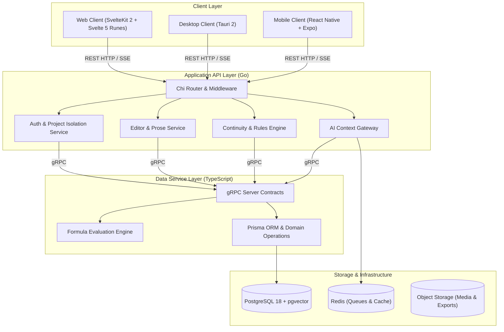

# NovWrite Platform Architecture

**Status:** Technical Specification Baseline (Version 2.0 - First & Second Class Blueprints, Mathematical Formula Engine & Zero-Badge Standards)  
**Scope:** Monorepo design, service boundaries, data persistence, continuity verification engine, blueprint architecture, and deployment.

---

## 1. Purpose & Design Philosophy

NovWrite is a continuity-first novel creation platform designed to track the state of a fictional world as an author writes long-form stories.

### Core Tenets

1. **Canon Over AI Memory:** Fictional state is persisted in an authoritative database, not held implicitly inside an LLM's context window.
2. **Explicit State Over Implicit Assumptions:** Character attributes, locations, items, affiliations, and relationships are stored as structured state.
3. **Events as State Transitions:** World mutations occur exclusively through recorded events (e.g. `Battle of Xian`, `Artifact Transfer`, `Breakthrough`).
4. **User-Defined Universes & Blueprint Freedom:** No genre assumptions. Authors have complete freedom to define 1st-Class Entity Archetypes and 2nd-Class Sub-Blueprints, dynamic enum categories, and sandboxed mathematical formulas.
5. **Explainable Continuity Warnings:** Any continuity violation detected by the system points directly to the historical events establishing the current state and offers concrete resolution actions.
6. **Multi-User Collaboration & Audited Governance:** Multi-tenant RBAC (`OWNER`, `ADMIN`, `EDITOR`, `CONTRIBUTOR`, `VIEWER`), collaborative scene leases, and immutable Admin Override logs ensure safe co-authoring and explainable exceptions.
7. **Dedicated Page-Based Routing & Zero-Badge Policy:** Every domain features dedicated 3-tier routing (`/`, `/create`, `/[id]`) with clean, modern visual design without badge clutter.

---

## 2. Multi-Tier Service Architecture



---

## 3. Layer Responsibilities & Dependency Rules

1. **Client Layer (`apps/web`, Desktop, Mobile):**
   - Pure UI representation; communicates with the Go backend via HTTP/REST and Server-Sent Events (SSE).
   - Never communicates directly with the database or internal data service.
   - Built on Svelte 5 Runes with `worldStore.svelte.ts` and client-side safe expression evaluation for immediate form previews.

2. **API Backend Layer (`apps/api` in Go):**
   - Handles HTTP routing, session security, project-level access control, prose drafting, AI prompt compilation, and the core continuity rules engine.
   - Communicates with the TypeScript Data Service over coarse-grained internal gRPC contracts.

3. **Data Service Layer (`apps/data-service` in TypeScript + Prisma):**
   - Manages schema migrations, relational integrity, JSONB property query compilation, and vector embeddings.
   - Houses domain engines (Schema Engine, Timeline Engine, State Fold Engine, Formula Engine).

4. **Persistence Layer:**
   - **PostgreSQL 18:** System of record for users, projects, novels, chapters, scenes, entities, relationships, events, and rule definitions.
   - **pgvector Extension:** Semantic embeddings for scene retrieval and canonical knowledge grounding.
   - **Redis:** Background task queues, session cache, and streaming AI generation buffers.

---

## 4. First-Class & Second-Class Blueprint Architecture

```text
┌────────────────────────────────────────────────────────┐
│               FIRST-CLASS BLUEPRINTS                   │
│   Primary Entity Archetypes (Characters, Relics,       │
│   Realms, Factions, Sects)                             │
│   - Instantiates timeline EntityItem instances         │
│   - Tracks causality, state snapshots & mutation logs   │
└───────────────────────────┬────────────────────────────┘
                            │ References / Embeds
                            ▼
┌────────────────────────────────────────────────────────┐
│              SECOND-CLASS BLUEPRINTS                   │
│   Sub-Schemas & Continuous Gauges                      │
│   - Romantic Affection Scale (-100 to +1000 pts)       │
│   - Cultivation Rank & Mastery (Realms 1-9)            │
│   - Power Matrices & Alignment Gauges                  │
└───────────────────────────┬────────────────────────────┘
                            │ Evaluates via
                            ▼
┌────────────────────────────────────────────────────────┐
│         MATHEMATICAL & LOGICAL FORMULA ENGINE          │
│   Safe AST Expression Parser (formulaEngine.ts)        │
│   - Live Combat Power = (cultivation.major_realm *     │
│     cultivation.minor_realm) * special_Physique +      │
│     attack * mastery - defence * def_mastery           │
└────────────────────────────────────────────────────────┘
```
