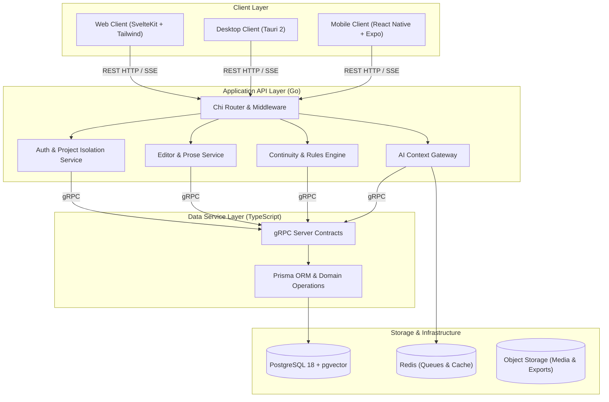

# NovWrite Platform Architecture

**Status:** Technical Specification Baseline (Version 1.0)  
**Scope:** Monorepo design, service boundaries, data persistence, continuity verification engine, and deployment architecture.

---

## 1. Purpose & Design Philosophy

NovWrite is a continuity-first novel creation platform designed to track the state of a fictional world as an author writes long-form stories.

### Core Tenets

1. **Canon Over AI Memory:** Fictional state is persisted in an authoritative database, not held implicitly inside an LLM's context window.
2. **Explicit State Over Implicit Assumptions:** Character attributes, locations, items, affiliations, and relationships are stored as structured state.
3. **Events as State Transitions:** World mutations occur exclusively through recorded events (e.g. `Battle of Xian`, `Artifact Transfer`, `Breakthrough`).
4. **User-Defined Universes:** No genre assumptions. Authors define custom entity types, fields, progression ladders, and relationship semantics.
5. **Explainable Continuity Warnings:** Any continuity violation detected by the system points directly to the historical events establishing the current state and offers concrete resolution actions.
6. **Multi-User Collaboration & Audited Governance:** Multi-tenant RBAC (`OWNER`, `ADMIN`, `EDITOR`, `CONTRIBUTOR`, `VIEWER`), collaborative scene leases, and immutable Admin Override logs ensure safe co-authoring and explainable exceptions.

---

## 2. Multi-Tier Service Architecture



---

## 3. Layer Responsibilities & Dependency Rules

1. **Client Layer (`frontend/web`, `frontend/desktop`):**
   - Pure UI representation; communicates with the Go backend via HTTP/REST and Server-Sent Events (SSE).
   - Never communicates directly with the database or internal data service.

2. **API Backend Layer (`api/`, `backend/` in Go):**
   - Handles HTTP routing, session security, project-level access control, prose drafting, AI prompt compilation, and the core continuity rules engine.
   - Communicates with the TypeScript Data Service over coarse-grained internal gRPC contracts.

3. **Data Service Layer (`services/data/` in TypeScript + Prisma):**
   - Manages schema migrations, relational integrity, JSONB property query compilation, and vector embeddings.
   - Exposes coarse-grained domain RPCs: `GetNovelState`, `CreateEvent`, `GetTimeline`, `GetCharacter`, `QueryStoryContext`. Generic raw CRUD is forbidden.

4. **Persistence Layer:**
   - **PostgreSQL 18:** System of record for users, projects, novels, chapters, scenes, entities, relationships, events, and rule definitions.
   - **pgvector Extension:** Semantic embeddings for scene retrieval and canonical knowledge grounding.
   - **Redis:** Background task queues, session cache, and streaming AI generation buffers.

---

## 4. Planned Monorepo Directory Structure

```text
novwrite/
├── agents.md                         # Agent instructions and rules
├── current_context.md                # Ongoing task and context tracker
├── README.md                         # Project overview and quick start
├── NOVWRITE_ARCHITECTURE.md          # High-level architecture specification
│
├── docs/                             # Engineering documentation
│   ├── ARCHITECTURE.md               # In-depth subsystem guide
│   ├── API_GUIDE.md                  # REST and gRPC API specifications
│   ├── ONBOARDING.md                 # Developer setup and environment guide
│   ├── design_decisions.md           # Architecture Decision Log
│   ├── recommended_commands.md       # Developer cheat-sheet
│   └── adr/                          # Architecture Decision Records
│       └── 0001-initial-architecture-baseline.md
│
├── api/                              # Go HTTP API transport
│   ├── http/                         # Chi routes, middleware, and request handlers
│   ├── problem/                      # RFC 7807 problem responses
│   └── cmd/                          # Executables (server, worker, novctl)
│
├── backend/                          # Go domain core & logic
│   ├── shared/                       # Shared models, logging, crypto
│   ├── identity/                     # Users, auth, project permissions
│   ├── novel/                        # Novels, chapters, scenes, prose
│   ├── universe/                     # Custom entity types, properties, power systems
│   ├── timeline/                     # Events, causal history, state reconstruction
│   ├── continuity/                   # Continuity verification and rule validator
│   └── ai/                           # AI prompt assembler, context builder, model gateway
│
├── proto/                            # Protocol Buffers / gRPC definitions
│   └── data/v1/                      # Coarse-grained Data Service contracts
│
├── services/
│   └── data/                         # TypeScript Data Service (Prisma + gRPC)
│       ├── prisma/                   # schema.prisma and migrations
│       └── src/                      # gRPC service implementations
│
├── frontend/                         # User Interfaces
│   ├── web/                          # SvelteKit web client
│   └── desktop/                      # Tauri desktop app (future phase)
│
└── deploy/                           # Deployment & Infrastructure
    ├── compose.yaml                  # Local development compose
    ├── docker-compose.prod.yml       # Production VPS compose
    └── traefik/                      # Traefik reverse proxy configuration
```

---

## 5. Continuity Engine Mechanics

The Continuity Engine operates via **Event Sourcing State Reconstruction**:

1. **State Snapshotting:** The canonical state at chapter $N$ is computed by taking the initial universe state at chapter $0$ and applying all event mutations up to chapter $N$.
2. **Rule Verification:** As a scene in chapter $N$ is drafted or updated:
   - Entity status (e.g. Alive/Dead) is verified.
   - Item ownership/location is verified against current inventory.
   - Techniques or powers invoked are validated against the character's progression stage.
   - Relationship changes are validated against defined scales.
3. **Violation Generation:** If an inconsistency is detected, an actionable `ContinuityViolation` is produced with:
   - The contradictory claim in prose/metadata.
   - The canonical baseline and the historical event that established it.
   - Available resolutions (e.g., _Accept as New Canon_, _Insert Missing Breakthrough Event_, _Revert Scene_).
