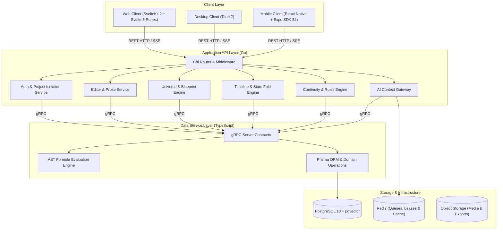
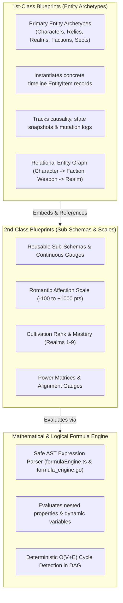
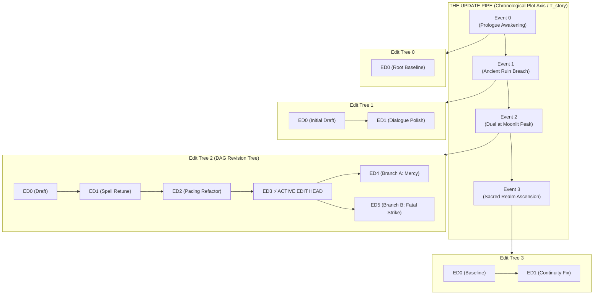

# NovWrite Platform Architecture

**Status:** Technical Specification Baseline (Version 2.8 - Creative Novel Multi-Project Isolation, Freeform Genre Input, 3-Step Irreversible Project Deletion, Zero Redundant Close Buttons, Svelte 5 Native Bidirectional Transitions & 5-Phase Monorepo Test Suite)  
**Scope:** Monorepo design, service boundaries, data persistence, continuity verification engine, blueprint architecture, REST standards, and deployment.

---

## 1. Purpose & Design Philosophy

NovWrite is a continuity-first novel creation platform designed to track the state of a fictional world as an author writes long-form stories.

### Core Tenets

1. **Canon Over AI Memory:** Fictional state is persisted in an authoritative database, not held implicitly inside an LLM's context window.
2. **Explicit State Over Implicit Assumptions:** Character attributes, locations, items, affiliations, and relationships are stored as structured state.
3. **Events as State Transitions:** World mutations occur exclusively through recorded events (e.g. `Battle of Xian`, `Artifact Transfer`, `Breakthrough`).
4. **The UPDATE Pipe & Hanging EDIT Trees DAG Engine:** Narrative timeline conduit ($T_{\text{story}}$) vs vertical hanging revision DAG ($T_{\text{revision}}$) with non-destructive checkouts, infinite branching, and bitemporal coordinate resolution $(T_{\text{narrative}}, T_{\text{revision}})$.
5. **Blueprint (Class) vs. Entity (Object) Paradigm:** Clear separation between structural blueprints/templates (1st-Class Archetypes vs. 2nd-Class Sub-Schemas) and concrete instantiated universe objects.
6. **Categorical ENUM, Weighted VALUE_TYPE, ARRAY & ARRAY_REF:** Pure string categorical choices (`ENUM`), dual-valued weighted options (`VALUE_TYPE`), freeform string lists (`ARRAY`), and entity references (`ARRAY_REF`) feed directly into safe AST formula parsers for live calculations.
7. **Zero-Trust Backend Validation Parity:** Backend never trusts frontend formatting; forces lowercase machine keys (`.toLowerCase()`, `strings.ToLower`), rejects duplicate keys, executes field type slate wipe, and normalizes entity property keys.
8. **Deterministic Server-Side AST Formula Engine:** Safe AST expression evaluators (`formula_engine.go` & `formulaEngine.ts`) compute all formula fields deterministically on the backend during entity mutation.
9. **CodeMirror 6 JSON Workbench & Bi-Directional State:** First-class color-coded JSON editing with automatic word-wrapping, syntax diagnostics, and bi-directional reactive synchronization with visual form fields.
10. **Full-Screen Isolated Error Canvases:** Centralized SvelteKit error architecture (`+error.svelte`) routing 404 and 500 exceptions to dedicated, chrome-free canvases with word-wrapped JSON diagnostic traces.
11. **Explainable Continuity Warnings:** Any continuity violation detected points directly to the historical events establishing the current state and offers concrete resolution actions.
12. **Multi-User Collaboration & Audited Governance:** Multi-tenant RBAC (`LEAD_AUTHOR`, `CO_AUTHOR`, `EDITOR`, `CONTRIBUTOR`, `VIEWER`), 60-second collaborative scene leases, and immutable Admin Override logs.
13. **Dedicated Page-Based Routing, 3-Tier Hierarchy & Zero-Badge Policy:** Every domain features dedicated 3-tier routing (`/`, `/create`, `/[id]`), clean slate dynamic field initialization, 100% Bits UI Select dropdown usage, 3-tier header visual hierarchy, and automatic post-save redirection.
14. **RESTful API Standards & Telemetry:** Explicit `/api/v1/` routes, `API-Version`, `X-Request-ID`, `X-Response-Time`, standardized pagination envelopes, guaranteed non-null `[]` empty queries, and container probes (`/healthz`, `/livez`, `/readyz`).
15. **6-Phase Monorepo Test Architecture:** Automated test and regression pipeline covering contracts, domain engines, Go backend, SvelteKit components/stores, mobile client engines, and monorepo diagnostics ([`./test.sh`](file:///home/yogesh/Projects/NovWrite/test.sh) / [`.\test.ps1`](file:///home/yogesh/Projects/NovWrite/test.ps1)).
16. **Creative Novel Multi-Project Scoping & Freeform Genre:** Full workspace tenancy isolated by `ProjectID`, dynamic project switching via `projectStore.svelte.ts`, freeform genre string input (e.g. `Xianxia / Cultivation`, `Sci-Fi`), and 100% Clean Slate universe creation with zero dummy entity bloat.
17. **3-Step Irreversible Project Deletion & Zero Redundant Close Buttons:** Guarded 3-step deletion sequence (`DeleteProjectDialog.svelte` assessing scope, requiring irreversibility checkbox, and exact title typing) alongside elimination of redundant `X` close buttons across all modals, drawers, and toasts.
18. **Formula Engine Cycle Detection ($O(V+E)$ DAG Topological Traversal):** Synchronous 3-state DFS cycle detection catches circular formula dependencies before persistence with formatted cycle chain error paths.
19. **Non-Destructive Schema Evolution & Legacy Upcasting:** Preserves deprecated properties (`_legacy_properties`) across historical timeline revisions and upcasts them dynamically during blueprint updates.
20. **Bitemporal Micro-Revision Compaction:** Collapses contiguous linear chains of `TYPO_FIX` edits into atomic baseline revisions (`CompactMicroRevisions`), preventing tree bloat.
21. **RFC 6902 Differential State Patching:** Lightweight delta operations (`diffEntityProperties`, `applyEntityPatch`) across `@novwrite/bridge` IPC boundaries.
22. **Viewport-Safe Mobile Dialogs & Sticky Action Trays:** Enforces `max-h-[min(90dvh,750px)]` modal containment, internal scrollable body, and sticky bottom footer trays docked safely above virtual keyboards.
23. **Universal Cross-Platform Tooling:** Universal portability across Linux, macOS, and Windows with matching POSIX Bash (`.sh`) and PowerShell (`.ps1`) scripts.

---

## 2. Multi-Tier Service Architecture

---

## 3. Layer Responsibilities & Dependency Rules

1. **Client Layer (`apps/web`, Desktop, Mobile):**
   - Pure UI representation; communicates with the Go backend via HTTP/REST and Server-Sent Events (SSE).
   - Never communicates directly with the database or internal data service.
   - Built on Svelte 5 Runes with `worldStore.svelte.ts` and client-side safe expression evaluation for immediate form previews.
   - Shared `@novwrite/core` package for mobile and desktop parity.

2. **API Backend Layer (`apps/api` in Go):**
   - Handles HTTP routing, session security, project-level access control, prose drafting, AI prompt compilation, blueprint schema validation, and the core continuity rules engine.
   - Communicates with the TypeScript Data Service over coarse-grained internal gRPC contracts.

3. **Data Service Layer (`apps/data-service` in TypeScript + Prisma):**
   - Manages schema migrations, relational integrity, JSONB property query compilation, and vector embeddings.
   - Houses domain engines (Schema Engine, Timeline Engine, State Fold Engine, Formula Engine).

4. **Persistence Layer:**
   - **PostgreSQL 18:** System of record for users, projects, novels, chapters, scenes, blueprints, entities, relationships, events, and rule definitions.
   - **pgvector Extension:** Semantic embeddings for scene retrieval and canonical knowledge grounding.
   - **Redis:** Background task queues, session cache, collaborative scene leases, and streaming AI generation buffers.

---

## 4. First-Class & Second-Class Blueprint Architecture

---

## 5. The UPDATE Pipe & Hanging EDIT Trees DAG Architecture

NovWrite introduces an orthogonal dual-axis revision paradigm:

- **The UPDATE Pipe ($T_{\text{story}}$):** The horizontal chronological story pipeline (`event0 ---> event1 ---> event2 ...`).
- **Hanging EDIT Trees ($T_{\text{revision}}$):** Vertical revision DAG hanging under each event and entity.
- **Non-Destructive Checkout:** Reverting to `ED3` moves the active EDIT head pointer without deleting `ED4`. Adding `ED5` creates a branch from `ED3` (`[ED4, ED5]`).
- **Bitemporal Resolution:** Resolves exact universe state at any 2D coordinate $(T_{\text{narrative}}, T_{\text{revision}})$.

---

## 6. RESTful API Best Practices & Telemetry

- **Explicit Versioning & Path Standard:** Routes strictly formatted as `/api/v1/...` with `API-Version: 1.0`.
- **Request Tracing:** Automatic `X-Request-ID` and `X-Response-Time` latency headers on all responses.
- **Standardized Pagination:** Predictable envelopes (`page`, `pageSize`, `totalCount`, `totalPages`, `hasNextPage`, `hasPreviousPage`).
- **Empty Query Non-Null Guarantees:** 0 matching records returns `200 OK` with `"data": []` and `"totalCount": 0` (never `null`).
- **RFC 7807 Problem Details:** Error responses return `application/problem+json` with machine-readable error codes and field-level invalid parameters.
- **Container Probes:** Standardized `/healthz`, `/livez`, and `/readyz` endpoints.

---

## 7. 6-Phase Monorepo Test Architecture

NovWrite enforces a strict 6-phase test runner ([`./test.sh`](file:///home/yogesh/Projects/NovWrite/test.sh) / [`.\test.ps1`](file:///home/yogesh/Projects/NovWrite/test.ps1)):

1. **Phase 1 (`@novwrite/bridge`):** RPC contracts, Zod schemas, differential state patchers, and error normalizers.
2. **Phase 2 (`@novwrite/data-service`):** Schema validation, property normalization, micro-revision compaction, and AST formula engine with cycle detection (41 unit tests).
3. **Phase 3 (`apps/api`):** Go backend unit, formula engine cycle detection, and HTTP integration test suite.
4. **Phase 4 (`@novwrite/web`):** Frontend component, store, table configuration, and mathjs AST formula evaluation tests (29 unit tests).
5. **Phase 5 (`@novwrite/mobile`):** Mobile client stores, entity creation, timeline fold engine, and telemetry suite (11 unit tests).
6. **Phase 6 (Diagnostic Typecheck):** Monorepo SvelteKit and TypeScript type diagnostics via [`./check.sh`](file:///home/yogesh/Projects/NovWrite/check.sh) / [`.\check.ps1`](file:///home/yogesh/Projects/NovWrite/check.ps1) with 0 errors and 0 warnings tolerance.

---

## 8. Governance, Quality Standards & Anti-Pattern Prevention

NovWrite establishes an authoritative engineering documentation governance standard modeled after leading open-source repositories:

- **Authoritative Standard:** [`docs/DOCUMENTATION_STANDARDS.md`](docs/DOCUMENTATION_STANDARDS.md) establishes strict rules against AI documentation anti-patterns (hallucinated flags, lazy TODO placeholders, robotic buzzword fluff, code-doc drift, broken links, happy-path exclusivity).
- **Contributor Guidelines:** [`CONTRIBUTING.md`](CONTRIBUTING.md) defines conventional commits, mandatory GPG signing (`git commit -S`), single-change isolation, and PR checklists.
- **Security Policy:** [`SECURITY.md`](SECURITY.md) outlines vulnerability reporting, SLAs, per-IP rate limiting, 10MB payload size limits, and the Singleton Super Admin security model.
