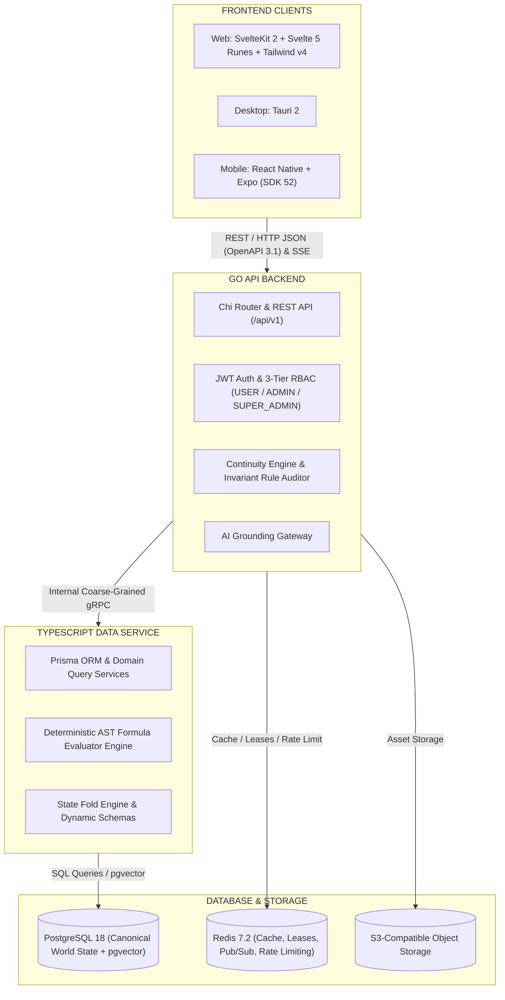

<div align="center">
  
  <h1>NovWrite</h1>
  <p><strong>A continuity-first novel creation platform with a user-defined story universe engine.</strong></p>
  <p><em>You define the rules of your universe. NovWrite remembers them.</em></p>
  <p>
    <a href="docs/ONBOARDING.md"><strong>📖 Developer Onboarding Guide</strong></a> •
    <a href="docs/recommended_commands.md"><strong>⚡ Recommended Commands</strong></a> •
    <a href="docs/API_GUIDE.md"><strong>🔌 API Guide</strong></a> •
    <a href="CONTRIBUTING.md"><strong>🤝 Contributing</strong></a>
  </p>
</div>

---

> [!IMPORTANT]
> **Dependency Installation & Update Workflow (First-Time Clone vs Repo Updates)**:
>
> - 📦 **First-Time Clone (Initial Setup — Mandatory)**:
>   Running the dependency installation command is **required** when you first clone the repository. It orchestrates pnpm workspace packages, Go modules, Prisma 8 client generation, and bridge contracts in under 5 seconds:
>   - **Linux / macOS / WSL**: `./deps` (or `./run.sh deps` / `pnpm deps`)
>   - **Windows PowerShell**: `.\deps` (or `.\run.ps1 deps`)
> - 🔄 **Updating Dependencies as per Repo (After `git pull`)**:
>   Whenever you pull latest commits or when dependencies update across branches, use the **exact same command in update mode**:
>   - **Linux / macOS / WSL**: `./deps --update` (or `./run.sh deps --update` / `pnpm deps --update`)
>   - **Windows PowerShell**: `.\deps -Update` (or `.\run.ps1 deps -Update`)

---

## 1. 1-Click Quickstart (Recommended & First Choice)

> 💡 _For full workstation setup, prerequisites, and developer workflows, visit the **[Developer Onboarding Guide](docs/ONBOARDING.md)**._

Our unified runner and direct root aliases are the **official, fastest, and recommended** way to set up and run NovWrite:

### 1.1. Linux / macOS / Windows (Git Bash / WSL)

```bash
# 1. Clone repository
git clone https://github.com/Yogesh-Kumar-Mallik-dev/NovWrite.git
cd NovWrite

# 2. 1-Click Environment Setup (Installs all dependencies, prepares .env, starts DB/Redis, runs Prisma & builds contracts)
./envi        # or: ./run.sh envi

# 3. 1-Click Launch Full Dev Environment (Postgres, Redis, API :8080, Web :5173)
./dev         # or: ./run.sh dev
```

### 1.2. Windows (PowerShell as Administrator / Windows Terminal)

```powershell
# 1. Clone repository
git clone https://github.com/Yogesh-Kumar-Mallik-dev/NovWrite.git
cd NovWrite

# 2. 1-Click Environment Setup
.\envi        # or: .\run.ps1 envi

# 3. 1-Click Launch Full Dev Environment
.\dev         # or: .\run.ps1 dev
```

---

## 2. Workstation Prerequisites & Manual Setup (Alternative / Not Recommended)

### 2.1. System Toolchains (Go 1.23+, Node 22 LTS, pnpm, Docker, Protoc)

- **Linux (Ubuntu / Debian):**

  ```bash
  sudo apt-get update && sudo apt-get install -y curl wget git build-essential make protobuf-compiler
  curl -fsSL https://deb.nodesource.com/setup_22.x | sudo -E bash - && sudo apt-get install -y nodejs
  corepack enable && corepack prepare pnpm@latest --activate
  go install google.golang.org/protobuf/cmd/protoc-gen-go@latest google.golang.org/grpc/cmd/protoc-gen-go-grpc@latest
  ```

- **macOS (Homebrew):**

  ```bash
  brew install go node@22 pnpm protobuf bufbuild/buf/buf protoc-gen-go protoc-gen-go-grpc git make
  brew install --cask docker
  ```

- **Windows (Winget in PowerShell as Admin):**

  ```powershell
  winget install --id Git.Git -e; winget install --id GoLang.Go -e; winget install --id OpenJS.NodeJS.LTS -e; winget install --id pnpm.pnpm -e; winget install --id Google.Protobuf -e; winget install --id BufBuild.Buf -e; winget install --id Docker.DockerDesktop -e
  go install google.golang.org/protobuf/cmd/protoc-gen-go@latest google.golang.org/grpc/cmd/protoc-gen-go-grpc@latest
  ```

> 📖 For full setup guides (including Fedora, Arch Linux, WSL2, and direct downloads), see the **[Developer Onboarding Guide](docs/ONBOARDING.md)**.

### 2.2. Manual Step-by-Step Installation (Without 1-Click Scripts)

> [!NOTE]
> The single root entrypoint (`./run.sh` / `.\run.ps1`) is the official and recommended way to work with NovWrite. If your workflow requires manual setup without scripts, run the commands below:

```bash
# 1. Clone & prepare environment
git clone https://github.com/Yogesh-Kumar-Mallik-dev/NovWrite.git
cd NovWrite
cp .env.example .env

# 2. Install workspace dependencies & Go modules
pnpm install
cd apps/api && go mod download && cd ../..

# 3. Start local PostgreSQL & Redis
docker compose up -d postgres redis

# 4. Initialize database schema & generate clients
pnpm --filter @novwrite/data-service db:push
pnpm --filter @novwrite/data-service db:generate
pnpm --filter @novwrite/bridge build

# 5. Start development servers
# Terminal 1: cd apps/api && go run ./cmd/server
# Terminal 2: pnpm --filter @novwrite/web dev
```

---

## 2. Core Features & Capabilities

- **Dynamic Project Isolation & Multi-Novel Scoping**:
  - Full project hierarchy: `Project` $\rightarrow$ `Novel` $\rightarrow$ `Volume` $\rightarrow$ `Chapter` $\rightarrow$ `Scene`.
  - Dynamic Project Switcher with instant switching, freeform genre text input (e.g. `Xianxia / Cultivation`, `Sci-Fi`), pure **Clean Slate** universe creation (zero starter archetypes or dummy entity bloat), and zero-state "No Active Project Selected" guidance cards.
  - Project Settings & Edit modal (`EditProjectDialog`) with title, genre, and synopsis modification.
  - **3-Step Irreversible Project Deletion** (`DeleteProjectDialog`): Sequential confirmation sequence assessing affected asset scope, requiring an irreversibility acknowledgment checkbox, and exact project title verification before deletion.
  - Complete database & Redis reset lifecycle (`./run.sh flush-db` / `.\run.ps1 flush-db`) for testing fresh user onboarding.
- **Zero Redundant Close Buttons Standard**:
  - Clean, distraction-free modal dialogs, drawers, and toasts with zero redundant top-right cross `(X)` buttons.
  - Consistent dismissal across all viewports via backdrop click, keyboard `Escape`, and explicit bottom action buttons (`[Cancel]`, `[Close]`).
- **The UPDATE Pipe & Hanging EDIT Trees Dual-Axis Reversible DAG Engine**:
  - **The UPDATE Pipe (Plot Axis / $T_{\text{story}}$)**: Sequential horizontal pipeline representing chronological narrative events (`event0 ---> event1 ---> event2 ---> event3 ---> event4`).
  - **Hanging EDIT Trees (Authorial Revision DAG)**: Every event and entity possesses a vertical tree of immutable revision nodes (`ED0 -> ED1 -> ED2 -> ED3 ...`) with non-destructive checkouts. Reverting to an earlier node does not erase newer drafts—they remain branches of the parent node with infinite branching support.
  - **Bitemporal Micro-Revision Compaction**: Deterministically collapses contiguous linear chains of `TYPO_FIX` edits into atomic baseline revisions (`CompactMicroRevisions`), preventing tree bloat while preserving all non-linear draft branches.
  - **Bitemporal Coordinate Resolution**: Deterministically resolves exact world state at any dual-axis coordinate $(T_{\text{narrative}}, T_{\text{revision}})$.
  - **Interactive PipeTree Visualizer**: Dedicated UI component (`PipeTreeVisualizer`) rendering the glowing horizontal timeline conduit alongside vertical hanging branch graphs with live EDIT head pointers (`[⚡ ACTIVE EDIT HEAD]`).
- **RFC 6902-Style Differential State Patching**: Lightweight delta operations (`diffEntityProperties`, `applyEntityPatch`) across Communication Bridge (`@novwrite/bridge`) IPC boundaries, cutting network payloads by up to 90%.
- **RESTful API Standardization & Best Practices**:
  - **Versioning & Telemetry**: Explicit `/api/v1/` routes with `API-Version`, `X-Request-ID`, and `X-Response-Time` tracing headers.
  - **Standardized Pagination & Empty Query Guarantees**: Predictable pagination metadata envelopes (`page`, `pageSize`, `totalCount`, `totalPages`, `hasNextPage`, `hasPreviousPage`). Empty queries are guaranteed to return HTTP 200 OK with `"data": []` (never `null`).
  - **RFC 7807 Problem Details**: All errors return structured `application/problem+json` envelopes with field-level validation breakdowns.
  - **Defensive API Security & Rate Limiting**: Per-IP token-bucket rate limiter (`RateLimiterMiddleware`), 10MB payload size limiter (`MaxBytesMiddleware`), dynamic environment CORS (`CORS_ALLOWED_ORIGINS`), Content Security Policy & privacy headers, and JWT auth context (`JWTAuthMiddleware`).
  - **Three-Tier Multi-User Hierarchy & Singleton Super Admin**: Native multi-tenant role model separating standard authors (`USER`), platform operators (`ADMIN`), and root administrators (`SUPER_ADMIN`). Enforces a strict **Singleton Super Admin Constraint** with a dedicated username and password protected control plane (`/superadmin`, `POST /api/v1/superadmin/login`) and backend server CLI tool (`apps/api/cmd/admin-cli`).
  - **Container & Orchestration Probes**: Built-in `/healthz`, `/livez`, and `/readyz` endpoints.
- **First-Class & Second-Class Blueprint System**: Complete freedom to create universes from scratch.
  - **1st-Class Blueprints (Entity Archetypes)**: Instantiate tangible universe actors in the timeline (Characters, Sacred Relics, Realms, Factions, Sects) with full causal mutation history.
  - **2nd-Class Blueprints (Sub-Blueprints & Value Objects)**: Reusable embedded data structures and scale gauges (e.g. `Romantic Affection Scale`, `Cultivation Rank & Mastery`, `Power Matrices`) referenced across entities.
- **Dynamic Enums, Value Types, Arrays & Blueprint References**: Define options for enum fields, power-weighted value types, freeform item arrays (`ARRAY`), and entity reference arrays (`ARRAY_REF`).
- **Zero-Trust Backend Validation Parity & Non-Destructive Schema Evolution**:
  - Strict lowercase machine key coercion (`.toLowerCase()`, `strings.ToLower`), duplicate key rejection, field type slate wipe, and normalized property lookup across both Go and TypeScript backends.
  - Non-destructive schema evolution preserves legacy attributes (`_legacy_properties`) and runtime upcasters (`UpcastLegacyProperties`), preventing data corruption when blueprints evolve.
- **Deterministic Server-Side AST Formula Engine with $O(V+E)$ Cycle Detection**:
  - Write complex mathematical formulas for computed properties (e.g. `Total Combat Power = (cultivation.major_realm * cultivation.minor_realm) * special_Physique + attack * attack_technique_Mastery - defence * defence_technique_mastery`) that recalculate in real-time on frontend and are validated and computed deterministically on the backend.
  - Synchronous 3-state DAG topological traversal catches circular dependencies before persistence and displays exact cycle chains (e.g. `power -> modifier -> power`).
- **Mobile-First Responsive Architecture & Viewport Resilience**:
  - 2-tier sub-header control strip, auto-fit container-safe cards, top pagination bar to eliminate layout jumps, and isolated table/DAG scrolling.
  - Viewport-safe dialogs (`max-h-[min(90dvh,750px)]`) with internal scrollable bodies and sticky bottom action trays docked safely above mobile soft keyboards.
  - Svelte 5 native bidirectional transitions (`transition:fade`, `transition:scale`, `transition:fly`, 150–220ms) with physics-based cubic easing and full `@media (prefers-reduced-motion: reduce)` accessibility.
  - Single-icon purple theme toggle (`#7c3aed`) rendering exactly one icon at a time matching both light and dark themes.
- **Dedicated Page-Based Routing Architecture**: Deep-linkable 3-tier route architecture for every domain (List `/`, Create `/create`, Update/Inspect `/[id]`) adhering to the modern Zero-Badge UI standard, clean slate dynamic fields, 100% Bits UI Select dropdowns, and automatic post-save redirection.
- **Canonical State Tracking & Evidence-Based Continuity Warnings**: At any scene, reconstructs exact world state and flags prose contradictions citing historical causal events.
- **Universal Cross-Platform Tooling & 6-Phase Test Runner**: Unified entrypoint CLI (`./run.sh` / `.\run.ps1`) and direct shorthand root aliases (`./dev`, `./build`, `./check`, `./test`, `./deps`, `./envi`, `./uenvi`, `./flush_db`, `./qr`) orchestrating dev server, dependency manager, environment setup, teardown, build, typecheck, unified 6-phase test runner, and database flusher supporting Linux, macOS, and Windows.

---

## 3. Architecture & Tech Stack



- **API Backend**: Go 1.23+ (Modular Monolith with `go-chi/chi`, Dependency Injection).
- **Data Service**: TypeScript + Prisma ORM via coarse-grained gRPC contracts.
- **Formula Engine**: Sandboxed AST-based mathematical expression evaluator supporting arithmetic, dot-notation variables, logical conditionals, and math functions.
- **Database**: PostgreSQL 18 with JSONB for dynamic entity properties and `pgvector` for semantic context retrieval.
- **Caching & Ephemeral State**: Redis 7.2+.
- **Deployment**: Docker Compose behind Traefik reverse proxy with automated TLS.

---

## 4. Documentation Index

- **Academic & Formal Specifications:**
  - **[NovWrite B.Tech Capstone Project Report (`docs/Novwrite.docx`)](docs/Novwrite.docx)** — Comprehensive up-to-date professional project report and system architecture document for submission.
  - **[Documentation & Specification Changelog (`docs/changes.md`)](docs/changes.md)** — Chronological timeline of specification and report revisions.
- **Core Architecture Specifications:**
  - [Frontend Architecture Specification](docs/FRONTEND_ARCHITECTURE.md)
  - [Database Architecture Specification](docs/DATABASE_ARCHITECTURE.md)
  - [Backend Architecture Specification](docs/BACKEND_ARCHITECTURE.md)
  - [Cache Architecture Specification](docs/CACHE_ARCHITECTURE.md)
  - [Communication Layer Specification](docs/COMMUNICATION_LAYER.md)
  - [MVP Phased Implementation Plan](docs/MVP_PHASED_PLAN.md)
- **Governance, Quality Standards & Contribution:**
  - [Repository Documentation Standards & AI Anti-Pattern Prevention](docs/DOCUMENTATION_STANDARDS.md)
  - [Contributor Guidelines (CONTRIBUTING.md)](CONTRIBUTING.md)
  - [Security Policy & Vulnerability Disclosure (SECURITY.md)](SECURITY.md)
- **Guides & Quick References:**
  - [Developer Onboarding & Multi-OS Setup Guide](docs/ONBOARDING.md)
  - [Recommended Development Commands Cheat Sheet](docs/recommended_commands.md)
  - [API & Integration Guide](docs/API_GUIDE.md)
  - [Monorepo Architecture Specification](docs/NOVWRITE_ARCHITECTURE.md)
  - [Agent Instructions & Rules](.agent/agents.md)
  - [Design Decisions Log](docs/design_decisions.md)

---

## 5. Development Workflow & Rules

All contributors and AI agents must strictly adhere to the repository rules defined in [.agent/agents.md](.agent/agents.md):

1. **Single-Change Policy**: Execute strictly one change at a time (one feature, one refactor, or one fix). Reject multi-change requests.
2. **Commit Format**: All commit messages must follow `<type>(<domain>): <expression>` (e.g. `feat(world): add formula parser for combat powers`).
3. **Signed Commits**: Always commit changes using GPG: `git commit -S -m "..."`.
4. **Block-Based Code Standard**: Code must be written in modular blocks featuring comment headers, early returns (guard clauses), and unique block IDs in all error handling.
5. **Zero-Badge UI Policy**: Badges and pill tags are prohibited on the frontend. Use semantic icons, action buttons, accessible breadcrumbs, and slide drawers instead.
