# NovWrite Documentation & Specification Changelog

This document maintains the official, chronological change log for **`Novwrite.docx`** and all authoritative system architecture specifications.

> **Governance Policy:**  
> `Novwrite.docx` serves as the authoritative, up-to-date B.Tech Major Project Technical Report and Architecture Specification. Whenever a major architectural decision, domain engine update, database modification, or frontend redesign occurs, `Novwrite.docx` **must be regenerated** and the exact changes recorded in this changelog.

---

## Version Timeline

```mermaid
timeline
    title NovWrite Specification & Document Evolution
    2026-09-05 : Version 1.0 (Architecture Baseline)
               : Database, Backend, Frontend, Cache Specs Locked
    2026-09-05 : Version 1.1 (Decoupled Workspaces)
               : Prose Studio vs World Studio Separation
               : Anti-Pattern Prohibition (No Tab-in-Modal Soup)
    2026-09-05 : Version 1.2 (Runes State & Co-Development)
               : Svelte 5 Runes State Stores
               : Multi-Platform Simultaneous Engineering
    2026-09-05 : Version 1.3 (React Native & Reusables Parity)
               : React Native + Expo Mobile Stack
               : React Native Reusables (@rn-primitives) Integration
    2026-09-06 : Version 1.4 (B.Tech Formalization & Report Generation)
               : Novwrite.docx Academic Capstone Report Generated
               : Comprehensive 8-Chapter Technical Specification
    2026-09-06 : Version 1.5 (Multi-User RBAC & Admin Override Governance)
               : Multi-User Collaboration & Tenancy
               : Admin Override Powers vs Boundaries Matrix
               : Heartbeat Scene Leases & Active Lock Breakers
    2026-09-06 : Version 1.6 (Platform Administration & Creative Author Roles)
               : Platform Admin Capabilities (MFA Reset, Refunds, Data Repair)
               : Strict Operational Boundaries & Manuscript Privacy Grants
               : Creative In-App Roles (Lead Author, Co-Author, Editor)
    2026-09-06 : Version 1.7 (Two-Front Branching & Dedicated Communication Gateway)
               : Dedicated Git Branches (world & novel) with Upstream Tracking
               : Zero Direct Cross-Talk Invariant & @novwrite/bridge Contracts
               : Single-Page Communication Diagnostics Hub (/dev/communication-hub)
    2026-09-06 : Version 1.8 (MVP Phased Implementation Plan & Development Test Seeder)
               : Strict YAGNI In-Scope vs Out-of-Scope MVP Boundaries
               : Phase-by-Phase Execution for main, world, and novel Branches
               : One-Click Development Test Data Seeder (Chronicles of Aethelgard)
    2026-09-06 : Version 1.9 (UI/UX Quality Standards & AI Anti-Pattern Prevention)
               : Strict Prohibition of Excessive Gradients & Glow Shimmer
               : Table-First Badge Discipline & shadcn-svelte Select Standard
               : Comprehensive AI UI/UX Anti-Pattern Checklist (agents.md & docs)
    2026-09-06 : Version 2.0 (First & Second Class Blueprints & Mathematical Formula Engine)
               : 1st & 2nd Class Blueprint Architecture (Archetypes vs Sub-Schemas)
               : Dynamic Enum Categories & Custom Option Tag Builders
               : Sandboxed Mathematical & Logical Formula Engine (formulaEngine.ts)
               : Dedicated 3-Tier Page-Based Routing Standard (List, Create, Update)
               : Absolute Zero-Badge Policy Across All UI Screens
    2026-09-06 : Version 2.1 (CodeMirror 6 JSON Workbench, Error Isolation & Sliding Theme Switch)
               : CodeMirror 6 JSON Editor with Syntax Highlighting & Word-Wrapping
               : Full-Screen Isolated 404 & 500 Canvases with SvelteKit +error.svelte
               : Sliding Theme Toggle with Single Inactive Target Icon
               : Svelte 5 Pure Derivation & Synchronous Lifecycle Standard
    2026-09-07 : Version 2.2 (Zero-Trust Backend Validation Parity & Clean Slate Architecture)
               : Strict Lowercase Machine Keys & Duplicate Field Key Rejection
               : Field Type Slate Wipe & Server-Side Deterministic AST Formula Engine
               : Array & Array Reference Field Types (ARRAY, ARRAY_REF)
               : 100% Bits UI Select Dropdowns & Post-Save Route Redirections
               : Graceful Monorepo Lifecycle Scripts (dev.sh, build.sh, check.sh, test.sh, flush_db.sh)
    2026-09-07 : Version 2.3 (The UPDATE Pipe & Hanging EDIT Trees DAG)
               : Horizontal Story Axis vs Vertical Revision Trees
               : Non-Destructive Checkouts & Infinite Branching
               : 3-Tier Visual Hierarchy & Strict Schema Invariance
               : Smooth Rounded-Corner Favicon & Web App Metadata
    2026-09-07 : Version 2.4 (REST API Standardization & 5-Phase Monorepo Test Runner)
               : Explicit /api/v1/ Routes, API-Version & Telemetry Headers
               : Standardized Pagination Envelopes & Empty Query Guarantees
               : RFC 7807 Problem Details & Container Health Probes
               : 5-Phase Monorepo Test Runner (66+ Unit & Component Tests)
    2026-09-07 : Version 2.6 (Creative Novel Multi-Project Architecture, Theme Toggle Alignment & Clean Slate Flush)
               : Multi-Project Creation, Switching & Isolated Workspaces (projectStore.svelte.ts)
               : Interactive <ProjectSwitcher /> & <CreateProjectDialog />
               : Theme Toggle Dual-Mode Color Harmonization (Sun & Moon Tokens)
               : Go Backend REST /api/v1/projects Endpoints & Tests
               : Clean-Slate Database & Redis Flush Utility (flush_db.sh)
    2026-09-07 : Version 2.7 (Multi-OS Toolchains, Mobile-First Responsive System & Bidirectional Transitions)
               : Comprehensive Installation Commands for Windows, macOS, Linux (Ubuntu, Fedora, Arch) & WSL2
               : Mobile-First Layout Architecture (2-Tier Sub-Header Strip, Auto-Fit Grids, Top Pagination)
               : Svelte 5 Native Bidirectional Transitions (fade, scale, fly) & Motion Accessibility
               : Single-Icon Purple Theme Toggle & Global Scrollbar Suppression
```

---

## Release Details

### [Version 2.7] — 2026-09-07

**Scope:** Multi-OS Toolchain Installation Commands, Mobile-First Responsive Architecture, Svelte 5 Bidirectional Transitions & Micro-Interactions  
**Target Documents:** [`docs/ONBOARDING.md`](file:///home/yogesh/Projects/NovWrite/docs/ONBOARDING.md), [`README.md`](file:///home/yogesh/Projects/NovWrite/README.md), [`docs/recommended_commands.md`](file:///home/yogesh/Projects/NovWrite/docs/recommended_commands.md), [`docs/FRONTEND_ARCHITECTURE.md`](file:///home/yogesh/Projects/NovWrite/docs/FRONTEND_ARCHITECTURE.md), [`docs/API_GUIDE.md`](file:///home/yogesh/Projects/NovWrite/docs/API_GUIDE.md), [`changes.md`](file:///home/yogesh/Projects/NovWrite/changes.md)

#### Added

- **Comprehensive Multi-OS Dependency Installation Toolchain ([`docs/ONBOARDING.md`](file:///home/yogesh/Projects/NovWrite/docs/ONBOARDING.md)):**
  - **Linux (Ubuntu / Debian / Linux Mint):** `apt-get` packages for Go 1.23+, Node.js 22 LTS, `pnpm` via corepack, Docker Engine & Compose plugin, `protobuf-compiler`, `protoc-gen-go`, `protoc-gen-go-grpc`, and `buf`.
  - **Linux (Fedora / RHEL / CentOS Stream):** `dnf` groupinstall and module commands for Go, Node.js 22, Docker CE, and Protobuf toolchains.
  - **Linux (Arch Linux / Manjaro):** `pacman` commands for base-devel, Go, Node.js LTS, Protobuf, Docker, and Buf.
  - **macOS (Homebrew):** Homebrew commands for Go, Node 22, pnpm, Docker Desktop/OrbStack, protobuf, and plugins.
  - **Windows (Native & WSL2):** Winget, Chocolatey, Scoop, and WSL2 Ubuntu step-by-step commands.
  - **Unified Verification Script:** Terminal one-liner testing presence of all toolchains.
- **Mobile-First Responsive Layout Architecture:**
  - Standardized fluid gutters (`px-4 sm:px-6 lg:px-8`) across all shell and workbench routes.
  - 2-Tier Sub-Header Control Strip in `world/+layout.svelte` separating breadcrumb context from action dropdowns and action buttons.
  - Standardized Top Pagination Bar placed strictly above lists to prevent layout jumps on dynamic record heights.
  - Viewport-safe modals constrained to `max-h-[min(90dvh,800px)] overflow-y-auto` with internal scrolling.
  - Isolated horizontal scrolling for wide data tables and DAG visualizers.
- **Svelte 5 Bidirectional Transitions & Motion Accessibility:**
  - Applied paired `transition:fade={{ duration: 150 }}` on backdrops and `transition:scale={{ start: 0.96, duration: 150 }}` on modal dialogs.
  - Physics-based cubic easing on mobile slide-over drawers (`transition:fly={{ x: -320, duration: 220, easing: cubicOut }}`).
  - Global accessibility reset via `@media (prefers-reduced-motion: reduce)` in `app.css`.
  - Pruned redundant close controls in binary action dialogs and toasts.
- **Single-Icon Purple Theme Toggle:**
  - Strict single-icon rendering (Sun in dark mode, Moon in light mode) styled in purple `#7c3aed` matching both themes.

---

### [Version 2.6] — 2026-09-07

**Scope:** Multi-Project Creation & Workspace Switching, Theme Toggle Harmonization, Go Project REST API & Clean-Slate Flush Utility  
**Target Documents:** [`docs/BACKEND_ARCHITECTURE.md`](file:///home/yogesh/Projects/NovWrite/docs/BACKEND_ARCHITECTURE.md), [`docs/FRONTEND_ARCHITECTURE.md`](file:///home/yogesh/Projects/NovWrite/docs/FRONTEND_ARCHITECTURE.md), [`current_context.md`](file:///home/yogesh/Projects/NovWrite/current_context.md), [`changes.md`](file:///home/yogesh/Projects/NovWrite/changes.md)

#### Added

- **Reactive Multi-Project Management System (`apps/web`):**
  - **`projectStore.svelte.ts`:** Svelte 5 Runes store managing projects array, active project pointer, and localStorage persistence (`novwrite_projects_v1`).
  - **`ProjectSwitcher.svelte`:** Desktop and mobile drawer project selector with active checkmarks and `+ New Novel Project...` action.
  - **`CreateProjectDialog.svelte`:** Modal dialog supporting Novel Title, Genre selector, Synopsis, and Starting Architecture (Clean Slate vs Starter Archetypes).
  - **Project-Scoped World Store:** `worldStore.svelte.ts` partitions blueprints, entities, timeline events, and rules per project.
  - **Zero-Project Onboarding States:** Context-aware onboarding banners in World Studio and Home Hub guiding authors to instantiate their first novel.
- **Theme Toggle Dual-Mode Color Harmonization (`theme-toggle.svelte`):**
  - Harmonized active theme icon inside the sliding thumb (`Moon` in primary purple in Dark mode; `Sun` in warm amber in Light mode).
  - Balanced inactive target icon in the track with high-contrast, theme-tokenized colors.
- **Go Backend REST Creative Projects Endpoints (`apps/api`):**
  - `GET /api/v1/projects` with standard 10-item pagination and search filtering.
  - `POST /api/v1/projects` with name validation and RFC 7807 problem details.
  - `GET /api/v1/projects/{projectId}`, `PUT /api/v1/projects/{projectId}`, `DELETE /api/v1/projects/{projectId}`.
  - Comprehensive unit test suite in `project_handler_test.go` (`BLOCK_TEST_PROJECT_HANDLER_001`).
- **Clean-Slate Database & Redis Flush Utility ([`./flush_db.sh`](file:///home/yogesh/Projects/NovWrite/flush_db.sh)):**
  - Flushes Redis 7.2 cache (`FLUSHALL`) and resets PostgreSQL schema with Prisma (`prisma db push --force-reset --accept-data-loss`).

### [Version 2.5] — 2026-09-07

**Scope:** Standardized 10-Item Frontend Pagination, Blueprint-Scoped Dynamic Entity Tables, Core Responsive Philosophy & Mobile-First Structural Adaptation Standards  
**Target Documents:** [`agents.md`](file:///home/yogesh/Projects/NovWrite/agents.md), [`.agents/rules/mobile_first_responsive.md`](file:///home/yogesh/Projects/NovWrite/.agents/rules/mobile_first_responsive.md), [`docs/API_GUIDE.md`](file:///home/yogesh/Projects/NovWrite/docs/API_GUIDE.md), [`docs/FRONTEND_ARCHITECTURE.md`](file:///home/yogesh/Projects/NovWrite/docs/FRONTEND_ARCHITECTURE.md), [`frontend_design_descisions.md`](file:///home/yogesh/Projects/NovWrite/frontend_design_descisions.md), [`changes.md`](file:///home/yogesh/Projects/NovWrite/changes.md), [`current_context.md`](file:///home/yogesh/Projects/NovWrite/current_context.md)

#### Added

- **Unified Frontend API Client Layer (`apps/web/src/lib/api/apiClient.ts`):**
  - Typed `NovWriteApiClient` class supporting `getPaginated<T>` and `getSingle<T>` methods with RFC 7807 problem detail error decoding (`ApiError`).
  - Pure client-side array paginator `paginateArray<T>` matching the backend RFC pagination response structure (`{ data: [...], pagination: {...}, meta: {...} }`).
- **Standardized Reusable 10-Item Pagination Component (`apps/web/src/lib/components/ui/pagination.svelte`):**
  - Uniform **10 items per page** standard applied across all frontend table and list views.
  - Interactive **Previous Page** and **Next Page** buttons with subtle Chevron icons and accessible disabled states.
  - Live item range telemetry (`Showing X–Y of Z items`) and zero-badge page indicator (`Page X / Y`).
  - **Top Pagination Placement Invariant:** Placed **ABOVE** table/list content to prevent Cumulative Layout Shift (CLS) on page size changes.
  - Implemented across Universe Entities (`/world/entities`), Blueprints & Schemas (`/world/schemas`), Timeline Stream (`/world/timeline`), Invariant Rules (`/world/rules`), and Continuity Audit Violations (`/world/audit`).
- **Blueprint-Scoped Dynamic Entity Table Architecture (`/world/entities`):**
  - **Elimination of Global Filter Clutter:** Removed the redundant "All Blueprint Archetypes" and "All Categories" dropdown filters to prevent mixed column mismatches and empty cell artifacts across unrelated archetypes.
  - **Archetype-Scoped View:** Each table view is dedicated to a selected 1st-Class Blueprint Archetype, automatically defaulting to the first available blueprint.
  - **Blueprint-Tuned Column Selection:** Core columns streamlined to `name`, `description`, `lastMutatedSeqNumber`, while dynamic and computed formula columns dynamically adapt to the selected blueprint's schema fields.
  - Per-blueprint column preferences stored and restored independently in `localStorage`.
- **Official Responsive & Mobile-First Design System Governance:**
  - Codified Rule 13 (_Core Responsive Philosophy & Layout Robustness_), Rule 14 (_Mobile-First Adaptation — Do NOT Force Desktop UI_), and Rule 15 (_Standardized 10-Item Pagination & Layout Jump Prevention_) in [`agents.md`](file:///home/yogesh/Projects/NovWrite/agents.md) and [`.agents/rules/mobile_first_responsive.md`](file:///home/yogesh/Projects/NovWrite/.agents/rules/mobile_first_responsive.md).
  - Codified the Zero-Horizontal-Overflow Invariant (`scrollWidth > innerWidth`), minimum touch targets ($36\text{px}$–$44\text{px}$), viewport-safe modals, and genuine mobile interaction patterns (slide-over drawers, mobile entity card lists, tabbed inspectors).

---

### [Version 2.4] — 2026-09-07

**Scope:** Comprehensive RESTful API Standardization, Pagination Envelopes, Telemetry Headers, RFC 7807 Problem Details & 5-Phase Monorepo Test Runner  
**Target Documents:** [`current_context.md`](file:///home/yogesh/Projects/NovWrite/current_context.md), [`changes.md`](file:///home/yogesh/Projects/NovWrite/changes.md), [`NOVWRITE_ARCHITECTURE.md`](file:///home/yogesh/Projects/NovWrite/NOVWRITE_ARCHITECTURE.md), [`docs/ARCHITECTURE.md`](file:///home/yogesh/Projects/NovWrite/docs/ARCHITECTURE.md), [`docs/BACKEND_ARCHITECTURE.md`](file:///home/yogesh/Projects/NovWrite/docs/BACKEND_ARCHITECTURE.md), [`docs/DATABASE_ARCHITECTURE.md`](file:///home/yogesh/Projects/NovWrite/docs/DATABASE_ARCHITECTURE.md), [`docs/FRONTEND_ARCHITECTURE.md`](file:///home/yogesh/Projects/NovWrite/docs/FRONTEND_ARCHITECTURE.md), [`docs/MVP_PHASED_PLAN.md`](file:///home/yogesh/Projects/NovWrite/docs/MVP_PHASED_PLAN.md), [`docs/API_GUIDE.md`](file:///home/yogesh/Projects/NovWrite/docs/API_GUIDE.md), [`docs/recommended_commands.md`](file:///home/yogesh/Projects/NovWrite/docs/recommended_commands.md), [`frontend_design_descisions.md`](file:///home/yogesh/Projects/NovWrite/frontend_design_descisions.md), [`docs/design_decisions.md`](file:///home/yogesh/Projects/NovWrite/docs/design_decisions.md), [`agents.md`](file:///home/yogesh/Projects/NovWrite/agents.md), [`README.md`](file:///home/yogesh/Projects/NovWrite/README.md)

#### Added

- **RESTful API Standardization & Middleware Telemetry (`apps/api`):**
  - **Explicit Versioning & Prefixing:** Standardized all production endpoints on `/api/v1/...` with `API-Version: 1.0` response header.
  - **Telemetry & Tracing:** Built-in middleware attaching UUID `X-Request-ID` and execution latency `X-Response-Time` to all HTTP responses.
  - **Standardized Pagination Envelopes:** Collection queries wrap records in `{ data: [...], meta: {...}, pagination: { page, pageSize, totalCount, totalPages, hasNextPage, hasPreviousPage } }`.
  - **Empty Query Guarantees:** 0-result searches or filtered queries return `HTTP 200 OK` with `"data": []` and `"totalCount": 0` (never `null` or 404).
  - **RFC 7807 Problem Details:** All API errors return `application/problem+json` with structured error schemas and field-level validation breakdowns.
  - **Container & Orchestration Probes:** Added `/healthz` (summary), `/livez` (liveness), and `/readyz` (DB/Redis readiness) endpoints.
- **5-Phase Monorepo Test Runner & Regression Hardening ([`./test.sh`](file:///home/yogesh/Projects/NovWrite/test.sh)):**
  - **Phase 1 (`@novwrite/bridge`):** 12 unit tests verifying RPC contracts, Zod schemas, error normalizers, and mock adapters.
  - **Phase 2 (`@novwrite/data-service`):** 40 unit tests verifying schema validation, property normalization, AST formula engine, and state fold engine.
  - **Phase 3 (`apps/api`):** Go test suite covering domain packages (`shared`, `middleware`, `universe`, `timeline`, `continuity`).
  - **Phase 4 (`@novwrite/web`):** 14 Vitest tests covering `worldStore`, `formulaEngine`, and `PipeTreeVisualizer` components.
  - **Phase 5 (Diagnostic Typecheck):** Strict monorepo-wide typechecking via [`./check.sh`](file:///home/yogesh/Projects/NovWrite/check.sh) (0 errors).

---

### [Version 2.3] — 2026-09-07

**Scope:** The UPDATE Pipe & Hanging EDIT Trees Dual-Axis Reversible DAG Revision Engine, Entity Editor 3-Tier Visual Hierarchy, Strict Schema Invariance & Rounded Favicon Branding  
**Target Documents:** [`docs/FRONTEND_ARCHITECTURE.md`](file:///home/yogesh/Projects/NovWrite/docs/FRONTEND_ARCHITECTURE.md), [`docs/BACKEND_ARCHITECTURE.md`](file:///home/yogesh/Projects/NovWrite/docs/BACKEND_ARCHITECTURE.md), [`docs/DATABASE_ARCHITECTURE.md`](file:///home/yogesh/Projects/NovWrite/docs/DATABASE_ARCHITECTURE.md), [`docs/API_GUIDE.md`](file:///home/yogesh/Projects/NovWrite/docs/API_GUIDE.md), [`frontend_design_descisions.md`](file:///home/yogesh/Projects/NovWrite/frontend_design_descisions.md), [`changes.md`](file:///home/yogesh/Projects/NovWrite/changes.md)

#### Added

- **The UPDATE Pipe & Hanging EDIT Trees Dual-Axis Reversible DAG Engine:**
  - **Horizontal Narrative Conduit ($T_{\text{story}}$):** Chronological story events (`event0 ---> event1 ---> event2 ...`) carrying sequence numbers and state snapshots.
  - **Vertical Hanging Revision DAGs ($T_{\text{revision}}$):** Independent `EditTree<T>` DAGs for every entity and event containing immutable revision nodes (`ED0 -> ED1 -> ED2 ...`).
  - **Non-Destructive Checkout & Infinite Branching:** Checking out an earlier revision moves the active EDIT head pointer without deleting newer drafts. Branching creates multiple child nodes from any revision.
  - **Bitemporal Coordinate Resolution:** Deterministically resolves exact world state at any dual-axis coordinate $(T_{\text{narrative}}, T_{\text{revision}})$.
  - **Interactive PipeTree Visualizer (`PipeTreeVisualizer.svelte`):** UI component rendering the glowing narrative timeline alongside vertical hanging tree graphs with live `[⚡ ACTIVE EDIT HEAD]` indicator.
- **Entity Editor 3-Tier Visual Hierarchy Standard (`/world/entities/[id]`):**
  - **Tier 1 (Location & Navigation):** Clean breadcrumb trail (`‹ All Entities / World Studio › Entities › {entity.name}`).
  - **Tier 2 (Identity Banner):** Prominent entity name, archetype icon, category descriptor, template link, and sequence number.
  - **Tier 3 (Utilities & Actions Toolbar):** Segmented control (`Visual Form` vs `Raw JSON`), Feather History drawer trigger button with active edit counter, schema jump button, and primary `Save Changes` button.
- **Strict Schema Invariance & Eradication of Arbitrary Properties:**
  - Completely removed the unmanaged "Custom & Extended Object Properties" section from the Entity Editor.
  - Mandated that all entity attributes be governed by formal Blueprint schemas to preserve validation parity and prevent data corruption.
- **Favicon & Web App Branding:**
  - High-resolution SVG/PNG rounded-corner favicon (`favicon.svg`, `favicon.png`, `apple-touch-icon.png`).
  - Web application metadata, viewport configuration, and OpenGraph/Twitter social cards in `app.html`.

---

### [Version 2.2] — 2026-09-07

**Scope:** Zero-Trust Backend Validation Parity, Deterministic Server-Side AST Formula Engine, Dynamic Field Type Slate Wipe, Array/Array-Ref Field Types, Universal Bits UI Selects & Graceful Monorepo Scripts  
**Target Documents:** [`current_context.md`](file:///home/yogesh/Projects/NovWrite/current_context.md), [`changes.md`](file:///home/yogesh/Projects/NovWrite/changes.md), [`NOVWRITE_ARCHITECTURE.md`](file:///home/yogesh/Projects/NovWrite/NOVWRITE_ARCHITECTURE.md), [`docs/ARCHITECTURE.md`](file:///home/yogesh/Projects/NovWrite/docs/ARCHITECTURE.md), [`docs/BACKEND_ARCHITECTURE.md`](file:///home/yogesh/Projects/NovWrite/docs/BACKEND_ARCHITECTURE.md), [`docs/DATABASE_ARCHITECTURE.md`](file:///home/yogesh/Projects/NovWrite/docs/DATABASE_ARCHITECTURE.md), [`docs/FRONTEND_ARCHITECTURE.md`](file:///home/yogesh/Projects/NovWrite/docs/FRONTEND_ARCHITECTURE.md), [`docs/MVP_PHASED_PLAN.md`](file:///home/yogesh/Projects/NovWrite/docs/MVP_PHASED_PLAN.md), [`docs/API_GUIDE.md`](file:///home/yogesh/Projects/NovWrite/docs/API_GUIDE.md), [`docs/recommended_commands.md`](file:///home/yogesh/Projects/NovWrite/docs/recommended_commands.md), [`frontend_design_descisions.md`](file:///home/yogesh/Projects/NovWrite/frontend_design_descisions.md), [`docs/design_decisions.md`](file:///home/yogesh/Projects/NovWrite/docs/design_decisions.md), [`agents.md`](file:///home/yogesh/Projects/NovWrite/agents.md), [`README.md`](file:///home/yogesh/Projects/NovWrite/README.md)

#### Added

- **Zero-Trust Backend Validation Parity & Key Sanitization (`schema_validator.go`, `propertyValidator.ts`, `contracts.ts`):**
  - **Strict Lowercase Field Machine Keys:** Automatically converts and sanitizes all field machine keys (`name`) to lowercase (`.toLowerCase()`, `strings.ToLower`) and strips non-conforming characters (`[^a-z0-9_\.]`).
  - **Duplicate Field Key Rejection:** Blueprints strictly reject duplicate field machine keys within a single blueprint schema (`DUPLICATE_FIELD_KEY`).
  - **Field Type Slate Wipe:** When a field's type is modified, the backend and frontend dynamically wipe irrelevant type configuration (e.g. number bounds on strings/enums/arrays, options on numbers/formulas, formula expressions on booleans/enums).
  - **Case-Insensitive Property Normalization:** Entity payloads with mixed or uppercase keys (e.g. `Base_Attack`, `MULTIPLIER`) are normalized to lowercase before matching against dynamic schema definitions.
- **Dual Server-Side AST Formula Engines (`formula_engine.go` & `formulaEngine.ts`):**
  - Full recursive descent AST tokenizer, parser, and evaluator implemented in both Go API (`apps/api`) and TypeScript Data Service (`apps/data-service`).
  - Evaluates arithmetic operations, logical conditionals (`IF`, `&&`, `||`, `==`, `!=`, `<`, `>`, `<=`, `>=`), and math functions (`CLAMP`, `MIN`, `MAX`, `ROUND`, `FLOOR`, `CEIL`, `ABS`, `SQRT`, `POW`, `MOD`).
  - Dot-notation variable resolution (e.g. `stats.strength`, `cultivation.rank`) with case-insensitive matching.
  - Server-side deterministic recomputation of all formula fields during entity creation and mutation without trusting client numbers.
  - Circular dependency prevention (formulas cannot reference their own output variable).
- **Array (`ARRAY`) & Array Reference (`ARRAY_REF`) Field Types:**
  - `ARRAY`: Freeform array of strings or items (e.g., titles, martial arts techniques, epithets). Supports comma-separated string coercion and JSON array payloads.
  - `ARRAY_REF`: Array of entity references pointing to a target blueprint. Supports array of UUIDs and objects with ID properties.
  - Full parity across Prisma schema, Go backend, Data Service, Bridge Zod contracts, and Svelte UI.
- **Clean Slate Architecture & UI Polish:**
  - Dynamic fields in blueprint creation start completely clean from scratch without hardcoded dummy fields (e.g. `gender`).
  - Standardized `shadcn-svelte` / `Bits UI` `Select` component across 100% of application dropdowns.
  - Smooth navigation redirect back to `/world/schemas` or `/world/entities` upon successful save or update.
  - Complete database reset utility script (`./flush_db.sh`) for clean testing.
- **Graceful Monorepo Orchestration Scripts:**
  - `./dev.sh`: Graceful startup with health checks (PostgreSQL, Redis, Go backend, Data Service, Web UI), PID tracking, and graceful shutdown on `SIGINT`/`SIGTERM` with port freeing.
  - `./build.sh`: Graceful build script compiling all monorepo packages, Go binaries, and web client.
  - `./check.sh` & `./test.sh`: Automated monorepo typecheck and comprehensive test runner.

---

### [Version 2.1] — 2026-09-06

**Scope:** CodeMirror 6 Color-Coded JSON Workbench, Full-Screen Isolated Error Architecture, Sliding Switch Theme Toggle & Svelte 5 Pure Derivation Standards  
**Target Documents:** [`docs/FRONTEND_ARCHITECTURE.md`](file:///home/yogesh/Projects/NovWrite/docs/FRONTEND_ARCHITECTURE.md), [`frontend_design_descisions.md`](file:///home/yogesh/Projects/NovWrite/frontend_design_descisions.md), [`NOVWRITE_ARCHITECTURE.md`](file:///home/yogesh/Projects/NovWrite/NOVWRITE_ARCHITECTURE.md), [`current_context.md`](file:///home/yogesh/Projects/NovWrite/current_context.md), [`changes.md`](file:///home/yogesh/Projects/NovWrite/changes.md)

#### Added

- **Color-Coded CodeMirror 6 JSON Editor (`JsonEditor.svelte`):**
  - Custom token palette matching NovWrite tokens (Cyan property keys, Emerald strings, Orange numbers, Rose booleans, Purple null, Slate brackets).
  - Bi-directional synchronization between Visual Form inputs, AST computed formulas, and Raw JSON editor state.
  - Enabled `EditorView.lineWrapping` to prevent horizontal container overflow on long properties and stack traces.
  - Real-time dark and light theme reconfiguration via `themeStore.mode`.
- **Full-Screen 404 & 500 Error Architecture (`+error.svelte`):**
  - SvelteKit centralized error routing dynamically handling 404 (Timeline Paradox) and 500 (Continuity Invariant Collapse) with standalone preview routes (`/404`, `/500`).
  - Strict removal of all application chrome (dev header, main navigation, studio switcher, and theme switch) on error routes for an isolated, focused recovery canvas.
  - Generous vertical whitespace (`space-y-10 md:space-y-12`, `py-16 md:py-24`) between badge, hero number, description, buttons, and diagnostic inspector.
  - Word-wrapped, syntax-highlighted JSON diagnostic trace console with 1-click clipboard copy and toast confirmation.
- **Sliding-Switch Theme Toggle (`theme-toggle.svelte`):**
  - Smooth animated sliding thumb switch displaying exclusively the inactive destination icon on the exposed track (Sun icon when in Dark mode; Moon icon when in Light mode).
- **Svelte 5 Pure Derivation Standard:**
  - Removed state mutation side-effects from `$derived` getters in `worldStore` and standardized on synchronous initial state computation (`getInitialEntityState`) across edit routes.

---

### [Version 2.0] — 2026-09-06

**Scope:** First-Class vs. Second-Class Blueprints, Dynamic Enum Categories, Sandboxed Mathematical Formula Engine, Dedicated 3-Tier Page Routing & Zero-Badge Standards  
**Target Documents:** [`agents.md`](file:///home/yogesh/Projects/NovWrite/agents.md), [`frontend_design_descisions.md`](file:///home/yogesh/Projects/NovWrite/frontend_design_descisions.md), [`docs/FRONTEND_ARCHITECTURE.md`](file:///home/yogesh/Projects/NovWrite/docs/FRONTEND_ARCHITECTURE.md), [`docs/ARCHITECTURE.md`](file:///home/yogesh/Projects/NovWrite/docs/ARCHITECTURE.md), [`NOVWRITE_ARCHITECTURE.md`](file:///home/yogesh/Projects/NovWrite/NOVWRITE_ARCHITECTURE.md), [`README.md`](file:///home/yogesh/Projects/NovWrite/README.md), [`Novwrite.docx`](file:///home/yogesh/Projects/NovWrite/Novwrite.docx), [`current_context.md`](file:///home/yogesh/Projects/NovWrite/current_context.md)

#### Added

- **First-Class & Second-Class Blueprint Hierarchy:**
  - **1st-Class Blueprints (Primary Entity Archetypes)**: Instantiate concrete entities in the universe timeline (Characters, Sacred Relics, Realms, Factions) with full causal mutation history and state snapshots.
  - **2nd-Class Blueprints (Sub-Blueprints & Value Objects)**: Reusable embedded data structures and continuous scale gauges (e.g. `Romantic Affection Scale`, `Cultivation Rank & Mastery`, `Power Matrices`) that are referenced as fields in 1st-Class blueprints.
- **Dynamic Enum Categories & Option Management:**
  - Dynamic interactive option tag builder allowing authors to define custom categories on `ENUM` fields (e.g. `gender` with `["Male", "Female", "Dual-Yin-Yang", "Celestial"]`).
  - Rendered dynamically through accessible `shadcn-svelte` `Select` components.
- **Sandboxed Mathematical & Logical Formula Engine (`formulaEngine.ts`):**
  - AST-based mathematical expression parser evaluating complex formulas (arithmetic `+`, `-`, `*`, `/`, `%`, `^`, dot-notation variables, logical conditionals `IF`, and math functions `CLAMP`, `MIN`, `MAX`, `SQRT`, `POW`).
  - Live reactive re-computation in entity forms and blueprint test sandboxes (e.g. `Total Combat Power = (cultivation.major_realm * cultivation.minor_realm) * special_Physique + attack * attack_technique_Mastery - defence * defence_technique_mastery`).
- **Dedicated 3-Tier Page-Based Routing:**
  - Standardized all domains onto dedicated routes: Default List (`/`), Dedicated Create (`/create`), Dedicated Update/Detail (`/[id]`).
- **Absolute Zero-Badge Policy:**
  - Complete elimination of badges across the frontend, replacing them with semantic status icons, action buttons, accessible breadcrumbs, and slide-over drawers.
- **Academic Capstone Report Synchronization:**
  - Regenerated [`Novwrite.docx`](file:///home/yogesh/Projects/NovWrite/Novwrite.docx) to **Version 2.0** with Chapter 5.4.

---

### [Version 1.9] — 2026-09-06

**Scope:** Frontend UI/UX Quality Standards, Visual Noise Constraints & AI Anti-Pattern Prevention  
**Target Documents:** [`agents.md`](file:///home/yogesh/Projects/NovWrite/agents.md), [`frontend_design_descisions.md`](file:///home/yogesh/Projects/NovWrite/frontend_design_descisions.md), [`docs/FRONTEND_ARCHITECTURE.md`](file:///home/yogesh/Projects/NovWrite/docs/FRONTEND_ARCHITECTURE.md), [`Novwrite.docx`](file:///home/yogesh/Projects/NovWrite/Novwrite.docx), [`current_context.md`](file:///home/yogesh/Projects/NovWrite/current_context.md)

#### Added

- **Strict Gradient & Visual Noise Elimination:**
  - Codified rules barring gratuitous rainbow gradients, glossy glassmorphism, and neon glow effects.
  - Enforced solid, grounded surfaces (`zinc-900`/`slate-900`) inspired by MongoDB Compass and Linear.
- **Badge Discipline Standard:**
  - Restricted badge usage primarily to **Data Tables** (status/category indicators: `ALIVE`, `DEAD`, `PUBLISHED`) and compact header status pills (`[● Canon Verified]`).
  - Prohibited badge spamming across body text, card headers, and form field labels.
- **Dropdown Component Standard:**
  - Mandated the use of the official `Select` primitive from `shadcn-svelte` (`$lib/components/ui/select`) and `React Native Reusables` (`@rn-primitives`) for all dropdown selectors, banning native unstyled `<select>` tags and DIY div click hacks.
- **AI UI/UX Anti-Pattern Checklist in `agents.md`:**
  - Added Rule 10 requiring all agents to audit frontend implementations against the AI UI anti-pattern checklist (no card sprawl, no modal inside modal, designed empty/loading skeleton states, complete keyboard navigation, WCAG AA 4.5:1 text contrast).
- **Academic Report & Specification Synchronization:**
  - Regenerated [`Novwrite.docx`](file:///home/yogesh/Projects/NovWrite/Novwrite.docx) to **Version 1.9**, integrating Section 5.3 (UI/UX Standards, Visual Noise Constraints & AI Anti-Pattern Prevention).

---

### [Version 1.8] — 2026-09-06

**Scope:** MVP Phased Implementation Plan & One-Click Development Test Seeder  
**Target Documents:** [`docs/MVP_PHASED_PLAN.md`](file:///home/yogesh/Projects/NovWrite/docs/MVP_PHASED_PLAN.md), [`Novwrite.docx`](file:///home/yogesh/Projects/NovWrite/Novwrite.docx), [`current_context.md`](file:///home/yogesh/Projects/NovWrite/current_context.md)

#### Added

- **Strict MVP Scope Charter & YAGNI Prohibitions:**
  - Codified clear in-scope vs out-of-scope boundaries (excluding complex CRDTs, GNN embeddings, and multi-currency billing in MVP; focusing on deterministic state folding, scene lease locks, and isolated workbenches).
- **Branch-Specific Phased Implementation Plan:**
  - **Main Branch (`main`):** Phase 0.1 (Monorepo), Phase 0.2 (DB Migrations & Prisma), Phase 0.3 (`@novwrite/bridge` with mock adapter), Phase 0.4 (Dev Seeder Engine), Phase 0.5 (Diagnostics Hub `/dev/communication-hub`).
  - **World Branch (`world`):** Phase W1 (Dynamic Schema), Phase W2 (Timeline Event Sourcing), Phase W3 (State Fold Engine & Invariants), Phase W4 (World Studio UI Suite), Phase W5 (World Bridge Server).
  - **Novel Branch (`novel`):** Phase N1 (Manuscript Runes Store), Phase N2 (Rich Text Prose Editor & Mentions), Phase N3 (Scene Leases & Locks), Phase N4 (Lore Drawer & Continuity HUD), Phase N5 (Novel Bridge Client).
  - **Integration (`main`):** Phase I1 (Cross-Domain Bridge Integration Suite), Phase I2 (One-Click Demo Universe End-to-End Walkthrough).
- **Development-Only One-Click Test Data Filler (`BLOCK_DEV_SEEDER_ENGINE_001`):**
  - Integrated `POST /api/v1/dev/seed` and UI trigger to instantly populate the interconnected _"Chronicles of Aethelgard"_ dataset (3 characters, 2 locations, 5 timeline events with mutations, 2 invariant rules, 3 manuscript scenes with intentional violation and lease test cases).
- **Academic Report & Specification Synchronization:**
  - Regenerated [`Novwrite.docx`](file:///home/yogesh/Projects/NovWrite/Novwrite.docx) to **Version 1.8**, integrating Chapter 7.2 (MVP Phased Implementation Plan & Development Test Seeder).

---

### [Version 1.7] — 2026-09-06

**Scope:** Two-Front Isolated Branching Model & Centralized Cross-Domain Communication Layer  
**Target Documents:** [`docs/COMMUNICATION_LAYER.md`](file:///home/yogesh/Projects/NovWrite/docs/COMMUNICATION_LAYER.md), [`docs/design_decisions.md`](file:///home/yogesh/Projects/NovWrite/docs/design_decisions.md), [`Novwrite.docx`](file:///home/yogesh/Projects/NovWrite/Novwrite.docx)

#### Added

- **Two-Front Git Branching Architecture:**
  - Created and published dedicated remote branches: `origin/world` (World Studio, dynamic schemas, timeline fold engine, rules graph) and `origin/novel` (Prose Studio, manuscript tree, TipTap rich text, collaborative scene leases).
  - Configured upstream git tracking (`git branch -u origin/world` and `git branch -u origin/novel`) with isolated development lifecycles.
- **The Zero Direct Cross-Talk Invariant:**
  - Established strict boundary rules prohibiting raw cross-domain imports or direct SQL joins between prose content and dynamic lore models.
  - Specified `@novwrite/bridge` as the single authoritative communication contract (Protobuf RPC and Zod schemas) for all inter-space queries (`SceneGroundingRequest`, `ValidateContinuityRequest`, `EntityMentionQuery`).
- **Centralized Communication Diagnostics Hub (`/dev/communication-hub`):**
  - Designed a single-page diagnostic dashboard to inspect real-time inter-space traffic, detect payload schema discrepancies, simulate mock responses, and replay failing requests.
  - Centralized RFC 7807 problem normalizer ensuring all cross-domain communication errors are debugged and resolved in one place.
- **Academic Report & Specification Synchronization:**
  - Regenerated [`Novwrite.docx`](file:///home/yogesh/Projects/NovWrite/Novwrite.docx) to **Version 1.7**, integrating the Two-Front Architecture and Communication Bridge into Chapter 1, Chapter 2, and the Executive Summary.

---

### [Version 1.6] — 2026-09-06

**Scope:** Platform-Level Administration System & Creative In-App Author Terminology  
**Target Documents:** [`docs/DATABASE_ARCHITECTURE.md`](file:///home/yogesh/Projects/NovWrite/docs/DATABASE_ARCHITECTURE.md), [`docs/BACKEND_ARCHITECTURE.md`](file:///home/yogesh/Projects/NovWrite/docs/BACKEND_ARCHITECTURE.md), [`docs/FRONTEND_ARCHITECTURE.md`](file:///home/yogesh/Projects/NovWrite/docs/FRONTEND_ARCHITECTURE.md), [`docs/CACHE_ARCHITECTURE.md`](file:///home/yogesh/Projects/NovWrite/docs/CACHE_ARCHITECTURE.md), [`docs/design_decisions.md`](file:///home/yogesh/Projects/NovWrite/docs/design_decisions.md), [`Novwrite.docx`](file:///home/yogesh/Projects/NovWrite/Novwrite.docx)

#### Added

- **Platform-Level Administration & Support Subsystem (`SYSTEM_ADMIN`)**:
  - **Account & Security Operations:** Support capabilities for Platform Admins (`is_platform_admin = TRUE`) to reset lost MFA/2FA authenticators upon identity verification and unlock brute-force locked accounts with mandatory support ticket referencing.
  - **Billing & Payment Management:** Ability to process partial/full Stripe payment refunds and adjust subscription tier states directly through the admin portal.
  - **Universe State Snapshot Repair Tools:** Administrative tooling to trigger manual re-folds and snapshot cache repairs for corrupted entity states.
  - **Platform Admin Audit Logging:** Dedicated `platform_admin_audit_logs` table tracking admin user ID, target user ID, action category (`MFA_RESET`, `ACCOUNT_UNLOCK`, `STRIPE_REFUND`, `DATA_REPAIR`), ticket ID, metadata JSONB, and IP address.
  - **Dedicated Admin API & Portal:** Secure `/api/v1/platform/*` endpoints protected by `PlatformAdminAuthMiddleware` requiring step-up MFA verification, and an isolated `/platform-admin` frontend workspace.
- **Strict Platform Admin Security Boundaries & Protections**:
  - **Zero Plaintext Password Access:** Passwords remain strictly hashed (Argon2id/bcrypt) with no administrative viewing or decryption capability.
  - **Manuscript Privacy & Consent Grants:** Platform admins are strictly barred from silently browsing private user novels or lore; debugging access requires explicit, time-bounded user support access grants.
  - **PCI-DSS Compliance:** Raw credit card data is never accessible or stored; payment operations use tokenized Stripe customer and charge IDs.
  - **Append-Only Immutability:** Admin audit logs cannot be modified, updated, or deleted by any administrative role.
- **Creative In-App Author Role Standardization**:
  - Renamed generic project "Admin" roles to creative author terminology: `LEAD_AUTHOR` (Project Creator), `CO_AUTHOR` (Senior Lorekeeper/Collaborator with canon override authority), `EDITOR`, `CONTRIBUTOR`, and `VIEWER`.
  - Updated in-app lock breaking and canon exception overrides to `BLOCK_AUTHOR_OVERRIDE_*`.
- **Academic Report & Specification Synchronization**:
  - Regenerated [`Novwrite.docx`](file:///home/yogesh/Projects/NovWrite/Novwrite.docx) to reflect the separation between Platform Administration and In-App Author roles across all relevant chapters.

---

### [Version 1.5] — 2026-09-06

**Scope:** Multi-User Collaboration, Tenancy & Admin Override Governance  
**Target Documents:** [`docs/DATABASE_ARCHITECTURE.md`](file:///home/yogesh/Projects/NovWrite/docs/DATABASE_ARCHITECTURE.md), [`docs/BACKEND_ARCHITECTURE.md`](file:///home/yogesh/Projects/NovWrite/docs/BACKEND_ARCHITECTURE.md), [`docs/FRONTEND_ARCHITECTURE.md`](file:///home/yogesh/Projects/NovWrite/docs/FRONTEND_ARCHITECTURE.md), [`docs/CACHE_ARCHITECTURE.md`](file:///home/yogesh/Projects/NovWrite/docs/CACHE_ARCHITECTURE.md), [`Novwrite.docx`](file:///home/yogesh/Projects/NovWrite/Novwrite.docx)

#### Added

- **Multi-User Tenancy & Project Membership Schema:** Introduced `project_members` with 5-tier role hierarchy (`OWNER`, `ADMIN`, `EDITOR`, `CONTRIBUTOR`, `VIEWER`), fine-grained permission overrides, and author attribution across scenes, entities, events, and rules.
- **Collaborative Scene Lock & Heartbeat Lease Engine:** Implemented `scene_leases` table and Redis lease keys with 60-second sliding TTLs and 20-second heartbeat renewals to prevent concurrent overwrite collisions.
- **Admin Override Governance & Decision Matrix:**
  - **Authorized Powers:** Force-approving intentional canon invariant exceptions (`FORCE_APPROVE_VIOLATION`), breaking stale/abandoned scene locks, merging conflicting timeline branches, and soft-quarantining broken entities.
  - **Mandatory Audit Logging:** Created `admin_override_logs` table enforcing textual justification, admin ID, timestamp, and previous/new state capture for every override action (`BLOCK_ADMIN_OVERRIDE_*`).
  - **Immutable Architectural Safety Rails:** Strictly prohibited overwriting historical event audit trails, cross-tenant project access, project transfer/deletion by non-owners, and author impersonation.
- **Frontend Collaborative Presence UI:** Active collaborator avatar stack, locked scene warning banners, role-based action gatekeepers, and `shadcn` Admin Override Dialog modals.
- **Cache & Concurrency Tier Expansions:** Multi-user presence tracking and scene lease mutexes added to Redis 7.2 caching topology.
- **Docx Report Synchronization:** Regenerated [`Novwrite.docx`](file:///home/yogesh/Projects/NovWrite/Novwrite.docx) with updated multi-user collaboration chapters, schemas, and governance matrices.

---

### [Version 1.4] — 2026-09-06

**Scope:** Academic Formalization & `Novwrite.docx` Major Project Report Generation  
**Target Artifact:** [`Novwrite.docx`](file:///home/yogesh/Projects/NovWrite/Novwrite.docx)

#### Added

- **Formal Academic Report Structure (`Novwrite.docx`)**:
  - **Cover Page & Departmental Metadata:** B.Tech Major Project Technical Report under the Department of Computer Science & Engineering.
  - **Abstract & Executive Summary:** Formalization of the _Canon Over AI Memory_ architectural thesis.
  - **Chapter 1 (Introduction & Problem Definition):** Comparative analysis against existing LLM tools (SudoWrite, NovelAI, standard RAG).
  - **Chapter 2 (System Architecture & Topology):** Go 1.23+ Core API, TypeScript Prisma Data Service, and PostgreSQL + Redis infrastructure.
  - **Chapter 3 (Database & Persistence Architecture):** Relational prose backbone, dynamic JSONB schema definitions, event sourcing tables, and HNSW vector search.
  - **Chapter 4 (Backend Subsystems & Continuity Engine):** Deterministic 4-step State Fold Engine algorithm, 4 invariant rule classes, and RFC 7807 explainable violation details.
  - **Chapter 5 (Frontend Architecture & Multi-Platform Design):** Decoupled standalone studios, elimination of nested tab-and-modal soup, dedicated creation workbenches, and Tri-Platform co-development (Web, Tauri 2 Desktop, React Native + Expo Mobile).
  - **Chapter 6 (Cache & Ephemeral State):** 5-tier Redis 7.2 caching topology, checkpoint snapshots, mutex fold locks, and cascading invalidation.
  - **Chapter 7 (Quality Assurance, Testing & DevOps):** 100% test coverage target via Dependency Injection, single-change policy, signed Git commits, and Docker Compose topology.
  - **Chapter 8 (Conclusion & Future Work):** CRDT multi-author collaboration, graph neural network continuity auditing, and offline SLM sidecars.
- **Repository-Level Documentation Index:** Integrated `Novwrite.docx` directly into [`README.md`](file:///home/yogesh/Projects/NovWrite/README.md).

---

### [Version 1.3] — 2026-09-05

**Scope:** Native Mobile Framework Specification & `shadcn/ui` Mobile Equivalent  
**Target Documents:** [`docs/FRONTEND_ARCHITECTURE.md`](file:///home/yogesh/Projects/NovWrite/docs/FRONTEND_ARCHITECTURE.md), [`frontend_design_descisions.md`](file:///home/yogesh/Projects/NovWrite/frontend_design_descisions.md)

#### Added

- **React Native & Expo Ecosystem:** Explicitly established **React Native with Expo (SDK 52+, Expo Router)** as the official native mobile client stack.
- **React Native Reusables (`@rn-primitives`)**: Specified [React Native Reusables](https://reactnativereusables.com/) styled with **NativeWind v4** (Tailwind for React Native) as the official `shadcn/ui` counterpart on mobile.
- **Tri-Platform Co-Development Parity Matrix:** Added comprehensive comparative matrix mapping components, styling engines, routing standards, theme synchronization, and keyboard handling across Web, Desktop, and Mobile.
- **Mermaid Syntax & GitHub Rendering Fixes:** Resolved subgraph direct edge parsing issues across all architecture diagrams.
- **Authoritative Repository URLs:** Updated proto package paths and onboarding clone instructions to `https://github.com/Yogesh-Kumar-Mallik-dev/NovWrite`.

---

### [Version 1.2] — 2026-09-05

**Scope:** Svelte 5 Runes State Architecture & Tri-Platform Co-Development Scaffolding  
**Target Documents:** [`docs/FRONTEND_ARCHITECTURE.md`](file:///home/yogesh/Projects/NovWrite/docs/FRONTEND_ARCHITECTURE.md)

#### Added

- **Svelte 5 Runes Store Architecture:** Integrated complete reactive store implementation (`UniverseStore`) using `$state`, `$derived`, and `$effect` for dynamic entity selection, category filtering, search, and per-entity history fetching.
- **Tri-Platform Co-Development Standard:** Mandated simultaneous engineering of Web, Desktop (Tauri 2), and Mobile frontends from shared design tokens and API contracts.

---

### [Version 1.1] — 2026-09-05

**Scope:** Decoupled Standalone Studios Architecture & Anti-Pattern Elimination  
**Target Documents:** [`docs/FRONTEND_ARCHITECTURE.md`](file:///home/yogesh/Projects/NovWrite/docs/FRONTEND_ARCHITECTURE.md), [`frontend_design_descisions.md`](file:///home/yogesh/Projects/NovWrite/frontend_design_descisions.md)

#### Added

- **Decoupled Standalone Studios:** Decoupled **NovWrite Prose Studio (Writing Space)** from **NovWrite World Studio (Creation / Canon Space)** into separate, standalone app workspaces.
- **Strict Anti-Pattern Prohibition (No Tab-in-Modal Soup):** Explicitly prohibited cramming Characters, Power Progression Ladders, Techniques, Custom Field Schemas, and Rule Assertions into pop-up modals or nested tab carousels on a single page.
- **Dedicated World Creation Workspaces:**
  - Characters & Entity Studio (`/world/characters`) with Master-Detail Grid and dedicated **Change History Table** per entity.
  - Power Systems & Progression Studio (`/world/progression`).
  - Universe Schema & Field Architect Studio (`/world/schema`).
  - Continuity Rules & Invariant Builder (`/world/rules`).
  - Causal Timeline & Historical Event Studio (`/world/timeline`).
  - Relationships & Affiliations Matrix (`/world/relationships`).
  - Continuity Health & Canon Reconciler Studio (`/world/audit`).

---

### [Version 1.0] — 2026-09-05

**Scope:** System Architecture Baseline & Core Technical Specifications  
**Target Documents:** [`docs/DATABASE_ARCHITECTURE.md`](file:///home/yogesh/Projects/NovWrite/docs/DATABASE_ARCHITECTURE.md), [`docs/BACKEND_ARCHITECTURE.md`](file:///home/yogesh/Projects/NovWrite/docs/BACKEND_ARCHITECTURE.md), [`docs/FRONTEND_ARCHITECTURE.md`](file:///home/yogesh/Projects/NovWrite/docs/FRONTEND_ARCHITECTURE.md), [`docs/CACHE_ARCHITECTURE.md`](file:///home/yogesh/Projects/NovWrite/docs/CACHE_ARCHITECTURE.md)

#### Added

- **Database Architecture Specification:** PostgreSQL 18 schema with `pgvector`, dynamic JSONB schemas with GIN indexing, immutable event sourcing tables (`Event`, `EventEffect`), and snapshot tables.
- **Backend Architecture Specification:** Multi-tier Go 1.23+ application API layer + TypeScript Prisma Data Service over coarse-grained gRPC, domain engines, RFC 7807 problem details with unique block IDs (`BLOCK_<DOMAIN>_<ACTION>_<ID>`), and 100% test coverage target via Dependency Injection.
- **Frontend Architecture Specification:** SvelteKit 2 + Svelte 5 Runes + `shadcn-svelte` + Tailwind CSS v4, MongoDB Compass / Linear developer workbench styling (Solid Purple `#7c3aed` & Red `#dc2626`), and Android responsive parity (280px–390px).
- **Cache Architecture Specification:** 5-tier Redis 7.2 caching topology, point-in-time folded state snapshot caching, single-flight mutex locks, and cascading invalidation protocols.
