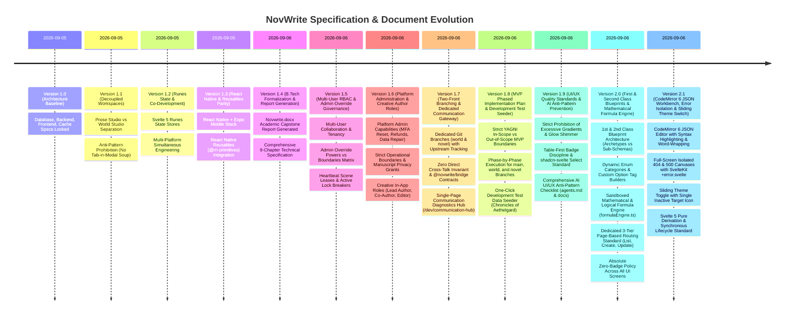

# NovWrite Documentation & Specification Changelog

This document maintains the official, chronological change log for **`Novwrite.docx`** and all authoritative system architecture specifications.

> **Governance Policy:**  
> `Novwrite.docx` serves as the authoritative, up-to-date B.Tech Major Project Technical Report and Architecture Specification. Whenever a major architectural decision, domain engine update, database modification, or frontend redesign occurs, `Novwrite.docx` **must be regenerated** and the exact changes recorded in this changelog.

---

## Version Timeline

---

## Release Details

### [Version 2.1] — 2026-09-06

**Scope:** CodeMirror 6 Color-Coded JSON Workbench, Full-Screen Isolated Error Architecture, Sliding Switch Theme Toggle & Svelte 5 Pure Derivation Standards  
**Target Documents:** [`docs/FRONTEND_ARCHITECTURE.md`](file:///home/yogesh/Projects/NovWrite/docs/FRONTEND_ARCHITECTURE.md), [`frontend_design_descisions.md`](file:///home/yogesh/Projects/NovWrite/frontend_design_descisions.md), [`NOVWRITE_ARCHITECTURE.md`](file:///home/yogesh/Projects/NovWrite/NOVWRITE_ARCHITECTURE.md), [`current_context.md`](file:///home/yogesh/Projects/NovWrite/current_context.md), [`changes.md`](file:///home/yogesh/Projects/NovWrite/changes.md)

#### Added

- **Color-Coded CodeMirror 6 JSON Editor (`JsonEditor.svelte`):**
  - Custom token palette matching NovWrite tokens (Cyan property keys, Emerald strings, Orange numbers, Rose booleans, Purple null, Slate brackets).
  - Bi-directional synchronization between Visual Form inputs, AST computed formulas, and Raw JSON editor state.
  - Enabled `EditorView.lineWrapping` to prevent horizontal container overflow on long properties and stack traces.
  - Real-time dark and light theme reconfiguration via `themeStore.mode`.
- **Full-Screen 404 & 500 Error Architecture (`+error.svelte`):**
  - SvelteKit centralized error routing dynamically handling 404 (Timeline Paradox) and 500 (Continuity Invariant Collapse) with standalone preview routes (`/404`, `/500`).
  - Strict removal of all application chrome (dev header, main navigation, studio switcher, and theme switch) on error routes for an isolated, focused recovery canvas.
  - Generous vertical whitespace (`space-y-10 md:space-y-12`, `py-16 md:py-24`) between badge, hero number, description, buttons, and diagnostic inspector.
  - Word-wrapped, syntax-highlighted JSON diagnostic trace console with 1-click clipboard copy and toast confirmation.
- **Sliding-Switch Theme Toggle (`theme-toggle.svelte`):**
  - Smooth animated sliding thumb switch displaying exclusively the inactive destination icon on the exposed track (Sun icon when in Dark mode; Moon icon when in Light mode).
- **Svelte 5 Pure Derivation Standard:**
  - Removed state mutation side-effects from `$derived` getters in `worldStore` and standardized on synchronous initial state computation (`getInitialEntityState`) across edit routes.

---

### [Version 2.0] — 2026-09-06

**Scope:** First-Class vs. Second-Class Blueprints, Dynamic Enum Categories, Sandboxed Mathematical Formula Engine, Dedicated 3-Tier Page Routing & Zero-Badge Standards  
**Target Documents:** [`agents.md`](file:///home/yogesh/Projects/NovWrite/agents.md), [`frontend_design_descisions.md`](file:///home/yogesh/Projects/NovWrite/frontend_design_descisions.md), [`docs/FRONTEND_ARCHITECTURE.md`](file:///home/yogesh/Projects/NovWrite/docs/FRONTEND_ARCHITECTURE.md), [`docs/ARCHITECTURE.md`](file:///home/yogesh/Projects/NovWrite/docs/ARCHITECTURE.md), [`NOVWRITE_ARCHITECTURE.md`](file:///home/yogesh/Projects/NovWrite/NOVWRITE_ARCHITECTURE.md), [`README.md`](file:///home/yogesh/Projects/NovWrite/README.md), [`Novwrite.docx`](file:///home/yogesh/Projects/NovWrite/Novwrite.docx), [`current_context.md`](file:///home/yogesh/Projects/NovWrite/current_context.md)

#### Added

- **First-Class & Second-Class Blueprint Hierarchy:**
  - **1st-Class Blueprints (Primary Entity Archetypes)**: Instantiate concrete entities in the universe timeline (Characters, Sacred Relics, Realms, Factions) with full causal mutation history and state snapshots.
  - **2nd-Class Blueprints (Sub-Blueprints & Value Objects)**: Reusable embedded data structures and continuous scale gauges (e.g. `Romantic Affection Scale`, `Cultivation Rank & Mastery`, `Power Matrices`) that are referenced as fields in 1st-Class blueprints.
- **Dynamic Enum Categories & Option Management:**
  - Dynamic interactive option tag builder allowing authors to define custom categories on `ENUM` fields (e.g. `gender` with `["Male", "Female", "Dual-Yin-Yang", "Celestial"]`).
  - Rendered dynamically through accessible `shadcn-svelte` `Select` components.
- **Sandboxed Mathematical & Logical Formula Engine (`formulaEngine.ts`):**
  - AST-based mathematical expression parser evaluating complex formulas (arithmetic `+`, `-`, `*`, `/`, `%`, `^`, dot-notation variables, logical conditionals `IF`, and math functions `CLAMP`, `MIN`, `MAX`, `SQRT`, `POW`).
  - Live reactive re-computation in entity forms and blueprint test sandboxes (e.g. `Total Combat Power = (cultivation.major_realm * cultivation.minor_realm) * special_Physique + attack * attack_technique_Mastery - defence * defence_technique_mastery`).
- **Dedicated 3-Tier Page-Based Routing:**
  - Standardized all domains onto dedicated routes: Default List (`/`), Dedicated Create (`/create`), Dedicated Update/Detail (`/[id]`).
- **Absolute Zero-Badge Policy:**
  - Complete elimination of badges across the frontend, replacing them with semantic status icons, action buttons, accessible breadcrumbs, and slide-over drawers.
- **Academic Capstone Report Synchronization:**
  - Regenerated [`Novwrite.docx`](file:///home/yogesh/Projects/NovWrite/Novwrite.docx) to **Version 2.0** with Chapter 5.4.

---

### [Version 1.9] — 2026-09-06

**Scope:** Frontend UI/UX Quality Standards, Visual Noise Constraints & AI Anti-Pattern Prevention  
**Target Documents:** [`agents.md`](file:///home/yogesh/Projects/NovWrite/agents.md), [`frontend_design_descisions.md`](file:///home/yogesh/Projects/NovWrite/frontend_design_descisions.md), [`docs/FRONTEND_ARCHITECTURE.md`](file:///home/yogesh/Projects/NovWrite/docs/FRONTEND_ARCHITECTURE.md), [`Novwrite.docx`](file:///home/yogesh/Projects/NovWrite/Novwrite.docx), [`current_context.md`](file:///home/yogesh/Projects/NovWrite/current_context.md)

#### Added

- **Strict Gradient & Visual Noise Elimination:**
  - Codified rules barring gratuitous rainbow gradients, glossy glassmorphism, and neon glow effects.
  - Enforced solid, grounded surfaces (`zinc-900`/`slate-900`) inspired by MongoDB Compass and Linear.
- **Badge Discipline Standard:**
  - Restricted badge usage primarily to **Data Tables** (status/category indicators: `ALIVE`, `DEAD`, `PUBLISHED`) and compact header status pills (`[● Canon Verified]`).
  - Prohibited badge spamming across body text, card headers, and form field labels.
- **Dropdown Component Standard:**
  - Mandated the use of the official `Select` primitive from `shadcn-svelte` (`$lib/components/ui/select`) and `React Native Reusables` (`@rn-primitives`) for all dropdown selectors, banning native unstyled `<select>` tags and DIY div click hacks.
- **AI UI/UX Anti-Pattern Checklist in `agents.md`:**
  - Added Rule 10 requiring all agents to audit frontend implementations against the AI UI anti-pattern checklist (no card sprawl, no modal inside modal, designed empty/loading skeleton states, complete keyboard navigation, WCAG AA 4.5:1 text contrast).
- **Academic Report & Specification Synchronization:**
  - Regenerated [`Novwrite.docx`](file:///home/yogesh/Projects/NovWrite/Novwrite.docx) to **Version 1.9**, integrating Section 5.3 (UI/UX Standards, Visual Noise Constraints & AI Anti-Pattern Prevention).

---

### [Version 1.8] — 2026-09-06

**Scope:** MVP Phased Implementation Plan & One-Click Development Test Seeder  
**Target Documents:** [`docs/MVP_PHASED_PLAN.md`](file:///home/yogesh/Projects/NovWrite/docs/MVP_PHASED_PLAN.md), [`Novwrite.docx`](file:///home/yogesh/Projects/NovWrite/Novwrite.docx), [`current_context.md`](file:///home/yogesh/Projects/NovWrite/current_context.md)

#### Added

- **Strict MVP Scope Charter & YAGNI Prohibitions:**
  - Codified clear in-scope vs out-of-scope boundaries (excluding complex CRDTs, GNN embeddings, and multi-currency billing in MVP; focusing on deterministic state folding, scene lease locks, and isolated workbenches).
- **Branch-Specific Phased Implementation Plan:**
  - **Main Branch (`main`):** Phase 0.1 (Monorepo), Phase 0.2 (DB Migrations & Prisma), Phase 0.3 (`@novwrite/bridge` with mock adapter), Phase 0.4 (Dev Seeder Engine), Phase 0.5 (Diagnostics Hub `/dev/communication-hub`).
  - **World Branch (`world`):** Phase W1 (Dynamic Schema), Phase W2 (Timeline Event Sourcing), Phase W3 (State Fold Engine & Invariants), Phase W4 (World Studio UI Suite), Phase W5 (World Bridge Server).
  - **Novel Branch (`novel`):** Phase N1 (Manuscript Runes Store), Phase N2 (Rich Text Prose Editor & Mentions), Phase N3 (Scene Leases & Locks), Phase N4 (Lore Drawer & Continuity HUD), Phase N5 (Novel Bridge Client).
  - **Integration (`main`):** Phase I1 (Cross-Domain Bridge Integration Suite), Phase I2 (One-Click Demo Universe End-to-End Walkthrough).
- **Development-Only One-Click Test Data Filler (`BLOCK_DEV_SEEDER_ENGINE_001`):**
  - Integrated `POST /api/v1/dev/seed` and UI trigger to instantly populate the interconnected _"Chronicles of Aethelgard"_ dataset (3 characters, 2 locations, 5 timeline events with mutations, 2 invariant rules, 3 manuscript scenes with intentional violation and lease test cases).
- **Academic Report & Specification Synchronization:**
  - Regenerated [`Novwrite.docx`](file:///home/yogesh/Projects/NovWrite/Novwrite.docx) to **Version 1.8**, integrating Chapter 7.2 (MVP Phased Implementation Plan & Development Test Seeder).

---

### [Version 1.7] — 2026-09-06

**Scope:** Two-Front Isolated Branching Model & Centralized Cross-Domain Communication Layer  
**Target Documents:** [`docs/COMMUNICATION_LAYER.md`](file:///home/yogesh/Projects/NovWrite/docs/COMMUNICATION_LAYER.md), [`docs/design_decisions.md`](file:///home/yogesh/Projects/NovWrite/docs/design_decisions.md), [`Novwrite.docx`](file:///home/yogesh/Projects/NovWrite/Novwrite.docx)

#### Added

- **Two-Front Git Branching Architecture:**
  - Created and published dedicated remote branches: `origin/world` (World Studio, dynamic schemas, timeline fold engine, rules graph) and `origin/novel` (Prose Studio, manuscript tree, TipTap rich text, collaborative scene leases).
  - Configured upstream git tracking (`git branch -u origin/world` and `git branch -u origin/novel`) with isolated development lifecycles.
- **The Zero Direct Cross-Talk Invariant:**
  - Established strict boundary rules prohibiting raw cross-domain imports or direct SQL joins between prose content and dynamic lore models.
  - Specified `@novwrite/bridge` as the single authoritative communication contract (Protobuf RPC and Zod schemas) for all inter-space queries (`SceneGroundingRequest`, `ValidateContinuityRequest`, `EntityMentionQuery`).
- **Centralized Communication Diagnostics Hub (`/dev/communication-hub`):**
  - Designed a single-page diagnostic dashboard to inspect real-time inter-space traffic, detect payload schema discrepancies, simulate mock responses, and replay failing requests.
  - Centralized RFC 7807 problem normalizer ensuring all cross-domain communication errors are debugged and resolved in one place.
- **Academic Report & Specification Synchronization:**
  - Regenerated [`Novwrite.docx`](file:///home/yogesh/Projects/NovWrite/Novwrite.docx) to **Version 1.7**, integrating the Two-Front Architecture and Communication Bridge into Chapter 1, Chapter 2, and the Executive Summary.

---

### [Version 1.6] — 2026-09-06

**Scope:** Platform-Level Administration System & Creative In-App Author Terminology  
**Target Documents:** [`docs/DATABASE_ARCHITECTURE.md`](file:///home/yogesh/Projects/NovWrite/docs/DATABASE_ARCHITECTURE.md), [`docs/BACKEND_ARCHITECTURE.md`](file:///home/yogesh/Projects/NovWrite/docs/BACKEND_ARCHITECTURE.md), [`docs/FRONTEND_ARCHITECTURE.md`](file:///home/yogesh/Projects/NovWrite/docs/FRONTEND_ARCHITECTURE.md), [`docs/CACHE_ARCHITECTURE.md`](file:///home/yogesh/Projects/NovWrite/docs/CACHE_ARCHITECTURE.md), [`docs/design_decisions.md`](file:///home/yogesh/Projects/NovWrite/docs/design_decisions.md), [`Novwrite.docx`](file:///home/yogesh/Projects/NovWrite/Novwrite.docx)

#### Added

- **Platform-Level Administration & Support Subsystem (`SYSTEM_ADMIN`)**:
  - **Account & Security Operations:** Support capabilities for Platform Admins (`is_platform_admin = TRUE`) to reset lost MFA/2FA authenticators upon identity verification and unlock brute-force locked accounts with mandatory support ticket referencing.
  - **Billing & Payment Management:** Ability to process partial/full Stripe payment refunds and adjust subscription tier states directly through the admin portal.
  - **Universe State Snapshot Repair Tools:** Administrative tooling to trigger manual re-folds and snapshot cache repairs for corrupted entity states.
  - **Platform Admin Audit Logging:** Dedicated `platform_admin_audit_logs` table tracking admin user ID, target user ID, action category (`MFA_RESET`, `ACCOUNT_UNLOCK`, `STRIPE_REFUND`, `DATA_REPAIR`), ticket ID, metadata JSONB, and IP address.
  - **Dedicated Admin API & Portal:** Secure `/api/v1/platform/*` endpoints protected by `PlatformAdminAuthMiddleware` requiring step-up MFA verification, and an isolated `/platform-admin` frontend workspace.
- **Strict Platform Admin Security Boundaries & Protections**:
  - **Zero Plaintext Password Access:** Passwords remain strictly hashed (Argon2id/bcrypt) with no administrative viewing or decryption capability.
  - **Manuscript Privacy & Consent Grants:** Platform admins are strictly barred from silently browsing private user novels or lore; debugging access requires explicit, time-bounded user support access grants.
  - **PCI-DSS Compliance:** Raw credit card data is never accessible or stored; payment operations use tokenized Stripe customer and charge IDs.
  - **Append-Only Immutability:** Admin audit logs cannot be modified, updated, or deleted by any administrative role.
- **Creative In-App Author Role Standardization**:
  - Renamed generic project "Admin" roles to creative author terminology: `LEAD_AUTHOR` (Project Creator), `CO_AUTHOR` (Senior Lorekeeper/Collaborator with canon override authority), `EDITOR`, `CONTRIBUTOR`, and `VIEWER`.
  - Updated in-app lock breaking and canon exception overrides to `BLOCK_AUTHOR_OVERRIDE_*`.
- **Academic Report & Specification Synchronization**:
  - Regenerated [`Novwrite.docx`](file:///home/yogesh/Projects/NovWrite/Novwrite.docx) to reflect the separation between Platform Administration and In-App Author roles across all relevant chapters.

---

### [Version 1.5] — 2026-09-06

**Scope:** Multi-User Collaboration, Tenancy & Admin Override Governance  
**Target Documents:** [`docs/DATABASE_ARCHITECTURE.md`](file:///home/yogesh/Projects/NovWrite/docs/DATABASE_ARCHITECTURE.md), [`docs/BACKEND_ARCHITECTURE.md`](file:///home/yogesh/Projects/NovWrite/docs/BACKEND_ARCHITECTURE.md), [`docs/FRONTEND_ARCHITECTURE.md`](file:///home/yogesh/Projects/NovWrite/docs/FRONTEND_ARCHITECTURE.md), [`docs/CACHE_ARCHITECTURE.md`](file:///home/yogesh/Projects/NovWrite/docs/CACHE_ARCHITECTURE.md), [`Novwrite.docx`](file:///home/yogesh/Projects/NovWrite/Novwrite.docx)

#### Added

- **Multi-User Tenancy & Project Membership Schema:** Introduced `project_members` with 5-tier role hierarchy (`OWNER`, `ADMIN`, `EDITOR`, `CONTRIBUTOR`, `VIEWER`), fine-grained permission overrides, and author attribution across scenes, entities, events, and rules.
- **Collaborative Scene Lock & Heartbeat Lease Engine:** Implemented `scene_leases` table and Redis lease keys with 60-second sliding TTLs and 20-second heartbeat renewals to prevent concurrent overwrite collisions.
- **Admin Override Governance & Decision Matrix:**
  - **Authorized Powers:** Force-approving intentional canon invariant exceptions (`FORCE_APPROVE_VIOLATION`), breaking stale/abandoned scene locks, merging conflicting timeline branches, and soft-quarantining broken entities.
  - **Mandatory Audit Logging:** Created `admin_override_logs` table enforcing textual justification, admin ID, timestamp, and previous/new state capture for every override action (`BLOCK_ADMIN_OVERRIDE_*`).
  - **Immutable Architectural Safety Rails:** Strictly prohibited overwriting historical event audit trails, cross-tenant project access, project transfer/deletion by non-owners, and author impersonation.
- **Frontend Collaborative Presence UI:** Active collaborator avatar stack, locked scene warning banners, role-based action gatekeepers, and `shadcn` Admin Override Dialog modals.
- **Cache & Concurrency Tier Expansions:** Multi-user presence tracking and scene lease mutexes added to Redis 7.2 caching topology.
- **Docx Report Synchronization:** Regenerated [`Novwrite.docx`](file:///home/yogesh/Projects/NovWrite/Novwrite.docx) with updated multi-user collaboration chapters, schemas, and governance matrices.

---

### [Version 1.4] — 2026-09-06

**Scope:** Academic Formalization & `Novwrite.docx` Major Project Report Generation  
**Target Artifact:** [`Novwrite.docx`](file:///home/yogesh/Projects/NovWrite/Novwrite.docx)

#### Added

- **Formal Academic Report Structure (`Novwrite.docx`)**:
  - **Cover Page & Departmental Metadata:** B.Tech Major Project Technical Report under the Department of Computer Science & Engineering.
  - **Abstract & Executive Summary:** Formalization of the _Canon Over AI Memory_ architectural thesis.
  - **Chapter 1 (Introduction & Problem Definition):** Comparative analysis against existing LLM tools (SudoWrite, NovelAI, standard RAG).
  - **Chapter 2 (System Architecture & Topology):** Go 1.23+ Core API, TypeScript Prisma Data Service, and PostgreSQL + Redis infrastructure.
  - **Chapter 3 (Database & Persistence Architecture):** Relational prose backbone, dynamic JSONB schema definitions, event sourcing tables, and HNSW vector search.
  - **Chapter 4 (Backend Subsystems & Continuity Engine):** Deterministic 4-step State Fold Engine algorithm, 4 invariant rule classes, and RFC 7807 explainable violation details.
  - **Chapter 5 (Frontend Architecture & Multi-Platform Design):** Decoupled standalone studios, elimination of nested tab-and-modal soup, dedicated creation workbenches, and Tri-Platform co-development (Web, Tauri 2 Desktop, React Native + Expo Mobile).
  - **Chapter 6 (Cache & Ephemeral State):** 5-tier Redis 7.2 caching topology, checkpoint snapshots, mutex fold locks, and cascading invalidation.
  - **Chapter 7 (Quality Assurance, Testing & DevOps):** 100% test coverage target via Dependency Injection, single-change policy, signed Git commits, and Docker Compose topology.
  - **Chapter 8 (Conclusion & Future Work):** CRDT multi-author collaboration, graph neural network continuity auditing, and offline SLM sidecars.
- **Repository-Level Documentation Index:** Integrated `Novwrite.docx` directly into [`README.md`](file:///home/yogesh/Projects/NovWrite/README.md).

---

### [Version 1.3] — 2026-09-05

**Scope:** Native Mobile Framework Specification & `shadcn/ui` Mobile Equivalent  
**Target Documents:** [`docs/FRONTEND_ARCHITECTURE.md`](file:///home/yogesh/Projects/NovWrite/docs/FRONTEND_ARCHITECTURE.md), [`frontend_design_descisions.md`](file:///home/yogesh/Projects/NovWrite/frontend_design_descisions.md)

#### Added

- **React Native & Expo Ecosystem:** Explicitly established **React Native with Expo (SDK 52+, Expo Router)** as the official native mobile client stack.
- **React Native Reusables (`@rn-primitives`)**: Specified [React Native Reusables](https://reactnativereusables.com/) styled with **NativeWind v4** (Tailwind for React Native) as the official `shadcn/ui` counterpart on mobile.
- **Tri-Platform Co-Development Parity Matrix:** Added comprehensive comparative matrix mapping components, styling engines, routing standards, theme synchronization, and keyboard handling across Web, Desktop, and Mobile.
- **Mermaid Syntax & GitHub Rendering Fixes:** Resolved subgraph direct edge parsing issues across all architecture diagrams.
- **Authoritative Repository URLs:** Updated proto package paths and onboarding clone instructions to `https://github.com/Yogesh-Kumar-Mallik-dev/NovWrite`.

---

### [Version 1.2] — 2026-09-05

**Scope:** Svelte 5 Runes State Architecture & Tri-Platform Co-Development Scaffolding  
**Target Documents:** [`docs/FRONTEND_ARCHITECTURE.md`](file:///home/yogesh/Projects/NovWrite/docs/FRONTEND_ARCHITECTURE.md)

#### Added

- **Svelte 5 Runes Store Architecture:** Integrated complete reactive store implementation (`UniverseStore`) using `$state`, `$derived`, and `$effect` for dynamic entity selection, category filtering, search, and per-entity history fetching.
- **Tri-Platform Co-Development Standard:** Mandated simultaneous engineering of Web, Desktop (Tauri 2), and Mobile frontends from shared design tokens and API contracts.

---

### [Version 1.1] — 2026-09-05

**Scope:** Decoupled Standalone Studios Architecture & Anti-Pattern Elimination  
**Target Documents:** [`docs/FRONTEND_ARCHITECTURE.md`](file:///home/yogesh/Projects/NovWrite/docs/FRONTEND_ARCHITECTURE.md), [`frontend_design_descisions.md`](file:///home/yogesh/Projects/NovWrite/frontend_design_descisions.md)

#### Added

- **Decoupled Standalone Studios:** Decoupled **NovWrite Prose Studio (Writing Space)** from **NovWrite World Studio (Creation / Canon Space)** into separate, standalone app workspaces.
- **Strict Anti-Pattern Prohibition (No Tab-in-Modal Soup):** Explicitly prohibited cramming Characters, Power Progression Ladders, Techniques, Custom Field Schemas, and Rule Assertions into pop-up modals or nested tab carousels on a single page.
- **Dedicated World Creation Workspaces:**
  - Characters & Entity Studio (`/world/characters`) with Master-Detail Grid and dedicated **Change History Table** per entity.
  - Power Systems & Progression Studio (`/world/progression`).
  - Universe Schema & Field Architect Studio (`/world/schema`).
  - Continuity Rules & Invariant Builder (`/world/rules`).
  - Causal Timeline & Historical Event Studio (`/world/timeline`).
  - Relationships & Affiliations Matrix (`/world/relationships`).
  - Continuity Health & Canon Reconciler Studio (`/world/audit`).

---

### [Version 1.0] — 2026-09-05

**Scope:** System Architecture Baseline & Core Technical Specifications  
**Target Documents:** [`docs/DATABASE_ARCHITECTURE.md`](file:///home/yogesh/Projects/NovWrite/docs/DATABASE_ARCHITECTURE.md), [`docs/BACKEND_ARCHITECTURE.md`](file:///home/yogesh/Projects/NovWrite/docs/BACKEND_ARCHITECTURE.md), [`docs/FRONTEND_ARCHITECTURE.md`](file:///home/yogesh/Projects/NovWrite/docs/FRONTEND_ARCHITECTURE.md), [`docs/CACHE_ARCHITECTURE.md`](file:///home/yogesh/Projects/NovWrite/docs/CACHE_ARCHITECTURE.md)

#### Added

- **Database Architecture Specification:** PostgreSQL 18 schema with `pgvector`, dynamic JSONB schemas with GIN indexing, immutable event sourcing tables (`Event`, `EventEffect`), and snapshot tables.
- **Backend Architecture Specification:** Multi-tier Go 1.23+ application API layer + TypeScript Prisma Data Service over coarse-grained gRPC, domain engines, RFC 7807 problem details with unique block IDs (`BLOCK_<DOMAIN>_<ACTION>_<ID>`), and 100% test coverage target via Dependency Injection.
- **Frontend Architecture Specification:** SvelteKit 2 + Svelte 5 Runes + `shadcn-svelte` + Tailwind CSS v4, MongoDB Compass / Linear developer workbench styling (Solid Purple `#7c3aed` & Red `#dc2626`), and Android responsive parity (280px–390px).
- **Cache Architecture Specification:** 5-tier Redis 7.2 caching topology, point-in-time folded state snapshot caching, single-flight mutex locks, and cascading invalidation protocols.
