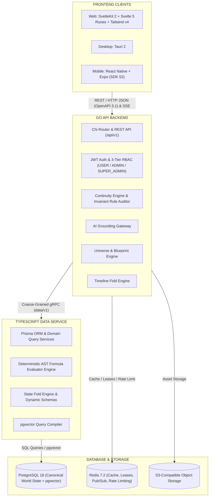
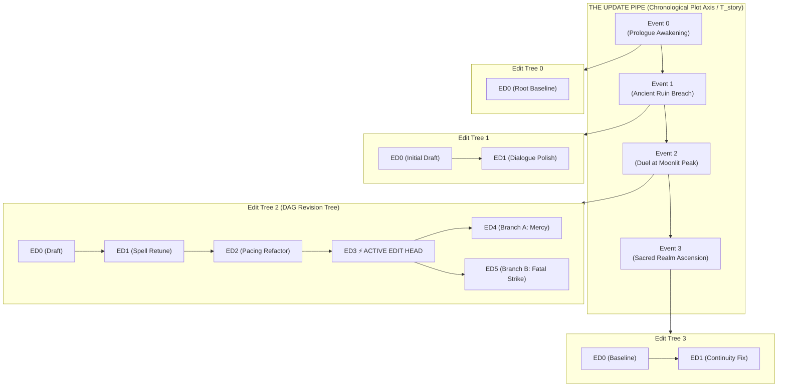

# NovWrite Subsystem Architecture & Implementation Guide

This document provides a comprehensive technical overview of the subsystems, domain modules, database schemas, API surfaces, continuity verification mechanics, and AI grounding pipelines for **NovWrite**.

---

## 1. System Architecture Overview

NovWrite is designed as a **hybrid multi-service architecture** composed of:

1. **Frontend Layer:** SvelteKit 2 + Svelte 5 (Runes) + Tailwind CSS v4 (Web) with Tauri 2 desktop client and React Native (Expo + NativeWind v4) mobile support.
2. **Go API Backend:** Modular monolith housing HTTP routing, authentication, project isolation, prose management, continuity rules execution, and AI orchestration.
3. **TypeScript Data Service:** Prisma-backed domain data service communicating with the Go backend via high-performance internal gRPC.
4. **Storage & Infrastructure:** PostgreSQL 18 with `pgvector`, Redis for queues/caching/leases, S3-compatible Object Storage, and Traefik reverse proxy.

---

## 2. Core Domain Subsystems

### 2.1 Identity, Project Isolation & Creative Workspace Lifecycle (`identity`, `project`)

- **Multi-Tenant / Project-Level Isolation:** Every novel, blueprint, dynamic property, timeline event, and scene is strictly partitioned by `ProjectID`.
- **Creative Novel Project Lifecycle:**
  - **Clean Slate Creation:** Instantiates isolated fictional universes with custom title, freeform genre text input (e.g. `Xianxia / Cultivation`, `Dark Fantasy`), and synopsis. Zero predefined dummy blueprints or starter archetype bloat.
  - **Project Settings & Edit:** Live modification of title, genre, and synopsis via `EditProjectDialog`.
  - **3-Step Irreversible Deletion:** Guarded by `DeleteProjectDialog` requiring scope assessment, irreversibility checkbox confirmation, and exact project title verification before destroying all scoped data.
- **RBAC Roles:** `LEAD_AUTHOR`, `CO_AUTHOR`, `EDITOR`, `CONTRIBUTOR`, `VIEWER`.
- **Session Security:** Cryptographically signed JWTs or HTTP-only session cookies with Redis revocation store and Platform Admin MFA assistance.

### 2.2 Novel & Prose Management (`novel`)

- **Hierarchy:** `Project` $\rightarrow$ `Novel` $\rightarrow$ `Volume` $\rightarrow$ `Chapter` $\rightarrow$ `Scene`.
- **Prose Representation:** Structured block-based rich text (TipTap/ProseMirror JSON) + raw markdown export + `@entity` inline mention tags.
- **Collaborative Concurrency:** 60-second heartbeat scene lease locks (`scene_leases`) preventing simultaneous editing overwrites.

### 2.3 Blueprint (Class) vs. Entity (Object) Universe Engine (`universe`)

NovWrite cleanly separates world-building archetypes from concrete instantiated objects:

- **1st-Class Blueprints (`FIRST_CLASS` - Entity Archetypes):**
  - Concrete universe actors and structures instantiated into the timeline (e.g. `Cultivator / Protagonist`, `Sacred Weapon & Relic`, `Sanctuary & Realm`, `Ancient Faction & Sect`).
  - Maintain unique entity IDs, causal mutation sequences, and point-in-time snapshots.
  - Can reference other 1st-Class Blueprints via `BLUEPRINT_REF` targeting entity IDs (relational entity graph: Character $\rightarrow$ Faction, Weapon $\rightarrow$ Realm).
- **2nd-Class Blueprints (`SECOND_CLASS` - Sub-Schemas & Continuous Scales):**
  - Reusable nested schemas and continuous scale gauges (e.g. `Romantic Affection Scale`, `Cultivation Rank & Mastery`, `Power Matrices`, `Soul Profile`).
  - Embedded inside 1st-Class blueprints or other 2nd-Class blueprints; cannot instantiate standalone entities.
- **Categorical Enums (`ENUM`), Weighted Value Types (`VALUE_TYPE`) & Arrays (`ARRAY`, `ARRAY_REF`):**
  - `ENUM`: Pure string categorical constants (`["Sword", "Saber", "Spear"]`) for narrative taxonomy without numeric power.
  - `VALUE_TYPE`: Dual-valued options (`[{ label: "Divine", value: "divine", power: 1000 }]`) bridging qualitative categorization with quantitative power weights for formulas.
  - `ARRAY`: Freeform string/item lists (e.g. titles, martial arts techniques, epithets).
  - `ARRAY_REF`: Array of entity references pointing to target blueprints (e.g. equipped artifacts, mastered spells).
- **Zero-Trust Backend Validation Parity & Lowercase Machine Keys:**
  - Strict lowercasing (`.toLowerCase()` / `strings.ToLower`) and sanitization (`[^a-z0-9_\.]`) for all field machine keys.
  - Schema-level rejection of duplicate field machine keys within a single blueprint (`DUPLICATE_FIELD_KEY`).
  - Field Type Slate Wipe: Modifying a field type sanitizes and wipes irrelevant type-specific configuration (number bounds on strings/enums/arrays, options on numbers/formulas, formula expressions on booleans/enums).
  - Case-insensitive / normalized lowercase entity property lookup and validation.
- **Dual Server-Side Mathematical & Logical Formula Engine (`formula_engine.go` & `formulaEngine.ts`):**
  - Safe recursive descent AST expression parser evaluating arithmetic, nested dot-notation variables (`cultivation.major_realm`), logical conditionals (`IF`, `&&`, `||`, `==`, `!=`, `<`, `>`, `<=`, `>=`), and math functions (`CLAMP`, `MIN`, `MAX`, `ROUND`, `FLOOR`, `CEIL`, `ABS`, `SQRT`, `POW`, `MOD`).
  - Server-side deterministic recomputation of all formula fields during entity creation and mutation without trusting client numbers.
  - Circular dependency prevention (formulas cannot reference their own output variable).

### 2.4 Timeline & Event State Engine (`timeline`)

- **Events (`Event`):** Occurrences tied to narrative sequence points (Chapter/Scene indices).
- **Event Effects (`EventEffect`):** Atomic state mutations caused by an event:
  - Property updates (e.g. `Li Wei.cultivation.major_realm = 4`)
  - Relational transfers (e.g. `Dawnbreaker Blade: Li Wei -> Zhang Rui`)
  - Status changes (e.g. `Elder Han: active -> deceased`)
- **Canonical State Reconstruction:** Reconstructs the exact state of any entity or the entire universe at any historical chapter/scene index by folding ordered event effects over the nearest base snapshot.

### 2.4.1 The UPDATE Pipe & Hanging EDIT Trees (Dual-Axis Reversible DAG Model)

NovWrite separates story progression from authorial drafting through an orthogonal dual-axis architecture:

1. **The UPDATE Pipe (Horizontal Plot Timeline):**
   - Sequential canonical story milestones (`event0 ---> event1 ---> event2 ---> event3 ---> event4`).
   - Carries sequence numbers and chronological universe years.
   - When folding universe state, each event evaluates using the snapshot of its current **Active EDIT Head**.
2. **The Hanging EDIT Trees (Vertical Authorial Revision DAGs):**
   - Every event and entity on the pipe has its own independent `EditTree<T>` DAG.
   - Each node (`EditNode`) stores an immutable snapshot, author note, revision type (`TYPO_FIX`, `BASELINE_EDIT`, `RETROACTIVE_PLOT_FIX`, `REVERT`), timestamp, delta patch, and pointers to infinite children branches (`childrenIds`).
3. **Non-Destructive Checkout & Infinite Branching:**
   - **Reverting:** Checking out an earlier edit (e.g., from `ED4` back to `ED3`) moves the `activeEditId` pointer to `ED3` without deleting `ED4`. `ED4` remains a valid branch of `ED3`.
   - **Branching:** When a new edit `ED5` is added while `ED3` is active, `ED3` now possesses multiple child branches (`[ED4, ED5]`), with the `activeEditId` advancing to `ED5`.
   - Any parent node in the tree can have infinite child branches, guaranteeing complete non-destructive reversibility and auditability.

### 2.5 Continuity & Rules Engine (`continuity`)

- **Rule Definitions (`ContinuityRule`):** System and author-defined invariants:
  - _Dead Entity Constraint:_ Deceased entities cannot perform actions without a preceding resurrection event.
  - _Inventory Possession Constraint:_ Entities cannot use or gift items they do not possess at the current timeline point.
  - _Progression Boundary Constraint:_ Characters cannot utilize techniques or spells above their active power stage.
  - _Location Proximity Constraint:_ Entities cannot be present at distant locations simultaneously without transit events.
- **Violation Reporting:** Formulates structured violations containing the contradictory prose span, canonical baseline state, historical causal event, and recommended one-click resolutions.

### 2.6 AI Orchestration & Grounding Gateway (`ai`)

- **Context Builder:** Retrieves the active scene's participants, folded canonical state, relevant timeline events, and `pgvector`-matched lore.
- **Grounding Pipeline:** Embeds strict canonical state constraints into LLM system prompts.
- **Extraction Pipeline:** Analyzes drafted prose to suggest new entities, relationship shifts, and event effects for author approval.

---

## 3. Dedicated Page-Based Routing & UI Standards

Every major domain is partitioned into a dedicated 3-tier route structure:

| Workbench Route   | Purpose                        | Key Capabilities                                                                                                                                           |
| :---------------- | :----------------------------- | :--------------------------------------------------------------------------------------------------------------------------------------------------------- |
| `/world/entities` | Entities Catalog & Inspector   | List (`/`) with per-blueprint customizable columns, Create (`/create`) with Archetype Carousel & live formulas, Update/Detail (`/[id]`)                    |
| `/world/schemas`  | Blueprints & Schemas Architect | List (`/`), Create (`/create`), Update/Detail (`/[id]`) for 1st-Class Archetypes & 2nd-Class Sub-Schemas (Progression Ladders, Affection Gauges, Formulas) |
| `/world/timeline` | Causal Timeline                | Narrative vs Chronological sequence visualization and atomic mutation logs                                                                                 |
| `/world/rules`    | Rules & Invariants             | Predicate builder and violation severity configurations                                                                                                    |
| `/world/audit`    | Continuity Health              | Universe violation tracker and one-click canon reconciler                                                                                                  |

- **Zero-Badge Policy:** Strict prohibition of badges/pill tags across all views. Replaced with semantic status icons, action buttons, accessible breadcrumbs, and slide-over drawers.
- **3-Tier Header Visual Hierarchy:** Entity Editor header is divided into Tier 1 (Navigation & Breadcrumbs), Tier 2 (Identity Banner & Archetype metadata), and Tier 3 (Utility Toolbar with Form/JSON switch, Feather History drawer trigger, and primary Save action).
- **Archetype Carousel:** Horizontal scroll deck on `/world/entities/create` with always-visible side navigation buttons (disabled, hover, active states), single-card stepping, no cutoffs, and hidden scrollbars.
- **Communication Bridge Separation:** `@novwrite/bridge` messaging diagnostics, contract tests, and mock adapters are strictly isolated in the `@novwrite/bridge` package and tested in Phase 1 of the test suite.

---

## 4. RESTful API Best Practices & Telemetry

- **Explicit Route Versioning:** All production endpoints are scoped under `/api/v1/...` and return `API-Version: 1.0`.
- **Telemetry & Tracing:** Responses automatically include `X-Request-ID` and execution latency `X-Response-Time`.
- **Standardized Pagination:** Collection queries use standard pagination envelopes (`page`, `pageSize`, `totalCount`, `totalPages`, `hasNextPage`, `hasPreviousPage`).
- **Empty Query Non-Null Guarantees:** 0-result queries return `200 OK` with `"data": []` and `"totalCount": 0` (never `null`).
- **RFC 7807 Problem Details:** Errors return `application/problem+json` envelopes with field-level breakdowns.
- **Container Probes:** Standardized `/healthz`, `/livez`, and `/readyz` endpoints.

---

## 5. 6-Phase Monorepo Test Architecture

NovWrite enforces a strict 6-phase test runner ([`./run.sh test`](file:///home/yogesh/Projects/NovWrite/run.sh) / [`.\run.ps1 test`](file:///home/yogesh/Projects/NovWrite/run.ps1)):

1. **Phase 1 (`@novwrite/bridge`):** RPC contracts, Zod schemas, differential state patchers, and error normalizers (13 unit tests).
2. **Phase 2 (`@novwrite/data-service`):** Schema validation, property normalization, micro-revision compaction, and AST formula engine with cycle detection (41 unit tests).
3. **Phase 3 (`apps/api`):** Go backend unit, formula engine cycle detection, and HTTP integration test suite.
4. **Phase 4 (`@novwrite/web`):** Frontend component, store, table configuration, and mathjs AST formula evaluation tests (29 unit tests).
5. **Phase 5 (`@novwrite/mobile`):** Mobile client stores, entity creation, timeline fold engine, and telemetry suite (11 unit tests).
6. **Phase 6 (Diagnostic Typecheck):** Monorepo SvelteKit and TypeScript type diagnostics via [`./run.sh check`](file:///home/yogesh/Projects/NovWrite/run.sh) / [`.\run.ps1 check`](file:///home/yogesh/Projects/NovWrite/run.ps1) with 0 errors and 0 warnings tolerance.
