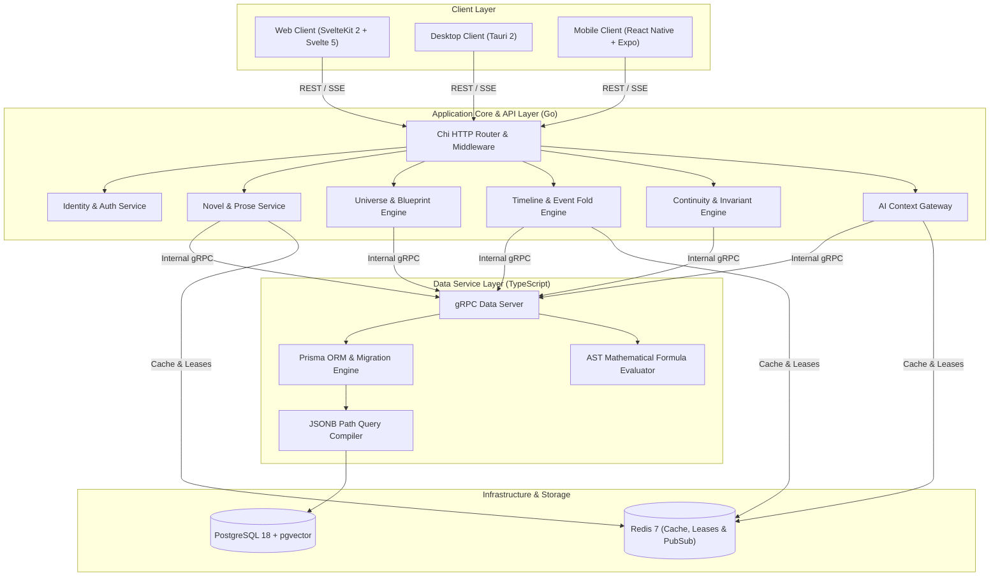
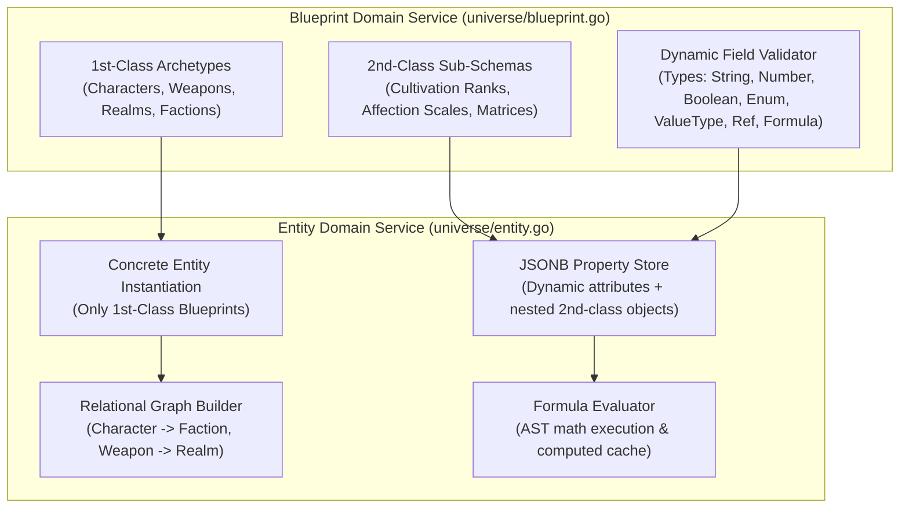
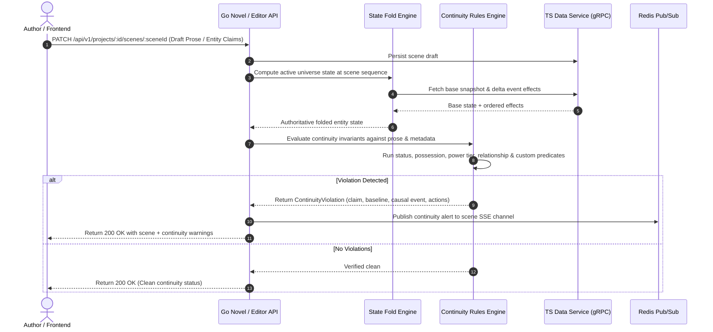

# Backend Architecture Specification

**Status:** Locked Baseline (Version 2.11 - Tiered Local-First Architecture, Canonical Backend Synchronization, Realtime SSE Hub & 6-Phase Monorepo Test Runner)  
**Primary Application Engine:** Go 1.23+ (`apps/api/`)  
**Data Access Service:** TypeScript Node.js 22+ with Prisma ORM (`apps/data-service/`)  
**Inter-Service Transport:** gRPC over HTTP/2 (`proto/data/v1/`) & `@novwrite/bridge`  
**Client API Transport:** REST HTTP (OpenAPI 3.1) & Server-Sent Events (SSE) via Chi Router

---

## 1. System Topology & Service Boundaries



---

## 2. Layer Responsibilities & Isolation Rules

### 2.1. Go Application API Layer (`apps/api/`)

- **HTTP Routing, Telemetry & Middleware:**
  - Standardized REST routing using Chi router with strict `/api/v1/` route prefixes.
  - Automatic `API-Version: 1.0`, `X-Request-ID`, and `X-Response-Time` tracing headers.
  - Standardized pagination metadata envelopes (`page`, `pageSize`, `totalCount`, `totalPages`, `hasNextPage`, `hasPreviousPage`).
  - Strict empty query non-null `[]` guarantees (returns `200 OK` with `"data": []`, never `null`).
  - Container and orchestration health probes: `/healthz`, `/livez`, `/readyz`.
  - JWT/session authentication, project tenancy scoping, and rate limiting.
- **The UPDATE Pipe & Hanging EDIT Trees Engine (`timeline`, `universe`):**
  - **Narrative Timeline Conduit ($T_{\text{story}}$)**: Sequential plot axis carrying narrative sequence numbers and chronological timestamps (`event0 ---> event1 ---> event2 ...`).
  - **Authorial Revision DAG ($T_{\text{revision}}$)**: Vertical hanging tree (`EditTree<T>`) for every event and entity containing immutable revision nodes (`ED0 -> ED1 -> ED2 ...`).
  - **Non-Destructive Checkout**: Checking out an earlier revision does not erase later drafts—they remain valid branches of the parent node with infinite branching support.
  - **Bitemporal Micro-Revision Compaction (`CompactMicroRevisions`)**: Collapses contiguous linear chains of minor `TYPO_FIX` edits into unified baseline nodes to prevent vertical tree explosion while preserving non-linear authorial branches.
  - **Bitemporal Coordinate Resolution**: Deterministically resolves exact world state at any dual-axis coordinate $(T_{\text{narrative}}, T_{\text{revision}})$.
- **Universe & Blueprint Engine (`universe`):**
  - Manages **1st-Class Blueprints** (Entity Archetypes: Characters, Weapons, Sanctuaries, Factions) and **2nd-Class Blueprints** (Sub-Schemas & Gauges: Cultivation Ranks, Affection Scales, Power Matrices).
  - Validates dynamic entity attributes against `BlueprintDef` and `DynamicFieldDef` schemas, including pure categorical enums (`ENUM`), weighted value types (`VALUE_TYPE`: `{ label, value, power }`), freeform arrays (`ARRAY`), blueprint references (`BLUEPRINT_REF`), and blueprint array references (`ARRAY_REF`).
  - **Zero-Trust Validation & Non-Destructive Schema Evolution:**
    - Automatically forces lowercase machine keys (`strings.ToLower`), rejects duplicate field keys (`DUPLICATE_FIELD_KEY`), executes field type slate wipe, and normalizes entity property keys.
    - Preserves historical attributes under underscore-prefixed legacy property maps (`_legacy_properties`) and runs non-destructive upcasters (`UpcastLegacyProperties`), guaranteeing backward compatibility when schemas evolve.
  - **Server-Side AST Formula Engine with DAG Cycle Detection (`formula_engine.go`):**
    - Executes recursive descent AST formula parsing and deterministic calculation server-side during entity persistence and event mutation.
    - Synchronous 3-state DAG topological traversal (`DetectFormulaCycles`, `DetectFormulaDependencyCycle`) detects circular dependencies before saving and returns formatted cycle paths (e.g. `power -> modifier -> power`).
- **Prose & Novel Engine (`novel`):** Managing scene markdown, word count telemetry, chapter hierarchies, entity mentions, and collaborative 60-second heartbeat scene locks (`scene_leases`).
- **Continuity & Rules Engine (`continuity`):** Invariant rule execution, predicate evaluation against folded state, relational link validation, and explainable violation traceback generation.
- **AI Context Gateway (`ai`):** Assembling grounded prompts from canonical state and `pgvector` similarity, streaming model completions via SSE.

### 2.2. TypeScript Data Service (`apps/data-service/`)

- **Isolation Scope:** Encapsulates direct database queries, migrations, and Prisma ORM client operations.
- **Domain Engine Parity:** Houses dual-engine TypeScript implementations of Schema Engine (`schemaEngine.ts`), Property Validator (`propertyValidator.ts`), State Fold Engine (`stateFoldEngine.ts`), Timeline Engine (`timelineEngine.ts`), Revision Engine (`revisionEngine.ts` with `compactMicroRevisions`), and AST Formula Engine (`formulaEngine.ts` with `detectFormulaCycles`) maintaining 100% parity with the Go backend.
- **Coarse-Grained Domain gRPC API:**
  - `GetProjectState(projectId, sequenceNumber)`
  - `CreateEventWithEffects(projectId, eventData, effects)`
  - `GetEntityTimeline(projectId, entityId)`
  - `EvaluateEntityFormulas(projectId, entityId, propertiesJson)`
  - `SearchVectorGrounding(projectId, queryEmbedding, limit)`

### 2.3. Shared Contract & Communication Bridge (`packages/bridge/`)

- **Bridge Contract Layer (`@novwrite/bridge`):** Houses typed RPC contracts, Zod schemas, mock adapters, differential patching utilities (`diffEntityProperties`, `applyEntityPatch`, `JSONPatchSchema`), and automated test suites for cross-domain interactions (`SceneGroundingRequest`, `ValidateContinuityRequest`, `EntityMentionQuery`).
- **Deterministic Contract Testing:** Automated contract and mock suites executed in Phase 1 of the monorepo test runner (`./test.sh` / `.\test.ps1`) ensuring seamless frontend-to-backend communication without cross-domain leakage.

---

## 3. Go Domain Module Architecture

Each domain module in `apps/api/internal/` follows strict Dependency Injection (DI) with interfaces:

```text
apps/api/internal/
├── shared/                       # Shared error types, logger, ID generators, RFC 7807 problem details
├── middleware/                   # Telemetry (Request ID, Response Time, API-Version), Auth, CORS
├── identity/                     # Users, auth tokens, workspace tenancy, MFA
├── novel/                        # Novel, chapter, scene, prose operations, scene leases
├── universe/                     # Blueprints (1st/2nd Class), fields, entities, formulas, revisions, relations
├── timeline/                     # Events, event effects, state snapshots, fold engine, edit trees
├── continuity/                   # Invariant rules, predicate evaluator, violation generator
└── ai/                           # Prompt builder, model clients (Gemini/Anthropic/OpenAI), SSE streamer
```

### 3.1. Block-Based Construction Standard

Every logical function or block in the Go codebase follows the mandatory structure:

```go
// Block: BLOCK_TIMELINE_FOLD_STATE_001
// Description: Reconstructs the universe entity state at a given chapter sequence number by folding historical event effects over the nearest base snapshot.
// Inputs: ctx context.Context, projectID uuid.UUID, targetSeq int
// Output: (*UniverseStateSnapshot, error)
func (e *TimelineFoldEngine) FoldStateAtSequence(ctx context.Context, projectID uuid.UUID, targetSeq int) (*UniverseStateSnapshot, error) {
    if targetSeq < 0 {
        return nil, fmt.Errorf("BLOCK_TIMELINE_FOLD_STATE_001: invalid negative sequence number: %d", targetSeq)
    }

    baseSnapshot, err := e.snapshotRepo.GetNearestSnapshot(ctx, projectID, targetSeq)
    if err != nil {
        return nil, fmt.Errorf("BLOCK_TIMELINE_FOLD_STATE_001: failed to retrieve base snapshot: %w", err)
    }

    // Flat execution flow with early returns and deterministic state folding...
    return foldedState, nil
}
```

---

## 4. Universe Blueprint & Entity Domain Mechanics

### 4.1. Blueprint (Class) vs Entity (Object) Service Model



### 4.2. Relational Entity Graph Traversal & Reference Integrity

- 1st-Class Blueprints can define fields of type `BLUEPRINT_REF` targeting other 1st-Class Blueprints (e.g. `cultivator.sect_id -> Ancient Faction & Sect`, `cultivator.equipped_weapon -> Sacred Weapon & Relic`).
- The backend validates reference integrity during instantiation and mutation, preventing dangling entity references.
- Circular references in formula dependencies are detected via cycle-detection algorithms before expression execution.

---

## 5. Continuity Verification Pipeline



---

## 6. gRPC Protobuf Contracts (`proto/data/v1/`)

```protobuf
syntax = "proto3";

package novwrite.data.v1;
option go_package = "github.com/Yogesh-Kumar-Mallik-dev/NovWrite/proto/data/v1;datav1";

service DataService {
  rpc GetProjectState(GetProjectStateRequest) returns (GetProjectStateResponse);
  rpc CreateEventWithEffects(CreateEventRequest) returns (CreateEventResponse);
  rpc QueryEntityHistory(QueryEntityHistoryRequest) returns (QueryEntityHistoryResponse);
  rpc EvaluateFormulas(EvaluateFormulasRequest) returns (EvaluateFormulasResponse);
  rpc FindSimilarContext(FindSimilarContextRequest) returns (FindSimilarContextResponse);
  rpc SaveStateSnapshot(SaveStateSnapshotRequest) returns (SaveStateSnapshotResponse);
}

enum BlueprintClass {
  BLUEPRINT_CLASS_UNSPECIFIED = 0;
  FIRST_CLASS = 1;
  SECOND_CLASS = 2;
}

enum BlueprintFieldType {
  FIELD_TYPE_UNSPECIFIED = 0;
  STRING = 1;
  NUMBER = 2;
  BOOLEAN = 3;
  ENUM = 4;
  BLUEPRINT_REF = 5;
  FORMULA = 6;
}

message EnumOption {
  string label = 1;
  string value = 2;
  double power = 3;
}

message DynamicFieldDef {
  string id = 1;
  string name = 2;
  string label = 3;
  BlueprintFieldType field_type = 4;
  repeated EnumOption options = 5;
  string target_blueprint_id = 6;
  double min_val = 7;
  double max_val = 8;
  double step_val = 9;
  string unit = 10;
  string formula_expression = 11;
  bool is_required = 12;
}

message BlueprintDef {
  string id = 1;
  string project_id = 2;
  string name = 3;
  BlueprintClass blueprint_class = 4;
  string category = 5;
  string description = 6;
  repeated DynamicFieldDef fields = 7;
}

message EntityItem {
  string id = 1;
  string project_id = 2;
  string blueprint_id = 3;
  string name = 4;
  repeated string aliases = 5;
  string description = 6;
  bytes properties_json = 7;
  bytes computed_formulas_json = 8;
  string status = 9;
  int32 last_mutated_seq = 10;
}

message GetProjectStateRequest {
  string project_id = 1;
  int32 sequence_number = 2;
}

message GetProjectStateResponse {
  string project_id = 1;
  int32 sequence_number = 2;
  repeated EntityItem entities = 3;
  string checksum = 4;
}

message CreateEventRequest {
  string project_id = 1;
  string anchor_scene_id = 2;
  string name = 3;
  string description = 4;
  int32 narrative_sequence = 5;
  repeated EventEffect effects = 6;
}

message EventEffect {
  string entity_id = 1;
  string property_key = 2;
  string operation = 3;
  string previous_value_json = 4;
  string new_value_json = 5;
  string explanation = 6;
}

message CreateEventResponse {
  string event_id = 1;
  bool success = 2;
}

message EvaluateFormulasRequest {
  string project_id = 1;
  string blueprint_id = 2;
  bytes properties_json = 3;
}

message EvaluateFormulasResponse {
  bytes computed_formulas_json = 1;
  bool success = 2;
  string error_message = 3;
}
```

---

## 7. REST API Standards, Telemetry & RFC 7807 Problem Details

### 7.1. Global REST Standards & Telemetry Middleware

All HTTP endpoints adhere to modern REST best practices:

- **Explicit Routing & Versioning:** Every domain route begins with `/api/v1/` and responds with the `API-Version: 1.0` header.
- **Request Tracing & Metrics:** Every inbound request is assigned a unique UUID in `X-Request-ID` and profiled with millisecond execution latency returned in `X-Response-Time`.
- **Standardized Pagination Envelopes:** List queries wrap records in `{ data: [...], meta: {...}, pagination: { page, pageSize, totalCount, totalPages, hasNextPage, hasPreviousPage } }`.
- **Empty Query Guarantees:** A search or query returning 0 records **always returns HTTP 200 OK with `"data": []` and `"totalCount": 0`** (never `null` or 404).
- **Probes for Container Orchestration:**
  - `GET /healthz`: Summary health status.
  - `GET /livez`: Fast liveness probe.
  - `GET /readyz`: Database & Redis dependency readiness probe.

### 7.2. RFC 7807 Problem Details (`application/problem+json`)

All HTTP error responses adhere to `application/problem+json`:

```json
{
  "type": "https://novwrite.io/errors/validation-error",
  "title": "Validation Failed",
  "status": 422,
  "detail": "BLOCK_CONTINUITY_EVAL_004: Character 'Elder Han' is claimed alive in Scene 42, but was marked deceased in Event 'Fall of Cloud Sect' (Seq: 18).",
  "instance": "/api/v1/projects/proj-123/scenes/scene-42/validate",
  "code": "SCHEMA_VALIDATION_ERROR",
  "timestamp": "2026-09-07T05:00:00.000000Z",
  "invalidParams": [
    {
      "name": "character_status",
      "reason": "Entity status deceased cannot invoke martial art techniques"
    }
  ]
}
```

### 7.3. Defensive API Security & Payload Bounding

- **Request Body Size Limiting (`MaxBytesMiddleware`):** Protects the API server from memory exhaustion DoS attacks by capping request payloads at 10MB (`10 << 20` bytes) via Go's standard `http.MaxBytesReader`.
- **Content Security Policy & Hardened Security Headers (`SecurityHeadersMiddleware`):**
  - `Content-Security-Policy: default-src 'self'; script-src 'self' 'wasm-unsafe-eval'; style-src 'self' 'unsafe-inline'; img-src 'self' data: https:; font-src 'self' data:; connect-src 'self' http://localhost:* ws://localhost:* http://127.0.0.1:* ws://127.0.0.1:*; frame-ancestors 'none';`
  - `X-Content-Type-Options: nosniff`
  - `X-Frame-Options: DENY`
  - `X-XSS-Protection: 1; mode=block`
  - `Referrer-Policy: strict-origin-when-cross-origin`
  - `Permissions-Policy: camera=(), microphone=(), geolocation=()`
- **Dynamic CORS Policy (`cors.Handler`):** Reads allowed origins from the `CORS_ALLOWED_ORIGINS` environment variable (comma-separated), falling back to local web (`localhost:5173`, `localhost:3000`) and desktop Tauri (`tauri://localhost`).

### 7.4. Token Bucket Rate Limiting & User Claims Context

- **Thread-Safe Token Bucket Rate Limiting (`RateLimiterMiddleware`):**
  - Per-client IP bucket holding up to $N$ tokens (default: 300 requests per minute) refilling smoothly over time.
  - Automatically extracts client IP from `X-Forwarded-For`, `X-Real-IP`, or `RemoteAddr`.
  - Injects `X-RateLimit-Limit`, `X-RateLimit-Remaining`, and `X-RateLimit-Reset: 60` headers on all responses.
  - Returns RFC 7807 `429 Too Many Requests` (`https://novwrite.com/errors/rate-limit-exceeded`, `RATE_LIMIT_EXCEEDED`) when capacity is exhausted.
  - Automatically cleans up stale client records after 10 minutes of inactivity.
- **JWT Authentication & Context (`JWTAuthMiddleware`):**
  - Parses and verifies standard HMAC-SHA256 bearer tokens.
  - Injects `UserClaims` (`UserID`, `Email`, `Role`, `ProjectIDs`) into the Go request context via `httputil.GetUserFromContext`.
  - Supports local development fallback using the `X-User-ID` header when no bearer token is present.

---

## 8. Multi-User Collaboration & Concurrency Engine

### 8.1. Scene Lock & Heartbeat Lease Protocol

To prevent concurrent overwrite conflicts when multiple co-authors work on a shared novel:

1. **Acquire Lease:** When an author opens a scene for editing, the client issues `POST /api/v1/projects/{id}/scenes/{sceneId}/lock`. The Go backend records an entry in `scene_leases` and returns a 60-second heartbeat lease token.
2. **Heartbeat Renewal:** The client pings `POST /api/v1/projects/{id}/scenes/{sceneId}/heartbeat` every 20 seconds to extend the lease.
3. **Read-Only Peer View:** Other authors attempting to edit the same scene receive an active editor indicator with the current writer's identity, placing their editor in synchronized read-only mode.
4. **Lock Breaking:** If a writer disconnects without releasing the lease, a `CO_AUTHOR` or `LEAD_AUTHOR` can break the lock via `DELETE /api/v1/projects/{id}/scenes/{sceneId}/lock` (logged to `admin_override_logs`).

---

## 9. In-App Author Override Engine & Project Governance

### 9.1. Block-Based Override Execution Standard

Every in-app canon override in Go must execute through the audited override pipeline with unique block IDs:

```go
// Block: BLOCK_AUTHOR_OVERRIDE_VIOLATION_001
// Description: Allows Lead Authors and Co-Authors to force-approve an intentional canon invariant exception (e.g. resurrection miracle) with mandatory justification.
// Inputs: ctx context.Context, projectID uuid.UUID, authorID uuid.UUID, req *ForceApproveViolationRequest
// Output: (*AuditLogEntry, error)
func (s *AuthorOverrideService) ForceApproveViolation(ctx context.Context, projectID uuid.UUID, authorID uuid.UUID, req *ForceApproveViolationRequest) (*AuditLogEntry, error) {
    if strings.TrimSpace(req.Justification) == "" {
        return nil, fmt.Errorf("BLOCK_AUTHOR_OVERRIDE_VIOLATION_001: override justification is mandatory and cannot be empty")
    }

    role, err := s.membershipRepo.GetUserRole(ctx, projectID, authorID)
    if err != nil || (role != RoleLeadAuthor && role != RoleCoAuthor) {
        return nil, fmt.Errorf("BLOCK_AUTHOR_OVERRIDE_VIOLATION_001: unauthorized; requires LEAD_AUTHOR or CO_AUTHOR role")
    }

    // Execute state override & log immutable audit trail...
    return auditEntry, nil
}
```

### 9.2. Project Author Override Decision Matrix

| Target Operation                        | Permitted for CO_AUTHOR? | Permitted for LEAD_AUTHOR? | Audit Requirement                                               | Immutable Safety Rail                                             |
| :-------------------------------------- | :----------------------- | :------------------------- | :-------------------------------------------------------------- | :---------------------------------------------------------------- |
| **Force-Approve Invariant Violation**   | Yes                      | Yes                        | Mandatory textual justification logged to `admin_override_logs` | Cannot erase violation history; marks resolved with override flag |
| **Break Stale Scene Lock**              | Yes                      | Yes                        | Lease expiration verification or reason logged                  | Cannot overwrite uncommitted client drafts                        |
| **Merge Conflicting Timeline Branches** | Yes                      | Yes                        | Conflict resolution rationale recorded                          | Replays new branch; past effects remain append-only               |
| **Modify Project Blueprints**           | Yes                      | Yes                        | Blueprint version bump logged                                   | Legacy entity data preserved with deprecation flags               |
| **Transfer / Delete Project**           | **NO**                   | **YES**                    | Multi-factor confirmation + Owner password check                | Project deletion is strictly restricted to LEAD_AUTHOR            |
| **Cross-Tenant Project Access**         | **NO**                   | **NO**                     | Blocked at SQL & JWT middleware level                           | Absolute tenant isolation between different fictional universes   |
| **Impersonate Author Attribution**      | **NO**                   | **NO**                     | Blocked by cryptographic user ID binding                        | Edits always record the executing user's true ID                  |

---

## 10. Multi-User Identity, Authentication & Platform Administration

NovWrite implements an explicit 3-tier system identity hierarchy:

1. **`USER` (Standard Author):** Standard user tier for authors, worldbuilders, and collaborators. Authors manage their own novel projects and invite collaborators with granular project roles (`LEAD_AUTHOR`, `CO_AUTHOR`, `EDITOR`, `CONTRIBUTOR`, `VIEWER`).
2. **`ADMIN` (Platform Administrator):** Operational tier for community managers and support engineers. Can view user accounts, filter by role, unlock accounts, and perform verified support actions.
3. **`SUPER_ADMIN` (Super Administrator):** System root authority with unrestricted management privileges: promoting/demoting user roles, deleting accounts, configuring platform rules, and auditing system events.

### 10.1. Authentication & Identity Endpoints (`/api/v1/auth`)

- `POST /api/v1/auth/register` — Register a new author account (`USER`). Elevated role assignment (`ADMIN`, `SUPER_ADMIN`) during registration is strictly restricted to `SUPER_ADMIN`.
- `POST /api/v1/auth/login` — Authenticate via email or username and password, returning an HMAC-SHA256 signed JWT token (`LoginResponse`) containing user claims.
- `GET /api/v1/auth/me` — Retrieve the profile and active role of the authenticated caller.

### 10.2. Administration & Role Management Endpoints (`/api/v1/admin`)

- `GET /api/v1/admin/users` — Paginated user directory with search and role filtering (Guarded by `RequireAdmin`).
- `PUT /api/v1/admin/users/{userId}/role` — Promote or demote a user's system role (Guarded by `RequireAdmin`; promoting to `ADMIN` or `SUPER_ADMIN` requires `RequireSuperAdmin`).
- `DELETE /api/v1/admin/users/{userId}` — Irreversibly delete/deactivate a user account (Guarded by `RequireSuperAdmin`).

### 10.3. Dedicated Singleton Super Admin Dashboard & Authentication (`/superadmin`)

NovWrite enforces a strict **Singleton Super Admin Constraint** across the entire platform. Exactly one root Super Admin account exists (`novwrite_ops` / `sysadmin@novwrite.dev`). Access to the dedicated Super Admin control plane is guarded by dual-layer protection:

1. **Username & Password Authentication Gate (`POST /api/v1/superadmin/login`):**
   - The `/superadmin` web route is locked by default behind a credential gate.
   - Requires valid Super Admin credentials (`emailOrUsername` and password).
   - Validates that the authenticated identity strictly holds the `SUPER_ADMIN` system role. Requests from standard `USER` or `ADMIN` roles are denied with `403 Forbidden` (`SUPER_ADMIN_CREDENTIALS_REQUIRED`).
   - Issues 24-hour HMAC-SHA256 signed JWT tokens containing `RoleSuperAdmin` claims.
2. **Protected Telemetry & Operations Endpoint (`GET /api/v1/superadmin/dashboard`):**
   - Guarded by `httputil.RequireSuperAdmin()` middleware.
   - Returns real-time system metrics: active goroutines, Go runtime version, host platform, user tier distributions, rate limiter status, payload size caps, and security telemetry.
3. **Session Lock & Voluntary Revocation:**
   - Dedicated `[Lock]` action on the Super Admin control plane allows the administrator to securely purge stored tokens and lock the interface immediately.

### 10.4. Backend Server CLI Management (`apps/api/cmd/admin-cli`)

For high-security host operations, the Super Admin singleton is directly administrable via the Go server CLI located on the backend host:

```bash
# 👑 Inspect Singleton Super Admin status, user distribution, and platform telemetry
cd apps/api && go run ./cmd/admin-cli status

# 🔑 Generate root JWT dashboard access token directly on server host
cd apps/api && go run ./cmd/admin-cli token

# 👥 List all registered users and their platform roles
cd apps/api && go run ./cmd/admin-cli list-users

# ⬆️ Promote a standard USER to ADMIN
cd apps/api && go run ./cmd/admin-cli promote <email_or_username>

# ⬇️ Demote an ADMIN back to standard USER
cd apps/api && go run ./cmd/admin-cli demote <email_or_username>
```

---

## 11. 6-Phase Monorepo Test Architecture & Regression Pipeline

NovWrite enforces a mandatory 6-phase test and verification pipeline ([`./run.sh test`](file:///home/yogesh/Projects/NovWrite/run.sh) / [`.\run.ps1 test`](file:///home/yogesh/Projects/NovWrite/run.ps1)) executing across the entire monorepo:

| Phase       | Target Subsystem / Package  | Test Type & Scope                                                | Verification Command                        |
| :---------- | :-------------------------- | :--------------------------------------------------------------- | :------------------------------------------ |
| **Phase 1** | `@novwrite/bridge`          | 13 Unit Tests: RPC contracts, Zod schemas, error normalizers     | `pnpm --filter @novwrite/bridge test`       |
| **Phase 2** | `@novwrite/data-service`    | 41 Unit Tests: Schema validation, AST formulas, DAG cycle checks | `pnpm --filter @novwrite/data-service test` |
| **Phase 3** | `apps/api` (Go Backend)     | Go Handler Suite: chi routes, RBAC guards, rate limiter, auth    | `go test ./...`                             |
| **Phase 4** | `@novwrite/web` (Frontend)  | 29 Unit Tests: mathjs formulas, project engine, table configs    | `pnpm --filter @novwrite/web test`          |
| **Phase 5** | `@novwrite/mobile` (Mobile) | 11 Unit Tests: Client stores, entity creation, timeline fold     | `pnpm --filter @novwrite/mobile test`       |
| **Phase 6** | SvelteKit & TS Monorepo     | Monorepo Diagnostics: `svelte-check` and `tsc --noEmit`          | `./run.sh check` / `.\run.ps1 check`        |

1. **Phase 1 (`@novwrite/bridge`):** Verifies typed RPC contracts, Zod schemas, error normalizers, and mock adapters.
2. **Phase 2 (`@novwrite/data-service`):** Verifies schema validation, property normalization, AST formula engine, and timeline state fold engine.
3. **Phase 3 (`apps/api`):** Executes Go unit and integration tests across domain packages (`shared`, `middleware`, `universe`, `timeline`, `continuity`).
4. **Phase 4 (`@novwrite/web`):** Executes Vitest component, utility, and project store tests (`worldStore`, `projectEngine`, `formulaEngine`, `PipeTreeVisualizer`, `JsonEditor`).
5. **Phase 5 (`@novwrite/mobile`):** Executes React Native mobile client store, timeline fold, entity mutation, and telemetry tests.
6. **Phase 6 (Diagnostic Typecheck):** Runs `svelte-check` and `tsc --noEmit` across all workspace packages via [`./run.sh check`](file:///home/yogesh/Projects/NovWrite/run.sh) / [`.\run.ps1 check`](file:///home/yogesh/Projects/NovWrite/run.ps1).

---

## 12. Creative Novel Project Management & Clean-Slate Database Flush Utility

### 12.1. REST Creative Novel Projects Endpoints (`apps/api`)

- `GET /api/v1/projects` — Paginated list of creative novel projects (`pageSize = 10`) with full-text search.
- `POST /api/v1/projects` — Instantiate a new isolated project universe on a pure **Clean Slate** with title, freeform genre text input (e.g. `Xianxia / Cultivation`, `Sci-Fi`), and synopsis. Zero boilerplate/starter archetypes seeded. Returns `201 Created` with `Location` header.
- `GET /api/v1/projects/{projectId}` — Retrieve project metadata and configuration.
- `PUT /api/v1/projects/{projectId}` / `PATCH /api/v1/projects/{projectId}` — Update project title, synopsis, and freeform genre string.
- `DELETE /api/v1/projects/{projectId}` — Irreversibly delete project and cascade deletion across scoped blueprints, entities, scenes, and timeline events (`204 No Content`). Guarded by frontend 3-step confirmation sequence (`DeleteProjectDialog.svelte`).

### 12.2. Clean-Slate Database & Redis Flush Utility (`./flush_db.sh`)

- Standalone executable script [`./flush_db.sh`](file:///home/yogesh/Projects/NovWrite/flush_db.sh) executing:
  1. Redis cache flush (`FLUSHALL`) via docker/local connection.
  2. PostgreSQL schema reset (`prisma db push --force-reset --accept-data-loss`).
  3. Clean slate guarantee for new user onboarding and fresh testing environments.
