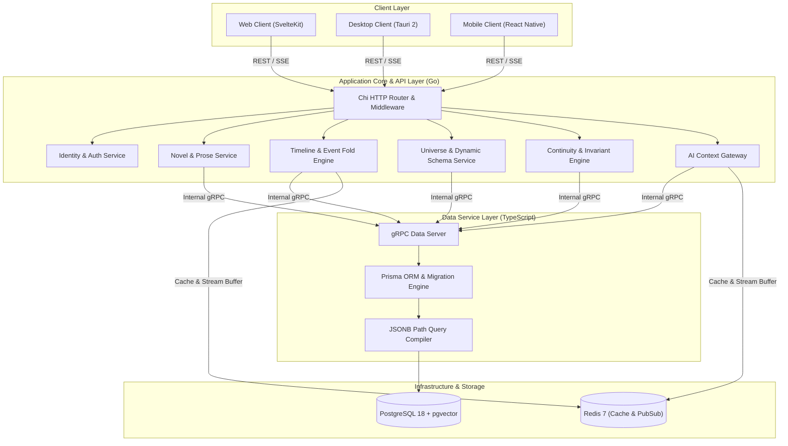
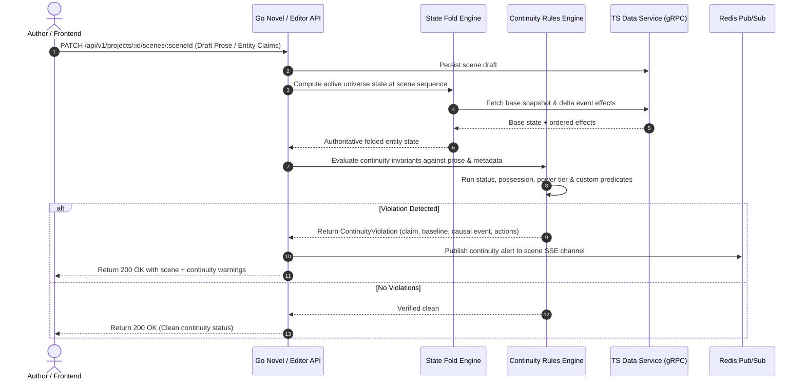

# Backend Architecture Specification

**Status:** Locked Baseline (Version 1.0)  
**Primary Application Engine:** Go 1.23+ (`api/`, `backend/`)  
**Data Access Service:** TypeScript Node.js 22+ with Prisma ORM (`services/data/`)  
**Inter-Service Transport:** gRPC over HTTP/2 (`proto/data/v1/`)  
**Client API Transport:** REST HTTP & Server-Sent Events (SSE) via Chi Router

---

## 1. System Topology & Service Boundaries



---

## 2. Layer Responsibilities & Isolation Rules

### 2.1. Go Application API Layer (`api/`, `backend/`)

- **HTTP Routing & Middleware:** Chi-based routing, JWT/session authentication, project tenancy scoping, rate limiting, and request correlation tracing.
- **Prose & Novel Engine:** Managing scene markdown, word count telemetry, chapter hierarchies, and lock contention.
- **Timeline & State Fold Engine:** Pure deterministic event folding, point-in-time state reconstruction, and historical snapshot generation.
- **Universe & Schema Engine:** Validation of dynamic entity attributes against `PropertyDefinition` schemas, relationship graph traversal.
- **Continuity & Rules Engine:** Invariant rule execution, predicate evaluation against folded state, explainable violation traceback generation.
- **AI Context Gateway:** Assembling grounded prompts from canonical state and vector similarity, streaming model completions via SSE.

### 2.2. TypeScript Data Service (`services/data/`)

- **Isolation Scope:** Encapsulates all direct database queries, migrations, and Prisma ORM client operations.
- **No Business Logic:** The data service does NOT perform continuity validation or narrative logic; it provides high-speed, type-safe persistence and vector indexing.
- **Coarse-Grained Domain gRPC API:** Replaces raw relational CRUD with atomic operations:
  - `GetNovelState(projectId, sequenceNumber)`
  - `CreateEventWithEffects(projectId, eventData, effects)`
  - `GetEntityTimeline(projectId, entityId)`
  - `SearchVectorGrounding(projectId, queryEmbedding, limit)`

---

## 3. Go Domain Module Architecture

Each domain module in `backend/` follows strict Dependency Injection (DI) with interfaces:

```text
backend/
├── shared/                       # Shared error types, logger, ID generators
├── identity/                     # Users, auth tokens, workspace tenancy
├── novel/                        # Novel, chapter, scene, prose operations
├── universe/                     # Entity types, property definitions, entities, relationships
├── timeline/                     # Events, event effects, state snapshots, fold engine
├── continuity/                   # Invariant rules, predicate evaluator, violation generator
└── ai/                           # Prompt builder, model clients (Anthropic/Gemini/OpenAI), SSE streamer
```

### 3.1. Block-Based Construction Standard

Every logical function or block in the Go codebase follows the mandatory structure:

```go
// Block: BLOCK_TIMELINE_FOLD_STATE_001
// Description: Reconstructs the universe entity state at a given chapter sequence number by folding historical event effects over the nearest base snapshot.
// Inputs: ctx context.Context, projectID uuid.UUID, targetSeq int
// Output: (*UniverseStateSnapshot, error)
func (e *TimelineFoldEngine) FoldStateAtSequence(ctx context.Context, projectID uuid.UUID, targetSeq int) (*UniverseStateSnapshot, error) {
    if targetSeq < 0 {
        return nil, fmt.Errorf("BLOCK_TIMELINE_FOLD_STATE_001: invalid negative sequence number: %d", targetSeq)
    }

    baseSnapshot, err := e.snapshotRepo.GetNearestSnapshot(ctx, projectID, targetSeq)
    if err != nil {
        return nil, fmt.Errorf("BLOCK_TIMELINE_FOLD_STATE_001: failed to retrieve base snapshot: %w", err)
    }

    // Flat execution flow with early returns...
    return foldedState, nil
}
```

---

## 4. Continuity Verification Pipeline



---

## 5. gRPC Protobuf Contracts (`proto/data/v1/`)

```protobuf
syntax = "proto3";

package novwrite.data.v1;
option go_package = "github.com/Yogesh-Kumar-Mallik-dev/NovWrite/proto/data/v1;datav1";

service DataService {
  rpc GetProjectState(GetProjectStateRequest) returns (GetProjectStateResponse);
  rpc CreateEventWithEffects(CreateEventRequest) returns (CreateEventResponse);
  rpc QueryEntityHistory(QueryEntityHistoryRequest) returns (QueryEntityHistoryResponse);
  rpc FindSimilarContext(FindSimilarContextRequest) returns (FindSimilarContextResponse);
  rpc SaveStateSnapshot(SaveStateSnapshotRequest) returns (SaveStateSnapshotResponse);
}

message GetProjectStateRequest {
  string project_id = 1;
  int32 sequence_number = 2;
}

message GetProjectStateResponse {
  string project_id = 1;
  int32 sequence_number = 2;
  bytes folded_entities_json = 3;
  string checksum = 4;
}

message CreateEventRequest {
  string project_id = 1;
  string anchor_scene_id = 2;
  string name = 3;
  string description = 4;
  int32 narrative_sequence = 5;
  repeated EventEffect effects = 6;
}

message EventEffect {
  string entity_id = 1;
  string property_key = 2;
  string operation = 3;
  string previous_value_json = 4;
  string new_value_json = 5;
  string explanation = 6;
}

message CreateEventResponse {
  string event_id = 1;
  bool success = 2;
}
```

---

## 6. Error Handling Standard (RFC 7807 Problem Details)

All HTTP error responses must adhere to `application/problem+json`:

```json
{
  "type": "https://novwrite.app/errors/continuity-violation",
  "title": "Continuity Invariant Violation",
  "status": 422,
  "detail": "BLOCK_CONTINUITY_EVAL_004: Character 'Elder Han' is claimed alive in Scene 42, but was marked deceased in Event 'Fall of Cloud Sect' (Seq: 18).",
  "instance": "/api/v1/projects/proj-123/scenes/scene-42/validate",
  "block_id": "BLOCK_CONTINUITY_EVAL_004",
  "invalid_params": [
    {
      "name": "character_status",
      "reason": "Entity status deceased cannot invoke martial art techniques"
    }
  ]
}
```

---

## 7. Testing Architecture & 100% Coverage Target

1. **Dependency Injection (DI):** All domain services depend strictly on interfaces (`EntityReader`, `EventFoldEngine`, `RuleStore`, `AIProvider`).
2. **Co-Located Unit Tests:** Every Go file `foo.go` must have an accompanying `foo_test.go` in the same directory covering:
   - Happy paths.
   - Guard clause early returns and edge cases.
   - Error wrapping and block ID assertions.
3. **Deterministic Mocking:** Use mock implementations of `DataServiceClient` for pure in-memory test execution without running database instances.

---

## 8. Multi-User Collaboration & Concurrency Engine

### 8.1. Scene Lock & Heartbeat Lease Protocol

To prevent concurrent overwrite conflicts when multiple co-authors work on a shared novel:

1. **Acquire Lease:** When an author opens a scene for editing, the client issues `POST /api/v1/projects/{id}/scenes/{sceneId}/lock`. The Go backend records an entry in `scene_leases` and returns a 60-second heartbeat lease token.
2. **Heartbeat Renewal:** The client pings `POST /api/v1/projects/{id}/scenes/{sceneId}/heartbeat` every 20 seconds to extend the lease.
3. **Read-Only Peer View:** Other authors attempting to edit the same scene receive an active editor indicator with the current writer's identity and avatar, placing their editor in synchronized read-only mode.
4. **Admin Lock Breaking:** If a writer disconnects without releasing the lease, a Project `ADMIN` or `OWNER` can break the lock via `DELETE /api/v1/projects/{id}/scenes/{sceneId}/lock` (logged to `admin_override_logs`).

---

## 9. Admin Override Execution Engine & Audit Governance

### 9.1. Block-Based Override Execution Standard

Every administrative override in Go must execute through the audited override pipeline with unique block IDs:

```go
// Block: BLOCK_ADMIN_OVERRIDE_VIOLATION_001
// Description: Allows Project Admins to force-approve an intentional canon invariant exception (e.g. resurrection miracle) with mandatory justification.
// Inputs: ctx context.Context, projectID uuid.UUID, adminID uuid.UUID, req *ForceApproveViolationRequest
// Output: (*AuditLogEntry, error)
func (s *AdminOverrideService) ForceApproveViolation(ctx context.Context, projectID uuid.UUID, adminID uuid.UUID, req *ForceApproveViolationRequest) (*AuditLogEntry, error) {
    if strings.TrimSpace(req.Justification) == "" {
        return nil, fmt.Errorf("BLOCK_ADMIN_OVERRIDE_VIOLATION_001: override justification is mandatory and cannot be empty")
    }

    role, err := s.membershipRepo.GetUserRole(ctx, projectID, adminID)
    if err != nil || (role != RoleOwner && role != RoleAdmin) {
        return nil, fmt.Errorf("BLOCK_ADMIN_OVERRIDE_VIOLATION_001: unauthorized; requires OWNER or ADMIN role")
    }

    // Execute state override & log immutable audit trail...
    return auditEntry, nil
}
```

### 9.2. Admin Override Decision Matrix: Permitted vs Prohibited

| Target Operation                        | Permitted for ADMIN? | Permitted for OWNER? | Audit Requirement                                               | Immutable Safety Rail                                             |
| :-------------------------------------- | :------------------- | :------------------- | :-------------------------------------------------------------- | :---------------------------------------------------------------- |
| **Force-Approve Invariant Violation**   | Yes                  | Yes                  | Mandatory textual justification logged to `admin_override_logs` | Cannot erase violation history; marks resolved with override flag |
| **Break Stale Scene Lock**              | Yes                  | Yes                  | Lease expiration verification or reason logged                  | Cannot overwrite uncommitted client drafts                        |
| **Merge Conflicting Timeline Branches** | Yes                  | Yes                  | Conflict resolution rationale recorded                          | Replays new branch; past effects remain append-only               |
| **Modify Project Custom Schemas**       | Yes                  | Yes                  | Schema version bump logged                                      | Legacy entity data preserved with deprecation flags               |
| **Transfer / Delete Project**           | **NO**               | **YES**              | Multi-factor confirmation + Owner password check                | Project deletion is strictly restricted to project OWNER          |
| **Cross-Tenant Project Access**         | **NO**               | **NO**               | Blocked at SQL & JWT middleware level                           | Absolute tenant isolation between different fictional universes   |
| **Impersonate Author Attribution**      | **NO**               | **NO**               | Blocked by cryptographic user ID binding                        | Edits always record the executing user's true ID                  |
