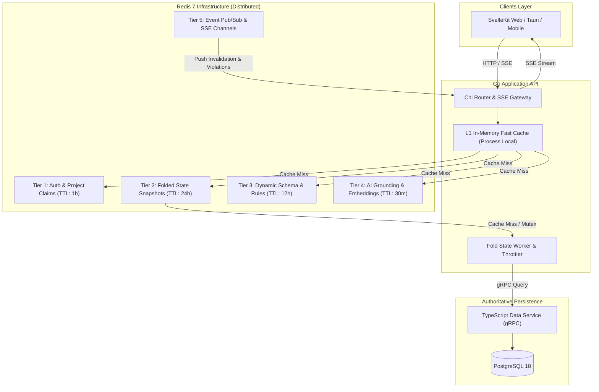
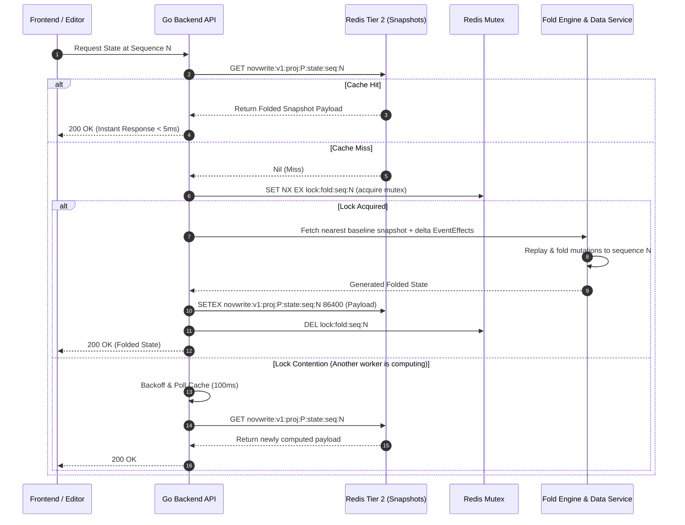

# Cache & State Snapshot Architecture Specification

**Status:** Locked Baseline (Version 1.0)  
**Primary Engine:** Redis 7.2+  
**Secondary (In-Memory):** Go Local Memory Cache (sync.Map / Ristretto)  
**Protocols:** Redis Protocol (RESP3), Pub/Sub & Server-Sent Events (SSE)

---

## 1. Multi-Tier Cache Topology



---

## 2. Cache Tier Hierarchy & Key Namespaces

All keys follow strict namespacing: `novwrite:<environment>:<tenant_id>:<subsystem>:<identifier>`

| Tier                       | Namespace Pattern                                          | Purpose                                                          | Format              | TTL                    | Eviction Strategy                |
| :------------------------- | :--------------------------------------------------------- | :--------------------------------------------------------------- | :------------------ | :--------------------- | :------------------------------- |
| **1. Auth & RBAC**         | `novwrite:v1:user:{userId}:session:{sessionId}`            | User session claims, token validity, project role permissions    | JSON                | 1 Hour (Sliding)       | Expiration                       |
| **2. State Snapshot**      | `novwrite:v1:proj:{projId}:state:seq:{sequenceNumber}`     | Pre-folded point-in-time universe entity states                  | Protobuf / LZ4 JSON | 24 Hours               | Cascading Eviction on Event Edit |
| **3. Schema & Rules**      | `novwrite:v1:proj:{projId}:schema:rules`                   | Compiled property definitions and active continuity rules        | JSON                | 12 Hours               | Write-Through Invalidation       |
| **4. AI Grounding**        | `novwrite:v1:proj:{projId}:ai:grounding:{sceneId}`         | Serialized canonical context + vector search results for prompts | JSON                | 30 Minutes             | LRU Eviction                     |
| **5. Distributed Lock**    | `novwrite:v1:proj:{projId}:lock:fold:seq:{sequenceNumber}` | Single-flight fold calculation mutex (prevents thundering herd)  | String              | 10 Seconds             | Atomic Release / Expiry          |
| **6. Scene Lease Lock**    | `novwrite:v1:proj:{projId}:scene:{sceneId}:lease`          | Active collaborative scene editing lock & heartbeat token        | JSON                | 60 Seconds (Heartbeat) | Expiry or Admin Override Break   |
| **7. Multi-User Presence** | `novwrite:v1:proj:{projId}:presence`                       | Active collaborator user IDs and active scene positions          | Redis Hash / Set    | 30 Seconds (Heartbeat) | Heartbeat Refresh                |

---

## 3. Folded Universe State Caching Mechanics

Reconstructing state across thousands of historical events can be computationally heavy. NovWrite employs **Checkpoint Snapshot Caching**:



---

## 4. Cascading Invalidation Protocol on Retroactive Timeline Edits

When an author modifies, inserts, or deletes an `Event` at historical sequence $K$:

1. **Calculate Invalidation Scope:**
   Any cached state snapshot with sequence number $S \ge K$ in project $P$ is now invalid because its causal history has changed.
2. **Execute Redis Invalidation Pipeline:**

   ```bash
   # Atomically scan and delete all cached state snapshots >= K
   # In practice, handled via Redis scan or secondary index set:
   SMEMBERS novwrite:v1:proj:{projId}:snapshot_keys
   # Keys where seq >= K are evicted via UNLINK
   UNLINK novwrite:v1:proj:{projId}:state:seq:{K} ...
   ```

3. **Publish Invalidation Message via Redis Pub/Sub:**
   - Channel: `novwrite:events:proj:{projId}`
   - Payload:

     ```json
     {
       "action": "TIMELINE_RETROACTIVE_MUTATION",
       "project_id": "proj-123",
       "affected_from_sequence": 14,
       "timestamp": 1757034000
     }
     ```

4. **SSE Broadcast to Connected Clients:**
   Active client sessions listening on the project's SSE stream receive the invalidation message and re-evaluate their local continuity state reactively.

---

## 5. High Availability & Graceful Degradation

1. **Degraded Operation on Redis Failure:**
   - If Redis connection is lost, the Go backend automatically switches to **Direct DB Passthrough Mode**.
   - State folding calculations continue to execute in Go process memory with results served directly to clients without distributed caching.
   - Circuit breaker attempts reconnection in the background every 5 seconds.
2. **Memory Limit & Policy:**
   - Redis `maxmemory` configured to 2GB (or 75% container memory).
   - Eviction policy: `volatile-lru` (evicts least recently used keys with an explicit TTL, preserving critical active locks).
3. **Serialization Efficiency:**
   - Snapshots exceeding 64KB are compressed using LZ4 before being stored in Redis to minimize network payload and memory footprint.
