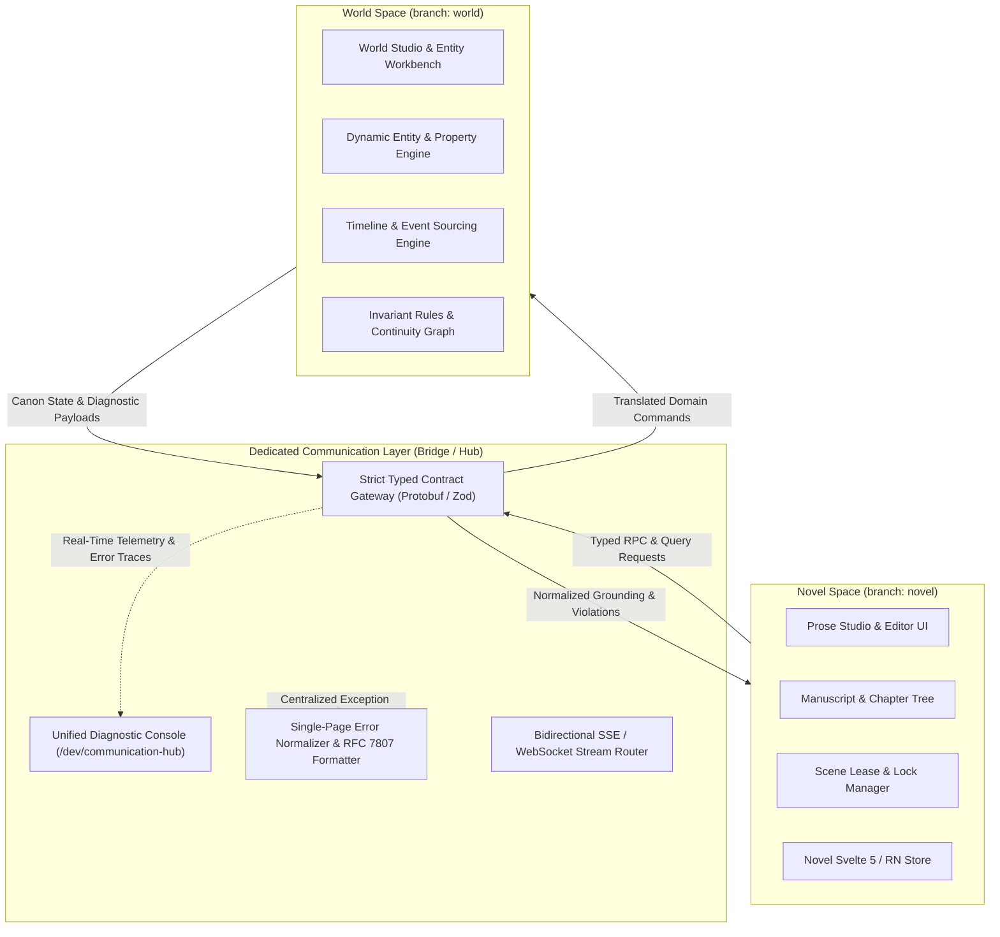
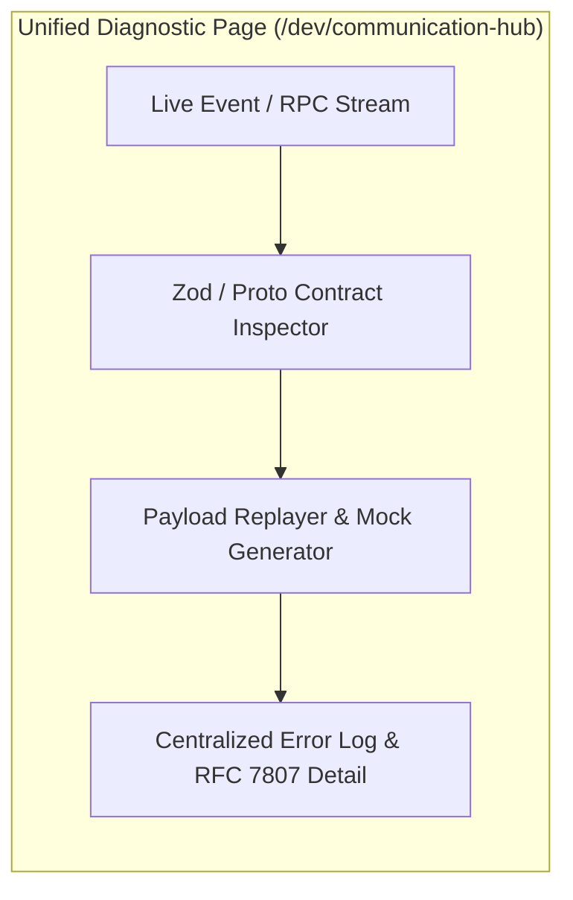
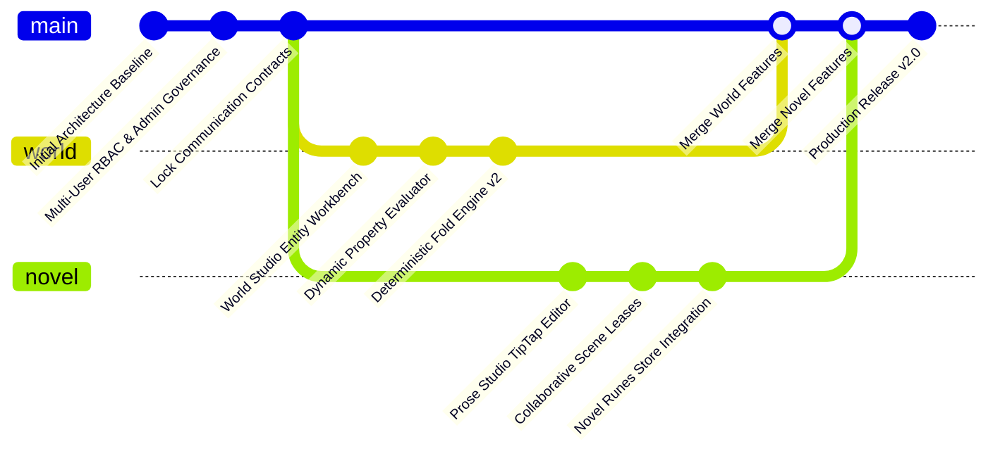

# NovWrite Dedicated Communication Layer & Two-Front Isolation Architecture

## 1. Overview & Architectural Thesis

To achieve absolute modularity, independent scalability, and rapid parallel engineering, NovWrite divides application development into **two autonomous fronts** maintained on dedicated git branches:

1. **World Space (`world` branch):** Universe schema, dynamic entity property engines, timeline event sourcing, invariant rule graphs, and the deterministic State Fold Engine.
2. **Novel Space (`novel` branch):** Prose Studio, manuscript hierarchy, rich text editing engines (TipTap / Lexical / React Native Reusables), collaborative scene leases, and multi-author presence.



---

## 2. The Zero Direct Cross-Talk Invariant

> **Strict Rule:** Novel Space and World Space **NEVER** import each other's domain packages, query each other's raw persistence models directly, or invoke internal service functions across the boundary.

| Communication Vector | Permitted                                             | Prohibited                                                 |
| :------------------- | :---------------------------------------------------- | :--------------------------------------------------------- |
| **Code Imports**     | Import `@novwrite/bridge` contracts only              | Direct import of `novel/*` inside `world/*` or vice-versa  |
| **Database Access**  | Domain services query only their owned schemas        | SQL `JOIN`s spanning prose blocks and raw invariant ASTs   |
| **Network / IPC**    | Calls strictly pass through `CommunicationBridge`     | Ad-hoc internal REST endpoints bypassing bridge validation |
| **Error Handling**   | Normalized via centralized `CommunicationDiagnostics` | Uncaught domain exceptions leaking across spaces           |

---

## 3. Communication Bridge Contracts & Standard Payloads

All cross-domain communications are strictly typed using shared schemas (Protobuf for backend RPC, Zod / TypeScript for frontend clients) located in `@novwrite/bridge`.

### 3.1. Cross-Domain Contract Interface

```typescript
// packages/bridge/src/contracts.ts

export interface NovelToWorldBridge {
  /** Request canonical lore grounding and vector context for a scene */
  getSceneGrounding(
    req: SceneGroundingRequest,
  ): Promise<SceneGroundingResponse>;

  /** Submit pending prose event draft for continuity invariant audit */
  validateProseContinuity(
    req: ValidateContinuityRequest,
  ): Promise<ContinuityAuditResponse>;

  /** Query entity autocomplete suggestions based on prose text token */
  suggestEntityMentions(
    req: EntityMentionQuery,
  ): Promise<EntityMentionResponse>;
}

export interface WorldToNovelBridge {
  /** Stream live canon state updates when world events are committed */
  onCanonStateChanged(
    handler: (event: CanonStateChangedEvent) => void,
  ): () => void;

  /** Push invariant rule updates affecting currently open scenes */
  onRuleInvalidated(handler: (event: RuleInvalidatedEvent) => void): () => void;
}
```

### 3.2. Standard Request & Response Schemas

#### 1. Scene Grounding Contract (`BLOCK_COMM_GROUNDING_CONTRACT_001`)

```json
{
  "request": {
    "project_id": "9b1deb4d-3b7d-4bad-9bdd-2b0d7b3dcb6d",
    "scene_id": "c3d4e5f6-a7b8-4c9d-0e1f-2a3b4c5d6e7f",
    "target_sequence_number": 142,
    "mentioned_entity_ids": ["e1111111-2222-3333-4444-555555555555"]
  },
  "response": {
    "scene_id": "c3d4e5f6-a7b8-4c9d-0e1f-2a3b4c5d6e7f",
    "sequence_number": 142,
    "folded_states": [
      {
        "entity_id": "e1111111-2222-3333-4444-555555555555",
        "entity_name": "Eldrin the Mage",
        "category": "CHARACTER",
        "computed_properties": {
          "status": "ALIVE",
          "mana_capacity": 420,
          "inventory": ["Staff of Arcanum", "Spellbook"]
        }
      }
    ],
    "active_constraints": [
      {
        "rule_id": "r999",
        "rule_name": "No Magic in Null Zone",
        "scope": "SCENE_SEQUENCE_RANGE"
      }
    ]
  }
}
```

#### 2. Continuity Invariant Audit Contract (`BLOCK_COMM_AUDIT_CONTRACT_001`)

```json
{
  "request": {
    "project_id": "9b1deb4d-3b7d-4bad-9bdd-2b0d7b3dcb6d",
    "scene_id": "c3d4e5f6-a7b8-4c9d-0e1f-2a3b4c5d6e7f",
    "draft_events": [
      {
        "entity_id": "e1111111-2222-3333-4444-555555555555",
        "event_type": "CAST_SPELL",
        "delta": { "mana_cost": 500 },
        "claimed_state": { "status": "ALIVE" }
      }
    ]
  },
  "response": {
    "status": "VIOLATION_DETECTED",
    "violations": [
      {
        "code": "INVARIANT_NUMERIC_MIN_VIOLATED",
        "rule_name": "Mana Non-Negativity",
        "entity_id": "e1111111-2222-3333-4444-555555555555",
        "entity_name": "Eldrin the Mage",
        "property": "mana_capacity",
        "expected_minimum": 0,
        "calculated_result": -80,
        "rfc7807_uri": "https://api.novwrite.com/errors/INVARIANT_NUMERIC_MIN_VIOLATED"
      }
    ]
  }
}
```

---

## 4. Centralized Communication Diagnostics Console (`/dev/communication-hub`)

To guarantee that **all communication errors can be diagnosed, debugged, and resolved in one central place**, NovWrite incorporates a dedicated **Communication Hub**:

### 4.1. Core Capabilities of the Communication Hub

1. **Live Cross-Space Traffic Inspector:** Real-time stream of all requests and responses flowing between Novel Studio and World Studio.
2. **Schema & Contract Validator:** Instant visualization of payload mismatch errors, missing required fields, or version incompatibilities.
3. **Mock Server & Payload Injector:** Allows Novel developers on the `novel` branch to simulate World Engine responses without running the full timeline fold engine, and vice-versa.
4. **Payload Replay & Time-Travel Debugger:** Capture failing RPC messages, modify parameters in the UI, and replay them through the bridge.
5. **Unified RFC 7807 Error Normalizer:** Every error (network timeout, invalid entity ID, invariant rule syntax error) is formatted identically with actionable remediation steps.



---

## 5. Branching Strategy & Development Workflow



### 5.1. Branch Responsibilities

| Branch      | Primary Focus                                                                         | Dependencies                 | Remote Target  |
| :---------- | :------------------------------------------------------------------------------------ | :--------------------------- | :------------- |
| **`main`**  | Core infrastructure, DB migrations, `@novwrite/bridge` contracts, shared auth         | Source of truth              | `origin/main`  |
| **`world`** | World Studio UI, dynamic entity schema, timeline event sourcing, invariant rule graph | `@novwrite/bridge` contracts | `origin/world` |
| **`novel`** | Prose Studio UI, TipTap rich text, scene leases, chapter hierarchy, mobile prose      | `@novwrite/bridge` contracts | `origin/novel` |

### 5.2. Synchronization & PR Rules

1. **Contract First:** Any change to cross-domain interactions MUST first be updated in `@novwrite/bridge` on `main`.
2. **Isolated Branch Verification:** Both branches test against mock fixtures generated by the Communication Hub.
3. **No Cross-Branch Merging:** `novel` and `world` never merge directly into one another; both rebase from and merge into `main` after passing bridge integration tests.
