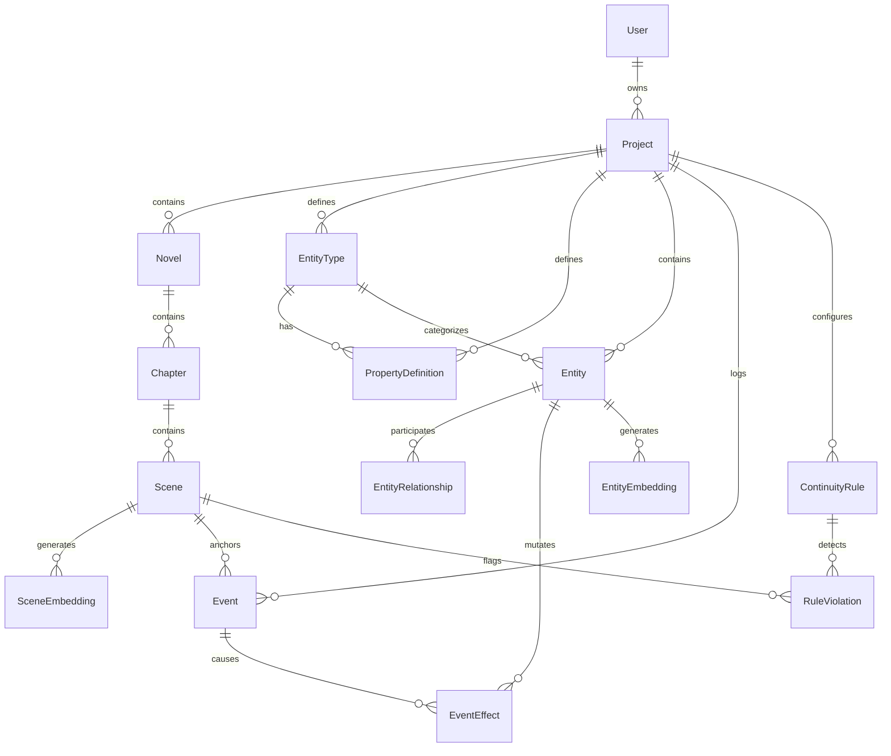
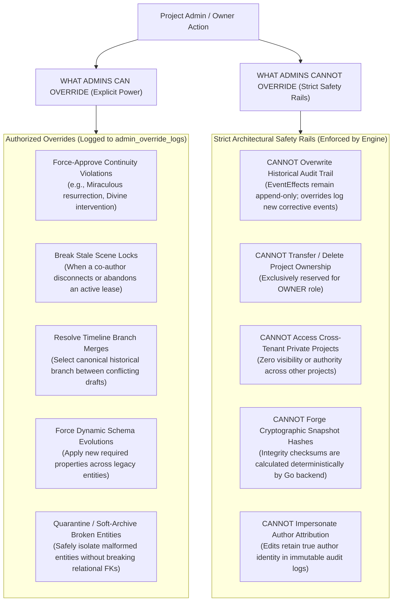

# Database Architecture Specification

**Status:** Locked Baseline (Version 1.0)  
**Engine:** PostgreSQL 18 with `pgvector` extension  
**ORM / Data Access:** TypeScript Data Service (`services/data/`) using Prisma ORM & Coarse-Grained gRPC

---

## 1. Architectural Principles & Data Philosophy

1. **Canon Over AI Memory:** Canonical world state is stored exclusively in PostgreSQL relational tables and dynamic JSONB attributes. AI models never act as the system of record.
2. **Relational Backbone with Dynamic JSONB Schemas:** Rigid relational models govern structural hierarchies (Projects, Novels, Chapters, Scenes, Events, Rules), while user-defined entities (Characters, Items, Locations, Powers) utilize JSONB columns validated against project-level `PropertyDefinition` schemas.
3. **Event-Sourced State Transitions:** Historical truth is never overwritten. Changes to entity attributes over narrative time are recorded as immutable `EventEffect` rows attached to sequential `Event` records.
4. **Strict Project Isolation (Multi-Tenancy):** Every database query and index must be partitioned by `project_id` to guarantee tenant isolation and performance predictability.
5. **Vector Knowledge Grounding:** Semantic prose and entity embeddings use the `pgvector` extension with HNSW indexing for rapid continuity retrieval.

---

## 2. Entity-Relationship Diagram (ERD)



---

## 3. Detailed Table Schema Definitions

### 3.1. Identity, Tenancy & Prose Hierarchy

```sql
-- Users and authentication
CREATE TABLE users (
    id UUID PRIMARY KEY DEFAULT gen_random_uuid(),
    email VARCHAR(255) NOT NULL UNIQUE,
    password_hash VARCHAR(255) NOT NULL,
    display_name VARCHAR(100) NOT NULL,
    created_at TIMESTAMPTZ NOT NULL DEFAULT NOW(),
    updated_at TIMESTAMPTZ NOT NULL DEFAULT NOW()
);

-- Projects (author workspaces / fictional universes)
CREATE TABLE projects (
    id UUID PRIMARY KEY DEFAULT gen_random_uuid(),
    owner_id UUID NOT NULL REFERENCES users(id) ON DELETE CASCADE,
    name VARCHAR(255) NOT NULL,
    slug VARCHAR(255) NOT NULL,
    description TEXT,
    settings JSONB NOT NULL DEFAULT '{}'::jsonb,
    created_at TIMESTAMPTZ NOT NULL DEFAULT NOW(),
    updated_at TIMESTAMPTZ NOT NULL DEFAULT NOW(),
    CONSTRAINT uq_project_owner_slug UNIQUE (owner_id, slug)
);

-- Multi-User Project Memberships & RBAC
CREATE TABLE project_members (
    id UUID PRIMARY KEY DEFAULT gen_random_uuid(),
    project_id UUID NOT NULL REFERENCES projects(id) ON DELETE CASCADE,
    user_id UUID NOT NULL REFERENCES users(id) ON DELETE CASCADE,
    role VARCHAR(50) NOT NULL, -- OWNER, ADMIN, EDITOR, CONTRIBUTOR, VIEWER
    permissions JSONB NOT NULL DEFAULT '{}'::jsonb,
    invited_by UUID REFERENCES users(id) ON DELETE SET NULL,
    created_at TIMESTAMPTZ NOT NULL DEFAULT NOW(),
    updated_at TIMESTAMPTZ NOT NULL DEFAULT NOW(),
    CONSTRAINT uq_project_member UNIQUE (project_id, user_id)
);

-- Novels within a project
CREATE TABLE novels (
    id UUID PRIMARY KEY DEFAULT gen_random_uuid(),
    project_id UUID NOT NULL REFERENCES projects(id) ON DELETE CASCADE,
    title VARCHAR(255) NOT NULL,
    synopsis TEXT,
    order_index INT NOT NULL DEFAULT 0,
    created_by UUID REFERENCES users(id) ON DELETE SET NULL,
    created_at TIMESTAMPTZ NOT NULL DEFAULT NOW(),
    updated_at TIMESTAMPTZ NOT NULL DEFAULT NOW()
);

-- Chapters within a novel
CREATE TABLE chapters (
    id UUID PRIMARY KEY DEFAULT gen_random_uuid(),
    novel_id UUID NOT NULL REFERENCES novels(id) ON DELETE CASCADE,
    project_id UUID NOT NULL REFERENCES projects(id) ON DELETE CASCADE,
    title VARCHAR(255) NOT NULL,
    order_index INT NOT NULL,
    global_sequence_number INT NOT NULL,
    created_by UUID REFERENCES users(id) ON DELETE SET NULL,
    created_at TIMESTAMPTZ NOT NULL DEFAULT NOW(),
    updated_at TIMESTAMPTZ NOT NULL DEFAULT NOW(),
    CONSTRAINT uq_chapter_order UNIQUE (novel_id, order_index)
);

-- Scenes (individual writing units with author attribution)
CREATE TABLE scenes (
    id UUID PRIMARY KEY DEFAULT gen_random_uuid(),
    chapter_id UUID NOT NULL REFERENCES chapters(id) ON DELETE CASCADE,
    project_id UUID NOT NULL REFERENCES projects(id) ON DELETE CASCADE,
    title VARCHAR(255) NOT NULL,
    content_markdown TEXT NOT NULL DEFAULT '',
    word_count INT NOT NULL DEFAULT 0,
    order_index INT NOT NULL,
    status VARCHAR(50) NOT NULL DEFAULT 'draft', -- draft, in_review, canon
    last_edited_by UUID REFERENCES users(id) ON DELETE SET NULL,
    created_at TIMESTAMPTZ NOT NULL DEFAULT NOW(),
    updated_at TIMESTAMPTZ NOT NULL DEFAULT NOW(),
    CONSTRAINT uq_scene_order UNIQUE (chapter_id, order_index)
);

-- Collaborative Scene Active Locks & Heartbeat Leases
CREATE TABLE scene_leases (
    scene_id UUID PRIMARY KEY REFERENCES scenes(id) ON DELETE CASCADE,
    project_id UUID NOT NULL REFERENCES projects(id) ON DELETE CASCADE,
    locked_by_user_id UUID NOT NULL REFERENCES users(id) ON DELETE CASCADE,
    heartbeat_token VARCHAR(64) NOT NULL,
    acquired_at TIMESTAMPTZ NOT NULL DEFAULT NOW(),
    expires_at TIMESTAMPTZ NOT NULL
);

-- Immutable Admin Override & Canon Exception Audit Log
CREATE TABLE admin_override_logs (
    id UUID PRIMARY KEY DEFAULT gen_random_uuid(),
    project_id UUID NOT NULL REFERENCES projects(id) ON DELETE CASCADE,
    admin_user_id UUID NOT NULL REFERENCES users(id) ON DELETE RESTRICT,
    target_type VARCHAR(50) NOT NULL, -- CONTINUITY_VIOLATION, TIMELINE_BRANCH, SCENE_LOCK, SCHEMA_MUTATION
    target_id UUID NOT NULL,
    action VARCHAR(50) NOT NULL, -- FORCE_APPROVE_VIOLATION, BREAK_SCENE_LOCK, MERGE_BRANCH_OVERRIDE, SCHEMA_FORCE_MIGRATE
    justification TEXT NOT NULL,
    previous_state JSONB NOT NULL,
    new_state JSONB NOT NULL,
    created_at TIMESTAMPTZ NOT NULL DEFAULT NOW()
);
```

### 3.2. World Building & Dynamic Universe Schemas

```sql
-- User-defined entity types (e.g. Character, Faction, Sect, Divine Artifact, Realm)
CREATE TABLE entity_types (
    id UUID PRIMARY KEY DEFAULT gen_random_uuid(),
    project_id UUID NOT NULL REFERENCES projects(id) ON DELETE CASCADE,
    name VARCHAR(100) NOT NULL,
    slug VARCHAR(100) NOT NULL,
    description TEXT,
    icon_name VARCHAR(50),
    is_built_in BOOLEAN NOT NULL DEFAULT FALSE,
    created_at TIMESTAMPTZ NOT NULL DEFAULT NOW(),
    updated_at TIMESTAMPTZ NOT NULL DEFAULT NOW(),
    CONSTRAINT uq_project_entity_type_slug UNIQUE (project_id, slug)
);

-- Property definitions for dynamic schemas (e.g. Cultivation Stage, Bloodline, Affiliation)
CREATE TABLE property_definitions (
    id UUID PRIMARY KEY DEFAULT gen_random_uuid(),
    project_id UUID NOT NULL REFERENCES projects(id) ON DELETE CASCADE,
    entity_type_id UUID NOT NULL REFERENCES entity_types(id) ON DELETE CASCADE,
    name VARCHAR(100) NOT NULL,
    key VARCHAR(100) NOT NULL,
    data_type VARCHAR(50) NOT NULL, -- string, number, enum, boolean, range, entity_ref, ladder
    validation_rules JSONB NOT NULL DEFAULT '{}'::jsonb, -- e.g. {"enum_values": ["Core Formation", "Nascent Soul"], "min": 0, "max": 100}
    default_value JSONB,
    description TEXT,
    is_required BOOLEAN NOT NULL DEFAULT FALSE,
    order_index INT NOT NULL DEFAULT 0,
    created_at TIMESTAMPTZ NOT NULL DEFAULT NOW(),
    updated_at TIMESTAMPTZ NOT NULL DEFAULT NOW(),
    CONSTRAINT uq_property_key UNIQUE (project_id, entity_type_id, key)
);

-- Canonical entities in the universe
CREATE TABLE entities (
    id UUID PRIMARY KEY DEFAULT gen_random_uuid(),
    project_id UUID NOT NULL REFERENCES projects(id) ON DELETE CASCADE,
    entity_type_id UUID NOT NULL REFERENCES entity_types(id) ON DELETE RESTRICT,
    name VARCHAR(255) NOT NULL,
    aliases TEXT[] NOT NULL DEFAULT '{}',
    description TEXT,
    properties JSONB NOT NULL DEFAULT '{}'::jsonb, -- dynamic attributes conforming to property_definitions
    status VARCHAR(50) NOT NULL DEFAULT 'active', -- active, deceased, destroyed, sealed
    created_at TIMESTAMPTZ NOT NULL DEFAULT NOW(),
    updated_at TIMESTAMPTZ NOT NULL DEFAULT NOW()
);

-- Inter-entity relationships (e.g., Master -> Disciple, Rival -> Rival)
CREATE TABLE entity_relationships (
    id UUID PRIMARY KEY DEFAULT gen_random_uuid(),
    project_id UUID NOT NULL REFERENCES projects(id) ON DELETE CASCADE,
    source_entity_id UUID NOT NULL REFERENCES entities(id) ON DELETE CASCADE,
    target_entity_id UUID NOT NULL REFERENCES entities(id) ON DELETE CASCADE,
    relationship_type VARCHAR(100) NOT NULL, -- master, apprentice, rival, ally, spouse, parent
    is_bidirectional BOOLEAN NOT NULL DEFAULT FALSE,
    metadata JSONB NOT NULL DEFAULT '{}'::jsonb,
    created_at TIMESTAMPTZ NOT NULL DEFAULT NOW(),
    updated_at TIMESTAMPTZ NOT NULL DEFAULT NOW(),
    CONSTRAINT uq_relationship UNIQUE (project_id, source_entity_id, target_entity_id, relationship_type)
);
```

### 3.3. Event Sourcing & Timeline Mutations

```sql
-- Causal timeline events anchored to narrative or world milestones
CREATE TABLE events (
    id UUID PRIMARY KEY DEFAULT gen_random_uuid(),
    project_id UUID NOT NULL REFERENCES projects(id) ON DELETE CASCADE,
    anchor_scene_id UUID REFERENCES scenes(id) ON DELETE SET NULL,
    name VARCHAR(255) NOT NULL,
    description TEXT,
    narrative_sequence INT NOT NULL, -- order in author's storytelling
    chronological_timestamp BIGINT, -- in-universe timeline order (if applicable)
    importance_tier VARCHAR(20) NOT NULL DEFAULT 'standard', -- minor, standard, major, epoch
    causal_predecessors UUID[] NOT NULL DEFAULT '{}', -- event IDs leading directly to this event
    created_at TIMESTAMPTZ NOT NULL DEFAULT NOW(),
    updated_at TIMESTAMPTZ NOT NULL DEFAULT NOW()
);

-- Immutable state effects applied by an event
CREATE TABLE event_effects (
    id UUID PRIMARY KEY DEFAULT gen_random_uuid(),
    event_id UUID NOT NULL REFERENCES events(id) ON DELETE CASCADE,
    project_id UUID NOT NULL REFERENCES projects(id) ON DELETE CASCADE,
    entity_id UUID NOT NULL REFERENCES entities(id) ON DELETE CASCADE,
    property_key VARCHAR(100) NOT NULL, -- key in entity properties (e.g. 'realm', 'location', 'weapon')
    operation VARCHAR(20) NOT NULL, -- SET, INCREMENT, APPEND, REMOVE, TRANSFER
    previous_value JSONB,
    new_value JSONB NOT NULL,
    explanation TEXT,
    created_at TIMESTAMPTZ NOT NULL DEFAULT NOW()
);

-- Point-in-time universe state snapshots (for O(1) state reconstruction)
CREATE TABLE state_snapshots (
    id UUID PRIMARY KEY DEFAULT gen_random_uuid(),
    project_id UUID NOT NULL REFERENCES projects(id) ON DELETE CASCADE,
    chapter_id UUID NOT NULL REFERENCES chapters(id) ON DELETE CASCADE,
    sequence_number INT NOT NULL,
    snapshot_data JSONB NOT NULL, -- full folded entity state at this sequence
    checksum VARCHAR(64) NOT NULL,
    created_at TIMESTAMPTZ NOT NULL DEFAULT NOW(),
    CONSTRAINT uq_project_chapter_snapshot UNIQUE (project_id, chapter_id)
);
```

### 3.4. Continuity Rules & Invariant Validation

```sql
-- User-defined & system continuity rules
CREATE TABLE continuity_rules (
    id UUID PRIMARY KEY DEFAULT gen_random_uuid(),
    project_id UUID NOT NULL REFERENCES projects(id) ON DELETE CASCADE,
    name VARCHAR(255) NOT NULL,
    description TEXT,
    rule_type VARCHAR(50) NOT NULL, -- status_invariant, possession_exclusive, power_tier_ladder, custom_predicate
    target_entity_type_id UUID REFERENCES entity_types(id) ON DELETE CASCADE,
    predicate_expression JSONB NOT NULL, -- e.g. {"field": "status", "op": "NEQ", "value": "deceased"}
    severity VARCHAR(20) NOT NULL DEFAULT 'error', -- error, warning, info
    is_active BOOLEAN NOT NULL DEFAULT TRUE,
    created_at TIMESTAMPTZ NOT NULL DEFAULT NOW(),
    updated_at TIMESTAMPTZ NOT NULL DEFAULT NOW()
);

-- Detected continuity rule violations
CREATE TABLE rule_violations (
    id UUID PRIMARY KEY DEFAULT gen_random_uuid(),
    project_id UUID NOT NULL REFERENCES projects(id) ON DELETE CASCADE,
    rule_id UUID NOT NULL REFERENCES continuity_rules(id) ON DELETE CASCADE,
    scene_id UUID NOT NULL REFERENCES scenes(id) ON DELETE CASCADE,
    entity_id UUID REFERENCES entities(id) ON DELETE SET NULL,
    violating_claim TEXT NOT NULL,
    canonical_baseline TEXT NOT NULL,
    causal_event_id UUID REFERENCES events(id) ON DELETE SET NULL,
    suggested_resolutions JSONB NOT NULL DEFAULT '[]'::jsonb,
    is_resolved BOOLEAN NOT NULL DEFAULT FALSE,
    resolution_action VARCHAR(50),
    created_at TIMESTAMPTZ NOT NULL DEFAULT NOW(),
    resolved_at TIMESTAMPTZ
);
```

### 3.5. Vector Embeddings (pgvector)

```sql
-- Enable pgvector extension
CREATE EXTENSION IF NOT EXISTS vector;

-- Semantic embeddings for scenes (prose chunks)
CREATE TABLE scene_embeddings (
    id UUID PRIMARY KEY DEFAULT gen_random_uuid(),
    project_id UUID NOT NULL REFERENCES projects(id) ON DELETE CASCADE,
    scene_id UUID NOT NULL REFERENCES scenes(id) ON DELETE CASCADE,
    chunk_index INT NOT NULL DEFAULT 0,
    chunk_text TEXT NOT NULL,
    embedding vector(1536) NOT NULL, -- standard embedding dimension (e.g. OpenAI text-embedding-3-small or Gemini text-embedding-004 768)
    created_at TIMESTAMPTZ NOT NULL DEFAULT NOW(),
    CONSTRAINT uq_scene_chunk UNIQUE (scene_id, chunk_index)
);

-- Semantic embeddings for canonical entities
CREATE TABLE entity_embeddings (
    id UUID PRIMARY KEY DEFAULT gen_random_uuid(),
    project_id UUID NOT NULL REFERENCES projects(id) ON DELETE CASCADE,
    entity_id UUID NOT NULL REFERENCES entities(id) ON DELETE CASCADE,
    profile_summary TEXT NOT NULL,
    embedding vector(1536) NOT NULL,
    created_at TIMESTAMPTZ NOT NULL DEFAULT NOW(),
    CONSTRAINT uq_entity_embedding UNIQUE (entity_id)
);
```

---

## 4. Indexing Strategy & Performance Optimizations

```sql
-- Multi-tenant compound indexes
CREATE INDEX idx_chapters_project_seq ON chapters(project_id, global_sequence_number);
CREATE INDEX idx_scenes_chapter_order ON scenes(chapter_id, order_index);
CREATE INDEX idx_entities_project_type ON entities(project_id, entity_type_id);
CREATE INDEX idx_events_project_narrative ON events(project_id, narrative_sequence);
CREATE INDEX idx_event_effects_entity_event ON event_effects(entity_id, event_id);
CREATE INDEX idx_rule_violations_scene_resolved ON rule_violations(scene_id, is_resolved);

-- JSONB GIN Indexes for high-speed dynamic attribute filtering
CREATE INDEX idx_entities_properties_gin ON entities USING gin (properties jsonb_path_ops);
CREATE INDEX idx_event_effects_new_val_gin ON event_effects USING gin (new_value jsonb_path_ops);

-- HNSW Vector Indexes for cosine similarity search
CREATE INDEX idx_scene_embeddings_hnsw ON scene_embeddings
USING hnsw (embedding vector_cosine_ops)
WITH (m = 16, ef_construction = 64);

CREATE INDEX idx_entity_embeddings_hnsw ON entity_embeddings
USING hnsw (embedding vector_cosine_ops)
WITH (m = 16, ef_construction = 64);
```

---

## 5. Event Sourcing State Folding Mechanics

To compute the authoritative state of an entity at chapter sequence $N$:

1. Retrieve the nearest state snapshot where `sequence_number <= N`.
2. Retrieve all `event_effects` from events between `snapshot.sequence_number` and $N$ ordered by `events.narrative_sequence ASC`.
3. Fold `event_effects` into the snapshot baseline:
   - `SET`: Overwrite target attribute with `new_value`.
   - `INCREMENT`: Add numeric `new_value` to current value.
   - `APPEND`: Append item to array attribute.
   - `REMOVE`: Remove item from array or nullify attribute.
   - `TRANSFER`: Change ownership or location reference.
4. Output the deterministic, explainable point-in-time universe state.

---

## 6. Migration & Evolution Guidelines

1. **Prisma as Schema Authority:** All structural changes originate in `services/data/prisma/schema.prisma` and are applied using `pnpm prisma migrate dev`.
2. **Zero Destructive Alterations:** Production migrations must never drop dynamic property columns directly; property deprecation flags in `property_definitions` are used instead.
3. **Data Backfill Transactions:** Migrations involving event replay or snapshot rebuilds must execute inside explicit PostgreSQL transactions with row-level locks on affected `project_id`s.

---

## 7. Multi-User RBAC & Admin Override Governance Matrix

### 7.1. Role Hierarchy & Project Permissions

| Role            | Description                      | Prose Drafting    | World & Entity CRUD  | Timeline Mutations | Schema & Rules  | Admin Overrides                                  |
| :-------------- | :------------------------------- | :---------------- | :------------------- | :----------------- | :-------------- | :----------------------------------------------- |
| **OWNER**       | Universe Creator / Project Owner | Full Read/Write   | Full Read/Write      | Full Read/Write    | Full Read/Write | Full Override Authority + Billing & Deletion     |
| **ADMIN**       | Lead Lorekeeper / Senior Editor  | Full Read/Write   | Full Read/Write      | Full Read/Write    | Full Read/Write | Canon Overrides, Lock Breaking, Conflict Merging |
| **EDITOR**      | Co-Writer / Chapter Author       | Full Read/Write   | Create/Edit Entities | Log Scene Events   | Read Only       | None                                             |
| **CONTRIBUTOR** | World Builder / Beta Writer      | Draft Submissions | Draft Proposals      | Propose Events     | Read Only       | None                                             |
| **VIEWER**      | Beta Reader / Proofreader        | Read Only         | Read Only            | Read Only          | Read Only       | None                                             |

### 7.2. Admin Override Power Boundaries: What Admins CAN vs CANNOT Override


