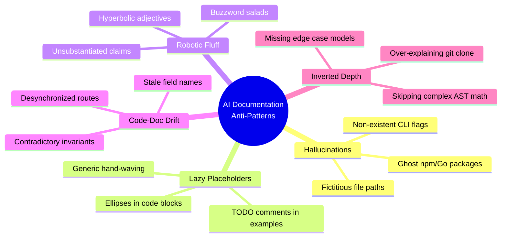

# Repository Documentation Standards & AI Anti-Pattern Prevention Guideline

**Version:** 1.0  
**Status:** Authoritative Standard  
**Scope:** Universal across all NovWrite repositories, packages, documentation files, and AI agent workflows

---

## 1. Executive Summary & Purpose

High-quality documentation is a first-class engineering deliverable. This standard synthesizes the architectural rigor, usability, and developer experience of the world's most successful open-source repositories (Kubernetes, Vite, Next.js, FastAPI, Rust, Go, Svelte, Supabase, Tailwind CSS) while establishing concrete defenses against **AI-generated documentation anti-patterns**.

Every document in this repository must be:

1. **Technically Precise & Verified:** Every code block, command line, API route, and type signature must execute against the actual codebase without errors.
2. **Proportionately Deep:** Focus explanation on novel algorithms, domain state machines, and non-obvious architecture rather than trivial boilerplate.
3. **Actionable & Fast:** Provide copy-pasteable, working examples with realistic parameters and exact versions.
4. **Free of AI Fluff:** Zero hollow buzzwords, zero lazy placeholders (`// TODO`), zero hallucinated flags, and zero desynchronized drift.

---

## 2. Standard Quality Repository Documentation Architecture

A gold-standard repository maintains a clear, tiered documentation hierarchy:

```text
NovWrite Repository
├── README.md                      # Primary entry point: Value proposition, visual architecture, quickstart, features
├── CONTRIBUTING.md                # Contributor workflows: Branching, PRs, conventional signed commits, 5-phase testing
├── SECURITY.md                    # Vulnerability disclosure policy, response SLAs, defense-in-depth model
├── LICENSE                        # Explicit legal licensing terms
├── changes.md                     # Chronological release log with scope, components, and breaking changes
├── docs/
│   ├── DOCUMENTATION_STANDARDS.md # [THIS FILE] Authoritative doc quality & anti-pattern rules
│   ├── ARCHITECTURE.md            # Master system topology, subsystem breakdown, data flow
│   ├── BACKEND_ARCHITECTURE.md    # Go API backend, chi routing, AST formulas, rate limiting, RBAC
│   ├── FRONTEND_ARCHITECTURE.md   # SvelteKit 2 + Svelte 5 runes, responsive layout, zero-badge UI
│   ├── DATABASE_ARCHITECTURE.md   # PostgreSQL 18 + pgvector, Prisma schemas, JSONB models, ERDs
│   ├── CACHE_ARCHITECTURE.md      # Multi-tier Redis 7.2 caching, pub/sub, SSE streams, eviction
│   ├── API_GUIDE.md               # REST /api/v1 endpoints, RFC 7807 errors, gRPC methods, headers
│   ├── COMMUNICATION_LAYER.md     # Two-front isolation, @novwrite/bridge contracts, typed RPC
│   ├── ONBOARDING.md              # Cross-platform workstation setup (Linux, macOS, Windows, WSL)
│   ├── recommended_commands.md    # 1-click lifecycle scripts, Go server CLI, testing cheat sheet
│   ├── MVP_PHASED_PLAN.md         # Phased delivery roadmap, YAGNI boundaries, test seeder
│   └── design_decisions.md        # Architecture Decision Records (ADRs) with rationale & trade-offs
```

---

## 3. Core Principles of Gold-Standard Open-Source Documentation

### 3.1. 5-Minute Quickstart Guarantee

- Every developer must be able to clone the repository, install dependencies, configure environment variables, and start a fully functioning development environment in **under 5 minutes**.
- All dependencies must specify exact, verified versions (e.g. `Go 1.23+`, `Node.js 22 LTS`, `pnpm 9+`, `PostgreSQL 18`, `Redis 7.2+`).

### 3.2. Visual Architecture & Concrete Data Flow

- Use **Mermaid.js** or clean ASCII diagrams to map:
  - Client-to-Backend-to-Database data flows.
  - Subsystem isolation boundaries and contracts.
  - State machine transitions, DAG trees, and event streams.
- Node labels must be clear, semantic, and syntax-error-free.

### 3.3. Zero Code-Doc Desynchronization (100% Parity)

- Documentation and code must be updated in the **same atomic commit**.
- All API routes, request bodies, query parameters, database tables, and environment variable names in documentation must match the actual source code verbatim.

### 3.4. Dual-Mode Cross-Platform Tooling

- Every command must be documented for both **Unix environments** (Linux, macOS, Windows Git Bash / WSL via `.sh` scripts) and **Native Windows environments** (PowerShell via `.ps1` scripts).

### 3.5. Comprehensive Error & Edge-Case Coverage

- Do not document only the happy path (`200 OK`).
- Always document validation failures (`422 Unprocessable Content`), permission denials (`403 Forbidden`), authentication lapses (`401 Unauthorized`), rate limits (`429 Too Many Requests`), and structured RFC 7807 problem detail envelopes.

---

## 4. The 10 AI Documentation Anti-Patterns & Prevention Rules

AI coding assistants frequently produce specific documentation failure modes. All contributors and AI agents must strictly recognize and avoid these anti-patterns:



---

### Anti-Pattern 1: Hallucinated Commands & Ghost Flags

- ❌ **The Anti-Pattern:** Inventing non-existent CLI flags, scripts, or package names (e.g., `pnpm run test:all --parallel-workers=8`, `docker compose -f deploy/compose.yaml` when the file is in root `docker-compose.yml`).
- ✅ **The Rule:** Every command, argument, and file path must be verified against actual workspace files (`package.json`, `go.mod`, filesystem paths) before writing.
- 🔍 **Verification:** Execute the command in the shell or check the file existence before documenting it.

---

### Anti-Pattern 2: Lazy Placeholder Text & TODO Stubs

- ❌ **The Anti-Pattern:**
  ```typescript
  // ❌ BAD AI DOCUMENTATION
  const res = await api.createBlueprint({
    // ... add your fields here
    // TODO: implement validation logic
  });
  ```
- ✅ **The Rule:** Provide complete, runnable, fully formed examples with realistic domain data.
  ```typescript
  // ✅ GOOD ENGINEERING STANDARD
  const res = await api.createBlueprint({
    name: "Character Archetype",
    category: "Character",
    blueprintClass: "FIRST_CLASS",
    fields: [
      {
        id: "f-mana",
        name: "mana_pool",
        label: "Mana Pool",
        fieldType: "NUMBER",
        defaultValue: 100,
        min: 0,
        max: 10000,
      },
    ],
  });
  ```

---

### Anti-Pattern 3: Robotic Buzzwords & Marketing Fluff

- ❌ **The Anti-Pattern:** _"NovWrite seamlessly leverages cutting-edge paradigms to empower creators with robust, game-changing synergistic workflows."_
- ✅ **The Rule:** Use crisp, factual engineering prose focusing on architecture, mechanisms, complexity, and concrete numbers.
- ✅ **The Standard:** _"NovWrite enforces a deterministic dual-axis timeline DAG (horizontal UPDATE plot axis and vertical hanging EDIT trees) with $O(V+E)$ cycle detection in formula calculations."_

---

### Anti-Pattern 4: Code-Doc Discrepancy Drift

- ❌ **The Anti-Pattern:** Documenting `POST /api/v1/user/new` when the backend code in `apps/api/cmd/server/main.go` registers `POST /api/v1/auth/register`.
- ✅ **The Rule:** Cross-reference every documented HTTP endpoint, parameter, and response code directly against the Go router, TypeScript schemas, and Prisma models.

---

### Anti-Pattern 5: Inverted Depth / Trivial Over-Explanation

- ❌ **The Anti-Pattern:** Writing 3 full paragraphs explaining how `git clone` downloads a repository or what a JSON key-value pair is, while giving only 1 sentence to explain a recursive AST formula evaluator with DAG topological cycle detection.
- ✅ **The Rule:** Calibrate documentation depth to technical complexity. Assume the reader is a competent engineer. Provide in-depth explanations for novel domain logic, state folding, lease concurrency, and security invariants.

---

### Anti-Pattern 6: Broken, Hypothetical, or Fake File Paths

- ❌ **The Anti-Pattern:** Referencing `file:///path/to/my/project/foo.ts` or linking to files that were moved or deleted.
- ✅ **The Rule:** Use exact workspace-relative paths or clickable markdown links (e.g. [`apps/api/cmd/server/main.go`](file:///home/yogesh/Projects/NovWrite/apps/api/cmd/server/main.go#L110-L140)) and verify the file exists on disk.

---

### Anti-Pattern 7: Happy-Path Exclusivity (Ignoring Failures & Errors)

- ❌ **The Anti-Pattern:** Only showing `200 OK` responses, creating the false illusion that operations cannot fail.
- ✅ **The Rule:** For every endpoint or module, document:
  1. Success response (`200 OK` / `201 Created`).
  2. Validation failure (`422 Unprocessable Content` with field-level problem details).
  3. Authentication/Authorization failure (`401 Unauthorized` / `403 Forbidden`).
  4. Rate limiting (`429 Too Many Requests` with retry headers).
  5. Invariant breach / conflict (`409 Conflict`).

---

### Anti-Pattern 8: Unstructured Monolithic Walls & ASCII Art Box Diagrams

- ❌ **The Anti-Pattern:** Drawing architecture diagrams or tables using ASCII box characters (`┌───┐`, `│   │`, `└───┘`, `+---+`) inside text code fences, or generating 500 lines of unbroken prose without visual hierarchy.
- ✅ **The Rule:** Always use **proper documentation tools**:
  - Use **Mermaid.js** (`flowchart TB`, `sequenceDiagram`, `erDiagram`, `mindmap`, `classDiagram`) for visual architecture diagrams, workflows, and DAG trees.
  - Use **Standard Markdown Tables** (`| Col 1 | Col 2 |`) for tabular data, mappings, and matrices.
  - Use **GitHub-Style Callouts** (`> [!NOTE]`, `> [!IMPORTANT]`, `> [!WARNING]`, `> [!CAUTION]`) for alerts.

---

### Anti-Pattern 9: Unpinned Dependency Hand-Waving

- ❌ **The Anti-Pattern:** _"Make sure you install the latest versions of Go, Node, and Docker."_
- ✅ **The Rule:** Specify exact minimum versions and provide verification commands:
  - Go: `1.23+` (`go version`)
  - Node.js: `22 LTS` (`node -v`)
  - pnpm: `9+` / `10+` (`pnpm -v`)
  - PostgreSQL: `18` with `pgvector`
  - Redis: `7.2+`

---

### Anti-Pattern 10: Invariant & RBAC Contradictions

- ❌ **The Anti-Pattern:** One document states "Any author can delete a project", another says "Only Platform Admins can delete projects", and the backend requires `LEAD_AUTHOR` role.
- ✅ **The Rule:** Maintain a single authoritative permission and invariant matrix across all documentation files (e.g. in `BACKEND_ARCHITECTURE.md` and `design_decisions.md`).

---

## 5. Summary Comparison: Bad AI vs. Good Engineering Documentation

| Dimension          | ❌ Bad AI Documentation Anti-Pattern        | ✅ Good Engineering Standard                              |
| :----------------- | :------------------------------------------ | :-------------------------------------------------------- |
| **Commands**       | Hallucinated flags, unverified syntax       | 100% verified, runnable scripts (`./dev.sh`, `./test.sh`) |
| **Code Snippets**  | Ellipses, `// TODO`, generic stubs          | Complete, typed, working examples with domain models      |
| **Tone**           | Fluffy buzzwords, exaggerated marketing     | Precise, concise, active voice technical facts            |
| **Error Handling** | Omitted; happy path only                    | RFC 7807 problem details, error codes, recovery steps     |
| **File Paths**     | Fake paths (`/path/to/...`), moved files    | Exact workspace-relative and clickable markdown paths     |
| **Depth**          | Over-explains basics, glosses over math/DAG | Proportional depth on AST formulas, fold engines, leases  |
| **Platforms**      | Linux-only or Mac-only assumptions          | Cross-platform parity (Linux, macOS, Windows PowerShell)  |
| **Parity**         | Desynchronized from actual backend routes   | 100% code-doc synchronization in the same commit          |

---

## 6. Pre-Commit Documentation Audit Checklist

Before committing any documentation changes, verify:

- [ ] **Run Diagnostics:** `./check.sh` passes with 0 errors and 0 warnings.
- [ ] **Run Test Suites:** `./test.sh` passes all 5 phases.
- [ ] **Check Routes:** All documented API paths match routes in `apps/api/cmd/server/main.go`.
- [ ] **Check Schemas:** All documented database models match `apps/data-service/prisma/schema.prisma`.
- [ ] **Verify Commands:** All CLI commands and flags are runnable as documented.
- [ ] **No Placeholders:** Zero `// TODO` or `...` stubs in tutorial/sample blocks.
- [ ] **No Dead Links:** All relative links and anchors point to existing targets.
- [ ] **Signed Commit:** Commit is signed with GPG (`git commit -S`).
