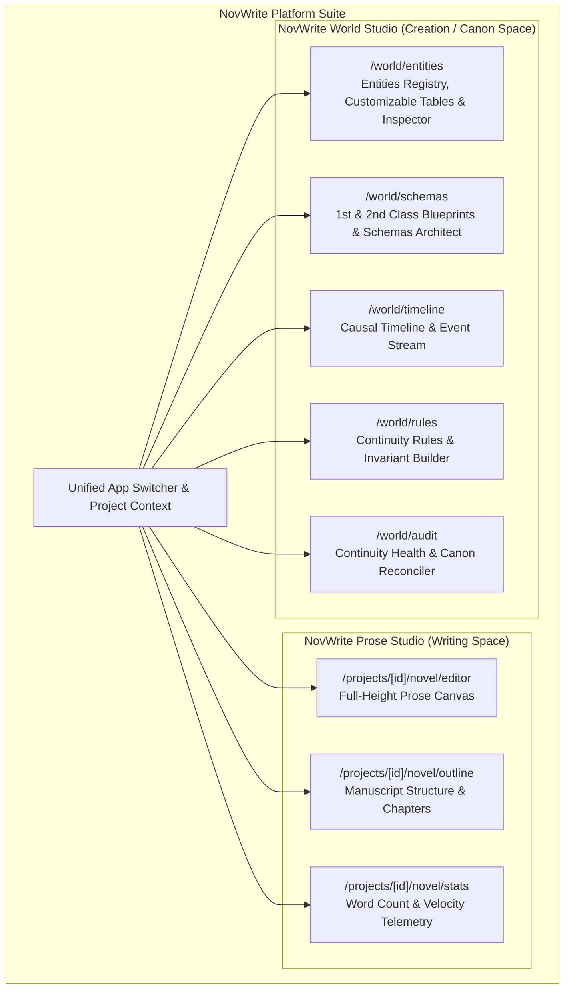
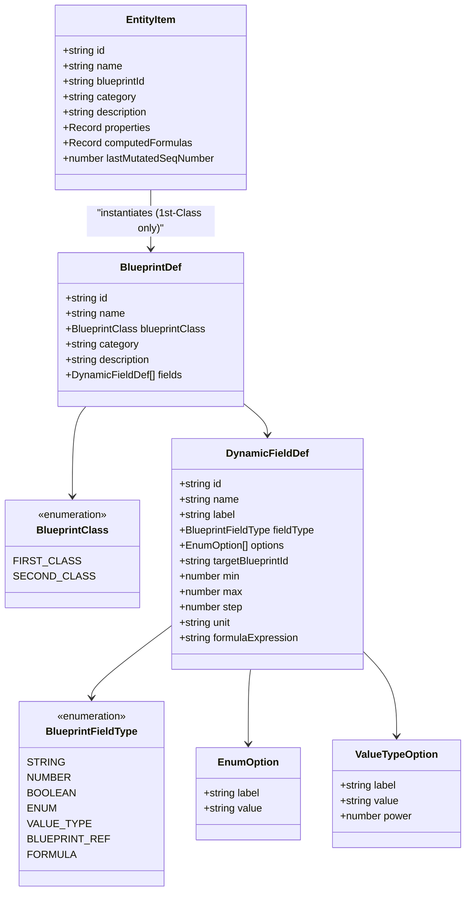
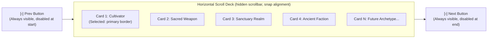

# Frontend Architecture Specification

**Status:** Locked Baseline (Version 2.0 - Blueprint vs. Entity Paradigm, Dual-Valued Enums, Dynamic Formula Engine, Archetype Carousel & Dedicated Page Routes)  
**Web & Desktop Framework:** SvelteKit 2 with Svelte 5 (Runes Mode) & Tauri 2  
**Mobile Framework:** React Native with Expo (SDK 52+, Expo Router)  
**Component Libraries (`shadcn` ecosystem):** `shadcn-svelte` (`bits-ui` in `zinc` on Web/Desktop) & `React Native Reusables` (`@rn-primitives` on Mobile)  
**Styling Engines:** Tailwind CSS v4 (Web/Desktop) & NativeWind v4 (Mobile)  
**Iconography:** `@lucide/svelte` (Web/Desktop) & `lucide-react-native` (Mobile)  
**Target Platforms (Co-Developed Together):** Web (SvelteKit), Desktop (Tauri 2), Mobile (React Native + Expo)

---

## 1. Architectural Philosophy: Decoupled Standalone Workspaces & Page-Based Routing

### 1.1. Decoupling Writing Space from Creation (World Building) Space

Novel writing and world building require completely different cognitive modes, visual structures, and interaction paradigms:

- **Prose Writing Space (NovWrite Prose Studio):** Requires maximum unobstructed canvas real estate, distraction-free typography, chapter/scene tree navigation, entity mentions (`@entity`), and non-intrusive background continuity verification.
- **World Creation Space (NovWrite World Studio):** Requires dense, information-rich master-detail data tables, dynamic blueprint architects, power tier progression ladders, causal timeline event streams, relationship scales, and mutation audit logs.



### 1.2. Dedicated Page-Based Routing Standard

To ensure maximum focus, deep linking, and zero modal crowding, all primary domains are partitioned into dedicated, full-page routes:

1. **Default List View (`/`)**: High-density table/grid of records with full search, category filtering, per-blueprint column pickers, and a prominent `[+ Create]` action button.
2. **Dedicated Creation View (`/create`)**: Full-canvas form with Archetype Carousel for selecting 1st-Class Blueprints, dynamic field inputs, sub-blueprint forms, relational links, and real-time live formula preview.
3. **Dedicated Update / Inspector View (`/[id]`)**: Deep-linkable detail workbench for editing properties, inspecting causal sequence numbers, previewing formula recalculations, and managing relational links.

### 1.3. Strict Anti-Pattern Prohibitions

1. **Zero-Badge UI Policy:** Badges, chips, and pill tags are **strictly prohibited** across the UI (except for raw data tables when explicitly necessary). Semantic status indicators, action buttons, accessible breadcrumbs, and slide-over drawers must be used instead.
2. **No Forced In-Page Tabs for Core Domains:** The application does **NOT** force users to toggle between Prose Writing and World Building via small tabs inside a single screen.
3. **No Jamming Complex Domains into Modals:** Blueprint creation, mathematical formula editing, entity state modification, and rule assertions receive their own dedicated standalone pages.
4. **Communication Bridge Isolation:** Internal messaging and bridge diagnostic layers (`@novwrite/bridge`) are strictly isolated to developer tooling (`/dev/communication-hub`) and never exposed in authoring navigation.

---

## 2. The Blueprint (Class) vs. Entity (Object) Paradigm

Borrowing directly from object-oriented software engineering (e.g. Java / TypeScript class and object design), NovWrite cleanly bifurcates the system into:

- **Blueprints (Classes / Templates):** The structural archetype definitions that specify what properties, validation rules, dual-valued options, relational links, sub-schemas, and mathematical formulas exist.
- **Entities (Concrete Objects):** The instantiated objects placed into the author's fictional universe and timeline, possessing concrete values for all attributes, links to other entities, and live computed formula outcomes.



### 2.1. First-Class Blueprints (`FIRST_CLASS`)

- **Role:** Primary universe entities that exist as distinct actors, objects, realms, or factions within the story timeline (e.g. `Cultivator / Protagonist`, `Sacred Weapon & Relic`, `Sanctuary & Realm`, `Ancient Faction & Sect`).
- **Instantiation:** Can be instantiated directly into concrete `EntityItem` instances on `/world/entities/create`.
- **Relational Links:** Can reference other 1st-Class Blueprints via `BLUEPRINT_REF` targeting entity IDs (e.g., a Character referencing a Sect entity, a Weapon entity, or a Sanctuary Realm entity), constructing an interconnected universe entity graph.
- **Sub-System Embedding:** Can embed 2nd-Class Blueprints as nested sub-systems.

### 2.2. Second-Class Blueprints (`SECOND_CLASS`)

- **Role:** Reusable structured schemas, sub-systems, value objects, gauges, and continuous scales (e.g. `Romantic Affection Scale`, `Cultivation Rank & Mastery`, `Power Matrices`, `Soul Profile`).
- **Limitation:** **CANNOT** instantiate standalone entity objects on their own. They exist purely as embedded schemas within 1st-Class entities or other 2nd-Class sub-blueprints.
- **Dot-Notation Traversal:** Embedded properties are accessed via dot notation in formula expressions (e.g. `cultivation.major_realm`, `romantic_feelings.affection_level`).

### 2.3. Categorical Enums (`ENUM`) & Weighted Value Types (`VALUE_TYPE`)

NovWrite distinctly separates pure categorical choices from quantitative, weighted domain ratings:

1. **`ENUM` (Pure String Categorical Enumeration):**
   - Pure string categorical options (e.g. `["Sword", "Saber", "Spear"]` or `["Righteous Dao", "Demonic Path"]`).
   - Used for narrative categorization, weapon types, elemental affinities, or moral alignments where no mathematical power number is needed.
   - Evaluated as categorical string literals in logical expressions (`IF(weapon_type == "Sword", 1.2, 1.0)`).

2. **`VALUE_TYPE` (Weighted Categorical Options with Power / Numeric Values):**
   - Rich options combining qualitative narrative labels with quantitative numeric weights:
     - **`label`**: Author-facing display text (e.g. `"Divine / Celestial"`, `"Heaven Step"`, `"Supreme Core"`).
     - **`value`**: Machine-readable identifier (e.g. `"divine_celestial"`, `"heaven_step"`, `"supreme_core"`).
     - **`power`**: Numeric power multiplier or base weight (e.g. `1000`, `2.5`, `50`) ingested automatically by formulas when the variable is referenced in math expressions.

### 2.4. Dynamic Field Types Reference

| Field Type | Form Widget / Input Control | Description & Configuration | Formula Interoperability |
| :--- | :--- | :--- | :--- |
| **`STRING`** | Text Input / Textarea | Freeform textual lore, origin story, bloodline notes | String matching & truthiness checks in `IF` |
| **`NUMBER`** | Numeric Input + Stepper | Numeric values with `min`, `max`, `step`, and `unit` (e.g. `Points`, `Rank`, `Atk`, `Km`) | Direct arithmetic operand |
| **`BOOLEAN`** | Toggle Switch | Binary flag (e.g. `awakened_dao_heart`, `is_bound`) | Boolean logic (`AND`, `OR`, `NOT`, `IF`) |
| **`ENUM`** | Select / Pill Picker | Pure string categorical choices (e.g. `["Sword", "Saber"]`) | Categorical string equality in conditionals |
| **`VALUE_TYPE`** | Select with Power Chips / Quick Select | Categorical options with numeric `power` ratings | Contributes `power` / numeric weight to formulas |
| **`BLUEPRINT_REF`** | Entity Picker (1st-Class) / Sub-Form (2nd-Class) | Relational link to another entity or embedded sub-blueprint | Nested dot-notation variable traversal |
| **`FORMULA`** | Read-Only Live Calculation Pill | Safe AST mathematical & logical expression | Output variable available to subsequent formulas |

---

## 3. Mathematical & Logical Formula Engine (`formulaEngine.ts`)

NovWrite includes a client-and-server shared, sandboxed, AST-based expression parser and evaluator for dynamic computed properties:

### 3.1. Expression Capabilities

- **Arithmetic Operators:** `+`, `-`, `*`, `/`, `%`, `^` (exponentiation).
- **Parentheses Grouping:** Arbitrary depth precedence support `( ... )`.
- **Dot-Notation Variable Resolution:** Resolves nested sub-blueprint fields (e.g. `cultivation.major_realm`, `romantic_feelings.affection_level`).
- **Mathematical Functions:** `CLAMP(val, min, max)`, `MIN(a, b, ...)`, `MAX(a, b, ...)`, `ROUND(val)`, `FLOOR(val)`, `CEIL(val)`, `ABS(val)`, `SQRT(val)`, `POW(base, exp)`.
- **Logical & Conditional Statements:** `IF(condition, trueVal, falseVal)`, `>`, `<`, `>=`, `<=`, `==`, `!=`, `AND`, `OR`, `NOT`.

### 3.2. Real-World Cultivation Formula Example

$$\text{Total Combat Power} = (\text{cultivation.major\_realm} \times \text{cultivation.minor\_realm}) \times \text{special\_Physique} + \text{attack} \times \text{attack\_technique\_Mastery} - \text{defence} \times \text{defence\_technique\_mastery}$$

- **Live Reactive Updates:** Modifying any component field (e.g. changing `attack` or selecting a higher `cultivation.major_realm`) immediately re-evaluates the formula and updates the entity profile in real-time.

---

## 4. World Studio Component Architecture

### 4.1. Archetype Carousel Deck (`/world/entities/create`)

To support an arbitrary and growing number of 1st-Class Blueprints without cluttering the screen or cutting off cards, the archetype selector features a dedicated horizontal scroll carousel:



- **Container Mechanics:** Flex layout with `overflow-x-auto`, `scroll-smooth`, and snap alignment (`snap-x snap-mandatory`).
- **Side Navigation Buttons:** Always visible `<Button variant="outline" size="icon">` components positioned on the left and right flanks.
- **Button States:** Explicit `disabled` state when `scrollLeft <= 0` or `scrollLeft + clientWidth >= scrollWidth - 2`, with distinct `hover:bg-accent` and `active:scale-95` micro-interactions.
- **Stepping Mechanism:** Programmatic single-card stepping via `scrollBy({ left: ±(cardWidth + gap), behavior: 'smooth' })`.
- **Scrollbar Hidden:** Zero visible scrollbar track (`scrollbar-none` / `::-webkit-scrollbar { display: none }`).
- **No Cut-Off Cards:** Fixed card widths (`min-w-[280px] max-w-[320px]`) and padding ensure clean card boundaries without awkward half-card cutoffs.

### 4.2. Per-Blueprint Customizable Table Columns (`/world/entities`)

The Entities Catalog table provides author-level column customization per 1st-Class Blueprint:

- **Column Registry:** Maintains a dictionary of all available dynamic fields and computed formulas for each blueprint archetype.
- **Column Visibility Dropdown:** Accessible popover allowing authors to toggle checkboxes for individual attributes (e.g. show `cultivation.major_realm`, hide `romantic_feelings.trust_score`, show `total_combat_power`).
- **State Persistence:** Custom column preferences are saved in local storage and synced to user project preferences.

---

## 5. Dedicated World Creation Workspaces Breakdown

Every world building domain is implemented as a first-class, standalone workbench:

### 5.1. Universe Entities Workbench (`/world/entities`)

- **List Page (`/world/entities`)**: Table showing archetype identities, customizable per-blueprint columns, custom enum values with power levels, nested sub-blueprint properties, and live computed mathematical formulas.
- **Create Page (`/world/entities/create`)**: Instantiation form featuring the Archetype Carousel, dynamic enum selects, sub-blueprint forms, relational entity links, and real-time live formula preview.
- **Update Page (`/world/entities/[id]`)**: Deep inspector for modifying attributes, inspecting causal sequence numbers, viewing relational links, and previewing real-time formula recalculations.

### 5.2. Blueprints & Schemas Workbench (`/world/schemas`)

- **Unified Registry**: Integrates both **1st-Class Archetypes** (Characters, Relics, Locations, Factions) and **2nd-Class Sub-Schemas** (Progression Ladders, Affection Gauges, Power Matrices) under one coherent schema engine.
- **List Page (`/world/schemas`)**: Filter by 1st-Class vs 2nd-Class blueprints, category tags, search, and dynamic fields summary.
- **Create Page (`/world/schemas/create`)**: Full-canvas blueprint architect with dual-valued enum options (`{ label, value, power }`), target blueprint reference selector, bounds, and mathematical formula engine with token insertion chips.
- **Update Page (`/world/schemas/[id]`)**: Deep inspector, inline option adder/remover with power metrics, dynamic field attachments, and sandbox formula evaluation.

---

## 6. Tri-Platform Co-Development Architecture (Web, Desktop, Mobile)

All three frontends are **co-developed together** as unified client applications sharing common design tokens, TypeScript contracts, and API transport protocols:

| Feature / Dimension           | Web Client                      | Desktop Client (Tauri 2)        | Mobile Client (React Native + Expo)           |
| :---------------------------- | :------------------------------ | :------------------------------ | :-------------------------------------------- |
| **Framework**                 | SvelteKit 2 (Svelte 5)          | Tauri 2 (SvelteKit 2)           | React Native (Expo SDK 52+)                   |
| **Styling Engine**            | Tailwind CSS v4                 | Tailwind CSS v4                 | NativeWind v4 (Tailwind for RN)               |
| **`shadcn` Component System** | `shadcn-svelte` (`zinc`)        | `shadcn-svelte` (`zinc`)        | **React Native Reusables** (`@rn-primitives`) |
| **Routing Standard**          | SvelteKit File-Based Routes     | SvelteKit File-Based Routes     | Expo Router File-Based Routes                 |
| **Icons Library**             | `@lucide/svelte`                | `@lucide/svelte`                | `lucide-react-native`                         |
| **Formula Engine**            | `formulaEngine.ts`              | `formulaEngine.ts`              | Shared TypeScript package (`@novwrite/core`)  |
| **Navigation Model**          | Header Breadcrumbs + Sub-Nav    | Native Window Menus + Sub-Nav   | Bottom Action Bar + Native Bottom Sheets      |
| **Zero-Badge Policy**         | Enforced across all views       | Enforced across all views       | Enforced across all views                     |

---

## 7. Svelte 5 Runes State Architecture (`worldStore.svelte.ts`)

State across all workspaces is managed via modular, reactive class instances utilizing Svelte 5 runes (`$state`, `$derived`, `$props`, `$effect`):

```typescript
// Block: BLOCK_WORLD_STORE_RUNE_003
// Description: Reactive state store for 1st/2nd class blueprints, dynamic fields, dual-valued enums, formulas, and entities.

import { evaluateFormula } from '../engine/formulaEngine.ts';

export class WorldStateStore {
  blueprints = $state<BlueprintDef[]>([...initialBlueprints]);
  entities = $state<EntityItem[]>([...initialEntities]);

  constructor() {
    this.recomputeAllEntityFormulas();
  }

  getFirstClassBlueprints(): BlueprintDef[] {
    return this.blueprints.filter((b) => b.blueprintClass === 'FIRST_CLASS');
  }

  getSecondClassBlueprints(): BlueprintDef[] {
    return this.blueprints.filter((b) => b.blueprintClass === 'SECOND_CLASS');
  }

  evaluateEntityFormulas(entity: EntityItem, bp?: BlueprintDef): Record<string, number> {
    const blueprint = bp || this.getBlueprint(entity.blueprintId);
    if (!blueprint) return {};

    const computed: Record<string, number> = {};
    const context = { ...entity.properties };

    // Inject enum power ratings into formula context
    for (const field of blueprint.fields) {
      if (field.fieldType === 'ENUM' && field.options) {
        const val = entity.properties[field.name];
        const matched = field.options.find((o) => (typeof o === 'string' ? o === val : o.value === val || o.label === val));
        if (matched && typeof matched === 'object' && matched.power !== undefined) {
          context[`${field.name}_power`] = matched.power;
        }
      }
    }

    for (const field of blueprint.fields) {
      if (field.fieldType === 'FORMULA' && field.formulaExpression) {
        const evalRes = evaluateFormula(field.formulaExpression, context);
        if (evalRes.success && evalRes.value !== undefined) {
          computed[field.name] = evalRes.value;
          context[field.name] = evalRes.value;
        }
      }
    }
    return computed;
  }
}

export const worldStore = new WorldStateStore();
```

---

## 7. Color-Coded CodeMirror 6 JSON Workbench Architecture

### 7.1. Motivation & Technical Stack
While visual form controls offer intuitive editing for structured entity properties, complex universe design frequently requires direct JSON payload manipulation, bulk property editing, and debugging. NovWrite embeds a first-class CodeMirror 6 JSON editor ([`JsonEditor.svelte`](file:///home/yogesh/Projects/NovWrite/apps/web/src/lib/components/ui/json-editor/json-editor.svelte)) with:
- **Modular CodeMirror 6 Packages**: `@codemirror/state`, `@codemirror/view`, `@codemirror/language`, `@codemirror/lang-json`, `@lezer/highlight`.
- **Custom Token Palette**:
  - **Property Keys**: Cyan (`#38bdf8`, `fontWeight: '600'`)
  - **String Literals**: Emerald (`#34d399`)
  - **Numeric Literals**: Amber / Orange (`#fb923c`)
  - **Booleans**: Rose (`#f43f5e`, `fontWeight: 'bold'`)
  - **Null**: Purple (`#a855f7`, `fontWeight: 'bold'`)
  - **Punctuation & Brackets**: Slate (`#94a3b8` / `#cbd5e1`)
- **Word Wrapping (`EditorView.lineWrapping`)**: Long property descriptions, nested lore notes, and trace stacks wrap cleanly without causing horizontal container blowouts.
- **Dynamic Theme Synchronization**: Listens reactively to `themeStore.mode` to reconfigure CodeMirror compartments between light and dark themes in real time.
- **Bi-Directional State Synchronization**: Changes in the Visual Form update the Raw JSON buffer, and valid edits inside the CodeMirror JSON view immediately reflect back in the visual form inputs and AST formulas.

---

## 8. Error Handling & Full-Screen Isolation Architecture (404 & 500)

### 8.1. SvelteKit Global Error Handling Standard
NovWrite integrates a centralized SvelteKit error handler ([`+error.svelte`](file:///home/yogesh/Projects/NovWrite/apps/web/src/routes/+error.svelte)) that routes dynamic status codes to universe-themed error screens:
- **Status 404 (Timeline Paradox)**: Rendered when a route, entity, or chapter coordinates cannot be found in the canon index.
- **Status 500 / 5xx (Continuity Invariant Collapse)**: Rendered when an unexpected exception or invariant conflict interrupts deterministic state folding.
- **Standalone Route Parity**: Direct access to `/404` and `/500` routes is supported for design verification and diagnostics.

### 8.2. Full-Screen Chrome Isolation
On error pages, all extraneous application chrome (the top development header, main navigation bar, studio switcher, and project indicator) is strictly removed from the layout. The user is presented with a distraction-free, focused recovery canvas featuring:
- Large thematic hero number (`404` / `500`) with ambient glow halos.
- Clear, readable causal fault explanations.
- Structured primary actions (**Return to Home Hub**, **Go Back**, **Recalibrate Timeline**, **Continuity Audit**).
- Diagnostic panels with word-wrapped, syntax-highlighted JSON error traces and 1-click clipboard copy with toast notifications.

---

## 9. Theme Switcher Sliding Toggle Architecture

The application theme toggle ([`theme-toggle.svelte`](file:///home/yogesh/Projects/NovWrite/apps/web/src/lib/components/ui/theme-toggle.svelte)) implements a sliding switch design:
- **Interactive Thumb**: Smooth animated sliding pill (`transition-transform duration-200 ease-in-out`) transitioning across the track.
- **Single Inactive Icon Display**: Only the non-active target mode icon is visible on the exposed track (the Sun icon is visible when in Dark mode; the Moon icon is visible when in Light mode).
- **Accessibility**: Full keyboard navigation support (`Enter` / `Space`), ARIA `role="switch"` and `aria-checked` bindings.

---

## 10. Svelte 5 Pure Derivation & Synchronous Lifecycle Standard

### 10.1. Pure Derived Getters Rule
In Svelte 5, derived values (`$derived`) must be strictly pure functions. Calling getters or methods that mutate state (e.g. assigning to `$state` variables or cached formulas) inside a `$derived` derivation causes runtime aborts during client-side navigation. All store getters (e.g. `worldStore.getEntity`, `worldStore.getBlueprint`) must be side-effect free.

### 10.2. Synchronous Initial Form State
To eliminate flickering, empty input states, and race conditions during SSR and client page navigation, edit pages (`/world/entities/[id]`, `/world/schemas/[id]`) compute their initial form state synchronously via `getInitialEntityState()` before mounting rather than relying on delayed asynchronous effects.

