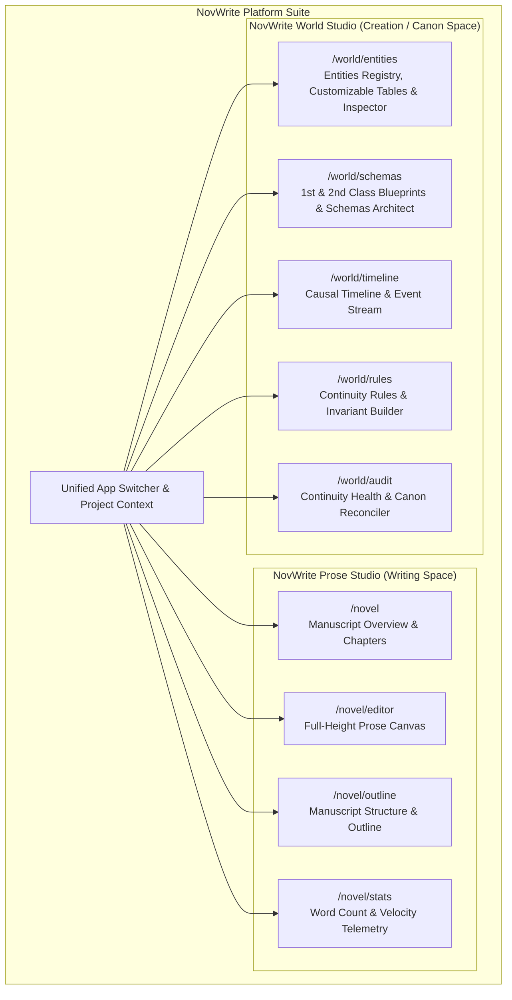
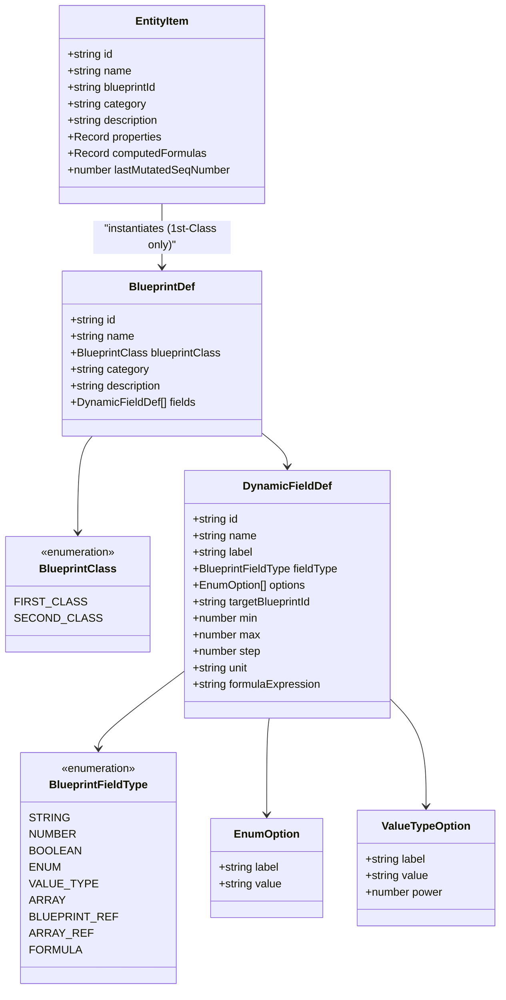
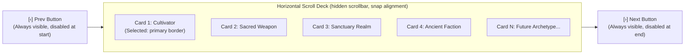

# Frontend Architecture Specification

**Status:** Locked Baseline (Version 2.8 - Creative Novel Multi-Project Isolation, Freeform Genre Input, 3-Step Project Deletion, Zero Redundant Close Buttons, Svelte 5 Native Bidirectional Transitions & 5-Phase Monorepo Test Suite)  
**Web & Desktop Framework:** SvelteKit 2 with Svelte 5 (Runes Mode) & Tauri 2  
**Mobile Framework:** React Native with Expo (SDK 52+, Expo Router)  
**Component Libraries (`shadcn` ecosystem):** `shadcn-svelte` (`bits-ui` in `zinc` on Web/Desktop) & `React Native Reusables` (`@rn-primitives` on Mobile)  
**Styling Engines:** Tailwind CSS v4 (Web/Desktop) & NativeWind v4 (Mobile)  
**Iconography:** `@lucide/svelte` (Web/Desktop) & `lucide-react-native` (Mobile)  
**Target Platforms (Co-Developed Together):** Web (SvelteKit), Desktop (Tauri 2), Mobile (React Native + Expo)

---

## 1. Architectural Philosophy: Decoupled Standalone Workspaces & Page-Based Routing

### 1.1. Decoupling Writing Space from Creation (World Building) Space

Novel writing and world building require completely different cognitive modes, visual structures, and interaction paradigms:

- **Prose Writing Space (NovWrite Prose Studio):** Requires maximum unobstructed canvas real estate, distraction-free typography, chapter/scene tree navigation, entity mentions (`@entity`), and non-intrusive background continuity verification.
- **World Creation Space (NovWrite World Studio):** Requires dense, information-rich master-detail data tables, dynamic blueprint architects, power tier progression ladders, causal timeline event streams, relationship scales, and mutation audit logs.



### 1.2. Dedicated Page-Based Routing Standard

To ensure maximum focus, deep linking, and zero modal crowding, all primary domains are partitioned into dedicated, full-page routes:

1. **Default List View (`/`)**: High-density table/grid of records with full search, category filtering, per-blueprint column pickers, and a prominent `[+ Create]` action button.
2. **Dedicated Creation View (`/create`)**: Full-canvas form with Archetype Carousel for selecting 1st-Class Blueprints, dynamic field inputs, sub-blueprint forms, relational links, and real-time live formula preview. Blueprints start completely clean from scratch with zero hardcoded dummy fields. Saving automatically redirects back to `/world/schemas` or `/world/entities`.
3. **Dedicated Update / Inspector View (`/[id]`)**: Deep-linkable detail workbench for editing properties, inspecting causal sequence numbers, previewing formula recalculations, and managing relational links. Full dynamic field modification with automatic field type slate wipe.

### 1.3. Strict Anti-Pattern Prohibitions

1. **Zero-Badge UI Policy:** Badges, chips, and pill tags are **strictly prohibited** across the UI (except for raw data tables when explicitly necessary). Semantic status indicators, action buttons, accessible breadcrumbs, and slide-over drawers must be used instead.
2. **No Forced In-Page Tabs for Core Domains:** The application does **NOT** force users to toggle between Prose Writing and World Building via small tabs inside a single screen.
3. **No Jamming Complex Domains into Modals:** Blueprint creation, mathematical formula editing, entity state modification, and rule assertions receive their own dedicated standalone pages.
4. **Communication Bridge Isolation:** Internal messaging and bridge diagnostic layers (`@novwrite/bridge`) are strictly tested through contract suites and mock adapters and never exposed in authoring navigation.

---

## 2. The Blueprint (Class) vs. Entity (Object) Paradigm

Borrowing directly from object-oriented software engineering (e.g. Java / TypeScript class and object design), NovWrite cleanly bifurcates the system into:

- **Blueprints (Classes / Templates):** The structural archetype definitions that specify what properties, validation rules, dual-valued options, relational links, sub-schemas, and mathematical formulas exist.
- **Entities (Concrete Objects):** The instantiated objects placed into the author's fictional universe and timeline, possessing concrete values for all attributes, links to other entities, and live computed formula outcomes.



### 2.1. First-Class Blueprints (`FIRST_CLASS`)

- **Role:** Primary universe entities that exist as distinct actors, objects, realms, or factions within the story timeline (e.g. `Cultivator / Protagonist`, `Sacred Weapon & Relic`, `Sanctuary & Realm`, `Ancient Faction & Sect`).
- **Instantiation:** Can be instantiated directly into concrete `EntityItem` instances on `/world/entities/create`.
- **Relational Links:** Can reference other 1st-Class Blueprints via `BLUEPRINT_REF` targeting entity IDs (e.g., a Character referencing a Sect entity, a Weapon entity, or a Sanctuary Realm entity), constructing an interconnected universe entity graph.
- **Sub-System Embedding:** Can embed 2nd-Class Blueprints as nested sub-systems.

### 2.2. Second-Class Blueprints (`SECOND_CLASS`)

- **Role:** Reusable structured schemas, sub-systems, value objects, gauges, and continuous scales (e.g. `Romantic Affection Scale`, `Cultivation Rank & Mastery`, `Power Matrices`, `Soul Profile`).
- **Limitation:** **CANNOT** instantiate standalone entity objects on their own. They exist purely as embedded schemas within 1st-Class entities or other 2nd-Class sub-blueprints.
- **Dot-Notation Traversal:** Embedded properties are accessed via dot notation in formula expressions (e.g. `cultivation.major_realm`, `romantic_feelings.affection_level`).

### 2.3. Categorical Enums (`ENUM`) & Weighted Value Types (`VALUE_TYPE`)

NovWrite distinctly separates pure categorical choices from quantitative, weighted domain ratings:

1. **`ENUM` (Pure String Categorical Enumeration):**
   - Pure string categorical options (e.g. `["Sword", "Saber", "Spear"]` or `["Righteous Dao", "Demonic Path"]`).
   - Used for narrative categorization, weapon types, elemental affinities, or moral alignments where no mathematical power number is needed.
   - Evaluated as categorical string literals in logical expressions (`IF(weapon_type == "Sword", 1.2, 1.0)`).

2. **`VALUE_TYPE` (Weighted Categorical Options with Power / Numeric Values):**
   - Rich options combining qualitative narrative labels with quantitative numeric weights:
     - **`label`**: Author-facing display text (e.g. `"Divine / Celestial"`, `"Heaven Step"`, `"Supreme Core"`).
     - **`value`**: Machine-readable identifier (e.g. `"divine_celestial"`, `"heaven_step"`, `"supreme_core"`).
     - **`power`**: Numeric power multiplier or base weight (e.g. `1000`, `2.5`, `50`) ingested automatically by formulas when the variable is referenced in math expressions.

### 2.4. Dynamic Field Types Reference

| Field Type          | Form Widget / Input Control                      | Description & Configuration                                                               | Formula Interoperability                         |
| :------------------ | :----------------------------------------------- | :---------------------------------------------------------------------------------------- | :----------------------------------------------- |
| **`STRING`**        | Text Input / Textarea                            | Freeform textual lore, origin story, bloodline notes                                      | String matching & truthiness checks in `IF`      |
| **`NUMBER`**        | Numeric Input + Stepper                          | Numeric values with `min`, `max`, `step`, and `unit` (e.g. `Points`, `Rank`, `Atk`, `Km`) | Direct arithmetic operand                        |
| **`BOOLEAN`**       | Toggle Switch                                    | Binary flag (e.g. `awakened_dao_heart`, `is_bound`)                                       | Boolean logic (`AND`, `OR`, `NOT`, `IF`)         |
| **`ENUM`**          | Select / Pill Picker                             | Pure string categorical choices (e.g. `["Sword", "Saber"]`)                               | Categorical string equality in conditionals      |
| **`VALUE_TYPE`**    | Select with Power Chips / Quick Select           | Categorical options with numeric `power` ratings                                          | Contributes `power` / numeric weight to formulas |
| **`BLUEPRINT_REF`** | Entity Picker (1st-Class) / Sub-Form (2nd-Class) | Relational link to another entity or embedded sub-blueprint                               | Nested dot-notation variable traversal           |
| **`FORMULA`**       | Read-Only Live Calculation Pill                  | Safe AST mathematical & logical expression                                                | Output variable available to subsequent formulas |

---

## 3. Mathematical & Logical Formula Engine (`formulaEngine.ts`)

NovWrite includes a client-and-server shared, sandboxed, AST-based expression parser and evaluator for dynamic computed properties:

### 3.1. Expression Capabilities

- **Arithmetic Operators:** `+`, `-`, `*`, `/`, `%`, `^` (exponentiation).
- **Parentheses Grouping:** Arbitrary depth precedence support `( ... )`.
- **Dot-Notation Variable Resolution:** Resolves nested sub-blueprint fields (e.g. `cultivation.major_realm`, `romantic_feelings.affection_level`).
- **Mathematical Functions:** `CLAMP(val, min, max)`, `MIN(a, b, ...)`, `MAX(a, b, ...)`, `ROUND(val)`, `FLOOR(val)`, `CEIL(val)`, `ABS(val)`, `SQRT(val)`, `POW(base, exp)`.
- **Logical & Conditional Statements:** `IF(condition, trueVal, falseVal)`, `>`, `<`, `>=`, `<=`, `==`, `!=`, `AND`, `OR`, `NOT`.

### 3.2. Real-World Cultivation Formula Example

$$\text{Total Combat Power} = (\text{cultivation.major\_realm} \times \text{cultivation.minor\_realm}) \times \text{special\_Physique} + \text{attack} \times \text{attack\_technique\_Mastery} - \text{defence} \times \text{defence\_technique\_mastery}$$

- **Live Reactive Updates:** Modifying any component field (e.g. changing `attack` or selecting a higher `cultivation.major_realm`) immediately re-evaluates the formula and updates the entity profile in real-time.

---

## 4. World Studio Component Architecture

### 4.1. Archetype Carousel Deck (`/world/entities/create`)

To support an arbitrary and growing number of 1st-Class Blueprints without cluttering the screen or cutting off cards, the archetype selector features a dedicated horizontal scroll carousel:



- **Container Mechanics:** Flex layout with `overflow-x-auto`, `scroll-smooth`, and snap alignment (`snap-x snap-mandatory`).
- **Side Navigation Buttons:** Always visible `<Button variant="outline" size="icon">` components positioned on the left and right flanks.
- **Button States:** Explicit `disabled` state when `scrollLeft <= 0` or `scrollLeft + clientWidth >= scrollWidth - 2`, with distinct `hover:bg-accent` and `active:scale-95` micro-interactions.
- **Stepping Mechanism:** Programmatic single-card stepping via `scrollBy({ left: ±(cardWidth + gap), behavior: 'smooth' })`.
- **Scrollbar Hidden:** Zero visible scrollbar track (`scrollbar-none` / `::-webkit-scrollbar { display: none }`).
- **No Cut-Off Cards:** Fixed card widths (`min-w-[280px] max-w-[320px]`) and padding ensure clean card boundaries without awkward half-card cutoffs.

### 4.2. Per-Blueprint Customizable Table Columns (`/world/entities`)

The Entities Catalog table provides author-level column customization per 1st-Class Blueprint:

- **Column Registry:** Maintains a dictionary of all available dynamic fields and computed formulas for each blueprint archetype.
- **Column Visibility Dropdown:** Accessible popover allowing authors to toggle checkboxes for individual attributes (e.g. show `cultivation.major_realm`, hide `romantic_feelings.trust_score`, show `total_combat_power`).
- **State Persistence:** Custom column preferences are saved in local storage and synced to user project preferences.

---

## 5. Dedicated World Creation Workspaces Breakdown

Every world building domain is implemented as a first-class, standalone workbench:

### 5.1. Universe Entities Workbench (`/world/entities`)

- **List Page (`/world/entities`)**: Table showing archetype identities, customizable per-blueprint columns, custom enum values with power levels, nested sub-blueprint properties, and live computed mathematical formulas.
- **Create Page (`/world/entities/create`)**: Instantiation form featuring the Archetype Carousel, dynamic enum selects, sub-blueprint forms, relational entity links, and real-time live formula preview.
- **Update Page (`/world/entities/[id]`)**: Deep inspector for modifying attributes, inspecting causal sequence numbers, viewing relational links, and previewing real-time formula recalculations.

### 5.2. Blueprints & Schemas Workbench (`/world/schemas`)

- **Unified Registry**: Integrates both **1st-Class Archetypes** (Characters, Relics, Locations, Factions) and **2nd-Class Sub-Schemas** (Progression Ladders, Affection Gauges, Power Matrices) under one coherent schema engine.
- **List Page (`/world/schemas`)**: Filter by 1st-Class vs 2nd-Class blueprints, category tags, search, and dynamic fields summary.
- **Create Page (`/world/schemas/create`)**: Full-canvas blueprint architect with dual-valued enum options (`{ label, value, power }`), target blueprint reference selector, bounds, and mathematical formula engine with token insertion chips.
- **Update Page (`/world/schemas/[id]`)**: Deep inspector, inline option adder/remover with power metrics, dynamic field attachments, and sandbox formula evaluation.

---

## 6. Tri-Platform Co-Development Architecture (Web, Desktop, Mobile)

All three frontends are **co-developed together** as unified client applications sharing common design tokens, TypeScript contracts, and API transport protocols:

| Feature / Dimension           | Web Client                   | Desktop Client (Tauri 2)      | Mobile Client (React Native + Expo)           |
| :---------------------------- | :--------------------------- | :---------------------------- | :-------------------------------------------- |
| **Framework**                 | SvelteKit 2 (Svelte 5)       | Tauri 2 (SvelteKit 2)         | React Native (Expo SDK 52+)                   |
| **Styling Engine**            | Tailwind CSS v4              | Tailwind CSS v4               | NativeWind v4 (Tailwind for RN)               |
| **`shadcn` Component System** | `shadcn-svelte` (`zinc`)     | `shadcn-svelte` (`zinc`)      | **React Native Reusables** (`@rn-primitives`) |
| **Routing Standard**          | SvelteKit File-Based Routes  | SvelteKit File-Based Routes   | Expo Router File-Based Routes                 |
| **Icons Library**             | `@lucide/svelte`             | `@lucide/svelte`              | `lucide-react-native`                         |
| **Formula Engine**            | `formulaEngine.ts`           | `formulaEngine.ts`            | Shared TypeScript package (`@novwrite/core`)  |
| **Navigation Model**          | Header Breadcrumbs + Sub-Nav | Native Window Menus + Sub-Nav | Bottom Action Bar + Native Bottom Sheets      |
| **Zero-Badge Policy**         | Enforced across all views    | Enforced across all views     | Enforced across all views                     |

---

## 7. Svelte 5 Runes State Architecture (`worldStore.svelte.ts`)

State across all workspaces is managed via modular, reactive class instances utilizing Svelte 5 runes (`$state`, `$derived`, `$props`, `$effect`):

```typescript
// Block: BLOCK_WORLD_STORE_RUNE_003
// Description: Reactive state store for 1st/2nd class blueprints, dynamic fields, dual-valued enums, formulas, and entities.

import { evaluateFormula } from "../engine/formulaEngine.ts";

export class WorldStateStore {
  blueprints = $state<BlueprintDef[]>([...initialBlueprints]);
  entities = $state<EntityItem[]>([...initialEntities]);

  constructor() {
    this.recomputeAllEntityFormulas();
  }

  getFirstClassBlueprints(): BlueprintDef[] {
    return this.blueprints.filter((b) => b.blueprintClass === "FIRST_CLASS");
  }

  getSecondClassBlueprints(): BlueprintDef[] {
    return this.blueprints.filter((b) => b.blueprintClass === "SECOND_CLASS");
  }

  evaluateEntityFormulas(
    entity: EntityItem,
    bp?: BlueprintDef,
  ): Record<string, number> {
    const blueprint = bp || this.getBlueprint(entity.blueprintId);
    if (!blueprint) return {};

    const computed: Record<string, number> = {};
    const context = { ...entity.properties };

    // Inject enum power ratings into formula context
    for (const field of blueprint.fields) {
      if (field.fieldType === "ENUM" && field.options) {
        const val = entity.properties[field.name];
        const matched = field.options.find((o) =>
          typeof o === "string"
            ? o === val
            : o.value === val || o.label === val,
        );
        if (
          matched &&
          typeof matched === "object" &&
          matched.power !== undefined
        ) {
          context[`${field.name}_power`] = matched.power;
        }
      }
    }

    for (const field of blueprint.fields) {
      if (field.fieldType === "FORMULA" && field.formulaExpression) {
        const evalRes = evaluateFormula(field.formulaExpression, context);
        if (evalRes.success && evalRes.value !== undefined) {
          computed[field.name] = evalRes.value;
          context[field.name] = evalRes.value;
        }
      }
    }
    return computed;
  }
}

export const worldStore = new WorldStateStore();
```

---

## 7. Color-Coded CodeMirror 6 JSON Workbench Architecture

### 7.1. Motivation & Technical Stack

While visual form controls offer intuitive editing for structured entity properties, complex universe design frequently requires direct JSON payload manipulation, bulk property editing, and debugging. NovWrite embeds a first-class CodeMirror 6 JSON editor ([`JsonEditor.svelte`](file:///home/yogesh/Projects/NovWrite/apps/web/src/lib/components/ui/json-editor/json-editor.svelte)) with:

- **Modular CodeMirror 6 Packages**: `@codemirror/state`, `@codemirror/view`, `@codemirror/language`, `@codemirror/lang-json`, `@lezer/highlight`.
- **Custom Token Palette**:
  - **Property Keys**: Cyan (`#38bdf8`, `fontWeight: '600'`)
  - **String Literals**: Emerald (`#34d399`)
  - **Numeric Literals**: Amber / Orange (`#fb923c`)
  - **Booleans**: Rose (`#f43f5e`, `fontWeight: 'bold'`)
  - **Null**: Purple (`#a855f7`, `fontWeight: 'bold'`)
  - **Punctuation & Brackets**: Slate (`#94a3b8` / `#cbd5e1`)
- **Word Wrapping (`EditorView.lineWrapping`)**: Long property descriptions, nested lore notes, and trace stacks wrap cleanly without causing horizontal container blowouts.
- **Dynamic Theme Synchronization**: Listens reactively to `themeStore.mode` to reconfigure CodeMirror compartments between light and dark themes in real time.
- **Bi-Directional State Synchronization**: Changes in the Visual Form update the Raw JSON buffer, and valid edits inside the CodeMirror JSON view immediately reflect back in the visual form inputs and AST formulas.

---

## 8. Error Handling & Full-Screen Isolation Architecture (404 & 500)

### 8.1. SvelteKit Global Error Handling Standard

NovWrite integrates a centralized SvelteKit error handler ([`+error.svelte`](file:///home/yogesh/Projects/NovWrite/apps/web/src/routes/+error.svelte)) that routes dynamic status codes to universe-themed error screens:

- **Status 404 (Timeline Paradox)**: Rendered when a route, entity, or chapter coordinates cannot be found in the canon index.
- **Status 500 / 5xx (Continuity Invariant Collapse)**: Rendered when an unexpected exception or invariant conflict interrupts deterministic state folding.
- **Standalone Route Parity**: Direct access to `/404` and `/500` routes is supported for design verification and diagnostics.

### 8.2. Full-Screen Chrome Isolation

On error pages, all extraneous application chrome (the top development header, main navigation bar, studio switcher, and project indicator) is strictly removed from the layout. The user is presented with a distraction-free, focused recovery canvas featuring:

- Large thematic hero number (`404` / `500`) with ambient glow halos.
- Clear, readable causal fault explanations.
- Structured primary actions (**Return to Home Hub**, **Go Back**, **Recalibrate Timeline**, **Continuity Audit**).
- Diagnostic panels with word-wrapped, syntax-highlighted JSON error traces and 1-click clipboard copy with toast notifications.

---

## 9. Theme Switcher Sliding Toggle Architecture

The application theme toggle ([`theme-toggle.svelte`](file:///home/yogesh/Projects/NovWrite/apps/web/src/lib/components/ui/theme-toggle.svelte)) implements a sliding switch design:

- **Interactive Thumb**: Smooth animated sliding pill (`transition-transform duration-200 ease-in-out`) transitioning across the track.
- **Single Inactive Icon Display**: Only the non-active target mode icon is visible on the exposed track (the Sun icon is visible when in Dark mode; the Moon icon is visible when in Light mode).
- **Accessibility**: Full keyboard navigation support (`Enter` / `Space`), ARIA `role="switch"` and `aria-checked` bindings.

---

## 10. Svelte 5 Pure Derivation & Synchronous Lifecycle Standard

### 10.1. Pure Derived Getters Rule

In Svelte 5, derived values (`$derived`) must be strictly pure functions. Calling getters or methods that mutate state (e.g. assigning to `$state` variables or cached formulas) inside a `$derived` derivation causes runtime aborts during client-side navigation. All store getters (e.g. `worldStore.getEntity`, `worldStore.getBlueprint`) must be side-effect free.

### 10.2. Synchronous Initial Form State

To eliminate flickering, empty input states, and race conditions during SSR and client page navigation, edit pages (`/world/entities/[id]`, `/world/schemas/[id]`) compute their initial form state synchronously via `getInitialEntityState()` before mounting rather than relying on delayed asynchronous effects.

---

## 11. Entity Editor 3-Tier Visual Hierarchy Standard

The Entity Editor header layout ([`apps/web/src/routes/world/entities/[id]/+page.svelte`](file:///home/yogesh/Projects/NovWrite/apps/web/src/routes/world/entities/[id]/+page.svelte)) resolves toolbar crowding through a strictly tiered 3-level vertical hierarchy:

| Tier Level | Component Purpose | Elements & Structure |
| :--- | :--- | :--- |
| **Tier 1: Location & Context** | Breadcrumb navigation | `‹ All Entities / World Studio › Entities › Eldrin the Spellblade` |
| **Tier 2: Identity Banner** | Entity archetype & metadata | `[ICON] Eldrin the Spellblade` · `Cultivator · Template: Protagonist Archetype · Sequence #12` |
| **Tier 3: Utilities & Actions** | Operating modes & primary CTAs | `[ Visual Form \| Raw JSON ]` · `[ ⚡ Feather History (3) ]` · `[ ↗ Schema ]` · `[ Save Changes ]` |

1. **Tier 1 (Location & Navigation):** Clean breadcrumb path with back-link (`‹ All Entities`) establishing spatial context without competing with actions.
2. **Tier 2 (Identity Banner):** Prominent entity name, archetype icon, category descriptor, template link, and causal mutation sequence number.
3. **Tier 3 (Utilities & Actions Toolbar):** Segmented view-mode control (`Visual Form` vs `Raw JSON`), Feather History revision drawer trigger button with active edit counter, schema quick-jump button, and primary `Save Changes` call-to-action.

---

## 12. UPDATE Pipe & Hanging EDIT Trees Visualizer (`PipeTreeVisualizer.svelte`)

The UPDATE Pipe and Hanging EDIT Trees UI component ([`PipeTreeVisualizer.svelte`](file:///home/yogesh/Projects/NovWrite/apps/web/src/lib/components/ui/pipe-tree-visualizer/pipe-tree-visualizer.svelte)) visualizes the dual-axis narrative vs authorial revision model:

- **Horizontal Plot Axis (The UPDATE Pipe):** Renders the chronological narrative conduit (`event0 ---> event1 ---> event2 ---> event3`) with sequence numbers and causal badges.
- **Vertical Authorial Revision Trees:** Hanging vertical branch DAGs under each pipe node displaying revision nodes (`ED0 -> ED1 -> ED2 ...`).
- **Live Active EDIT Head Indicator:** Highlights the current active checkout node with `[⚡ ACTIVE EDIT HEAD]` pill indicator.
- **Interactive Non-Destructive Checkout:** Clicking any past node non-destructively moves the active head without deleting newer revisions.
- **Infinite Branching Graph:** Multiple child nodes branch side-by-side with clear connecting SVG connector rails.

---

## 13. Strict Schema Invariance & Eradication of Arbitrary Instance Properties

To protect data integrity, prevent schema drift, and eliminate runtime bugs:

- **Strict Blueprint Conformance:** Entities strictly adhere to their assigned Blueprint schema.
- **Eradication of Arbitrary Custom Properties:** The legacy "Custom & Extended Object Properties" section is completely prohibited from the Entity Editor. Authors must not attach unvalidated ad-hoc key-value pairs.
- **Schema-First Evolution:** To add new fields, authors update the Blueprint schema directly in `/world/schemas/[id]`. This guarantees zero-trust backend validation parity, formula interoperability, and automatic migration across all instances.

---

## 14. Frontend Testing & Verification Architecture

The frontend test suite ([`apps/web`](file:///home/yogesh/Projects/NovWrite/apps/web)) uses Vitest and Testing Library:

- **Unit Tests:** AST formula engine evaluation (`formulaEngine.test.ts`), bitemporal coordinate resolution, and schema validation.
- **Store Tests:** Svelte 5 Runes store reactivity, entity formula caching, and revision checkout operations (`worldStore.test.ts`).
- **Component Tests:** `PipeTreeVisualizer.test.ts`, `JsonEditor.test.ts`, and archetype carousel interaction tests.
- **Automated Execution:** Tested automatically as Phase 4 in [`./test.sh`](file:///home/yogesh/Projects/NovWrite/test.sh) and typechecked via [`./check.sh`](file:///home/yogesh/Projects/NovWrite/check.sh).

---

## 15. Core Responsive Philosophy & Layout Robustness

NovWrite avoids device-query fragmentation by anchoring layout styling in container fluid dynamics and structural invariants:

### 15.1. The Zero-Horizontal-Overflow Invariant

- **Root Protection:** Under no circumstances should `document.documentElement.scrollWidth > window.innerWidth`.
- **Flex Child Sizing:** Every flex child that renders truncated text, badges, or code blocks must declare `min-w-0` to avoid flex child blowout past parent boundaries.
- **Isolated Horizontal Overflow Containers:** Naturally wide components (such as the Data Table, DAG Visualizers, and CodeMirror editors) must be wrapped in isolated horizontal scroll containers (`overflow-x-auto w-full min-w-0 max-w-full`).

### 15.2. Viewport-Safe Modal & Dialog Architecture

- All modals, sheets, and dialogs must fit inside the active viewport: `max-h-[min(90dvh,800px)] w-[min(95vw,600px)]`.
- Modal footers and headers remain pinned, while body content scrolls internally (`overflow-y-auto min-h-0`).
- Touch targets must adhere to a minimum physical threshold of $36\text{px} \times 36\text{px}$ (compact) to $44\text{px} \times 44\text{px}$ (standard mobile).

---

## 16. Mobile-First Structural Adaptation & Interaction Architecture

Responsive design in NovWrite is NOT about compressing desktop layouts into narrow mobile views. When desktop interaction patterns degrade on small viewports, components pivot to dedicated mobile interaction structures:

| Desktop UI Pattern | Dedicated Mobile UI Pattern (< 768px) |
| :--- | :--- |
| **Persistent Multi-level Sidebar** | Hamburger `[☰]` + Slide-over Drawer / Sheet |
| **Horizontal Subnav Tab Strip** | Breadcrumb Header + Mobile Section Dropdown (`Select`) |
| **Multi-column Data Table** | Dedicated Mobile Entity Card List + Table View Switcher |
| **Multi-column Form Grid** | Single-column Vertical Stack with $\ge 44\text{px}$ touch targets |
| **Side-by-Side Dual-Axis Inspector** | Full-width Segmented Tabbed Sheet (`[Revisions]` vs `[Coordinates]`) |
| **Horizontal Action Toolbar Tray** | Stacked Full-width Primary CTA above Secondary Sub-actions |

### 16.1. Mobile Navigation & Breadcrumb Dropdown Pattern

- On screens $<768\text{px}$, persistent sidebars collapse into a slide-over sheet triggered by a top-left hamburger `[☰]` button.
- Sub-navigation bars with more than 3 tabs convert to a native `<Select>` or dropdown menu displaying the active section name next to the breadcrumbs.

### 16.2. Table vs Card List Adaptation

- Complex data grids render an interactive card view on small screens where each entity card presents the title, archetype badge, key metadata metrics, and a quick-action trigger.
- Users can toggle between Card and Table modes when inspecting dense datasets on mobile devices.

### 16.3. Adaptation Preference Hierarchy

When adapting UI components across viewport boundaries, the following priority order is strictly enforced:

1. Pure CSS Fluid Layouts (`flex-wrap`, `minmax`, CSS Grid `auto-fit`)
2. CSS `gap` and `padding` scaling via responsive tokens (`p-3 md:p-6`)
3. Semantic HTML Wrapping & Text Truncation (`truncate`, `break-words`)
4. Intentional View Modes (Card vs. Table view toggle)
5. Component-Level Structural Breakpoints (`hidden md:flex`)
6. Progressive Disclosure (Expandable accordions, collapsible panels)
7. Mobile Drawers / Modals (replacing permanent side panels)
8. Isolated Scrolling (last resort, strictly bounded to table or graph sub-regions)

---

## 17. Standardized 10-Item Pagination & Layout Jump Prevention Architecture

To guarantee predictable memory consumption, instantaneous query response times, and stable rendering:

### 17.1. Standard 10-Item Page Sizing

- All list endpoints and data views default to a page chunk size of $10$ items (`pageSize = 10`).
- Standard query parameters across REST APIs: `?page=1&limit=10`.
- Standard API response contract:
  ```json
  {
    "data": [ ... ],
    "total": 42,
    "page": 1,
    "pageSize": 10,
    "totalPages": 5
  }
  ```

### 17.2. Anti-Layout-Jump Placement: Top Pagination Bar

- **Positioning Rule:** Pagination counters and navigation buttons (`[‹ Previous]` / `[Next ›]`) must be positioned **ABOVE** the data table or card container.
- **Rationale:** Placing pagination controls solely at the bottom of dynamic lists causes drastic vertical jumps (Cumulative Layout Shift) when transitioning between pages of varying item heights or when reaching the last page with fewer items. The top pagination bar provides an anchored, flicker-free navigation landmark.

---

## 18. Multi-Project Architecture, ProjectSwitcher & Creative Onboarding

### 18.1. Reactive Multi-Project State Store (`projectStore.svelte.ts`)

- Manages user novel projects (`ProjectItem[]`), active project selection (`activeProjectId`), project edit/delete modal states (`isEditDialogOpen`, `isDeleteDialogOpen`, `projectToEdit`, `projectToDelete`), and persistent storage (`novwrite_projects_v1`).
- Provides clean isolation across different fictional universes, ensuring authors can write multiple distinct novels and world canons without data cross-contamination.

### 18.2. Interactive Project Switcher (`ProjectSwitcher.svelte`)

- Embedded in both top desktop navigation and the mobile slide-over drawer.
- Shows active novel title with folder icon, interactive dropdown selector with active checkmarks, and fast-action edit/delete triggers.
- Includes `+ New Novel Project...` action triggering the creation workflow.
- Renders an immediate `[+ Create Project]` CTA when zero projects exist.

### 18.3. Modal Creation & Scaffolding Workflow (`CreateProjectDialog.svelte`)

- Supports custom Novel Title, arbitrary freeform Genre & Universe Setting text input (e.g. Xianxia / Cultivation, Dark Fantasy, Sci-Fi, Custom hybrids), and Universe Synopsis.
- **Pure Clean Slate Guarantee:** Every newly created project starts 100% clean with zero predefined blueprints, schemas, or default entity bloat. Authorial universe architecture is designed directly within the workspace.

### 18.4. Project Edit Settings (`EditProjectDialog.svelte`)

- Allows authors to modify Project Title, Freeform Genre & Universe Setting, and Synopsis.
- Features a dedicated **Danger Zone** section at the bottom allowing lead authors to initiate project deletion.

### 18.5. 3-Step Irreversible Deletion Sequence (`DeleteProjectDialog.svelte`)

- Guards against accidental deletion with a sequential 3-step confirmation workflow:
  1. **Step 1 (Scope & Impact Assessment):** Displays exact counts of affected Blueprints, Entities, Scenes, and Timeline Events that will be permanently destroyed.
  2. **Step 2 (Irreversibility Acknowledgment):** Requires explicit checkbox confirmation acknowledging that data cannot be restored.
  3. **Step 3 (Exact Title Verification):** Requires the author to type the exact project title before enabling the final red `[Delete Project Forever]` button.

---

## 19. Zero Redundant Close Buttons Standard

To minimize visual noise and enhance UI cleanliness across desktop and mobile screens:

1. **Elimination of Cross (`X`) Buttons:** Top-right cross `(X)` close buttons are systematically eliminated from modals, dialogs, slide drawers, popovers, and toast notifications.
2. **Unified Dismissal Vectors:** Every modal or drawer supports:
   - Clicking outside the content box (backdrop dismiss).
   - Pressing the keyboard `Escape` key.
   - Explicit bottom action buttons (`[Cancel]`, `[Close]`, `[Done]`).
3. **Touch-Friendly Navigation:** On mobile screens, full-width bottom buttons provide comfortable 44px+ touch targets superior to tiny top-corner cross icons.

---

## 20. Viewport-Safe Modal Architecture & Sticky Action Trays

To ensure total usability on short viewports, laptops (e.g. 1280x600), and mobile devices with virtual on-screen keyboards:

1. **Strict Viewport Containment (`max-h-[min(90dvh,750px)]`):** Dialog cards use `flex flex-col max-h-[min(90dvh,750px)] overflow-hidden` to guarantee modals never exceed available screen height.
2. **Dedicated Internal Scrollable Body (`overflow-y-auto flex-1`):** Form inputs, explanations, and dynamic lists scroll strictly within the modal body, preventing root window scrollbars or layout clipping.
3. **Sticky Bottom Action Trays (`sticky bottom-0 bg-card/95 backdrop-blur-md`):** Action buttons (`[Save Changes]`, `[Create Project]`, `[Cancel]`, `[Delete]`) remain anchored to the bottom of the dialog container, floating cleanly above mobile soft keyboards.

---

## 21. Client-Side AST Formula Engine & $O(V+E)$ DAG Cycle Detection

- **Real-Time Live Calculation (`apps/web/src/lib/engine/formulaEngine.ts`):** Evaluates mathematical expressions in real-time as users adjust property sliders or input values on the Entity Editor.
- **Topological Cycle Traversal (`detectFormulaCycles`, `detectFormulaDependencyCycle`):** Detects circular dependencies (e.g. `technique_power -> attack_power -> technique_power`) synchronously before form submission, returning human-readable cycle path chains.
- **Zero-Latency Mathematical Functions:** Full support for `CLAMP(val, min, max)`, `MIN(...)`, `MAX(...)`, `SQRT(...)`, `POW(...)`, and ternary `IF(cond, then, else)` expressions with mathjs integration.

---

## 22. NovWrite Prose Studio Architecture (`/novel`)

The Prose Studio provides the dedicated novel drafting and manuscript structuring workspace:

- **Reactive State Store (`proseStore.svelte.ts`):** Manages chapters, scenes, draft prose text, word counts, daily targets, and localStorage persistence keyed to `projectStore.activeProjectId`.
- **Manuscript Overview (`/novel`):** Novel hero header, word counts, chapter counts, reading times, and quick start cards.
- **Canvas Prose Editor (`/novel/editor`):** Distraction-free writing canvas with fluid width clamp (`max-w-3xl`), focus mode toggle, live word/character counters, estimated reading time, and auto-save timers.
- **Manuscript Outline (`/novel/outline`):** Hierarchical chapter/scene tree with collapsible accordions, scene status tracking (`DRAFT`, `IN_PROGRESS`, `REVISED`, `COMPLETED`), target word counts, and deletion confirmations.
- **Writing Telemetry (`/novel/stats`):** Daily writing output metrics, target completion percentages, pacing velocity, and chapter-by-chapter word distribution breakdown.

---

## 23. Cross-Frontend Adaptive Viewport Invariant

NovWrite enforces consistent responsive parity across all three frontend deployment targets:

| Frontend Target | Wide Viewport (≥ 768px / Desktop / Maximized) | Narrow Viewport (< 768px / Mobile / Shrunk Window) |
| :--- | :--- | :--- |
| **Web (SvelteKit 2)** | Persistent sub-headers, multi-column master-detail grids, dense table views | Hamburger `[☰]` + slide-over drawer, mobile dropdown switcher, touch cards |
| **Desktop (Tauri 2)** | Maximized window provides full desktop canvas and sidebars | Resizing / shrinking the window fluidly transitions into the mobile touch-safe layout |
| **Mobile (React Native)** | Tablet / Foldable / Landscape / DeX expands into multi-column layout | Mobile phone portrait provides dedicated bottom tabs / slide drawer and stacked cards |

---

## 24. NovWrite Mobile Studio Client Architecture (`apps/mobile`)

The dedicated Mobile Client is powered by **React Native 0.76+**, **Expo SDK 52+**, **Expo Router**, and **NativeWind v4**:

- **Shared Domain Contracts (`@novwrite/bridge`):** Direct contract-first binding to the universe schema models, entity structures, and causal invariants without duplicate type definitions.
- **Mobile Reactive Store (`src/lib/mobileStore.ts`):** Lightweight client state store providing active project context isolation, chapter/scene progression, distraction-free drafting, and telemetry synchronization.
- **Tab Navigation & Responsive Tablet Expansion (`app/(tabs)/_layout.tsx`):**
  - **Phone (< 768px):** Bottom tab navigation (`Projects`, `Prose Studio`, `Entities`, `Blueprints`) with $\ge 44\text{px}$ touch targets.
  - **Tablet / Foldable (≥ 768px):** Expands into master-detail split views, multi-column card grids, and persistent sidebar drawers.
- **Screens:**
  - **Projects Dashboard (`app/(tabs)/index.tsx`):** Active project telemetry card, project list, and creation modal.
  - **Prose Studio (`app/(tabs)/novel.tsx`):** Distraction-free canvas with horizontal/vertical scene selectors and live word counters.
  - **Entities Registry (`app/(tabs)/world.tsx`):** Dedicated touch entity cards with archetype badges and property inspectors.
  - **Blueprints & Schemas (`app/(tabs)/schemas.tsx`):** 1st & 2nd class archetype viewer with dynamic fields and validation lists.


