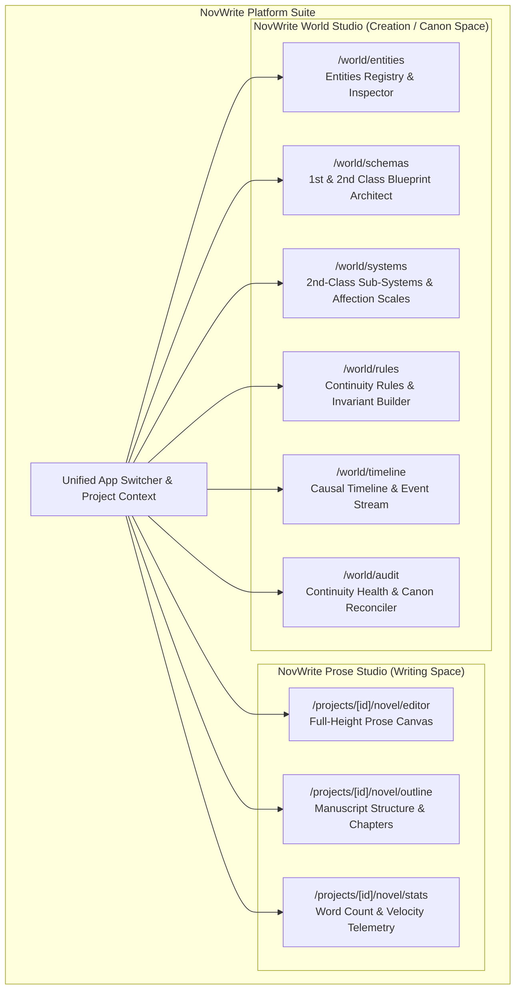
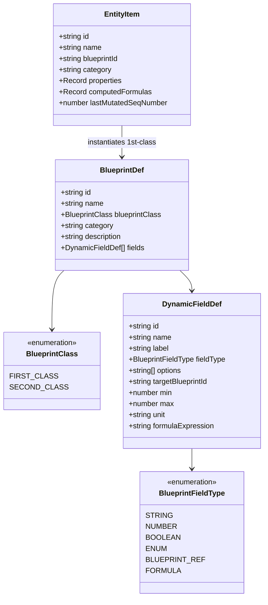

# Frontend Architecture Specification

**Status:** Locked Baseline (Version 2.0 - First & Second Class Blueprints, Dynamic Formulas & Dedicated Page Routes)  
**Web & Desktop Framework:** SvelteKit 2 with Svelte 5 (Runes Mode) & Tauri 2  
**Mobile Framework:** React Native with Expo (SDK 52+, Expo Router)  
**Component Libraries (`shadcn` ecosystem):** `shadcn-svelte` (Web/Desktop) & `React Native Reusables` (`@rn-primitives` on Mobile)  
**Styling Engines:** Tailwind CSS v4 (Web/Desktop) & NativeWind v4 (Mobile)  
**Iconography:** `@lucide/svelte` (Web/Desktop) & `lucide-react-native` (Mobile)  
**Target Platforms (Co-Developed Together):** Web (SvelteKit), Desktop (Tauri 2), Mobile (React Native + Expo)

---

## 1. Architectural Philosophy: Decoupled Standalone Workspaces & Page-Based Routing

### 1.1. Decoupling Writing Space from Creation (World Building) Space

Novel writing and world building require completely different cognitive modes, visual structures, and interaction paradigms:

- **Prose Writing Space (NovWrite Prose Studio):** Requires maximum unobstructed canvas real estate, distraction-free typography, chapter/scene tree navigation, and background non-intrusive continuity verification.
- **World Creation Space (NovWrite World Studio):** Requires dense, information-rich master-detail data tables, dynamic blueprint architects, power tier progression ladders, causal timeline event streams, relationship scales, and mutation audit logs.



### 1.2. Dedicated Page-Based Routing Standard

To ensure maximum focus, deep linking, and zero modal crowding, all primary domains are partitioned into dedicated, full-page routes:

1. **Default List View (`/`)**: High-density table/grid of records with full search, category filtering, and a prominent `[+ Create]` action button.
2. **Dedicated Creation View (`/create`)**: Full-canvas form for blueprint configuration, dynamic field generation, and entity instantiation.
3. **Dedicated Update / Inspector View (`/[id]`)**: Deep-linkable detail workbench for editing properties, evaluating live formulas, inspecting change history, and managing causal sequences.

### 1.3. Strict Anti-Pattern Prohibitions

1. **Zero-Badge UI Policy:** Badges, chips, and pill tags are **strictly prohibited** across the UI (except for raw data tables when explicitly necessary). Semantic status indicators, action buttons, accessible breadcrumbs, and slide-over drawers must be used instead.
2. **No Forced In-Page Tabs for Core Domains:** The application does **NOT** force users to toggle between Prose Writing and World Building via small tabs inside a single screen.
3. **No Jamming Complex Domains into Modals:** Blueprint creation, mathematical formula editing, entity state modification, and rule assertions receive their own dedicated standalone pages.
4. **Communication Bridge Isolation:** Internal messaging and bridge diagnostic layers (`@novwrite/bridge`) are strictly isolated to developer tooling (`/dev/communication-hub`) and never exposed in authoring navigation.

---

## 2. Blueprint System Architecture: First-Class & Second-Class Blueprints

NovWrite provides complete freedom to build custom fictional universes from scratch with a two-tier blueprint classification:



### 2.1. First-Class Blueprints (Primary Entity Archetypes)
- **Definition:** Primary universe entities that exist as distinct actors, objects, or locations within the timeline (e.g. `Character / Cultivator`, `Sacred Weapon & Relic`, `Sanctuary & Realm`, `Sect & Faction`).
- **Capabilities:** Can be instantiated into concrete `EntityItem` instances with unique IDs, causal mutation histories, and event logs.

### 2.2. Second-Class Blueprints (Sub-Blueprints & Value Objects)
- **Definition:** Reusable structured schemas, sub-systems, gauges, and continuous scales (e.g. `Romantic Affection Scale`, `Cultivation Rank & Mastery`, `Power Matrices`, `Soul Constitution Profile`).
- **Capabilities:** Embedded or referenced as fields inside 1st-Class or other 2nd-Class blueprints. Supports nested dot-notation property traversal (e.g. `cultivation.major_realm`).

### 2.3. Dynamic Field Types & Custom Enum Categories
- **`STRING`**: Freeform text input.
- **`NUMBER`**: Numeric values with optional `min`, `max`, `step`, and `unit` (e.g., `Points`, `Rank`, `Atk`).
- **`BOOLEAN`**: Toggle switch.
- **`ENUM`**: User-defined categorical options (e.g., `gender` with custom options `["Male", "Female", "Dual-Yin-Yang", "Genderless / Celestial"]`).
- **`BLUEPRINT_REF`**: Reference to any First-Class or Second-Class Blueprint.
- **`FORMULA`**: Live evaluated mathematical and logical expressions.

---

## 3. Mathematical & Logical Formula Engine (`formulaEngine.ts`)

NovWrite includes a safe, sandboxed, AST-based expression parser and evaluator for computed properties:

### 3.1. Expression Capabilities
- **Arithmetic Operators:** `+`, `-`, `*`, `/`, `%`, `^` (exponentiation).
- **Parentheses Grouping:** Full precedence support `( ... )`.
- **Dot-Notation Variable Resolution:** Accesses nested sub-blueprint fields (e.g. `cultivation.major_realm`, `romantic_feelings.affection_level`).
- **Mathematical Functions:** `CLAMP(val, min, max)`, `MIN(a, b, ...)`, `MAX(a, b, ...)`, `ROUND(val)`, `FLOOR(val)`, `CEIL(val)`, `ABS(val)`, `SQRT(val)`, `POW(base, exp)`.
- **Logical & Conditional Statements:** `IF(condition, trueVal, falseVal)`, `>`, `<`, `>=`, `<=`, `==`, `!=`, `AND`, `OR`, `NOT`.

### 3.2. Real-World Cultivation Formula Example
$$\text{Total Combat Power} = (\text{cultivation.major\_realm} \times \text{cultivation.minor\_realm}) \times \text{special\_Physique} + \text{attack} \times \text{attack\_technique\_Mastery} - \text{defence} \times \text{defence\_technique\_mastery}$$

- **Live Reactive Updates:** Changing component fields (e.g. `attack` or `cultivation.major_realm`) immediately re-evaluates the formula and updates the entity profile in real-time.

---

## 4. Dedicated World Creation Workspaces Breakdown

Every world building domain is implemented as a first-class, standalone workbench:

### 4.1. Universe Entities Workbench (`/world/entities`)
- **List Page (`/world/entities`)**: Table showing archetype identities, custom enum values (`Male`/`Female`), affection bond stages, and live computed combat powers.
- **Create Page (`/world/entities/create`)**: Instantiation form bound to 1st-Class Blueprints with dynamic enum selects, sub-blueprint forms, and live formula cards.
- **Update Page (`/world/entities/[id]`)**: Deep inspector for modifying attributes, inspecting causal sequence numbers, and previewing real-time formula recalculations.

### 4.2. Blueprints & Schemas Workbench (`/world/schemas`)
- **List Page (`/world/schemas`)**: Filter by 1st-Class vs 2nd-Class blueprints, category tags, search, and field breakdown.
- **Create Page (`/world/schemas/create`)**: Blueprint architect with dynamic enum option manager, target reference picker, and mathematical formula editor with token insertion chips.
- **Update Page (`/world/schemas/[id]`)**: Live field editor, formula test sandbox, and enum category modifiers.

### 4.3. 2nd-Class Sub-Systems Workbench (`/world/systems`)
- **List Page (`/world/systems`)**: Dedicated catalog for Progression Ladders, Affection Scales, and Power Matrices.
- **Create Page (`/world/systems/create`)**: Quick configurator for multi-tier ladders or continuous affection gauges.
- **Update Page (`/world/systems/[id]`)**: Inspector for sub-blueprint attributes and mechanics.

---

## 5. Tri-Platform Co-Development Architecture (Web, Desktop, Mobile)

All three frontends are **co-developed together** as unified client applications sharing common design tokens, TypeScript contracts, and API transport protocols:

| Feature / Dimension           | Web Client                      | Desktop Client (Tauri 2)        | Mobile Client (React Native + Expo)           |
| :---------------------------- | :------------------------------ | :------------------------------ | :-------------------------------------------- |
| **Framework**                 | SvelteKit 2 (Svelte 5)          | Tauri 2 (SvelteKit 2)           | React Native (Expo SDK 52+)                   |
| **Styling Engine**            | Tailwind CSS v4                 | Tailwind CSS v4                 | NativeWind v4 (Tailwind for RN)               |
| **`shadcn` Component System** | `shadcn-svelte` (`zinc`)        | `shadcn-svelte` (`zinc`)        | **React Native Reusables** (`@rn-primitives`) |
| **Routing Standard**          | SvelteKit File-Based Routes     | SvelteKit File-Based Routes     | Expo Router File-Based Routes                 |
| **Icons Library**             | `@lucide/svelte`                | `@lucide/svelte`                | `lucide-react-native`                         |
| **Formula Engine**            | `formulaEngine.ts`              | `formulaEngine.ts`              | Shared TypeScript package (`@novwrite/core`)  |
| **Navigation Model**          | Header Breadcrumbs + Sub-Nav    | Native Window Menus + Sub-Nav   | Bottom Action Bar + Native Bottom Sheets      |
| **Zero-Badge Policy**         | Enforced across all views       | Enforced across all views       | Enforced across all views                     |

---

## 6. Svelte 5 Runes State Architecture (`worldStore.svelte.ts`)

State across all workspaces is managed via modular, reactive class instances utilizing Svelte 5 runes (`$state`, `$derived`, `$props`, `$effect`):

```typescript
// Block: BLOCK_WORLD_STORE_RUNE_002
// Description: Reactive state store for 1st/2nd class blueprints, dynamic fields, formulas, and entities.

import { evaluateFormula } from '../engine/formulaEngine.ts';

export class WorldStateStore {
  blueprints = $state<BlueprintDef[]>([...initialBlueprints]);
  entities = $state<EntityItem[]>([...initialEntities]);

  constructor() {
    this.recomputeAllEntityFormulas();
  }

  getFirstClassBlueprints(): BlueprintDef[] {
    return this.blueprints.filter((b) => b.blueprintClass === 'FIRST_CLASS');
  }

  getSecondClassBlueprints(): BlueprintDef[] {
    return this.blueprints.filter((b) => b.blueprintClass === 'SECOND_CLASS');
  }

  evaluateEntityFormulas(entity: EntityItem, bp?: BlueprintDef): Record<string, number> {
    const blueprint = bp || this.getBlueprint(entity.blueprintId);
    if (!blueprint) return {};

    const computed: Record<string, number> = {};
    const context = { ...entity.properties };

    for (const field of blueprint.fields) {
      if (field.fieldType === 'FORMULA' && field.formulaExpression) {
        const evalRes = evaluateFormula(field.formulaExpression, context);
        if (evalRes.success && evalRes.value !== undefined) {
          computed[field.name] = evalRes.value;
          context[field.name] = evalRes.value;
        }
      }
    }
    return computed;
  }
}

export const worldStore = new WorldStateStore();
```
