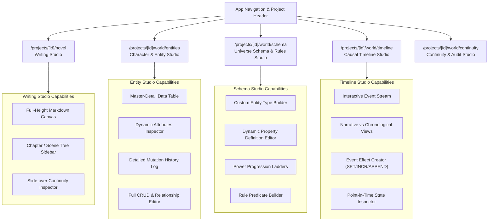

# Frontend Architecture Specification

**Status:** Locked Baseline (Version 1.0)  
**Framework:** SvelteKit 2 with Svelte 5 (Runes Mode)  
**Component Library:** `shadcn-svelte` (`nova` style, `zinc` base) / `Bits UI`  
**Styling:** Tailwind CSS v4 (`@theme inline`)  
**Iconography:** `@lucide/svelte`  
**Target Platforms:** Web, Desktop (Tauri 2), Mobile Web / PWA

---

## 1. Design System & Visual Workbench Identity

### 1.1. Developer Workbench Aesthetic (MongoDB Compass & Linear)

NovWrite is an author's consistency engine and precision workbench—**not a marketing landing page**.

- **Surfaces & Borders:** Clean, high-contrast structural panels with crisp borderlines (`#334155` / `#e2e8f0`), dark graphite/zinc backgrounds (`#080c14` / `#0d1322`) for Dark mode and clean slate surfaces (`#f8fafc` / `#ffffff`) for Light mode.
- **Dual Solid Primary Palette:**
  - **Solid Purple (`#7c3aed` / `purple-600` / `purple-700`):** Workbench hierarchy, active navigation tabs, entity tree nodes, and AI context grounding badges.
  - **Solid Red (`#dc2626` / `red-600` / `red-700`):** Continuity guard status, invariant breach alerts, timeline state mutation triggers, and critical validation warnings.
  - **Zero Marketing Gradients:** Use solid, confident, functional color tokens to preserve readability, contrast, and visual calm during multi-hour writing sessions.

### 1.2. Component Standard (`shadcn-svelte`)

- All UI primitives **must** be sourced from `shadcn-svelte` (`$lib/components/ui/`):
  `button`, `badge`, `card`, `dialog`, `dropdown-menu`, `input`, `label`, `popover`, `scroll-area`, `select`, `separator`, `sheet`, `tabs`, `textarea`, `tooltip`, `table`.
- Custom UI primitives are strictly forbidden unless no applicable `shadcn-svelte` or `bits-ui` primitive exists.

---

## 2. Dedicated Multi-Page Workspaces

Novel writing and world building are distinct authoring workflows. While NovWrite is a fast Single Page App (SvelteKit client-side routing), world building tools are partitioned into **dedicated workspaces** with full-featured tables, relationship graphs, and change history tables—not crammed into transient popups or small modals.



### 2.1. Route Breakdown & Workspaces

1. **Writing Studio (`/projects/[id]/novel`):**
   - **Main Canvas:** Full-height, distraction-free markdown prose editor with real-time word counting and auto-save.
   - **Left Panel:** Collapsible tree navigation for Novels, Chapters, and Scenes.
   - **Right Slide-Over:** Continuity guard drawer showing active scene violations, entity mentions, and AI grounding suggestions.

2. **Character & Entity Studio (`/projects/[id]/world/entities`):**
   - **Master-Detail Table:** Filterable, sortable data table of all characters, items, locations, and factions with custom columns matching dynamic attributes.
   - **Entity Profile Editor:** Dynamic form rendering attributes defined in `PropertyDefinitions` (e.g. Cultivation Stage, Affiliation, Inventory).
   - **Entity Mutation History Table:** Dedicated audit log per entity detailing every historical `EventEffect` (Event Name, Scene, Property Changed, Previous Value, New Value, Timestamp).
   - **Full CRUD & Entity Relations:** Add/Edit/Archive entities and manage directed/bidirectional relationships (Master/Disciple, Ally, Enemy).

3. **Universe Schema & Rules Studio (`/projects/[id]/world/schema`):**
   - **Custom Entity Types:** Create and customize entity categories (Characters, Divine Relics, Sects, Planets, Bloodlines).
   - **Dynamic Property Definitions:** Add typed schema fields (strings, numbers, enums, progression ladders, entity references) with validation constraints.
   - **Rule Builder:** Visual predicate builder for invariant rules (e.g., `"When Entity.status == 'deceased', Entity cannot participate in Battle events"`).

4. **Causal Timeline Studio (`/projects/[id]/world/timeline`):**
   - **Dual Timeline Views:** Switch between narrative order (as read in chapters) and in-universe chronological order.
   - **Event Effect Editor:** Form to record state transitions (e.g., `Elder Li` -> `realm` SET `Core Formation`).
   - **Causal Graph Visualizer:** Visual representation of event dependencies and consequences.

5. **Continuity & Audit Studio (`/projects/[id]/world/continuity`):**
   - **Project Continuity Health Dashboard:** Summary of active violations, severity levels (errors vs warnings), and affected chapters.
   - **Explainable Traceback & Canon Reconciler:** One-click resolution interface with historical event comparison and auto-fix capabilities.

---

## 3. Svelte 5 Runes State Architecture

State is managed via modular reactive classes in `$lib/stores/` using Svelte 5 runes:

```typescript
// Block: BLOCK_STORE_UNIVERSE_001
// Description: Reactive state store for dynamic universe entities, property schemas, and selection state.
// Output: UniverseState reactive class instance

import { untrack } from "svelte";
import type { Entity, EntityType, PropertyDefinition } from "$lib/types";

export class UniverseStore {
  entities = $state<Entity[]>([]);
  entityTypes = $state<EntityType[]>([]);
  propertyDefinitions = $state<PropertyDefinition[]>([]);
  selectedEntityId = $state<string | null>(null);
  isLoading = $state<boolean>(false);
  errorMessage = $state<string | null>(null);

  selectedEntity = $derived(
    this.entities.find((e) => e.id === this.selectedEntityId) ?? null,
  );

  filteredEntities = $derived.by(() => {
    return (typeId: string | null) => {
      if (!typeId) return this.entities;
      return this.entities.filter((e) => e.entityTypeId === typeId);
    };
  });

  async selectEntity(id: string) {
    this.selectedEntityId = id;
  }
}

export const universeStore = new UniverseStore();
```

---

## 4. Mandatory Hand-in-Hand Mobile & Android Parity

Every component and workspace must be engineered for full responsive parity from the first line of code:

### 4.1. Screen & Viewport Constraints

- **Ultra-Narrow / Foldable Outer Screens (280px – 340px):**
  - Text, table cells, and badges must use `truncate` or wrap gracefully.
  - Multi-column tables collapse into responsive cards or horizontally scrollable containers with sticky headers.
  - Touch targets maintain minimum 44x44px hitboxes.
- **Compact Android Phones (360px – 390px):**
  - Navigation switches to bottom action bar and slide-over `Sheet` drawers.
  - Sidebars default to collapsed overlay sheets.
- **Tall Aspect Ratios (20:9, 21:9) & Virtual Keyboards:**
  - Viewports use `100dvh` (dynamic viewport height) to prevent keyboard clipping.
  - Editor toolbars stick above the virtual keyboard without pushing editor content off-screen.

### 4.2. Adaptive Continuum Guarantee

- **Narrow Desktop / Split Window:** Looks and behaves identically to the Mobile client.
- **Mobile on Large Screen (Tablet / DeX):** Seamlessly expands into the full multi-pane workbench.
- **Zero Horizontal Overflow:** Strict layout rule: No unintentional horizontal scrolling on any route.
