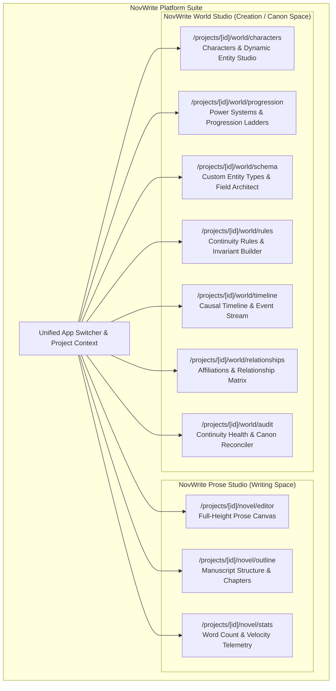
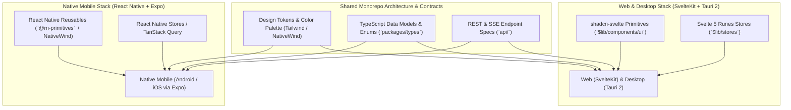
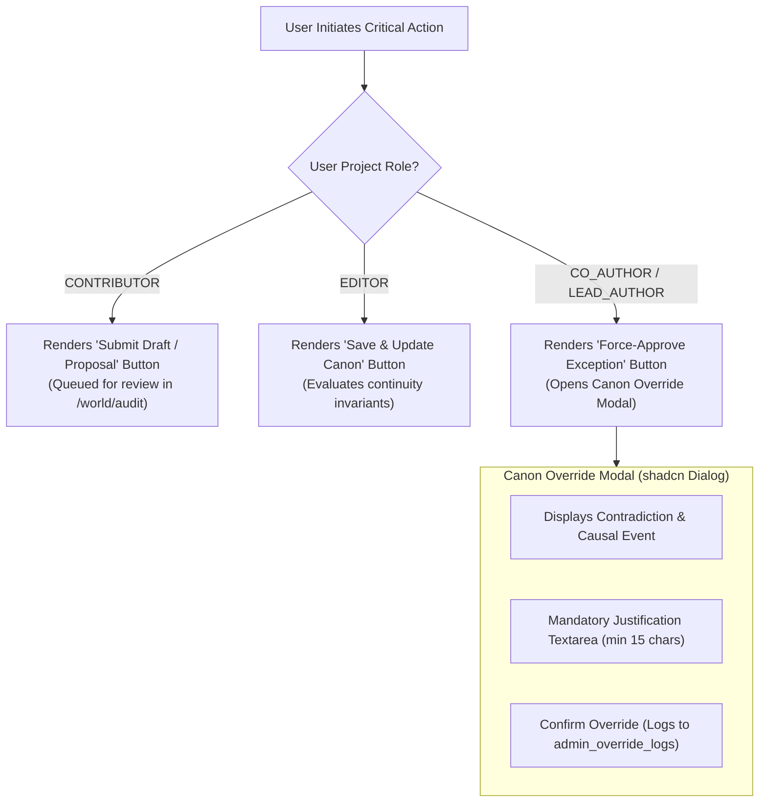

# Frontend Architecture Specification

**Status:** Locked Baseline (Version 1.3 - Decoupled Workspaces & React Native Mobile Parity)  
**Web & Desktop Framework:** SvelteKit 2 with Svelte 5 (Runes Mode) & Tauri 2  
**Mobile Framework:** React Native with Expo (SDK 52+, Expo Router)  
**Component Libraries (`shadcn` ecosystem):** `shadcn-svelte` (Web/Desktop) & `React Native Reusables` (`@rn-primitives` on Mobile)  
**Styling Engines:** Tailwind CSS v4 (Web/Desktop) & NativeWind v4 (Mobile)  
**Iconography:** `@lucide/svelte` (Web/Desktop) & `lucide-react-native` (Mobile)  
**Target Platforms (Co-Developed Together):** Web (SvelteKit), Desktop (Tauri 2), Mobile (React Native + Expo)

---

## 1. Architectural Philosophy: Decoupled Standalone Workspaces

### 1.1. Decoupling Writing Space from Creation (World Building) Space

Novel writing and world building require completely different cognitive modes, visual structures, and interaction paradigms:

- **Prose Writing Space (NovWrite Prose Studio):** Requires maximum unobstructed canvas real estate, distraction-free typography, chapter/scene tree navigation, and background non-intrusive continuity verification.
- **World Creation Space (NovWrite World Studio):** Requires dense, information-rich master-detail data tables, dynamic schema builders, power tier progression trees, causal timeline event streams, relationship graphs, and mutation audit logs.



### 1.2. Strict Anti-Pattern Prohibition: Elimination of Tab-and-Modal Soup

1. **No Forced In-Page Tabs for Core Domains:** The application does **NOT** force users to toggle between Prose Writing and World Building via small tabs inside a single screen.
2. **No Jamming Complex Domains into Modals or Nested Tabs:**
   - Features like Character Creation, Power Progression Ladders, Techniques, Custom Schema Fields, and Rule Assertions **MUST NEVER** be crammed into pop-up modals or nested tab carousels on a single page.
   - Every creation domain receives its own **dedicated standalone page / workbench** equipped with full-viewport data grids, filter bars, master-detail inspectors, and historical change tables.

---

## 2. Dedicated World Creation Workspaces Breakdown

Every world building domain is implemented as a first-class, standalone workbench:

### 2.1. Characters & Entity Studio (`/projects/[id]/world/characters`)

- **Master-Detail Data Grid:** High-density, sortable table displaying all entities (Characters, Beasts, Spirits, Artifacts) with dynamic property columns, status badges (Active, Deceased, Sealed), and type pills.
- **Dedicated Entity Profile Inspector:** Full-height inspector panel rendering custom attributes defined in `PropertyDefinitions` (e.g. Cultivation Realm, Bloodline, Affiliations, Inventory).
- **Dedicated Change History Table (Per-Entity Audit Log):**
  - Displays every historical `EventEffect` mutating the entity over the entire novel sequence.
  - Columns: `Sequence #`, `Event Name`, `Anchor Scene`, `Property Mutated`, `Previous Value`, `New Value`, `Author / Source`, `Timestamp`.
- **Full CRUD & Batch Actions:** Create, edit, clone, archive, and bulk-tag entities.

### 2.2. Power Systems & Progression Studio (`/projects/[id]/world/progression`)

- **Visual Progression Ladder Builder:** Dedicated workbench to define cultivation realms, magic circles, martial tiers, or sci-fi tech levels (e.g., _Qi Condensation $\to$ Foundation Establishment $\to$ Core Formation $\to$ Nascent Soul_).
- **Techniques & Abilities Vault:** Dedicated registry for spells, sword forms, domain skills, and martial arts with mastery requirements, power costs, and character assignments.
- **Breakthrough Rules & Bottlenecks:** Define prerequisites and invariant constraints required for an entity to advance to the next tier.

### 2.3. Universe Schema & Field Architect Studio (`/projects/[id]/world/schema`)

- **Custom Entity Type Architect:** Define new categories of entities beyond standard characters (e.g., _Sects, Divine Treasures, Secret Realms, Star Systems, Bloodlines_).
- **Dynamic Property Definitions:** Add typed schema fields with validation rules:
  - Data types: `String`, `Number`, `Enum (Dropdown list)`, `Boolean`, `Range (Min/Max)`, `Entity Reference`, `Progression Ladder Link`.
  - Required flags, default values, and description tooltips.

### 2.4. Continuity Rules & Invariant Builder (`/projects/[id]/world/rules`)

- **Rule Predicate Builder:** Visual logic builder to construct invariant assertions (e.g., `IF entity.status == 'deceased' THEN entity cannot possess active weapons`).
- **Rule Severity & Scope:** Configure rules as `Blocking Error`, `Warning`, or `Advisory Note`.
- **Target Entity Type Scoping:** Bind rules to specific entity classes or global universe state.

### 2.5. Causal Timeline & Historical Event Studio (`/projects/[id]/world/timeline`)

- **Interactive Dual-Mode Timeline:** Switch seamlessly between:
  1. _Narrative Sequence:_ Order events appear in the authored chapters/scenes.
  2. _In-Universe Chronological Sequence:_ True chronological order of historical events.
- **Event Effect Mutation Editor:** Form to record precise atomic state changes (`SET`, `INCREMENT`, `APPEND`, `REMOVE`, `TRANSFER`).
- **Causal Dependency Graph:** Visual node graph linking predecessor events to downstream consequences.
- **Point-in-Time Universe State Snapshot:** Inspect the exact folded state of any character or faction at that specific moment in timeline history.

### 2.6. Relationships & Affiliations Matrix (`/projects/[id]/world/relationships`)

- **Matrix & Graph Views:** Interactive 2D relationship matrix and node-link network visualizer.
- **Directional & Bidirectional Semantics:** Support for directed edges (_Master $\to$ Disciple_, _Liege $\to$ Vassal_) and symmetric edges (_Spouse $\leftrightarrow$ Spouse_, _Nemesis $\leftrightarrow$ Nemesis_).

### 2.7. Continuity Health & Canon Reconciler Studio (`/projects/[id]/world/audit`)

- **Universe Integrity Dashboard:** Real-time breakdown of all unresolved continuity violations across the novel.
- **Explainable Traceback Inspector:** Side-by-side comparison of contradictory scene prose vs canonical historical event records.
- **One-Click Reconciler:** Execute remediation actions (_Accept New Canon_, _Insert Missing Breakthrough Event_, _Revert Prose Claim_).

---

## 3. Dedicated Prose Writing Studio Breakdown (`/projects/[id]/novel`)

- **Full-Height Prose Canvas:** Clean, typography-optimized markdown canvas with distraction-free focus mode, custom line height, and typewriter scrolling.
- **Manuscript Navigator Sidebar:** Fast reordering of volumes, acts, chapters, and scenes with word count indicators and status tags (Draft, In-Review, Canon).
- **Contextual Slide-Over Reference Drawer (Non-Intrusive):**
  - Slide-out quick lookup sheet allowing authors to search character profiles, cultivation stages, and item locations without leaving the writing canvas.
- **Live Continuity Status Pill:** Minimalist status badge in the editor header (Emerald: Clean Canon, Solid Red: Invariant Alert) with click-to-view explainable details.

---

## 4. Tri-Platform Co-Development Architecture (Web, Desktop, Mobile)

All three frontends are **co-developed together** as unified client applications sharing common design tokens, TypeScript contracts, and API transport protocols:



### 4.1. React Native Ecosystem & `shadcn/ui` Equivalent for Mobile

For native mobile client development, NovWrite adopts the modern React Native + Expo ecosystem:

- **Framework & Routing**: [React Native](https://reactnative.dev/) with [Expo](https://expo.dev/) (SDK 52+) and [Expo Router](https://docs.expo.dev/router/introduction/) (typed file-based routing mirroring the web workspace structure).
- **Styling Engine**: [NativeWind v4](https://www.nativewind.dev/) (Tailwind CSS engine compiling Tailwind utility classes to native style sheets).
- **Component Primitives (`shadcn/ui` Equivalent for React Native)**:
  - **Library**: [React Native Reusables](https://reactnativereusables.com/) (`@rn-primitives`)
  - **Architecture**: A direct port of `shadcn/ui` principles to React Native. Accessible, unstyled primitives (`@rn-primitives/dialog`, `@rn-primitives/dropdown-menu`, `@rn-primitives/popover`, `@rn-primitives/tabs`, `@rn-primitives/tooltip`) styled with `NativeWind` that you copy-paste directly into the project.
  - **Parity**: Delivers identical visual styling, interaction patterns, and token usage as `shadcn-svelte` on Web and Desktop.
- **Icons**: `lucide-react-native` (exact visual counterpart to `@lucide/svelte`).

### 4.2. Platform Parity Matrix

| Feature / Dimension           | Web Client                      | Desktop Client (Tauri 2)        | Mobile Client (React Native + Expo)           |
| :---------------------------- | :------------------------------ | :------------------------------ | :-------------------------------------------- |
| **Framework**                 | SvelteKit 2 (Svelte 5)          | Tauri 2 (SvelteKit 2)           | React Native (Expo SDK 52+)                   |
| **Styling Engine**            | Tailwind CSS v4                 | Tailwind CSS v4                 | NativeWind v4 (Tailwind for RN)               |
| **`shadcn` Component System** | `shadcn-svelte` (`nova`/`zinc`) | `shadcn-svelte` (`nova`/`zinc`) | **React Native Reusables** (`@rn-primitives`) |
| **Routing Standard**          | SvelteKit File-Based Routes     | SvelteKit File-Based Routes     | Expo Router File-Based Routes                 |
| **Icons Library**             | `@lucide/svelte`                | `@lucide/svelte`                | `lucide-react-native`                         |
| **Theme System**              | Dark / Light Mode               | Dark / Light Mode + OS Sync     | Dark / Light Mode + OS Sync                   |
| **Navigation Model**          | Sidebars & Header Breadcrumbs   | Native Window Menus + Sidebars  | Bottom Action Bar + Native Bottom Sheets      |
| **Creation Workspaces**       | Full Master-Detail Data Grids   | Full Master-Detail Data Grids   | Responsive Card Grids + Drilldown Screens     |
| **Prose Editor**              | Full-height canvas + Shortucts  | Full-height canvas + Shortcuts  | Full-height canvas + Keyboard Accessory Bar   |
| **Continuity Verification**   | Real-time SSE Alerts            | Real-time SSE Alerts            | Real-time SSE / Push Alerts                   |

---

## 5. Svelte 5 Runes State Architecture

State across all workspaces is managed via modular, reactive class instances utilizing Svelte 5 runes (`$state`, `$derived`, `$props`, `$effect`):

```typescript
// Block: BLOCK_STORE_UNIVERSE_001
// Description: Reactive state store for dynamic universe entities, property schemas, and selection state.
// Output: UniverseStore reactive class instance

import { untrack } from "svelte";
import type {
  Entity,
  EntityType,
  PropertyDefinition,
  EventEffect,
} from "$lib/types";

export class UniverseStore {
  entities = $state<Entity[]>([]);
  entityTypes = $state<EntityType[]>([]);
  propertyDefinitions = $state<PropertyDefinition[]>([]);
  selectedEntityId = $state<string | null>(null);
  entityHistory = $state<Record<string, EventEffect[]>>({});
  isLoading = $state<boolean>(false);
  errorMessage = $state<string | null>(null);

  selectedEntity = $derived(
    this.entities.find((e) => e.id === this.selectedEntityId) ?? null,
  );

  selectedEntityHistory = $derived(
    this.selectedEntityId
      ? (this.entityHistory[this.selectedEntityId] ?? [])
      : [],
  );

  filteredEntities = $derived.by(() => {
    return (typeId: string | null, search: string) => {
      let result = this.entities;
      if (typeId) {
        result = result.filter((e) => e.entityTypeId === typeId);
      }
      if (search.trim()) {
        const query = search.toLowerCase();
        result = result.filter(
          (e) =>
            e.name.toLowerCase().includes(query) ||
            e.aliases.some((a) => a.toLowerCase().includes(query)),
        );
      }
      return result;
    };
  });

  async selectEntity(id: string) {
    this.selectedEntityId = id;
    if (!this.entityHistory[id]) {
      await this.fetchEntityHistory(id);
    }
  }

  async fetchEntityHistory(entityId: string) {
    try {
      this.isLoading = true;
      const res = await fetch(`/api/v1/entities/${entityId}/history`);
      if (!res.ok) throw new Error("Failed to load entity history");
      const data = await res.json();
      this.entityHistory[entityId] = data;
    } catch (err: any) {
      this.errorMessage = `BLOCK_STORE_UNIVERSE_001: ${err.message}`;
    } finally {
      this.isLoading = false;
    }
  }
}

export const universeStore = new UniverseStore();
```

---

## 6. UI & Styling Specifications (MongoDB Compass / Linear Workbench)

- **Borderlines & Separators:** High-contrast, sharp borderlines (`border-zinc-800` / `#27272a` in Dark mode; `border-zinc-200` / `#e4e4e7` in Light mode).
- **Solid Dual Primary Palette:**
  - **Solid Purple (`#7c3aed` / `purple-600`):** Workbench structure, tree nodes, active selection states, AI grounding indicators.
  - **Solid Red (`#dc2626` / `red-600`):** Continuity guard warnings, invariant breaches, timeline mutation badges.
  - **Zero Marketing Gradients:** Strictly solid, clean colors conveying precision and focus.
- **Component Primitives Standard:** Strictly utilize official `shadcn-svelte` primitives (`$lib/components/ui/`) for all dialogs, buttons, dropdowns, inputs, sheets, tabs, tooltips, tables, and badges.

---

## 7. Hand-in-Hand Responsiveness & Android Parity Standards

Every single page, data grid, and editor view must pass the following responsive guarantees:

1. **Ultra-Narrow Viewport Support (280px – 340px):**
   - Verified on foldable outer screens (e.g. Samsung Galaxy Fold cover screen).
   - Zero horizontal overflow (`overflow-x-clip`, `truncate`, auto-wrapping toolbars).
   - Touch hitboxes guaranteed $\ge 44 \times 44\text{px}$.
2. **Compact Android Phones (360px – 390px):**
   - Tables smoothly transition into responsive data cards with sticky header actions.
   - Sidebars transition into touch-friendly slide-over `Sheet` drawers.
3. **Dynamic Viewport Heights (`100dvh`):**
   - Handles virtual keyboard opening/closing on Android devices without displacing prose or dialog actions.
4. **Adaptive Continuum:**
   - A narrow desktop window looks and behaves like the mobile client.
   - A mobile client opened on a tablet, foldable inner screen, or external monitor expands into the full multi-pane workbench layout.

---

## 8. Multi-User Collaboration UI & Author Override Gatekeepers

### 8.1. Multi-User Presence & Scene Lock Banner

1. **Active Co-Author Avatar Stack:** The studio header displays live avatar chips of all collaborators currently active in the project workspace (synced over SSE).
2. **Locked Scene Overlay & Banner:** When an author opens a scene locked by another writer, the prose canvas transitions to synchronized read-only mode with a high-contrast top banner:
   - _Message:_ `"Locked: Co-author @Elena is actively editing this scene (Lease expires in 42s)."`
   - _Author Action:_ A `Break Lock` button is conditionally rendered only for users with `CO_AUTHOR` or `LEAD_AUTHOR` roles, opening an audit justification prompt.

### 8.2. Role-Based Action Gatekeepers & Canon Override Modal



- **Author Attribution Chips:** Every scene version, entity property change, and timeline event displays an author badge (`Created by @username · 2h ago`) linking to the user profile and change audit table.

---

## 9. Platform Administration Portal (System & Support Operations)

A dedicated, isolated operational portal (`/platform-admin`) accessible only to users with `is_platform_admin == true`:

- **User Lookup & Account Management:** Comprehensive search by email, username, or Stripe customer ID with account status controls (active, suspended, MFA reset pending).
- **MFA Reset & Security Assist Desk:** Secure workflow to clear lost 2FA authenticators upon identity verification, requiring mandatory support ticket reference.
- **Payment & Refund Console:** View subscription billing history, issue partial/full Stripe refunds, and manage tier entitlements.
- **Snapshot Diagnostics & Repair Utility:** Trigger background re-indexing and snapshot repairs for user-submitted corrupted universes.

---

## 10. UI/UX Quality Standards, Visual Noise Constraints & AI Anti-Pattern Prevention

To ensure a cohesive, professional IDE experience inspired by **Linear** and **MongoDB Compass**, all frontend components must strictly adhere to visual noise constraints and avoid common AI-generated design failures.

### 10.1. Visual Styling & Component Standards

1. **Avoid Excessive Gradients & Visual Shimmer:**
   - The application is a serious authoring workbench, not a consumer marketing site.
   - Use solid, grounded surfaces (`zinc-900`, `zinc-950`, `slate-900`) with clean 1px borders (`border-zinc-800`, `border-slate-200`).
   - Multi-color rainbow gradients, glossy glassmorphism, and neon glow borders are strictly prohibited.
2. **Strict Badge Discipline:**
   - **Permitted Usage:** Badges are reserved primarily for **Data Tables** (e.g. status columns `ALIVE`, `DEAD`, `DRAFT`, `PUBLISHED`, entity category pills) and compact header status pills (e.g. `[● Canon Verified]`).
   - **Prohibited Usage:** Do NOT scatter badges across regular body text, form field labels, breadcrumbs, or random card headers. Use subtle typography (`text-muted-foreground font-mono text-xs`) instead.
3. **Mandatory `Select` Component from `shadcn-svelte`:**
   - For all dropdown menus, enum pickers, and category selectors, always use the official `Select` primitive from `shadcn-svelte` (`$lib/components/ui/select`) or `@rn-primitives` on mobile.
   - Native unstyled `<select>` elements and DIY div-based click dropdowns are strictly prohibited.

### 10.2. AI UI/UX Anti-Pattern Checklist

All developers and AI agents must audit frontend work against the following anti-patterns before submitting changes:

- **No Card Sprawl:** Do not wrap every small input or label in a separate bordered `<Card>`. Organize data into dense master-detail tables or structured forms.
- **No Modal Inside Modal:** Never open dialogs from other dialogs. Use slide-over sheets (`Sheet`) or dedicated `/world/*` routes.
- **Complete Empty & Loading States:** Every table and list view must include designed empty states (with an icon, headline, and primary action button) and skeleton loaders (`Skeleton`).
- **Keyboard Navigation & Accessibility:** All interactive elements must support `Tab` navigation, `Esc` closing for overlays, and meet WCAG AA 4.5:1 text contrast ratios.
