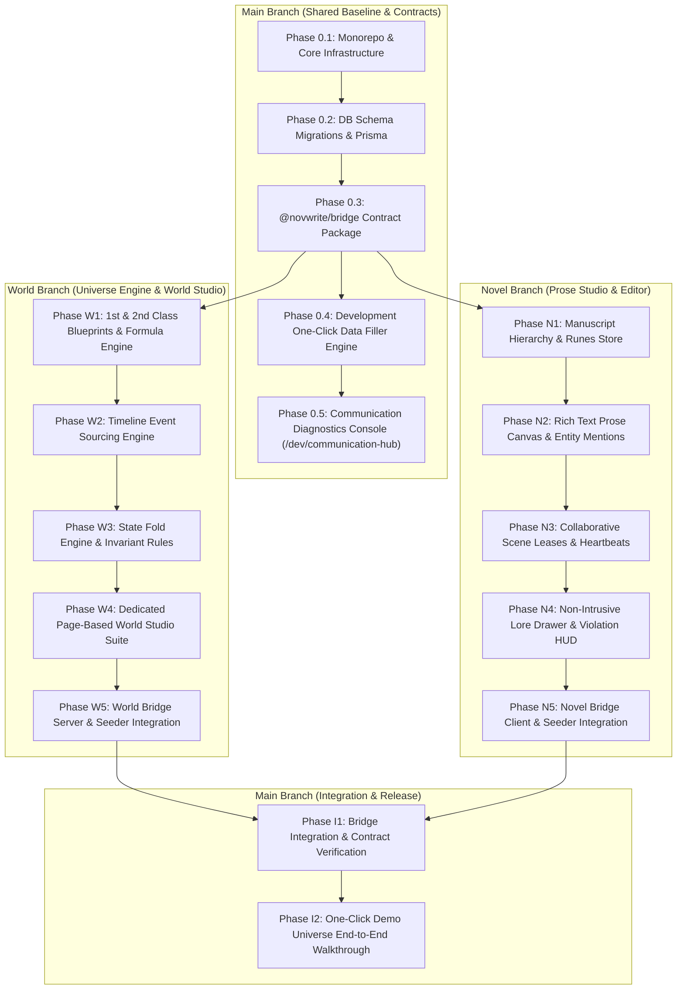

# NovWrite MVP Phased Implementation Plan

## 1. Executive Charter & MVP Scope Boundaries

The goal of the **NovWrite MVP** is to deliver a functional, end-to-end, multi-user novel writing platform powered by the **Canon Over AI Memory** deterministic universe state engine. Development is strictly bifurcated across two isolated git branches (`world` and `novel`) coordinated through the `@novwrite/bridge` communication layer.

---

## 2. Strict MVP Scope: In-Scope vs YAGNI Prohibitions

To ensure velocity, code quality, and maintainability, strict boundaries are enforced. Features marked **Out of Scope** MUST NOT be implemented in MVP.

| Domain              | In Scope for MVP                                                                                                       | Out of Scope (YAGNI / Post-MVP)                                                             |
| :------------------ | :--------------------------------------------------------------------------------------------------------------------- | :------------------------------------------------------------------------------------------ |
| **World Engine**    | 1st & 2nd class blueprints, dynamic enums, formula evaluator, event sourcing delta logs, state fold engine, invariants | Complex external rule DSL compilers, multi-branch alternate timeline mergers, 3D world maps |
| **World Studio UI** | Dedicated page routes (`/`, `/create`, `/[id]`) for Entities, Blueprints, Systems; Zero-Badge modern design           | Drag-and-drop node physics graphs, visual particle trees, character avatar image generators |
| **Novel Engine**    | Projects, Volumes, Chapters, Scenes, TipTap/Lexical markdown canvas, `@entity` mention extraction                      | CRDT collaborative simultaneous character-by-character typing (OT/Yjs)                      |
| **Collaboration**   | Role hierarchy (`LEAD_AUTHOR`, `CO_AUTHOR`, `EDITOR`, etc.), Redis 60s scene lease locks, lock break override          | Live audio chat, peer-to-peer WebRTC video rooms, fine-grained paragraph-level locking      |
| **Platform Admin**  | User MFA reset endpoint, account unlock, simulated Stripe refund action, audit log table                               | Automated fraud detection ML pipelines, multi-currency conversion engines                   |
| **Cross-Domain**    | `@novwrite/bridge` typed RPC/SSE contracts, `/dev/communication-hub` diagnostic inspector                              | GraphQL federation gateways, distributed mesh proxies                                       |
| **Developer DX**    | **One-Click Dev Test Data Seeder (`POST /api/v1/dev/seed` + UI button)**                                               | Complex third-party mocking SaaS platforms                                                  |

---

## 3. Development-Only One-Click Test Data Filler

To eliminate tedious manual data entry during testing, a dedicated **Development-Only Test Data Seeder** (`BLOCK_DEV_SEEDER_001`) is integrated into both frontend and backend.

### 3.1. One-Click Seeder Capabilities

- **Single UI Trigger:** A persistent development banner in non-production builds (`[⚡ Seed Demo Universe]`, `[🧹 Reset DB]`).
- **CLI Command:** `pnpm seed:dev` (runs `cmd/seeder` in Go backend or Node script).
- **Endpoint:** `POST /api/v1/dev/seed` (disabled when `NODE_ENV=production` or `APP_ENV=production`).

### 3.2. Demo Dataset ("Chronicles of Aethelgard")

The seeder provisions a rich, interconnected universe showcasing First-Class and Second-Class Blueprints with live calculated combat powers:

1. **Second-Class Blueprints:**
   - `Romantic Affection Scale` (fields: `relationship_stage` [Enum: Stranger, Acquaintance, Friend, Confidant, Romantic Interest, Soulmate], `affection_level` [Number: -100 to 1000], `trust_score` [Number: 0-100], `bond_buff_multiplier` [Formula: `1 + (affection_level / 1000) * 0.5`]).
   - `Cultivation Rank & Mastery` (fields: `realm_name` [Enum], `major_realm` [Number: 1-9], `minor_realm` [Number: 1-9], `cultivation_method` [String]).
2. **First-Class Blueprints:**
   - `Cultivator / Protagonist` (fields: `gender` [Enum: Male, Female, Dual-Yin-Yang, Celestial], `cultivation` [Ref to Cultivation Rank], `romantic_feelings` [Ref to Romantic Affection], `special_Physique` [Number: 2.0], `attack` [Number: 1200], `attack_technique_Mastery` [Number: 1.8], `defence` [Number: 800], `defence_technique_mastery` [Number: 1.2], `total_combat_power` [Formula: `(cultivation.major_realm * cultivation.minor_realm) * special_Physique + attack * attack_technique_Mastery - defence * defence_technique_mastery`]).
   - `Sacred Weapon & Relic` (fields: `weapon_type` [Enum: Sword, Saber, Spear], `grade` [Enum], `base_damage` [Number], `soul_sync_ratio` [Number], `effective_artifact_power` [Formula: `base_damage * (1 + soul_sync_ratio * 0.75)`]).
3. **Entities:**
   - _Eldrin the Spellblade_ (`Cultivator / Protagonist` - Male, Foundation Realm, Affection: 450 pts, Total Combat Power: 1,220).
   - _Lyra of the Astral Veil_ (`Cultivator / Protagonist` - Female, Core Formation, Affection: 820 pts Soulmate, Total Combat Power: 2,122.5).
   - _Dawnbreaker Blade of Aethelgard_ (`Sacred Weapon & Relic` - Divine Grade, Effective Power: 4,020).
4. **Historical Event Stream (5 Events):**
   - Event 1 (Seq #10): _Awakening at the Citadel_
   - Event 2 (Seq #50): _Duel at Crimson Ridge_
   - Event 3 (Seq #150): _Fall of Malakor_
5. **Manuscript Prose Hierarchy:**
   - 1 Volume (_Book 1: The Astral Awakening_).
   - 2 Chapters (_Chapter 1: Whispers of the Void_, _Chapter 2: The Duel_).
   - 3 Scenes (Grounding test scene, contradiction alert test scene, lease lock test scene).
