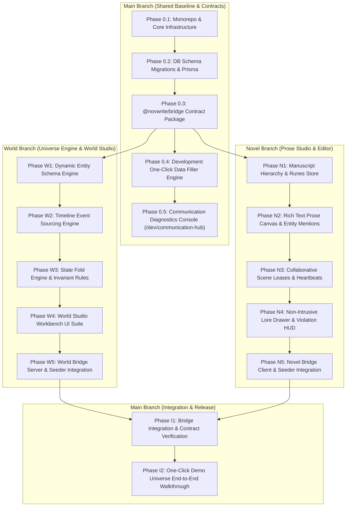
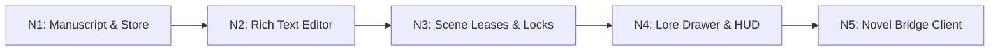

# NovWrite MVP Phased Implementation Plan

## 1. Executive Charter & MVP Scope Boundaries

The goal of the **NovWrite MVP** is to deliver a functional, end-to-end, multi-user novel writing platform powered by the **Canon Over AI Memory** deterministic universe state engine. Development is strictly bifurcated across two isolated git branches (`world` and `novel`) coordinated through the `@novwrite/bridge` communication layer.

---

## 2. Strict MVP Scope: In-Scope vs YAGNI Prohibitions

To ensure velocity, code quality, and maintainability, strict boundaries are enforced. Features marked **Out of Scope** MUST NOT be implemented in MVP.

| Domain              | In Scope for MVP                                                                                                       | Out of Scope (YAGNI / Post-MVP)                                                             |
| :------------------ | :--------------------------------------------------------------------------------------------------------------------- | :------------------------------------------------------------------------------------------ |
| **World Engine**    | Dynamic JSONB properties, event sourcing delta logs, 4-step state fold engine, numeric min/max & state invariant rules | Complex rule DSL compilers, multi-branch alternate timeline mergers, 3D world maps          |
| **World Studio UI** | Standalone master-detail workbenches for Characters, Schemas, Rules, Timeline, and Violation Audit                     | Drag-and-drop node physics graphs, visual particle trees, character avatar image generators |
| **Novel Engine**    | Projects, Volumes, Chapters, Scenes, TipTap/Lexical markdown canvas, `@entity` mention extraction                      | CRDT collaborative simultaneous character-by-character typing (OT/Yjs)                      |
| **Collaboration**   | Role hierarchy (`LEAD_AUTHOR`, `CO_AUTHOR`, `EDITOR`, etc.), Redis 60s scene lease locks, lock break override          | Live audio chat, peer-to-peer WebRTC video rooms, fine-grained paragraph-level locking      |
| **Platform Admin**  | User MFA reset endpoint, account unlock, simulated Stripe refund action, audit log table                               | Automated fraud detection ML pipelines, multi-currency conversion engines                   |
| **Cross-Domain**    | `@novwrite/bridge` typed RPC/SSE contracts, `/dev/communication-hub` single-page inspector                             | GraphQL federation gateways, distributed mesh proxies                                       |
| **Developer DX**    | **One-Click Dev Test Data Seeder (`POST /api/v1/dev/seed` + UI button)**                                               | Complex third-party mocking SaaS platforms                                                  |

---

## 3. Development-Only One-Click Test Data Filler

To eliminate tedious manual data entry during testing, a dedicated **Development-Only Test Data Seeder** (`BLOCK_DEV_SEEDER_001`) is integrated into both frontend and backend.

### 3.1. One-Click Seeder Capabilities

- **Single UI Trigger:** A persistent development banner in non-production builds (`[⚡ Seed Demo Universe]`, `[🧹 Reset DB]`).
- **CLI Command:** `pnpm seed:dev` (runs `cmd/seeder` in Go backend or Node script).
- **Endpoint:** `POST /api/v1/dev/seed` (disabled when `NODE_ENV=production` or `APP_ENV=production`).

### 3.2. Demo Dataset ("Chronicles of Aethelgard")

The seeder instantly provisions a rich, interconnected fictional universe with pre-calculated states and intentional test violations:

1. **Universe Schema:**
   - Entity Type: `CHARACTER` (properties: `mana_capacity` [int], `cultivation_realm` [enum: Mortal, Qi Condensation, Foundation, Core Formation], `status` [enum: ALIVE, DEAD, EXILED], `faction` [string]).
   - Entity Type: `LOCATION` (properties: `spiritual_density` [float], `controlled_by` [string]).
   - Entity Type: `ARTIFACT` (properties: `grade` [string], `durability` [int]).
2. **Entities:**
   - _Eldrin the Spellblade_ (`CHARACTER` - Initial Mana: 500, Foundation Realm, ALIVE).
   - _Lyra of the Astral Veil_ (`CHARACTER` - Initial Mana: 800, Core Formation, ALIVE).
   - _Lord Malakor_ (`CHARACTER` - Initial Mana: 1200, Core Formation, DEAD at Seq #150).
   - _The Sunken Citadel_ (`LOCATION` - Spiritual Density: 9.5).
3. **Invariant Rules:**
   - Rule 1: `mana_capacity >= 0` (Numeric Minimum Invariant).
   - Rule 2: If `status == 'DEAD'`, entity cannot execute `CAST_SPELL` effects (State Invariant).
4. **Historical Event Stream (5 Events):**
   - Event 1 (Seq #10): _Awakening at the Citadel_ (Eldrin gains 500 Mana).
   - Event 2 (Seq #50): _Duel at Crimson Ridge_ (Eldrin spends 200 Mana -> 300 remaining).
   - Event 3 (Seq #150): _Fall of Malakor_ (Malakor status changed to `DEAD`).
5. **Manuscript Prose Hierarchy:**
   - 1 Volume (_Book 1: The Astral Awakening_).
   - 2 Chapters (_Chapter 1: Whispers of the Void_, _Chapter 2: The Duel_).
   - 3 Scenes:
     - **Scene 1 (Seq #50):** Valid scene depicting the duel. Mentions `@Eldrin` (Mana: 300).
     - **Scene 2 (Seq #160):** **Contradiction Test Scene**! Text claims Malakor (DEAD) casts a spell consuming 500 mana from Eldrin (violating Rule 1 and Rule 2) -> Used to test real-time HUD warning and Diagnostic Console.
     - **Scene 3 (Seq #170):** **Lease Test Scene**! Pre-locked by `CO_AUTHOR` ("Lyra") -> Used to test lease banner and lock-breaking modal.

---

## 4. Phase-by-Phase Implementation Plan

### Phase 0: Shared Baseline & Contracts (`main` branch)

#### Phase 0.1: Monorepo Workspace & Core Tooling

- **Block ID:** `BLOCK_CORE_INFRA_INIT_001`
- **Objective:** Configure `pnpm-workspace.yaml`, Go 1.23+ modules (`apps/api`), TypeScript Prisma workspace (`apps/data-service`), SvelteKit Web (`apps/web`), and shared bridge package (`packages/bridge`).
- **Deliverables:** Working `pnpm build`, `pnpm lint`, and Docker Compose for PostgreSQL 18 + Redis 7.

#### Phase 0.2: Database Schema & Prisma Migrations

- **Block ID:** `BLOCK_DB_SCHEMA_MIGRATE_001`
- **Objective:** Apply PostgreSQL schema from [`docs/DATABASE_ARCHITECTURE.md`](file:///home/yogesh/Projects/NovWrite/docs/DATABASE_ARCHITECTURE.md) (users, projects, project_members, entity_definitions, dynamic_properties, timeline_events, invariant_rules, manuscripts, chapters, scenes, scene_leases, platform_admin_audit_logs).
- **Validation:** Prisma client generated, clean migration run.

#### Phase 0.3: Shared Contract Package (`@novwrite/bridge`)

- **Block ID:** `BLOCK_COMM_BRIDGE_CONTRACT_001`
- **Objective:** Implement TypeScript Zod schemas and Go Protobuf/JSON struct definitions for `SceneGroundingRequest`, `ContinuityAuditRequest`, `EntityMentionQuery`, and `CanonStateChangedEvent`.
- **Deliverables:** Exported `@novwrite/bridge` package with built-in Mock Bridge Provider for isolated branch testing.

#### Phase 0.4: Development One-Click Test Data Seeder

- **Block ID:** `BLOCK_DEV_SEEDER_ENGINE_001`
- **Objective:** Implement `POST /api/v1/dev/seed` and `POST /api/v1/dev/reset` with the "Chronicles of Aethelgard" test dataset.
- **Validation:** Running `pnpm seed:dev` populates DB in < 500ms; verify querying Eldrin returns Foundation Realm.

#### Phase 0.5: Communication Diagnostics Hub (`/dev/communication-hub`)

- **Block ID:** `BLOCK_DEV_DIAGNOSTICS_HUB_001`
- **Objective:** Build single-page web console inspecting all RPC/SSE traffic, schema contract mismatches, payload replay debugger, and RFC 7807 problem normalizer.

---

### Phase W: World Front (`world` branch)

#### Phase W1: Dynamic Entity Schema & Property Engine

- **Block ID:** `BLOCK_WORLD_DYNAMIC_SCHEMA_001`
- **Objective:** Implement CRUD and validation for user-defined entity types and dynamic JSONB property schemas (`NUMBER`, `STRING`, `BOOLEAN`, `ENUM_SINGLE`, `ENUM_MULTI`).
- **Testing:** Unit tests verifying schema type coercion and constraint validation.

#### Phase W2: Causal Timeline & Event Sourcing Engine

- **Block ID:** `BLOCK_WORLD_TIMELINE_ENGINE_001`
- **Objective:** Implement atomic event logging with `EventEffect` payloads. Support dual sequence indexing: `chronological_order` vs `narrative_sequence_number`.
- **Testing:** Unit test creating 5 chained events and asserting causal order.

#### Phase W3: Deterministic State Fold Engine & Invariant Rules

- **Block ID:** `BLOCK_WORLD_STATE_FOLD_001`
- **Objective:** Implement the 4-step state fold algorithm: Checkpoint retrieval -> Event replay -> Invariant rule evaluation (`NUMERIC_MIN_MAX`, `STATE_TRANSITION`) -> RFC 7807 violation generation.
- **Testing:** Unit test proving intentional violation on Malakor (DEAD entity casting spell) returns structured violation payload.

#### Phase W4: World Studio Workbench UI Suite

- **Block ID:** `BLOCK_WORLD_UI_WORKBENCH_001`
- **Objective:** Build standalone workbench views with `shadcn-svelte`:
  - `/world/characters`: Master-detail entity table with live property editor.
  - `/world/timeline`: Dual-mode timeline with event editor drawer.
  - `/world/rules`: Invariant rule predicate builder.
  - `/world/audit`: Canon violation dashboard with Lead Author override button.

#### Phase W5: World Bridge Server & Seeder Integration

- **Block ID:** `BLOCK_WORLD_BRIDGE_SERVER_001`
- **Objective:** Bind World Engine services to `@novwrite/bridge` RPC handlers. Add one-click seeder button in World Studio navbar.

---

### Phase N: Novel Front (`novel` branch)

#### Phase N1: Manuscript Hierarchy & Svelte 5 Runes State Store

- **Block ID:** `BLOCK_NOVEL_MANUSCRIPT_STORE_001`
- **Objective:** Implement project tree store (Volumes -> Chapters -> Scenes) using Svelte 5 Runes (`$state`, `$derived`, `$effect`).
- **Testing:** Unit tests verifying tree reordering and active scene selection.

#### Phase N2: Rich Text Prose Editor & Entity Mentions

- **Block ID:** `BLOCK_NOVEL_PROSE_EDITOR_001`
- **Objective:** Implement markdown-capable rich text editor (TipTap/Lexical). Integrate `@` entity mention trigger that fires `EntityMentionQuery` over the bridge.
- **Deliverables:** Distraction-free full-height prose canvas.

#### Phase N3: Collaborative Scene Leases & Author Presence

- **Block ID:** `BLOCK_NOVEL_SCENE_LEASE_001`
- **Objective:** Implement Redis 60s scene lease manager with 20s heartbeat refresh. Render active collaborator avatar stack and locked scene warning banner.
- **Testing:** Simulated multi-tab lease acquisition and lock-breaking modal for `CO_AUTHOR`.

#### Phase N4: Dedicated Lore Drawer & Continuity Diagnostic HUD

- **Block ID:** `BLOCK_NOVEL_LORE_HUD_001`
- **Objective:** Build non-intrusive slide-over lore lookup drawer and real-time status pill in the editor header (Green: Canon Consistent, Amber: Checking, Red: Invariant Contradiction).

#### Phase N5: Novel Bridge Client & Seeder Integration

- **Block ID:** `BLOCK_NOVEL_BRIDGE_CLIENT_001`
- **Objective:** Connect Prose Studio to `@novwrite/bridge` client. Add one-click seeder button in Prose Studio navbar.

---

### Phase I: Integration & End-to-End Verification (`main` branch)

#### Phase I1: Cross-Front Bridge Integration Suite

- **Block ID:** `BLOCK_INTEGRATION_TEST_001`
- **Objective:** Merge `world` and `novel` branches into `main`. Run automated end-to-end integration tests verifying cross-space queries and event propagation through the bridge.

#### Phase I2: One-Click Demo Universe Walkthrough & Validation

- **Block ID:** `BLOCK_INTEGRATION_DEMO_001`
- **Validation Checklist:**
  1. Click `[⚡ Seed Demo Universe]`.
  2. Open Prose Studio -> Navigate to _Scene 2 (Contradiction Test)_.
  3. Verify HUD turns Red with RFC 7807 violation detail (Eldrin mana underflow & Malakor deceased).
  4. Open `/dev/communication-hub` -> Verify message trace is captured and logged with zero uncaught exceptions.
  5. Click _Force Approve Invariant_ as `LEAD_AUTHOR` with justification -> Verify logged to `admin_override_logs` and HUD returns to normal.
  6. Navigate to _Scene 3_ -> Verify scene lease lock is enforced.
