# NovWrite Documentation & Specification Changelog

This document maintains the official, chronological change log for **`Novwrite.docx`** and all authoritative system architecture specifications.

> **Governance Policy:**  
> `Novwrite.docx` serves as the authoritative, up-to-date B.Tech Major Project Technical Report and Architecture Specification. Whenever a major architectural decision, domain engine update, database modification, or frontend redesign occurs, `Novwrite.docx` **must be regenerated** and the exact changes recorded in this changelog.

---

## Version Timeline

```mermaid
timeline
    title NovWrite Specification & Document Evolution
    2026-09-05 : Version 1.0 (Architecture Baseline)
               : Database, Backend, Frontend, Cache Specs Locked
    2026-09-05 : Version 1.1 (Decoupled Workspaces)
               : Prose Studio vs World Studio Separation
               : Anti-Pattern Prohibition (No Tab-in-Modal Soup)
    2026-09-05 : Version 1.2 (Runes State & Co-Development)
               : Svelte 5 Runes State Stores
               : Multi-Platform Simultaneous Engineering
    2026-09-05 : Version 1.3 (React Native & Reusables Parity)
               : React Native + Expo Mobile Stack
               : React Native Reusables (@rn-primitives) Integration
    2026-09-06 : Version 1.4 (B.Tech Formalization & Report Generation)
               : Novwrite.docx Academic Capstone Report Generated
               : Comprehensive 8-Chapter Technical Specification
    2026-09-06 : Version 1.5 (Multi-User RBAC & Admin Override Governance)
               : Multi-User Collaboration & Tenancy
               : Admin Override Powers vs Boundaries Matrix
               : Heartbeat Scene Leases & Active Lock Breakers
    2026-09-06 : Version 1.6 (Platform Administration & Creative Author Roles)
               : Platform Admin Capabilities (MFA Reset, Refunds, Data Repair)
               : Strict Operational Boundaries & Manuscript Privacy Grants
               : Creative In-App Roles (Lead Author, Co-Author, Editor)
    2026-09-06 : Version 1.7 (Two-Front Branching & Dedicated Communication Gateway)
               : Dedicated Git Branches (world & novel) with Upstream Tracking
               : Zero Direct Cross-Talk Invariant & @novwrite/bridge Contracts
               : Single-Page Communication Diagnostics Hub (/dev/communication-hub)
    2026-09-06 : Version 1.8 (MVP Phased Implementation Plan & Development Test Seeder)
               : Strict YAGNI In-Scope vs Out-of-Scope MVP Boundaries
               : Phase-by-Phase Execution for main, world, and novel Branches
               : One-Click Development Test Data Seeder (Chronicles of Aethelgard)
    2026-09-06 : Version 1.9 (UI/UX Quality Standards & AI Anti-Pattern Prevention)
               : Strict Prohibition of Excessive Gradients & Glow Shimmer
               : Table-First Badge Discipline & shadcn-svelte Select Standard
               : Comprehensive AI UI/UX Anti-Pattern Checklist (agents.md & docs)
    2026-09-06 : Version 2.0 (First & Second Class Blueprints & Mathematical Formula Engine)
               : 1st & 2nd Class Blueprint Architecture (Archetypes vs Sub-Schemas)
               : Dynamic Enum Categories & Custom Option Tag Builders
               : Sandboxed Mathematical & Logical Formula Engine (formulaEngine.ts)
               : Dedicated 3-Tier Page-Based Routing Standard (List, Create, Update)
               : Absolute Zero-Badge Policy Across All UI Screens
    2026-09-06 : Version 2.1 (CodeMirror 6 JSON Workbench, Error Isolation & Sliding Theme Switch)
               : CodeMirror 6 JSON Editor with Syntax Highlighting & Word-Wrapping
               : Full-Screen Isolated 404 & 500 Canvases with SvelteKit +error.svelte
               : Sliding Theme Toggle with Single Inactive Target Icon
               : Svelte 5 Pure Derivation & Synchronous Lifecycle Standard
    2026-09-07 : Version 2.2 (Zero-Trust Backend Validation Parity & Clean Slate Architecture)
               : Strict Lowercase Machine Keys & Duplicate Field Key Rejection
               : Field Type Slate Wipe & Server-Side Deterministic AST Formula Engine
               : Array & Array Reference Field Types (ARRAY, ARRAY_REF)
               : 100% Bits UI Select Dropdowns & Post-Save Route Redirections
               : Graceful Monorepo Lifecycle Scripts (dev.sh, build.sh, check.sh, test.sh, flush_db.sh)
    2026-09-07 : Version 2.3 (The UPDATE Pipe & Hanging EDIT Trees DAG)
               : Horizontal Story Axis vs Vertical Revision Trees
               : Non-Destructive Checkouts & Infinite Branching
               : 3-Tier Visual Hierarchy & Strict Schema Invariance
               : Smooth Rounded-Corner Favicon & Web App Metadata
    2026-09-07 : Version 2.4 (REST API Standardization & 5-Phase Monorepo Test Runner)
               : Explicit /api/v1/ Routes, API-Version & Telemetry Headers
               : Standardized Pagination Envelopes & Empty Query Guarantees
               : RFC 7807 Problem Details & Container Health Probes
               : 5-Phase Monorepo Test Runner (66+ Unit & Component Tests)
    2026-09-07 : Version 2.6 (Creative Novel Multi-Project Architecture, Theme Toggle Alignment & Clean Slate Flush)
               : Multi-Project Creation, Switching & Isolated Workspaces (projectStore.svelte.ts)
               : Interactive <ProjectSwitcher /> & <CreateProjectDialog />
               : Theme Toggle Dual-Mode Color Harmonization (Sun & Moon Tokens)
               : Go Backend REST /api/v1/projects Endpoints & Tests
               : Clean-Slate Database & Redis Flush Utility (flush_db.sh)
    2026-09-07 : Version 2.7 (Multi-OS Toolchains, Mobile-First Responsive System & Bidirectional Transitions)
               : Comprehensive Installation Commands for Windows, macOS, Linux (Ubuntu, Fedora, Arch) & WSL2
               : Mobile-First Layout Architecture (2-Tier Sub-Header Strip, Auto-Fit Grids, Top Pagination)
               : Svelte 5 Native Bidirectional Transitions (fade, scale, fly) & Motion Accessibility
               : Single-Icon Purple Theme Toggle & Global Scrollbar Suppression
    2026-09-07 : Version 2.8 (Simplified Project Creation Flow & Clean Slate Default)
               : Freeform String Genre Input across DB, Go Backend, TypeScript Types & UI
               : Complete Removal of Starter Archetype Seeding & Scaffolding Selection
               : Responsive Single-Column Modal Layout with Zero-Cross Action Trays
    2026-09-08 : Version 2.9 (Three-Tier Multi-User Hierarchy, Singleton Super Admin & Server CLI)
               : 3-Tier Multi-User RBAC (USER, ADMIN, SUPER_ADMIN)
               : Singleton Super Admin Constraint (novwrite_ops / sysadmin@novwrite.dev)
               : Dedicated Username & Password Protected Super Admin Dashboard (/superadmin)
               : Backend Host Server Go CLI (apps/api/cmd/admin-cli)
    2026-09-09 : Version 2.10 (Authoritative Repository Documentation Standards & AI Anti-Pattern Prevention)
               : Gold-Standard Documentation Architecture (docs/DOCUMENTATION_STANDARDS.md)
               : Strict 10 AI Documentation Anti-Patterns Catalog & Prevention Rules
               : Open Source Repository Hygiene (CONTRIBUTING.md & SECURITY.md)
               : Full Code-Doc Parity Across Monorepo Architecture Specs
    2026-09-10 : Version 2.10.1 (Mobile Bundler Node 22 ESM & CommonJS Resolution Fix)
               : Explicit .cjs Extensions for Metro, Babel, and Tailwind Configs
               : Zero-Crash ./dev.sh Universal Multi-Platform Orchestration
    2026-09-10 : Version 2.10.2 (Prisma 8 Decoupled Datasource & Dedicated Configuration Document)
               : Pure Schema Model Definition without Embedded Database URL
               : Dedicated Configuration Document (prisma.config.ts)
    2026-09-10 : Version 2.10.3 (6-Phase Monorepo Test Architecture & Documentation Parity Audit)
               : Synchronized 6-Phase Test Scripts (test.sh / test.ps1)
               : Rule 1 Documentation Standards & AI Anti-Pattern Codebase Audit
    2026-09-10 : Version 2.10.4 (PowerShell Script Suite Hardening & Cross-Version Parity)
               : PowerShell 5.1 & PowerShell 7+ Dual-Version Process Environment Inheritance
               : Robust Multi-PID Port Freeing & Zero-Crash Lifecycle Orchestration
    2026-09-10 : Version 2.10.5 (Windows PowerShell 5.1 Unicode ANSI Sanitization & Zero Parser Errors)
               : Complete Elimination of Multi-Byte Unicode Emojis from .ps1 Scripts
               : Zero-Fault Parsing Guarantee for Windows-1252 ANSI Default Code Page
    2026-09-10 : Version 2.10.6 (Windows Process Redirection, QR Script Stdio & Monotonic ID Hardening)
               : Separate Out/Err Logs in Start-Process to Fix Windows PowerShell Restriction
               : Pure Node.js Stdio in show-mobile-qr.mjs Eliminating Path Not Found Errors
               : Atomic Monotonic Sequence Counters in Go Backend ID Generators
    2026-09-10 : Version 2.10.7 (1-Click Environment Setup & Clean Teardown Utilities)
               : envi.sh / envi.ps1 1-Click Dependency, Env, Docker, Prisma & Build Provisioning
               : uenvi.sh / uenvi.ps1 1-Click Server Termination, Container Shutdown & Artifact Purge
               : Fallback DATABASE_URL in prisma.config.ts for Zero-Configuration Setup
    2026-09-10 : Version 2.10.8 (Tauri 2 Cross-Platform Window Standards & OS/WM Harmony Engine)
               : Runtime Desktop Environment & Window Manager Detection (Omarchy, Hyprland, Sway, i3 vs GNOME, KDE, Windows, macOS)
               : Zero-Titlebar Frameless Layout for Omarchy Linux & Tiling WMs
               : Native Window Controls for Windows, macOS & Floating Linux DEs
               : Rust/Cargo Pre-Flight Detection in dev.sh and dev.ps1
               : Resilient Supervisor Loop Preventing Session Teardown on Desktop Window Close
    2026-09-10 : Version 2.10.9 (1-Click Dependency Installation & Update Utilities)
               : deps.sh / deps.ps1 for Fast Monorepo Dependency Management (pnpm, Go, Prisma 8, Contracts)
               : Non-Blocking Default Execution (<5s) with Optional -Rust Flag for Cargo Crates
               : Automatic DATABASE_URL Fallback for Isolated Prisma Client Generation
    2026-09-10 : Version 2.11 (Tiered Local-First Architecture & Canonical Backend Synchronization)
               : Bridge AST Formula Engine & DAG Cycle Detector Deduplication (@novwrite/bridge)
               : Go Backend REST Handlers (Novel Chapters/Scenes, Rules & SSE Realtime Event Hub)
               : Web & Desktop Svelte 5 Runes Optimistic Hydration (projectStore, proseStore, worldStore)
               : Mobile Expo React Native Backend Synchronization (MobileStore & MobileApiClient)
    2026-09-11 : Version 2.12 (4-Tier Separation of Concerns, Redis Distributed Scene Leases & Mobile Modularization)
               : 4-Tier Separation of Concerns Matrix (Frontend, Go API, Redis 7.2, Postgres 18 + Prisma 8)
               : Redis Cache Manager with 60s Distributed Scene Leases & Active Project Context Caching
               : Mobile Screen Decomposition (10 Modular World & Prose Subcomponents)
               : REST Scene Lease Collaboration Endpoints & Lease Conflict Guards
    2026-09-11 : Version 2.12.1 (Hardcoded .dev Seed Purge & Clean Slate Initialization)
               : Complete Elimination of Pre-Seeded .dev User & Project Mock Accounts
               : Removal of Legacy devSeeder.ts Engine from @novwrite/data-service
               : Backend Super Admin CLI Bootstrap Command (bootstrap-superadmin)
               : Zero-State Form Defaults and Unpolluted Runtime State Stores
    2026-09-11 : Version 2.12.2 (Single Root Entrypoint script.sh/ps1, Root Script Purge & Documentation Relocation)
               : Relocation of Monorepo Architecture, Academic Reports & changes.md to docs/
               : Dedicated scripts/ Directory Housing Universal Core Implementations
               : Single Unified Root Entrypoint (script.sh / script.ps1) and Elimination of Root Wrapper Clutter
    2026-09-11 : Version 2.13 (Multi-User Account & Dual-Token Session Architecture)
               : Go Backend Dual-Token Architecture (15m Access Token + 7d Rotating Refresh Token in Redis)
               : Session Token Family Rotation & Instant Reuse Breach Revocation
               : SvelteKit 2 Svelte 5 Runes AuthStore & React Native Account/Security Modals
               : Constant-Time Bcrypt Hashing, Multi-Tenant Project Scoping & Contract Parity
    2026-09-11 : Version 2.13.1 (Clean-Slate Activity Heatmap & Bridge Mock Encapsulation)
               : Complete Elimination of Simulated Heatmap Activity on Clean Slate
               : Reactive Writing Milestone Progress Bar & Derived Goals
               : Bridge Mock Export Encapsulation & Internal Test Fixture Isolation
    2026-09-11 : Version 2.13.2 (Bits UI Checkbox Standard, SSE Flusher Streaming & Vite Workspace Allow)
               : Standardized Bits UI & Svelte 5 Checkbox Component (<Checkbox />)
               : Go API ResponseTime Middleware http.Flusher & Unwrap Streaming Support
               : Vite searchForWorkspaceRoot Configuration Eliminating File Serving Warnings
    2026-09-11 : Version 2.13.3 (Collection Query Empty 200 OK Semantics & REST Standard Alignment)
               : ValidateProjectQueryAccess Returning 200 OK Empty Data Arrays on Clean Slate
               : Universal Collection Endpoints Standardization (Blueprints, Entities, Timeline, Prose, Rules)
               : 403 Forbidden Scoping & 404 Mutation Protection Preserved
    2026-09-12 : Version 2.13.4 (Desktop Scrolling Flicker Elimination & GPU Composite Isolation)
               : Solid bg-card Headers Eliminating Repaint Lag & Backdrop Blur Composite Tearing
               : Viewport overscroll-behavior-y Suppression & Hardware GPU translateZ Layer Isolation
               : Single-Level Viewport Scroll Unification in World Studio Layout
```

---

## Release Details

### [Version 2.13.4] — 2026-09-12

**Scope:** Desktop Rapid Scroll Flicker Elimination, GPU Hardware Compositing & Layout Scroll Unification  
**Target Documents:** [`apps/web/src/app.css`](file:///home/yogesh/Projects/NovWrite/apps/web/src/app.css), [`apps/web/src/routes/+layout.svelte`](file:///home/yogesh/Projects/NovWrite/apps/web/src/routes/+layout.svelte), [`apps/web/src/routes/novel/+layout.svelte`](file:///home/yogesh/Projects/NovWrite/apps/web/src/routes/novel/+layout.svelte), [`apps/web/src/routes/world/+layout.svelte`](file:///home/yogesh/Projects/NovWrite/apps/web/src/routes/world/+layout.svelte), [`apps/web/src/routes/account/+page.svelte`](file:///home/yogesh/Projects/NovWrite/apps/web/src/routes/account/+page.svelte), [`apps/web/src/routes/novel/editor/+page.svelte`](file:///home/yogesh/Projects/NovWrite/apps/web/src/routes/novel/editor/+page.svelte), [`apps/web/src/routes/superadmin/+page.svelte`](file:///home/yogesh/Projects/NovWrite/apps/web/src/routes/superadmin/+page.svelte), [`apps/web/src/lib/components/ui/create-project-dialog.svelte`](file:///home/yogesh/Projects/NovWrite/apps/web/src/lib/components/ui/create-project-dialog.svelte), [`apps/web/src/lib/components/ui/edit-project-dialog.svelte`](file:///home/yogesh/Projects/NovWrite/apps/web/src/lib/components/ui/edit-project-dialog.svelte), [`apps/web/src/lib/components/ui/delete-project-dialog.svelte`](file:///home/yogesh/Projects/NovWrite/apps/web/src/lib/components/ui/delete-project-dialog.svelte), [`docs/changes.md`](file:///home/yogesh/Projects/NovWrite/docs/changes.md)

#### Added & Enhanced

- **Solid Header Backgrounds & Elimination of Backdrop Blur Tearing:**
  - Replaced semi-transparent `backdrop-blur` headers with solid `bg-card` across root navigation bar ([`+layout.svelte`](file:///home/yogesh/Projects/NovWrite/apps/web/src/routes/+layout.svelte)), Prose Studio sub-header ([`novel/+layout.svelte`](file:///home/yogesh/Projects/NovWrite/apps/web/src/routes/novel/+layout.svelte)), World Studio sub-header ([`world/+layout.svelte`](file:///home/yogesh/Projects/NovWrite/apps/web/src/routes/world/+layout.svelte)), Account hero ([`account/+page.svelte`](file:///home/yogesh/Projects/NovWrite/apps/web/src/routes/account/+page.svelte)), and Editor utility strip ([`novel/editor/+page.svelte`](file:///home/yogesh/Projects/NovWrite/apps/web/src/routes/novel/editor/+page.svelte)).
  - Completely resolved GPU framebuffer re-rasterization bottlenecks and white/black frame flashes during rapid up and down scrolling on desktop viewports and Tauri WebViews.

- **GPU Layer Promotion & Overscroll Protection (`app.css`):**
  - Added `overscroll-behavior-y: none` to `html, body` preventing trackpad bounce jitter from detaching sticky headers at upper and lower boundaries.
  - Added `.sticky { backface-visibility: hidden; -webkit-backface-visibility: hidden; transform: translateZ(0); }` to isolate sticky elements into dedicated hardware-accelerated GPU compositing planes.

- **Single-Level Viewport Scroll Unification:**
  - Removed conflicting nested `overflow-y-auto min-h-0` from World Studio layout (`world/+layout.svelte`), ensuring standard, unified window-level scrolling across all studio workbenches.

---

### [Version 2.13.3] — 2026-09-11

**Scope:** REST API Best Practices, Collection Query 200 OK Semantics & Universal Endpoint Alignment  
**Target Documents:** [`apps/api/internal/handlers/project_handler.go`](file:///home/yogesh/Projects/NovWrite/apps/api/internal/handlers/project_handler.go), [`apps/api/internal/handlers/blueprint_handler.go`](file:///home/yogesh/Projects/NovWrite/apps/api/internal/handlers/blueprint_handler.go), [`apps/api/internal/handlers/blueprint_handler_test.go`](file:///home/yogesh/Projects/NovWrite/apps/api/internal/handlers/blueprint_handler_test.go), [`apps/api/internal/handlers/entity_handler.go`](file:///home/yogesh/Projects/NovWrite/apps/api/internal/handlers/entity_handler.go), [`apps/api/internal/handlers/entity_handler_test.go`](file:///home/yogesh/Projects/NovWrite/apps/api/internal/handlers/entity_handler_test.go), [`apps/api/internal/handlers/timeline_handler.go`](file:///home/yogesh/Projects/NovWrite/apps/api/internal/handlers/timeline_handler.go), [`apps/api/internal/handlers/timeline_handler_test.go`](file:///home/yogesh/Projects/NovWrite/apps/api/internal/handlers/timeline_handler_test.go), [`apps/api/internal/handlers/novel_handler.go`](file:///home/yogesh/Projects/NovWrite/apps/api/internal/handlers/novel_handler.go), [`apps/api/internal/handlers/rule_handler.go`](file:///home/yogesh/Projects/NovWrite/apps/api/internal/handlers/rule_handler.go), [`docs/changes.md`](file:///home/yogesh/Projects/NovWrite/docs/changes.md)

#### Added & Enhanced

- **Collection Query Empty 200 OK Semantics (`ValidateProjectQueryAccess`):**
  - Standardized all REST collection query endpoints (`GET /projects/{id}/blueprints`, `GET /projects/{id}/entities`, `GET /projects/{id}/timeline/events`, `GET /projects/{id}/timeline/pipe`, `GET /projects/{id}/timeline/state`, `GET /projects/{id}/chapters`, `GET /projects/{id}/scenes`, `GET /projects/{id}/rules`, `GET /projects/{id}/audit`) to return HTTP `200 OK` with standard empty pagination envelopes (`{"data": [], "pagination": ...}`) when queried against fresh/empty projects instead of returning 404 errors.
  - Preserved strict `403 Forbidden` (`FORBIDDEN_PROJECT_ACCESS`) multi-tenant security verification when authenticated users attempt to access projects belonging to other authors.
  - Preserved strict `404 Not Found` (`PROJECT_NOT_FOUND`) on mutating actions (`POST`, `PUT`, `DELETE`) and single item lookup endpoints (`GET /{id}`) if the target project or resource does not exist.
- **Verification:**
  - Full 6-phase test suite passed with 100% success rate across all Go API packages and frontend engine tests (`./script.sh check` and `./script.sh test`).

---

### [Version 2.13.2] — 2026-09-11

**Scope:** Bits UI Checkbox Component Standard, Go SSE Streaming Fix & Vite Workspace Root Configuration  
**Target Documents:** [`apps/web/src/lib/components/ui/checkbox/`](file:///home/yogesh/Projects/NovWrite/apps/web/src/lib/components/ui/checkbox/), [`apps/web/src/lib/components/ui/checkbox.svelte`](file:///home/yogesh/Projects/NovWrite/apps/web/src/lib/components/ui/checkbox.svelte), [`apps/web/src/lib/components/ui/delete-project-dialog.svelte`](file:///home/yogesh/Projects/NovWrite/apps/web/src/lib/components/ui/delete-project-dialog.svelte), [`apps/web/src/routes/login/+page.svelte`](file:///home/yogesh/Projects/NovWrite/apps/web/src/routes/login/+page.svelte), [`apps/api/internal/httputil/middleware.go`](file:///home/yogesh/Projects/NovWrite/apps/api/internal/httputil/middleware.go), [`apps/api/internal/httputil/middleware_test.go`](file:///home/yogesh/Projects/NovWrite/apps/api/internal/httputil/middleware_test.go), [`apps/web/vite.config.ts`](file:///home/yogesh/Projects/NovWrite/apps/web/vite.config.ts), [`docs/changes.md`](file:///home/yogesh/Projects/NovWrite/docs/changes.md)

#### Added & Enhanced

- **Bits UI & Svelte 5 Runes Checkbox Component (`apps/web/src/lib/components/ui/checkbox/`):**
  - Created standardized, accessible Checkbox component conforming to modern shadcn-svelte / Bits UI 2 specifications.
  - Implemented bindable `checked`, `indeterminate`, and `ref` props with centered check and minus SVG indicators.
  - Replaced native `<input type="checkbox">` elements across [`DeleteProjectDialog`](file:///home/yogesh/Projects/NovWrite/apps/web/src/lib/components/ui/delete-project-dialog.svelte) and the [`Login`](file:///home/yogesh/Projects/NovWrite/apps/web/src/routes/login/+page.svelte) page.
- **Go API Server-Sent Events (SSE) Streaming Fix (`apps/api`):**
  - Implemented `Flush()` and `Unwrap()` on [`responseTimeWriter`](file:///home/yogesh/Projects/NovWrite/apps/api/internal/httputil/middleware.go) to ensure SSE connections via `GET /api/v1/events/stream` and `GET /api/v1/projects/{projectId}/events/stream` can flush events through the middleware chain without throwing HTTP 500 errors.
  - Added unit test `TestMiddleware_ResponseTime_FlusherSupport` in [`middleware_test.go`](file:///home/yogesh/Projects/NovWrite/apps/api/internal/httputil/middleware_test.go).
- **Vite Workspace Root File Serving Configuration (`apps/web`):**
  - Configured `server.fs.allow: [searchForWorkspaceRoot(process.cwd())]` in [`vite.config.ts`](file:///home/yogesh/Projects/NovWrite/apps/web/vite.config.ts) to eliminate Vite out-of-allow-list warnings in monorepo development.
- **Verification:**
  - Monorepo check (`./script.sh check`) and 6-phase test suite (`./script.sh test`) passed with 0 errors and 0 warnings.

---

### [Version 2.13.1] — 2026-09-11

**Scope:** Clean-Slate Activity Heatmap Sanitization & Bridge Mock Export Encapsulation  
**Target Documents:** [`apps/web/src/routes/account/+page.svelte`](file:///home/yogesh/Projects/NovWrite/apps/web/src/routes/account/+page.svelte), [`packages/bridge/src/index.ts`](file:///home/yogesh/Projects/NovWrite/packages/bridge/src/index.ts), [`packages/bridge/src/__tests__/bridge.test.ts`](file:///home/yogesh/Projects/NovWrite/packages/bridge/src/__tests__/bridge.test.ts), [`docs/changes.md`](file:///home/yogesh/Projects/NovWrite/docs/changes.md)

#### Added & Enhanced

- **Clean-Slate Account Activity Heatmap (`apps/web/src/routes/account/+page.svelte`):**
  - Removed pseudo-random simulated tile levels (`activeSeed > 8 ? (activeSeed % 5) + 1 : 0`), ensuring fresh accounts display clean zero-activity tiles until real writing sessions occur.
  - Replaced hardcoded `100%` progress bar with reactive derived writing milestone calculations (`todayWordsWritten`, `dailyGoal`, `goalProgressPercent`).
- **Bridge Mock Export Encapsulation (`packages/bridge`):**
  - Removed `export * from "./mock.js"` from package root bundle in [`packages/bridge/src/index.ts`](file:///home/yogesh/Projects/NovWrite/packages/bridge/src/index.ts) to prevent unintentional mock object leakage into production consumers.
  - Refactored [`bridge.test.ts`](file:///home/yogesh/Projects/NovWrite/packages/bridge/src/__tests__/bridge.test.ts) to import mock fixtures directly from `../mock.js`.
- **Verification:**
  - 100% test pass rate with 0 errors and 0 warnings across all 4 packages (`./script.sh check` and `./script.sh test`).

---

### [Version 2.13] — 2026-09-11

**Scope:** Multi-User Account, Dual-Token Session Management & Mobile/Web Client Tenancy Integration  
**Target Documents:** [`docs/API_GUIDE.md`](file:///home/yogesh/Projects/NovWrite/docs/API_GUIDE.md), [`docs/BACKEND_ARCHITECTURE.md`](file:///home/yogesh/Projects/NovWrite/docs/BACKEND_ARCHITECTURE.md), [`packages/bridge/src/types.ts`](file:///home/yogesh/Projects/NovWrite/packages/bridge/src/types.ts), [`packages/bridge/src/client/apiClient.ts`](file:///home/yogesh/Projects/NovWrite/packages/bridge/src/client/apiClient.ts), [`apps/api/`](file:///home/yogesh/Projects/NovWrite/apps/api/), [`apps/web/`](file:///home/yogesh/Projects/NovWrite/apps/web/), [`apps/mobile/`](file:///home/yogesh/Projects/NovWrite/apps/mobile/), [`docs/changes.md`](file:///home/yogesh/Projects/NovWrite/docs/changes.md)

#### Added & Enhanced

- **Go 1.23 API Backend Session & Auth Engine (`apps/api`):**
  - Integrated `golang.org/x/crypto/bcrypt` (cost: 12) for secure password hashing and constant-time authentication.
  - Implemented `SessionManager` interface in [`apps/api/internal/cache/session_manager.go`](file:///home/yogesh/Projects/NovWrite/apps/api/internal/cache/session_manager.go) with Redis and in-memory backing for dual-token lifetime management.
  - **Token Family Rotation & Reuse Detection:** 15-minute HS256 JWT access tokens paired with 7-day cryptographically random 256-bit refresh tokens with parent-child family tracking. Upon replaying an expired/superseded token, the entire session family is instantly revoked.
  - Added REST authentication endpoints: `POST /api/v1/auth/refresh`, `POST /api/v1/auth/logout`, `POST /api/v1/auth/password`.
  - Added cookie management (`SetAuthCookies`, `ClearAuthCookies`) with `HttpOnly`, `SameSite=Strict`, `Secure` flags.
  - Updated [`ProjectHandler`](file:///home/yogesh/Projects/NovWrite/apps/api/internal/handlers/project_handler.go) with multi-tenant author scoping based on authenticated context caller.
- **Contracts & Universal API Client (`@novwrite/bridge`):**
  - Defined TypeScript models: `UserAccount`, `ProjectRole`, `ProjectMember`, `AuthLoginRequest`, `AuthLoginResponse`, `RefreshTokenRequest`, `ChangePasswordRequest`.
  - Enhanced `apiClient` with token injection (`setAuthToken`), automatic `Authorization: Bearer <token>` header injection, and complete auth methods.
- **SvelteKit 2 Web Application (`apps/web`):**
  - Configured `App.Locals` and `hooks.server.ts` to hydrate session cookies on SSR.
  - Built `AuthStore` in `projectStore.svelte.ts` powered by Svelte 5 `$state` and `$derived` runes with local storage synchronization.
  - Integrated top navbar account profile pill and mobile drawer account controls in `+layout.svelte`.
- **React Native / Expo Mobile Application (`apps/mobile`):**
  - Extended `MobileStore` in `mobileStore.ts` with reactive auth state, login/register/logout/changePassword handlers, and offline-first fallback.
  - Implemented user account header bar, modal dialogs for author sign in/registration with min 44px touch targets, and security sheet with password change drawer in `app/(tabs)/index.tsx`.
- **Verification:**
  - 100% test pass rate with 0 errors and 0 warnings across all 4 packages (`./script.sh check` and `./script.sh test`).

---

### [Version 2.12.2] — 2026-09-11

**Scope:** Single Unified Root Entrypoint, Root Script Purge & Documentation Relocation to `docs/`  
**Target Documents:** [`script.sh`](file:///home/yogesh/Projects/NovWrite/script.sh), [`script.ps1`](file:///home/yogesh/Projects/NovWrite/script.ps1), [`README.md`](file:///home/yogesh/Projects/NovWrite/README.md), [`CONTRIBUTING.md`](file:///home/yogesh/Projects/NovWrite/CONTRIBUTING.md), [`docs/DOCUMENTATION_STANDARDS.md`](file:///home/yogesh/Projects/NovWrite/docs/DOCUMENTATION_STANDARDS.md), [`docs/recommended_commands.md`](file:///home/yogesh/Projects/NovWrite/docs/recommended_commands.md), [`docs/ONBOARDING.md`](file:///home/yogesh/Projects/NovWrite/docs/ONBOARDING.md), [`docs/NOVWRITE_ARCHITECTURE.md`](file:///home/yogesh/Projects/NovWrite/docs/NOVWRITE_ARCHITECTURE.md), [`docs/Novwrite.docx`](file:///home/yogesh/Projects/NovWrite/docs/Novwrite.docx), [`scripts/`](file:///home/yogesh/Projects/NovWrite/scripts/), [`docs/changes.md`](file:///home/yogesh/Projects/NovWrite/docs/changes.md)

#### Added & Refactored

- **Documentation Clean-Up at Root:**
  - Relocated `NOVWRITE_ARCHITECTURE.md` into `docs/NOVWRITE_ARCHITECTURE.md`.
  - Relocated `Novwrite.docx` into `docs/`.
  - Relocated `changes.md` into `docs/changes.md`.
  - Updated documentation index and links across `README.md`, `CONTRIBUTING.md`, `docs/DOCUMENTATION_STANDARDS.md`, `docs/ONBOARDING.md`, and `docs/recommended_commands.md`.
- **Dedicated `scripts/` Core Directory & Single Unified Root Entrypoint:**
  - Migrated core lifecycle script implementations into `scripts/` (`build.sh`, `build.ps1`, `check.sh`, `check.ps1`, `deps.sh`, `deps.ps1`, `dev.sh`, `dev.ps1`, `envi.sh`, `envi.ps1`, `flush_db.sh`, `flush_db.ps1`, `test.sh`, `test.ps1`, `uenvi.sh`, `uenvi.ps1`, `show-mobile-qr.mjs`).
  - Completely purged all scattered individual wrapper and alias script files from the repository root, keeping the root pristine.
  - Implemented a **single, robust root entrypoint** ([`script.sh`](file:///home/yogesh/Projects/NovWrite/script.sh) for Bash and [`script.ps1`](file:///home/yogesh/Projects/NovWrite/script.ps1) for PowerShell) orchestrating all subcommands (`dev`, `build`, `check`, `test`, `deps`, `envi`, `uenvi`, `flush-db`, `qr`, `help`) with seamless argument and flag forwarding to `scripts/`.
  - Updated `package.json` scripts (`envi`, `uenvi`, `deps`, `flush-db`) to invoke `./script.sh <command>`.
- **Verification:**
  - 100% verification across all 6 test phases via `./script.sh check` and `./script.sh test` runners.

---

### [Version 2.12.1] — 2026-09-11

**Scope:** Elimination of Hardcoded .dev Seed Data, Clean Slate Stores & Super Admin Bootstrap CLI  
**Target Documents:** [`apps/api/internal/handlers/user_handler.go`](file:///home/yogesh/Projects/NovWrite/apps/api/internal/handlers/user_handler.go), [`apps/api/internal/handlers/user_handler_test.go`](file:///home/yogesh/Projects/NovWrite/apps/api/internal/handlers/user_handler_test.go), [`apps/api/cmd/admin-cli/main.go`](file:///home/yogesh/Projects/NovWrite/apps/api/cmd/admin-cli/main.go), [`apps/data-service/src/index.ts`](file:///home/yogesh/Projects/NovWrite/apps/data-service/src/index.ts), [`apps/web/src/routes/superadmin/+page.svelte`](file:///home/yogesh/Projects/NovWrite/apps/web/src/routes/superadmin/+page.svelte), [`docs/recommended_commands.md`](file:///home/yogesh/Projects/NovWrite/docs/recommended_commands.md), [`changes.md`](file:///home/yogesh/Projects/NovWrite/changes.md)

#### Added & Refactored

- **Complete Removal of Hardcoded Seed Data & Clean Slate Initialization:**
  - **Go Backend User Store (`apps/api/internal/handlers/user_handler.go`):** Updated `NewInMemoryUserStore()` to initialize with an empty users map (`users: make(map[string]*User)`), removing pre-seeded `lead_author@novwrite.dev`, `co_author@novwrite.dev`, `admin@novwrite.dev`, and `sysadmin@novwrite.dev` accounts.
  - **Dynamic Test Fixture Setup (`apps/api/internal/handlers/user_handler_test.go`):** Refactored all user handler test suites to dynamically provision isolated in-memory test fixtures instead of relying on legacy pre-seeded accounts.
  - **Purge of Legacy Data Seeder (`apps/data-service`):** Deleted `apps/data-service/src/seed/devSeeder.ts` and `apps/data-service/src/__tests__/seeder.test.ts`, and cleanly removed its export from `apps/data-service/src/index.ts`.
  - **Super Admin Frontend Clean-Up (`apps/web/src/routes/superadmin/+page.svelte`):** Initialized login state variables with clean empty strings, removed hardcoded mock user metrics from fallback dashboard states, and sanitized input placeholders.
- **Backend Super Admin Server CLI Bootstrap (`apps/api/cmd/admin-cli`):**
  - Added `bootstrap-superadmin <email> <username>` command allowing host operators to provision the initial Singleton Super Admin on a clean system dynamically from the server terminal.
  - Updated `docs/recommended_commands.md` and CLI usage documentation with copy-pasteable bootstrap instructions.
- **Verification & Parity:**
  - 100% test pass rate across all 6 verification phases (80+ unit and component tests, 0 errors, 0 warnings, zero data races).

---

### [Version 2.12] — 2026-09-11

**Scope:** 4-Tier Separation of Concerns, Redis Distributed Scene Leases & Mobile UI Decomposition  
**Target Documents:** [`apps/api/internal/cache/redis_client.go`](file:///home/yogesh/Projects/NovWrite/apps/api/internal/cache/redis_client.go), [`apps/api/internal/handlers/novel_handler.go`](file:///home/yogesh/Projects/NovWrite/apps/api/internal/handlers/novel_handler.go), [`apps/api/internal/handlers/project_handler.go`](file:///home/yogesh/Projects/NovWrite/apps/api/internal/handlers/project_handler.go), [`packages/bridge/src/client/apiClient.ts`](file:///home/yogesh/Projects/NovWrite/packages/bridge/src/client/apiClient.ts), [`packages/bridge/src/contracts.ts`](file:///home/yogesh/Projects/NovWrite/packages/bridge/src/contracts.ts), [`packages/bridge/src/types.ts`](file:///home/yogesh/Projects/NovWrite/packages/bridge/src/types.ts), [`apps/mobile/app/(tabs)/world.tsx`](<file:///home/yogesh/Projects/NovWrite/apps/mobile/app/(tabs)/world.tsx>), [`apps/mobile/app/(tabs)/novel.tsx`](<file:///home/yogesh/Projects/NovWrite/apps/mobile/app/(tabs)/novel.tsx>), [`docs/API_GUIDE.md`](file:///home/yogesh/Projects/NovWrite/docs/API_GUIDE.md), [`docs/FRONTEND_ARCHITECTURE.md`](file:///home/yogesh/Projects/NovWrite/docs/FRONTEND_ARCHITECTURE.md), [`changes.md`](file:///home/yogesh/Projects/NovWrite/changes.md)

#### Added & Refactored

- **4-Tier Separation of Concerns Architecture:**
  - **Tier 1 (Frontend):** SvelteKit / React Native / Tauri. Pure view rendering, user interactions, optimistic UI, and Zod boundary validation via `@novwrite/bridge`. Prohibited from calculating business formulas and state folding.
  - **Tier 2 (Backend):** Go API Gateway (:8080). Canonical brain. Evaluates AST formulas, detects DAG cycles, folds timeline deltas, executes continuity audits, and broadcasts realtime SSE events.
  - **Tier 3 (Cache):** Redis 7.2. Hot active project working sets (`novwrite:context:project:{id}`), 60-second distributed collaborative scene leases (`novwrite:lease:scene:{id}`), and invalidation pub/sub channels.
  - **Tier 4 (Database):** PostgreSQL 18 + Prisma 8 + `pgvector`. Durable ACID persistence, append-only timeline event delta logs, and HNSW cosine vector search.
- **Go Backend Redis Cache Manager (`apps/api/internal/cache`):**
  - Created [`redis_client.go`](file:///home/yogesh/Projects/NovWrite/apps/api/internal/cache/redis_client.go) supporting atomic `AcquireSceneLease`, `RenewSceneLease`, `ReleaseSceneLease`, and `GetSceneLease` with fallback to `MemoryCacheManager` when Redis is in standalone mode or unit testing.
  - Added unit test suite `redis_client_test.go` verifying lease expiration, renewal Lua logic, and active project context storage.
- **REST Distributed Scene Lease Endpoints (`apps/api`):**
  - Added `/api/v1/projects/{projectId}/scenes/{sceneId}/lease` query, acquisition (`/lease/acquire`), renewal (`/lease/renew`), and release (`/lease/release`) endpoints.
  - Enforced collaborative edit protection in `UpdateScene`: prevents concurrent prose overwrites when a scene is locked by another author (`409 Conflict`).
- **Mobile Screen Decomposition (`apps/mobile`):**
  - Decomposed 1,000+ line monolithic `world.tsx` and `novel.tsx` screens into 10 modular subcomponents in `apps/mobile/src/components/world/` (`WorldHeader`, `WorldSearchBar`, `WorldSegmentBar`, `WorldBlueprintsList`, `WorldEntitiesList`, `WorldTimelineList`) and `apps/mobile/src/components/novel/` (`ProseHeader`, `ProseChaptersList`, `ProseScenesList`, `ProseEditorModal`).
- **Canonical Revision Engine Consolidation & Store Thinning (`@novwrite/bridge`):**
  - Centralized `computeEntityRevisionPatch`, `EditTreeEngine`, and `resolveBitemporalEntityState` in [`packages/bridge/src/engine/revisionEngine.ts`](file:///home/yogesh/Projects/NovWrite/packages/bridge/src/engine/revisionEngine.ts).
  - Thinned out [`apps/data-service/src/world/revisionEngine.ts`](file:///home/yogesh/Projects/NovWrite/apps/data-service/src/world/revisionEngine.ts) (from 455 lines to 180 lines) and [`apps/data-service/src/world/effectApplier.ts`](file:///home/yogesh/Projects/NovWrite/apps/data-service/src/world/effectApplier.ts) by delegating directly to `@novwrite/bridge`.
  - Streamlined [`apps/web/src/lib/stores/worldStore.svelte.ts`](file:///home/yogesh/Projects/NovWrite/apps/web/src/lib/stores/worldStore.svelte.ts) by removing 160+ lines of duplicated property diffing and coordinate resolution.
- **Unified 6-Phase Test Runner Verification:**
  - 100% pass across all 6 verification phases (83+ tests, 0 errors, 0 warnings).

---

### [Version 2.11] — 2026-09-10

**Scope:** Tiered Local-First Architecture & Canonical Backend Synchronization Across All 3 Frontends  
**Target Documents:** [`packages/bridge/src/engine/formulaEngine.ts`](file:///home/yogesh/Projects/NovWrite/packages/bridge/src/engine/formulaEngine.ts), [`apps/api/internal/handlers/novel_handler.go`](file:///home/yogesh/Projects/NovWrite/apps/api/internal/handlers/novel_handler.go), [`apps/api/internal/handlers/rule_handler.go`](file:///home/yogesh/Projects/NovWrite/apps/api/internal/handlers/rule_handler.go), [`apps/api/internal/handlers/event_hub.go`](file:///home/yogesh/Projects/NovWrite/apps/api/internal/handlers/event_hub.go), [`apps/web/src/lib/api/apiClient.ts`](file:///home/yogesh/Projects/NovWrite/apps/web/src/lib/api/apiClient.ts), [`apps/web/src/lib/stores/projectStore.svelte.ts`](file:///home/yogesh/Projects/NovWrite/apps/web/src/lib/stores/projectStore.svelte.ts), [`apps/web/src/lib/stores/proseStore.svelte.ts`](file:///home/yogesh/Projects/NovWrite/apps/web/src/lib/stores/proseStore.svelte.ts), [`apps/web/src/lib/stores/worldStore.svelte.ts`](file:///home/yogesh/Projects/NovWrite/apps/web/src/lib/stores/worldStore.svelte.ts), [`apps/mobile/src/lib/apiClient.ts`](file:///home/yogesh/Projects/NovWrite/apps/mobile/src/lib/apiClient.ts), [`apps/mobile/src/lib/mobileStore.ts`](file:///home/yogesh/Projects/NovWrite/apps/mobile/src/lib/mobileStore.ts), [`changes.md`](file:///home/yogesh/Projects/NovWrite/changes.md), [`docs/ARCHITECTURE.md`](file:///home/yogesh/Projects/NovWrite/docs/ARCHITECTURE.md), [`docs/BACKEND_ARCHITECTURE.md`](file:///home/yogesh/Projects/NovWrite/docs/BACKEND_ARCHITECTURE.md)

#### Added & Refactored

- **Bridge Engine Deduplication & Canonical Consolidation (`@novwrite/bridge`):**
  - Consolidated duplicate client/backend AST formula parsers into canonical [`packages/bridge/src/engine/formulaEngine.ts`](file:///home/yogesh/Projects/NovWrite/packages/bridge/src/engine/formulaEngine.ts).
  - Re-exported from `@novwrite/bridge` for `@novwrite/web`, `@novwrite/data-service`, and `@novwrite/mobile`.
- **Go API Persistence & Realtime Server-Sent Events (`apps/api`):**
  - Created [`novel_handler.go`](file:///home/yogesh/Projects/NovWrite/apps/api/internal/handlers/novel_handler.go) implementing REST endpoints for chapters and scenes with automated word counting and cascading deletions.
  - Created [`rule_handler.go`](file:///home/yogesh/Projects/NovWrite/apps/api/internal/handlers/rule_handler.go) managing invariant rules and continuity audit overrides.
  - Created [`event_hub.go`](file:///home/yogesh/Projects/NovWrite/apps/api/internal/handlers/event_hub.go) providing project-scoped SSE pub/sub multiplexing and heartbeat keep-alives.
  - Added comprehensive test suites (`novel_handler_test.go`, `rule_handler_test.go`, `event_hub_test.go`).
- **Web & Desktop Svelte 5 Runes Optimistic Hydration (`apps/web`):**
  - Enhanced [`apiClient.ts`](file:///home/yogesh/Projects/NovWrite/apps/web/src/lib/api/apiClient.ts) with full REST methods, automatic URL discovery (browser, Vite proxy, Tauri desktop), and SSE subscriber.
  - Refactored `projectStore.svelte.ts`, `proseStore.svelte.ts`, and `worldStore.svelte.ts` with local-first cache fallback, asynchronous backend write-behind, and SSE stream invalidation.
- **Mobile React Native Backend Synchronization (`apps/mobile`):**
  - Created [`apiClient.ts`](file:///home/yogesh/Projects/NovWrite/apps/mobile/src/lib/apiClient.ts) and updated [`mobileStore.ts`](file:///home/yogesh/Projects/NovWrite/apps/mobile/src/lib/mobileStore.ts) with optimistic synchronization and offline persistence.
- **6-Phase Monorepo Test Runner Verification:**
  - Full suite (Phase 1–Phase 6, 81+ tests) passing with 0 errors and 0 warnings across all workspaces.

---

### [Version 2.10.9] — 2026-09-10

**Scope:** 1-Click Dependency Installation & Update Utilities (`deps.sh`, `deps.ps1`)  
**Target Documents:** [`deps.sh`](file:///home/yogesh/Projects/NovWrite/deps.sh), [`deps.ps1`](file:///home/yogesh/Projects/NovWrite/deps.ps1), [`package.json`](file:///home/yogesh/Projects/NovWrite/package.json), [`docs/recommended_commands.md`](file:///home/yogesh/Projects/NovWrite/docs/recommended_commands.md), [`changes.md`](file:///home/yogesh/Projects/NovWrite/changes.md), [`.agent/current_context.md`](file:///home/yogesh/Projects/NovWrite/.agent/current_context.md)

#### Added & Refactored

- **1-Click Fast Dependency Manager (`deps.sh` / `deps.ps1`):**
  - Automates 4 core dependency phases: toolchain validation (`node`, `pnpm`, `go`, `git`), Node.js / pnpm workspace package installation, Go API module downloads (`go mod download && go mod tidy`), Prisma 8 client generation, and internal TypeScript contract compilation (`@novwrite/bridge` and `@novwrite/data-service`).
  - Supports `--update` / `-u` / `-Update` flag to upgrade packages and modules to latest allowed semver versions.
  - Supports `--clean` / `-c` / `-Clean` flag to prune store caches before installing.
  - Supports `--rust` / `-r` / `-Rust` flag to optionally verify or update Tauri Cargo desktop crates without blocking standard quick installations.
  - Embedded default `DATABASE_URL` fallback ensuring Prisma 8 client generation succeeds in fresh terminal environments.
  - Added `"deps"` script shortcut to [`package.json`](file:///home/yogesh/Projects/NovWrite/package.json).

---

### [Version 2.10.8] — 2026-09-10

**Scope:** Tauri 2 Cross-Platform Window Standards & OS/WM Harmony Engine  
**Target Documents:** [`apps/desktop/src-tauri/src/lib.rs`](file:///home/yogesh/Projects/NovWrite/apps/desktop/src-tauri/src/lib.rs), [`apps/desktop/src-tauri/tauri.conf.json`](file:///home/yogesh/Projects/NovWrite/apps/desktop/src-tauri/tauri.conf.json), [`dev.sh`](file:///home/yogesh/Projects/NovWrite/dev.sh), [`dev.ps1`](file:///home/yogesh/Projects/NovWrite/dev.ps1), [`changes.md`](file:///home/yogesh/Projects/NovWrite/changes.md), [`.agent/current_context.md`](file:///home/yogesh/Projects/NovWrite/.agent/current_context.md)

#### Added & Refactored

- **OS & Desktop Environment Harmony Engine (`apps/desktop/src-tauri/src/lib.rs`):**
  - **Omarchy Linux & Tiling Compositors (Hyprland, Sway, i3, bspwm, River, Awesome, DWM, etc.):** Automatically detects Omarchy and tiling window manager signatures via `HYPRLAND_INSTANCE_SIGNATURE`, `SWAYSOCK`, `I3SOCK`, `OMARCHY`, `XDG_CURRENT_DESKTOP`, and `DESKTOP_SESSION`. Sets `window.set_decorations(false)` to preserve the frameless, zero-titlebar layout without redundant minimize/maximize/close buttons.
  - **Windows:** Automatically enables native titlebar, window snapping, and standard minimize/maximize/close controls on the top-right (`window.set_decorations(true)`).
  - **macOS:** Automatically enables native top-left traffic lights and macOS styling (`window.set_decorations(true)`).
  - **Floating Linux Desktop Environments (GNOME, KDE Plasma, XFCE, Cinnamon, MATE):** Automatically preserves standard window manager decorations.
  - **Custom User Override:** Respects `NOVWRITE_DECORATIONS=1` or `NOVWRITE_DECORATIONS=0` environment variables across all platforms.
- **Tauri 2 Cross-Platform Window Configuration (`tauri.conf.json`):**
  - Added explicit `"label": "main"` mapping to align with default security capability configuration (`capabilities/default.json`).
  - Removed duplicate `beforeDevCommand` from `tauri.conf.json` to prevent duplicate Vite spawns and port 5173 collisions when launched via `dev.sh` and `dev.ps1`.
  - Updated loopback devUrl to `"http://127.0.0.1:5173"` to avoid IPv6 `::1` DNS resolution delays.
- **Rust/Cargo Pre-Flight Validation & Path Resolution (`dev.sh` / `dev.ps1`):**
  - Automatically detects and appends `$HOME/.cargo/bin` / `USERPROFILE\.cargo\bin` to `$env:PATH` if not already loaded in the active shell.
  - Added pre-flight check for `cargo` binary before attempting desktop compilation. If Rust is not installed, logs an informative notice and skips desktop launch without failing the Go API, SvelteKit Web, or Expo Mobile services.
- **Resilient Supervisor Lifecycle & Desktop Error Diagnosis (`dev.sh` / `dev.ps1`):**
  - Hardened supervisor monitoring loop so that closing the native desktop window does not kill the active Go backend API or SvelteKit Web workbench unless explicitly run in `--desktop-only` / `-DesktopOnly` mode.
  - Captured and displayed desktop stderr snippet on premature exit to surface missing MSVC C++ Build Tools or compilation issues immediately to the user.
  - Added `--api-only`, `--no-desktop`, and `--no-mobile` flags across both Unix Bash and PowerShell development launchers.

---

### [Version 2.10.7] — 2026-09-10

**Scope:** 1-Click Environment Setup (`envi.sh`, `envi.ps1`) & Clean Teardown Utilities (`uenvi.sh`, `uenvi.ps1`)  
**Target Documents:** [`envi.sh`](file:///home/yogesh/Projects/NovWrite/envi.sh), [`envi.ps1`](file:///home/yogesh/Projects/NovWrite/envi.ps1), [`uenvi.sh`](file:///home/yogesh/Projects/NovWrite/uenvi.sh), [`uenvi.ps1`](file:///home/yogesh/Projects/NovWrite/uenvi.ps1), [`enci.ps1`](file:///home/yogesh/Projects/NovWrite/enci.ps1), [`uenci.sh`](file:///home/yogesh/Projects/NovWrite/uenci.sh), [`uenci.ps1`](file:///home/yogesh/Projects/NovWrite/uenci.ps1), [`apps/data-service/prisma.config.ts`](file:///home/yogesh/Projects/NovWrite/apps/data-service/prisma.config.ts), [`docs/recommended_commands.md`](file:///home/yogesh/Projects/NovWrite/docs/recommended_commands.md), [`docs/ONBOARDING.md`](file:///home/yogesh/Projects/NovWrite/docs/ONBOARDING.md), [`README.md`](file:///home/yogesh/Projects/NovWrite/README.md), [`changes.md`](file:///home/yogesh/Projects/NovWrite/changes.md), [`.agent/current_context.md`](file:///home/yogesh/Projects/NovWrite/.agent/current_context.md)

#### Added & Refactored

- **1-Click Environment Setup (`envi.sh` / `envi.ps1`):**
  - Automates 6-phase environment bootstrap: pre-flight toolchain check (`node`, `pnpm`, `go`, `git`), `.env` creation, monorepo dependency installation (`pnpm install`, `go mod download`), Docker infrastructure boot (`postgres`, `redis`), Prisma client generation & database schema push, and contract builds.
- **1-Click Environment Teardown & Reset (`uenvi.sh` / `uenvi.ps1`):**
  - Automates server process termination (ports 8080, 5173, 8081), Docker container shutdown (`docker compose down`, with `-v` volume removal option), and artifact purge (`logs/`, `bin/`, `apps/api/bin/`, `.svelte-kit/`, `dist/`, and optional `-All` `node_modules` cleanup).
- **Fallback Database Connection URL (`prisma.config.ts`):**
  - Added sensible default fallback connection string in Prisma 8 configuration document, ensuring `prisma generate` and builds run seamlessly without manual environment variable exports.
- **Pure ASCII & PowerShell 5.1 Parity:**
  - Guaranteed 100% pure ASCII for all `.ps1` scripts with zero Unicode encoding errors.

---

### [Version 2.10.6] — 2026-09-10

**Scope:** Windows Process Redirection, QR Script Stdio & Go Monotonic ID Hardening  
**Target Documents:** [`dev.ps1`](file:///home/yogesh/Projects/NovWrite/dev.ps1), [`flush_db.ps1`](file:///home/yogesh/Projects/NovWrite/flush_db.ps1), [`scripts/show-mobile-qr.mjs`](file:///home/yogesh/Projects/NovWrite/scripts/show-mobile-qr.mjs), [`apps/api/internal/world/revision_engine.go`](file:///home/yogesh/Projects/NovWrite/apps/api/internal/world/revision_engine.go), [`apps/api/internal/handlers/entity_handler.go`](file:///home/yogesh/Projects/NovWrite/apps/api/internal/handlers/entity_handler.go), [`apps/api/internal/handlers/blueprint_handler.go`](file:///home/yogesh/Projects/NovWrite/apps/api/internal/handlers/blueprint_handler.go), [`apps/api/internal/handlers/timeline_handler.go`](file:///home/yogesh/Projects/NovWrite/apps/api/internal/handlers/timeline_handler.go), [`changes.md`](file:///home/yogesh/Projects/NovWrite/changes.md), [`.agent/current_context.md`](file:///home/yogesh/Projects/NovWrite/.agent/current_context.md)

#### Added & Refactored

- **Windows PowerShell `Start-Process` Redirection Fix (`dev.ps1`):**
  - Resolved `InvalidOperationException: "This command cannot be run because RedirectStandardOutput and RedirectStandardError are same"` by specifying distinct log files (`expo.log` / `expo-error.log`, `desktop.log` / `desktop-error.log`).
- **Cross-Platform Stdio in QR Generator (`scripts/show-mobile-qr.mjs`):**
  - Replaced shell `2>/dev/null` redirections with native Node.js `stdio: ['pipe', 'pipe', 'ignore']` and `stdio: 'ignore'`, eliminating `"The system cannot find the path specified."` on Windows `cmd.exe`.
- **Monotonic Atomic Counters in Go ID Generators (`apps/api`):**
  - Added atomic uint64 sequences to `GenerateEditID`, `GenerateRevisionID`, entity `Save`, blueprint `Save`, and timeline `AddEvent` to prevent ID collisions on Windows high-speed loops with coarse 15ms timer resolution.
- **Database Flush Error Trapping (`flush_db.ps1`):**
  - Added explicit `$LASTEXITCODE` check after Prisma schema push to alert when PostgreSQL container is not running.

---

### [Version 2.10.5] — 2026-09-10

**Scope:** Windows PowerShell 5.1 Unicode ANSI Sanitization & Zero Parser Errors across `.ps1` Scripts  
**Target Documents:** [`dev.ps1`](file:///home/yogesh/Projects/NovWrite/dev.ps1), [`test.ps1`](file:///home/yogesh/Projects/NovWrite/test.ps1), [`build.ps1`](file:///home/yogesh/Projects/NovWrite/build.ps1), [`check.ps1`](file:///home/yogesh/Projects/NovWrite/check.ps1), [`flush_db.ps1`](file:///home/yogesh/Projects/NovWrite/flush_db.ps1), [`changes.md`](file:///home/yogesh/Projects/NovWrite/changes.md), [`.agent/current_context.md`](file:///home/yogesh/Projects/NovWrite/.agent/current_context.md)

#### Added & Refactored

- **Windows PowerShell 5.1 Unicode ANSI Sanitization:**
  - Resolved `The string is missing the terminator: "` and `Missing closing '}' in statement block` parser errors triggered by Windows PowerShell 5.1's default Windows-1252 ANSI decoding of UTF-8 emoji bytes.
  - Fully sanitized all 5 core PowerShell scripts ([`dev.ps1`](file:///home/yogesh/Projects/NovWrite/dev.ps1), [`test.ps1`](file:///home/yogesh/Projects/NovWrite/test.ps1), [`build.ps1`](file:///home/yogesh/Projects/NovWrite/build.ps1), [`check.ps1`](file:///home/yogesh/Projects/NovWrite/check.ps1), [`flush_db.ps1`](file:///home/yogesh/Projects/NovWrite/flush_db.ps1)) to 100% pure ASCII indicator tokens (`[*]`, `[OK]`, `[!]`, `[WARN]`, `->`, `==`).
  - Preserved rich console coloring via `-ForegroundColor` (Cyan, Green, Yellow, Blue, Magenta).

---

### [Version 2.10.4] — 2026-09-10

**Scope:** Core PowerShell Lifecycle Scripts (`dev.ps1`, `test.ps1`, `build.ps1`, `check.ps1`, `flush_db.ps1`) Hardening & Cross-Version Parity  
**Target Documents:** [`dev.ps1`](file:///home/yogesh/Projects/NovWrite/dev.ps1), [`changes.md`](file:///home/yogesh/Projects/NovWrite/changes.md), [`.agent/current_context.md`](file:///home/yogesh/Projects/NovWrite/.agent/current_context.md)

#### Added & Refactored

- **PowerShell 5.1 & 7+ Environment Inheritance Parity (`dev.ps1`):**
  - Replaced PowerShell 7-only `Start-Process -Environment` syntax with native session environment variable setting (`$env:EXPO_PORT`, `$env:PORT`, `$env:ENVIRONMENT`), ensuring 100% flawless execution on default Windows PowerShell 5.1 as well as modern PowerShell Core (`pwsh`).
  - Hardened `Free-Port` helper function with deduplicated PID tracking across `Get-NetTCPConnection` and `netstat` fallback queries.
  - Confirmed 100% parity across all 5 core `.ps1` scripts ([`dev.ps1`](file:///home/yogesh/Projects/NovWrite/dev.ps1), [`test.ps1`](file:///home/yogesh/Projects/NovWrite/test.ps1), [`build.ps1`](file:///home/yogesh/Projects/NovWrite/build.ps1), [`check.ps1`](file:///home/yogesh/Projects/NovWrite/check.ps1), [`flush_db.ps1`](file:///home/yogesh/Projects/NovWrite/flush_db.ps1)).

---

### [Version 2.10.3] — 2026-09-10

**Scope:** 6-Phase Monorepo Test Runner Step Synchronization & Rule 1 Documentation Standards Audit  
**Target Documents:** [`test.sh`](file:///home/yogesh/Projects/NovWrite/test.sh), [`test.ps1`](file:///home/yogesh/Projects/NovWrite/test.ps1), [`CONTRIBUTING.md`](file:///home/yogesh/Projects/NovWrite/CONTRIBUTING.md), [`NOVWRITE_ARCHITECTURE.md`](file:///home/yogesh/Projects/NovWrite/NOVWRITE_ARCHITECTURE.md), [`changes.md`](file:///home/yogesh/Projects/NovWrite/changes.md), [`.agent/current_context.md`](file:///home/yogesh/Projects/NovWrite/.agent/current_context.md)

#### Added & Refactored

- **6-Phase Monorepo Test Suite Step Synchronization:**
  - Standardized step banner indexing across [`test.sh`](file:///home/yogesh/Projects/NovWrite/test.sh) and [`test.ps1`](file:///home/yogesh/Projects/NovWrite/test.ps1) from `[1/5]`–`[3/5]` to `[1/6]`–`[6/6]` to account for `@novwrite/mobile` integration tests.
  - Updated [`CONTRIBUTING.md`](file:///home/yogesh/Projects/NovWrite/CONTRIBUTING.md) and [`NOVWRITE_ARCHITECTURE.md`](file:///home/yogesh/Projects/NovWrite/NOVWRITE_ARCHITECTURE.md) to document the comprehensive 6-phase test pipeline.
- **Rule 1 Documentation Standards Audit:**
  - Completed exhaustive audit of repository documentation against all 10 AI anti-patterns and 5 core standards with 100% compliance established.

---

### [Version 2.10.2] — 2026-09-10

**Scope:** Prisma 8 Decoupled Datasource Architecture & Dedicated Configuration Document  
**Target Documents:** [`apps/data-service/prisma/schema.prisma`](file:///home/yogesh/Projects/NovWrite/apps/data-service/prisma/schema.prisma), [`apps/data-service/prisma.config.ts`](file:///home/yogesh/Projects/NovWrite/apps/data-service/prisma.config.ts), [`docs/DATABASE_ARCHITECTURE.md`](file:///home/yogesh/Projects/NovWrite/docs/DATABASE_ARCHITECTURE.md), [`docs/design_decisions.md`](file:///home/yogesh/Projects/NovWrite/docs/design_decisions.md), [`changes.md`](file:///home/yogesh/Projects/NovWrite/changes.md), [`.agent/current_context.md`](file:///home/yogesh/Projects/NovWrite/.agent/current_context.md)

#### Added & Refactored

- **Prisma 8 Decoupled Datasource Configuration (`apps/data-service`):**
  - Updated [`apps/data-service/prisma/schema.prisma`](file:///home/yogesh/Projects/NovWrite/apps/data-service/prisma/schema.prisma) removing the legacy embedded `url` attribute from the `datasource db` block to maintain a pure entity data contract.
  - Created the dedicated Prisma configuration document [`apps/data-service/prisma.config.ts`](file:///home/yogesh/Projects/NovWrite/apps/data-service/prisma.config.ts) leveraging `defineConfig` and `env` from `prisma/config`.
  - Documented Decision 24 in [`docs/design_decisions.md`](file:///home/yogesh/Projects/NovWrite/docs/design_decisions.md) and Section 6 in [`docs/DATABASE_ARCHITECTURE.md`](file:///home/yogesh/Projects/NovWrite/docs/DATABASE_ARCHITECTURE.md).

---

### [Version 2.10.1] — 2026-09-10

**Scope:** Mobile Expo Metro Bundler CommonJS Extension Migration under Node 22 ESM Environment  
**Target Documents:** [`changes.md`](file:///home/yogesh/Projects/NovWrite/changes.md), [`.agent/current_context.md`](file:///home/yogesh/Projects/NovWrite/.agent/current_context.md)

#### Added & Refactored

- **Mobile Expo Metro Bundler CommonJS Config Extension Migration (`apps/mobile`):**
  - Resolved `ReferenceError: require is not defined in ES module scope` failure in Node.js 22 when `@novwrite/mobile` declares `"type": "module"`.
  - Migrated `metro.config.js`, `babel.config.js`, and `tailwind.config.js` to explicit `.cjs` extensions: [`apps/mobile/metro.config.cjs`](file:///home/yogesh/Projects/NovWrite/apps/mobile/metro.config.cjs), [`apps/mobile/babel.config.cjs`](file:///home/yogesh/Projects/NovWrite/apps/mobile/babel.config.cjs), and [`apps/mobile/tailwind.config.cjs`](file:///home/yogesh/Projects/NovWrite/apps/mobile/tailwind.config.cjs).
  - Verified 100% Android JS bundle transformation and full 4-service development orchestration in [`./dev.sh`](file:///home/yogesh/Projects/NovWrite/dev.sh).

---

### [Version 2.10] — 2026-09-09

**Scope:** Authoritative Repository Documentation Standards, Open-Source Repository Hygiene & Strict AI Documentation Anti-Pattern Prevention  
**Target Documents:** [`docs/DOCUMENTATION_STANDARDS.md`](file:///home/yogesh/Projects/NovWrite/docs/DOCUMENTATION_STANDARDS.md), [`CONTRIBUTING.md`](file:///home/yogesh/Projects/NovWrite/CONTRIBUTING.md), [`SECURITY.md`](file:///home/yogesh/Projects/NovWrite/SECURITY.md), [`docs/API_GUIDE.md`](file:///home/yogesh/Projects/NovWrite/docs/API_GUIDE.md), [`docs/ONBOARDING.md`](file:///home/yogesh/Projects/NovWrite/docs/ONBOARDING.md), [`docs/DATABASE_ARCHITECTURE.md`](file:///home/yogesh/Projects/NovWrite/docs/DATABASE_ARCHITECTURE.md), [`docs/design_decisions.md`](file:///home/yogesh/Projects/NovWrite/docs/design_decisions.md), [`.agent/agents.md`](file:///home/yogesh/Projects/NovWrite/.agent/agents.md), [`README.md`](file:///home/yogesh/Projects/NovWrite/README.md), [`changes.md`](file:///home/yogesh/Projects/NovWrite/changes.md)

#### Added & Refactored

- **Authoritative Repository Documentation Standards (`docs/DOCUMENTATION_STANDARDS.md` & `.agent/rules/documentation_standards.md`):**
  - Synthesized best-in-class documentation principles from world-class open-source projects (Kubernetes, Vite, Next.js, FastAPI, Rust, Svelte, Supabase).
  - Cataloged the **10 AI Documentation Anti-Patterns**: Hallucinated Commands & Ghost Flags, Lazy Placeholder Stubs, Robotic Buzzwords & Fluff, Code-Doc Discrepancy Drift, Inverted Technical Depth, Broken/Hypothetical Paths, Happy-Path Exclusivity, Unstructured Monolithic Walls, Unpinned Dependency Hand-Waving, and Invariant Contradictions.
  - Formulated strict prevention rules, comparison tables ("Bad AI Example" vs. "Good Engineering Standard"), and pre-commit audit checklists.
- **Open-Source Repository Hygiene Documents (`CONTRIBUTING.md` & `SECURITY.md`):**
  - Created standardized `CONTRIBUTING.md` defining branching models, conventional commit conventions, mandatory GPG signing (`git commit -S`), single-change isolation policy, 5-phase test verification, and PR checklists.
  - Created `SECURITY.md` outlining vulnerability disclosure SLAs, contact channels (`security@novwrite.dev`), token-bucket rate limiting (300 req/min), 10MB payload size limits, and defense-in-depth architecture.
- **Full Code-Doc Parity Across Architecture Specifications:**
  - Updated [`docs/API_GUIDE.md`](file:///home/yogesh/Projects/NovWrite/docs/API_GUIDE.md) with complete reference for Authentication (`/api/v1/auth`), Platform Administration (`/api/v1/admin`), Singleton Super Admin (`/api/v1/superadmin`), and Rate Limiting telemetry headers (`X-RateLimit-*`, RFC 7807 429 responses).
  - Updated [`docs/ONBOARDING.md`](file:///home/yogesh/Projects/NovWrite/docs/ONBOARDING.md) and [`docs/recommended_commands.md`](file:///home/yogesh/Projects/NovWrite/docs/recommended_commands.md) ensuring verified container invocations against `docker-compose.yml`.
  - Updated [`docs/DATABASE_ARCHITECTURE.md`](file:///home/yogesh/Projects/NovWrite/docs/DATABASE_ARCHITECTURE.md) to Version 2.9 baseline with 3-Tier Multi-User RBAC models.
  - Added Decision 23 to [`docs/design_decisions.md`](file:///home/yogesh/Projects/NovWrite/docs/design_decisions.md).
  - Updated [`.agent/agents.md`](file:///home/yogesh/Projects/NovWrite/.agent/agents.md) with Rule 16 enforcing documentation hygiene and zero AI anti-patterns.

---

### [Version 2.9] — 2026-09-08

**Scope:** Three-Tier Multi-User Identity Hierarchy, Enforced Singleton Super Admin Constraint, Username & Password Protected Super Admin Dashboard Gate, and Backend Host Server CLI  
**Target Documents:** [`docs/BACKEND_ARCHITECTURE.md`](file:///home/yogesh/Projects/NovWrite/docs/BACKEND_ARCHITECTURE.md), [`docs/design_decisions.md`](file:///home/yogesh/Projects/NovWrite/docs/design_decisions.md), [`docs/recommended_commands.md`](file:///home/yogesh/Projects/NovWrite/docs/recommended_commands.md), [`README.md`](file:///home/yogesh/Projects/NovWrite/README.md), [`changes.md`](file:///home/yogesh/Projects/NovWrite/changes.md)

#### Added & Refactored

- **Three-Tier System Identity Hierarchy (`USER`, `ADMIN`, `SUPER_ADMIN`):**
  - Added native multi-tenant role model separating standard authors (`USER`), platform operators (`ADMIN`), and root administrators (`SUPER_ADMIN`).
  - Added typed RPC contracts in `@novwrite/bridge`, JWT role claims context (`UserClaims`), and Go HTTP middlewares (`RequireAdmin`, `RequireSuperAdmin`, `RequireRole`).
- **Enforced Singleton Super Admin Constraint:**
  - Guaranteed that exactly one root Super Admin account exists in the platform at all times (`novwrite_ops` / `sysadmin@novwrite.dev`).
  - Strict store-level and handler-level rejection for any attempts to register or promote a second Super Admin account, and complete protection against Super Admin deletion.
- **Username & Password Protected Super Admin Dashboard (`/superadmin` & `POST /api/v1/superadmin/login`):**
  - Created a responsive, accessible credentials gate screen requiring valid Super Admin identifier (`sysadmin@novwrite.dev` or `novwrite_ops`) and password.
  - Returns `403 Forbidden` (`SUPER_ADMIN_CREDENTIALS_REQUIRED`) if standard `USER` or `ADMIN` accounts attempt to authenticate on the Super Admin control plane.
  - Implemented session lock/logout mechanism allowing root administrators to immediately revoke local session state.
- **Backend Host Server CLI (`apps/api/cmd/admin-cli`):**
  - Standalone Go CLI tool on the backend server host providing commands for status inspection (`status`), root JWT token generation (`token`), user directory listings (`list-users`), and role promotions/demotions (`promote`, `demote`).
- **Full 5-Phase Test Coverage & Diagnostics Verification:**
  - Added unit test suite `TestUserHandler_SuperAdminLogin` verifying credentials and role gating with 100% test pass rate across all 5 monorepo phases.

---

### [Version 2.8] — 2026-09-07

**Scope:** Simplified Project Creation Flow, Freeform Genre Text Input, Project Edit Settings, 3-Step Irreversible Project Deletion & Pure Clean Slate World Architecture  
**Target Documents:** [`docs/FRONTEND_ARCHITECTURE.md`](file:///home/yogesh/Projects/NovWrite/docs/FRONTEND_ARCHITECTURE.md), [`docs/BACKEND_ARCHITECTURE.md`](file:///home/yogesh/Projects/NovWrite/docs/BACKEND_ARCHITECTURE.md), [`docs/API_GUIDE.md`](file:///home/yogesh/Projects/NovWrite/docs/API_GUIDE.md), [`docs/design_decisions.md`](file:///home/yogesh/Projects/NovWrite/docs/design_decisions.md), [`changes.md`](file:///home/yogesh/Projects/NovWrite/changes.md)

#### Added & Refactored

- **Free-Form Genre & Universe Setting String Input (`CreateProjectDialog.svelte`, `projectStore.svelte.ts`, `projectEngine.ts`):**
  - Replaced the constrained dropdown with a standard text input supporting arbitrary genre descriptions (e.g. `Xianxia / Cultivation`, `Dark Fantasy`, `Sci-Fi`, `Cyberpunk`, `Post-Apocalyptic`, custom hybrid genres).
  - Unconstrained backend validation allowing string input up to 100 characters with whitespace trimming.
  - Full stack parity across PostgreSQL schema (`String? @db.VarChar(100)`), Go handler models, TypeScript interfaces, and validation engines.
- **Pure Clean Slate Universe Scaffolding Guarantee (`worldStore.svelte.ts`):**
  - Removed "Initial Blueprint Architecture" selector and eliminated starter archetype seeding (`seedStarterArchetypes`).
  - Newly created projects initialize 100% clean with 0 blueprints, 0 entities, 0 timeline events, and 0 rules.
  - Authors define custom blueprints and schemas dynamically inside the workspace.
- **Project Edit Settings Modal (`EditProjectDialog.svelte`):**
  - Dedicated dialog for updating Project Title, Freeform Genre, and Universe Synopsis.
  - Features an integrated **Danger Zone** trigger for project deletion.
- **3-Step Irreversible Project Deletion Confirmation Sequence (`DeleteProjectDialog.svelte`):**
  - Multi-stage modal workflow to prevent accidental universe loss:
    - **Step 1:** Scope and impact assessment detailing exact count of Blueprints, Entities, Scenes, and Timeline Events to be deleted.
    - **Step 2:** Explicit checkbox acknowledgment of permanent data loss.
    - **Step 3:** Exact project title typing verification before activating the final destructive delete action.
- **Global Zero Redundant Close Buttons Standard:**
  - Removed redundant top-right cross `(X)` buttons across all modals, drawers, and toasts.
  - Standardized dismissal via backdrop clicks, `Escape` keypress, and explicit bottom action buttons.
- **Streamlined Modal Form Rhythm & Responsiveness:**
  - Compact, natural vertical form rhythm (Title -> Genre -> Synopsis -> Action Tray).
  - Eliminates visual gaps and maintains responsive mobile-first stacking.
  - Tested with comprehensive unit tests for arbitrary genres and clean state initialization.

---

### [Version 2.7] — 2026-09-07

**Scope:** Multi-OS Toolchain Installation Commands, Mobile-First Responsive Architecture, Svelte 5 Bidirectional Transitions & Micro-Interactions  
**Target Documents:** [`docs/ONBOARDING.md`](file:///home/yogesh/Projects/NovWrite/docs/ONBOARDING.md), [`README.md`](file:///home/yogesh/Projects/NovWrite/README.md), [`docs/recommended_commands.md`](file:///home/yogesh/Projects/NovWrite/docs/recommended_commands.md), [`docs/FRONTEND_ARCHITECTURE.md`](file:///home/yogesh/Projects/NovWrite/docs/FRONTEND_ARCHITECTURE.md), [`docs/API_GUIDE.md`](file:///home/yogesh/Projects/NovWrite/docs/API_GUIDE.md), [`changes.md`](file:///home/yogesh/Projects/NovWrite/changes.md)

#### Added

- **Comprehensive Multi-OS Dependency Installation Toolchain ([`docs/ONBOARDING.md`](file:///home/yogesh/Projects/NovWrite/docs/ONBOARDING.md)):**
  - **Linux (Ubuntu / Debian / Linux Mint):** `apt-get` packages for Go 1.23+, Node.js 22 LTS, `pnpm` via corepack, Docker Engine & Compose plugin, `protobuf-compiler`, `protoc-gen-go`, `protoc-gen-go-grpc`, and `buf`.
  - **Linux (Fedora / RHEL / CentOS Stream):** `dnf` groupinstall and module commands for Go, Node.js 22, Docker CE, and Protobuf toolchains.
  - **Linux (Arch Linux / Manjaro):** `pacman` commands for base-devel, Go, Node.js LTS, Protobuf, Docker, and Buf.
  - **macOS (Homebrew):** Homebrew commands for Go, Node 22, pnpm, Docker Desktop/OrbStack, protobuf, and plugins.
  - **Windows (Native & WSL2):** Winget, Chocolatey, Scoop, and WSL2 Ubuntu step-by-step commands.
  - **Unified Verification Script:** Terminal one-liner testing presence of all toolchains.
- **Mobile-First Responsive Layout Architecture:**
  - Standardized fluid gutters (`px-4 sm:px-6 lg:px-8`) across all shell and workbench routes.
  - 2-Tier Sub-Header Control Strip in `world/+layout.svelte` separating breadcrumb context from action dropdowns and action buttons.
  - Standardized Top Pagination Bar placed strictly above lists to prevent layout jumps on dynamic record heights.
  - Viewport-safe modals constrained to `max-h-[min(90dvh,800px)] overflow-y-auto` with internal scrolling.
  - Isolated horizontal scrolling for wide data tables and DAG visualizers.
- **Svelte 5 Bidirectional Transitions & Motion Accessibility:**
  - Applied paired `transition:fade={{ duration: 150 }}` on backdrops and `transition:scale={{ start: 0.96, duration: 150 }}` on modal dialogs.
  - Physics-based cubic easing on mobile slide-over drawers (`transition:fly={{ x: -320, duration: 220, easing: cubicOut }}`).
  - Global accessibility reset via `@media (prefers-reduced-motion: reduce)` in `app.css`.
  - Pruned redundant close controls in binary action dialogs and toasts.
- **Single-Icon Purple Theme Toggle:**
  - Strict single-icon rendering (Sun in dark mode, Moon in light mode) styled in purple `#7c3aed` matching both themes.

---

### [Version 2.6] — 2026-09-07

**Scope:** Multi-Project Creation & Workspace Switching, Theme Toggle Harmonization, Go Project REST API & Clean-Slate Flush Utility  
**Target Documents:** [`docs/BACKEND_ARCHITECTURE.md`](file:///home/yogesh/Projects/NovWrite/docs/BACKEND_ARCHITECTURE.md), [`docs/FRONTEND_ARCHITECTURE.md`](file:///home/yogesh/Projects/NovWrite/docs/FRONTEND_ARCHITECTURE.md), [`current_context.md`](file:///home/yogesh/Projects/NovWrite/current_context.md), [`changes.md`](file:///home/yogesh/Projects/NovWrite/changes.md)

#### Added

- **Reactive Multi-Project Management System (`apps/web`):**
  - **`projectStore.svelte.ts`:** Svelte 5 Runes store managing projects array, active project pointer, and localStorage persistence (`novwrite_projects_v1`).
  - **`ProjectSwitcher.svelte`:** Desktop and mobile drawer project selector with active checkmarks and `+ New Novel Project...` action.
  - **`CreateProjectDialog.svelte`:** Modal dialog supporting Novel Title, Genre selector, Synopsis, and Starting Architecture (Clean Slate vs Starter Archetypes).
  - **Project-Scoped World Store:** `worldStore.svelte.ts` partitions blueprints, entities, timeline events, and rules per project.
  - **Zero-Project Onboarding States:** Context-aware onboarding banners in World Studio and Home Hub guiding authors to instantiate their first novel.
- **Theme Toggle Dual-Mode Color Harmonization (`theme-toggle.svelte`):**
  - Harmonized active theme icon inside the sliding thumb (`Moon` in primary purple in Dark mode; `Sun` in warm amber in Light mode).
  - Balanced inactive target icon in the track with high-contrast, theme-tokenized colors.
- **Go Backend REST Creative Projects Endpoints (`apps/api`):**
  - `GET /api/v1/projects` with standard 10-item pagination and search filtering.
  - `POST /api/v1/projects` with name validation and RFC 7807 problem details.
  - `GET /api/v1/projects/{projectId}`, `PUT /api/v1/projects/{projectId}`, `DELETE /api/v1/projects/{projectId}`.
  - Comprehensive unit test suite in `project_handler_test.go` (`BLOCK_TEST_PROJECT_HANDLER_001`).
- **Clean-Slate Database & Redis Flush Utility ([`./flush_db.sh`](file:///home/yogesh/Projects/NovWrite/flush_db.sh)):**
  - Flushes Redis 7.2 cache (`FLUSHALL`) and resets PostgreSQL schema with Prisma (`prisma db push --force-reset --accept-data-loss`).

### [Version 2.5] — 2026-09-07

**Scope:** Standardized 10-Item Frontend Pagination, Blueprint-Scoped Dynamic Entity Tables, Core Responsive Philosophy & Mobile-First Structural Adaptation Standards  
**Target Documents:** [`agents.md`](file:///home/yogesh/Projects/NovWrite/agents.md), [`.agents/rules/mobile_first_responsive.md`](file:///home/yogesh/Projects/NovWrite/.agents/rules/mobile_first_responsive.md), [`docs/API_GUIDE.md`](file:///home/yogesh/Projects/NovWrite/docs/API_GUIDE.md), [`docs/FRONTEND_ARCHITECTURE.md`](file:///home/yogesh/Projects/NovWrite/docs/FRONTEND_ARCHITECTURE.md), [`frontend_design_descisions.md`](file:///home/yogesh/Projects/NovWrite/frontend_design_descisions.md), [`changes.md`](file:///home/yogesh/Projects/NovWrite/changes.md), [`current_context.md`](file:///home/yogesh/Projects/NovWrite/current_context.md)

#### Added

- **Unified Frontend API Client Layer (`apps/web/src/lib/api/apiClient.ts`):**
  - Typed `NovWriteApiClient` class supporting `getPaginated<T>` and `getSingle<T>` methods with RFC 7807 problem detail error decoding (`ApiError`).
  - Pure client-side array paginator `paginateArray<T>` matching the backend RFC pagination response structure (`{ data: [...], pagination: {...}, meta: {...} }`).
- **Standardized Reusable 10-Item Pagination Component (`apps/web/src/lib/components/ui/pagination.svelte`):**
  - Uniform **10 items per page** standard applied across all frontend table and list views.
  - Interactive **Previous Page** and **Next Page** buttons with subtle Chevron icons and accessible disabled states.
  - Live item range telemetry (`Showing X–Y of Z items`) and zero-badge page indicator (`Page X / Y`).
  - **Top Pagination Placement Invariant:** Placed **ABOVE** table/list content to prevent Cumulative Layout Shift (CLS) on page size changes.
  - Implemented across Universe Entities (`/world/entities`), Blueprints & Schemas (`/world/schemas`), Timeline Stream (`/world/timeline`), Invariant Rules (`/world/rules`), and Continuity Audit Violations (`/world/audit`).
- **Blueprint-Scoped Dynamic Entity Table Architecture (`/world/entities`):**
  - **Elimination of Global Filter Clutter:** Removed the redundant "All Blueprint Archetypes" and "All Categories" dropdown filters to prevent mixed column mismatches and empty cell artifacts across unrelated archetypes.
  - **Archetype-Scoped View:** Each table view is dedicated to a selected 1st-Class Blueprint Archetype, automatically defaulting to the first available blueprint.
  - **Blueprint-Tuned Column Selection:** Core columns streamlined to `name`, `description`, `lastMutatedSeqNumber`, while dynamic and computed formula columns dynamically adapt to the selected blueprint's schema fields.
  - Per-blueprint column preferences stored and restored independently in `localStorage`.
- **Official Responsive & Mobile-First Design System Governance:**
  - Codified Rule 13 (_Core Responsive Philosophy & Layout Robustness_), Rule 14 (_Mobile-First Adaptation — Do NOT Force Desktop UI_), and Rule 15 (_Standardized 10-Item Pagination & Layout Jump Prevention_) in [`agents.md`](file:///home/yogesh/Projects/NovWrite/agents.md) and [`.agents/rules/mobile_first_responsive.md`](file:///home/yogesh/Projects/NovWrite/.agents/rules/mobile_first_responsive.md).
  - Codified the Zero-Horizontal-Overflow Invariant (`scrollWidth > innerWidth`), minimum touch targets ($36\text{px}$–$44\text{px}$), viewport-safe modals, and genuine mobile interaction patterns (slide-over drawers, mobile entity card lists, tabbed inspectors).

---

### [Version 2.4] — 2026-09-07

**Scope:** Comprehensive RESTful API Standardization, Pagination Envelopes, Telemetry Headers, RFC 7807 Problem Details & 5-Phase Monorepo Test Runner  
**Target Documents:** [`current_context.md`](file:///home/yogesh/Projects/NovWrite/current_context.md), [`changes.md`](file:///home/yogesh/Projects/NovWrite/changes.md), [`NOVWRITE_ARCHITECTURE.md`](file:///home/yogesh/Projects/NovWrite/NOVWRITE_ARCHITECTURE.md), [`docs/ARCHITECTURE.md`](file:///home/yogesh/Projects/NovWrite/docs/ARCHITECTURE.md), [`docs/BACKEND_ARCHITECTURE.md`](file:///home/yogesh/Projects/NovWrite/docs/BACKEND_ARCHITECTURE.md), [`docs/DATABASE_ARCHITECTURE.md`](file:///home/yogesh/Projects/NovWrite/docs/DATABASE_ARCHITECTURE.md), [`docs/FRONTEND_ARCHITECTURE.md`](file:///home/yogesh/Projects/NovWrite/docs/FRONTEND_ARCHITECTURE.md), [`docs/MVP_PHASED_PLAN.md`](file:///home/yogesh/Projects/NovWrite/docs/MVP_PHASED_PLAN.md), [`docs/API_GUIDE.md`](file:///home/yogesh/Projects/NovWrite/docs/API_GUIDE.md), [`docs/recommended_commands.md`](file:///home/yogesh/Projects/NovWrite/docs/recommended_commands.md), [`frontend_design_descisions.md`](file:///home/yogesh/Projects/NovWrite/frontend_design_descisions.md), [`docs/design_decisions.md`](file:///home/yogesh/Projects/NovWrite/docs/design_decisions.md), [`agents.md`](file:///home/yogesh/Projects/NovWrite/agents.md), [`README.md`](file:///home/yogesh/Projects/NovWrite/README.md)

#### Added

- **RESTful API Standardization & Middleware Telemetry (`apps/api`):**
  - **Explicit Versioning & Prefixing:** Standardized all production endpoints on `/api/v1/...` with `API-Version: 1.0` response header.
  - **Telemetry & Tracing:** Built-in middleware attaching UUID `X-Request-ID` and execution latency `X-Response-Time` to all HTTP responses.
  - **Standardized Pagination Envelopes:** Collection queries wrap records in `{ data: [...], meta: {...}, pagination: { page, pageSize, totalCount, totalPages, hasNextPage, hasPreviousPage } }`.
  - **Empty Query Guarantees:** 0-result searches or filtered queries return `HTTP 200 OK` with `"data": []` and `"totalCount": 0` (never `null` or 404).
  - **RFC 7807 Problem Details:** All API errors return `application/problem+json` with structured error schemas and field-level validation breakdowns.
  - **Container & Orchestration Probes:** Added `/healthz` (summary), `/livez` (liveness), and `/readyz` (DB/Redis readiness) endpoints.
- **5-Phase Monorepo Test Runner & Regression Hardening ([`./test.sh`](file:///home/yogesh/Projects/NovWrite/test.sh)):**
  - **Phase 1 (`@novwrite/bridge`):** 12 unit tests verifying RPC contracts, Zod schemas, error normalizers, and mock adapters.
  - **Phase 2 (`@novwrite/data-service`):** 40 unit tests verifying schema validation, property normalization, AST formula engine, and state fold engine.
  - **Phase 3 (`apps/api`):** Go test suite covering domain packages (`shared`, `middleware`, `universe`, `timeline`, `continuity`).
  - **Phase 4 (`@novwrite/web`):** 14 Vitest tests covering `worldStore`, `formulaEngine`, and `PipeTreeVisualizer` components.
  - **Phase 5 (Diagnostic Typecheck):** Strict monorepo-wide typechecking via [`./check.sh`](file:///home/yogesh/Projects/NovWrite/check.sh) (0 errors).

---

### [Version 2.3] — 2026-09-07

**Scope:** The UPDATE Pipe & Hanging EDIT Trees Dual-Axis Reversible DAG Revision Engine, Entity Editor 3-Tier Visual Hierarchy, Strict Schema Invariance & Rounded Favicon Branding  
**Target Documents:** [`docs/FRONTEND_ARCHITECTURE.md`](file:///home/yogesh/Projects/NovWrite/docs/FRONTEND_ARCHITECTURE.md), [`docs/BACKEND_ARCHITECTURE.md`](file:///home/yogesh/Projects/NovWrite/docs/BACKEND_ARCHITECTURE.md), [`docs/DATABASE_ARCHITECTURE.md`](file:///home/yogesh/Projects/NovWrite/docs/DATABASE_ARCHITECTURE.md), [`docs/API_GUIDE.md`](file:///home/yogesh/Projects/NovWrite/docs/API_GUIDE.md), [`frontend_design_descisions.md`](file:///home/yogesh/Projects/NovWrite/frontend_design_descisions.md), [`changes.md`](file:///home/yogesh/Projects/NovWrite/changes.md)

#### Added

- **The UPDATE Pipe & Hanging EDIT Trees Dual-Axis Reversible DAG Engine:**
  - **Horizontal Narrative Conduit ($T_{\text{story}}$):** Chronological story events (`event0 ---> event1 ---> event2 ...`) carrying sequence numbers and state snapshots.
  - **Vertical Hanging Revision DAGs ($T_{\text{revision}}$):** Independent `EditTree<T>` DAGs for every entity and event containing immutable revision nodes (`ED0 -> ED1 -> ED2 ...`).
  - **Non-Destructive Checkout & Infinite Branching:** Checking out an earlier revision moves the active EDIT head pointer without deleting newer drafts. Branching creates multiple child nodes from any revision.
  - **Bitemporal Coordinate Resolution:** Deterministically resolves exact world state at any dual-axis coordinate $(T_{\text{narrative}}, T_{\text{revision}})$.
  - **Interactive PipeTree Visualizer (`PipeTreeVisualizer.svelte`):** UI component rendering the glowing narrative timeline alongside vertical hanging tree graphs with live `[⚡ ACTIVE EDIT HEAD]` indicator.
- **Entity Editor 3-Tier Visual Hierarchy Standard (`/world/entities/[id]`):**
  - **Tier 1 (Location & Navigation):** Clean breadcrumb trail (`‹ All Entities / World Studio › Entities › {entity.name}`).
  - **Tier 2 (Identity Banner):** Prominent entity name, archetype icon, category descriptor, template link, and sequence number.
  - **Tier 3 (Utilities & Actions Toolbar):** Segmented control (`Visual Form` vs `Raw JSON`), Feather History drawer trigger button with active edit counter, schema jump button, and primary `Save Changes` button.
- **Strict Schema Invariance & Eradication of Arbitrary Properties:**
  - Completely removed the unmanaged "Custom & Extended Object Properties" section from the Entity Editor.
  - Mandated that all entity attributes be governed by formal Blueprint schemas to preserve validation parity and prevent data corruption.
- **Favicon & Web App Branding:**
  - High-resolution SVG/PNG rounded-corner favicon (`favicon.svg`, `favicon.png`, `apple-touch-icon.png`).
  - Web application metadata, viewport configuration, and OpenGraph/Twitter social cards in `app.html`.

---

### [Version 2.2] — 2026-09-07

**Scope:** Zero-Trust Backend Validation Parity, Deterministic Server-Side AST Formula Engine, Dynamic Field Type Slate Wipe, Array/Array-Ref Field Types, Universal Bits UI Selects & Graceful Monorepo Scripts  
**Target Documents:** [`current_context.md`](file:///home/yogesh/Projects/NovWrite/current_context.md), [`changes.md`](file:///home/yogesh/Projects/NovWrite/changes.md), [`NOVWRITE_ARCHITECTURE.md`](file:///home/yogesh/Projects/NovWrite/NOVWRITE_ARCHITECTURE.md), [`docs/ARCHITECTURE.md`](file:///home/yogesh/Projects/NovWrite/docs/ARCHITECTURE.md), [`docs/BACKEND_ARCHITECTURE.md`](file:///home/yogesh/Projects/NovWrite/docs/BACKEND_ARCHITECTURE.md), [`docs/DATABASE_ARCHITECTURE.md`](file:///home/yogesh/Projects/NovWrite/docs/DATABASE_ARCHITECTURE.md), [`docs/FRONTEND_ARCHITECTURE.md`](file:///home/yogesh/Projects/NovWrite/docs/FRONTEND_ARCHITECTURE.md), [`docs/MVP_PHASED_PLAN.md`](file:///home/yogesh/Projects/NovWrite/docs/MVP_PHASED_PLAN.md), [`docs/API_GUIDE.md`](file:///home/yogesh/Projects/NovWrite/docs/API_GUIDE.md), [`docs/recommended_commands.md`](file:///home/yogesh/Projects/NovWrite/docs/recommended_commands.md), [`frontend_design_descisions.md`](file:///home/yogesh/Projects/NovWrite/frontend_design_descisions.md), [`docs/design_decisions.md`](file:///home/yogesh/Projects/NovWrite/docs/design_decisions.md), [`agents.md`](file:///home/yogesh/Projects/NovWrite/agents.md), [`README.md`](file:///home/yogesh/Projects/NovWrite/README.md)

#### Added

- **Zero-Trust Backend Validation Parity & Key Sanitization (`schema_validator.go`, `propertyValidator.ts`, `contracts.ts`):**
  - **Strict Lowercase Field Machine Keys:** Automatically converts and sanitizes all field machine keys (`name`) to lowercase (`.toLowerCase()`, `strings.ToLower`) and strips non-conforming characters (`[^a-z0-9_\.]`).
  - **Duplicate Field Key Rejection:** Blueprints strictly reject duplicate field machine keys within a single blueprint schema (`DUPLICATE_FIELD_KEY`).
  - **Field Type Slate Wipe:** When a field's type is modified, the backend and frontend dynamically wipe irrelevant type configuration (e.g. number bounds on strings/enums/arrays, options on numbers/formulas, formula expressions on booleans/enums).
  - **Case-Insensitive Property Normalization:** Entity payloads with mixed or uppercase keys (e.g. `Base_Attack`, `MULTIPLIER`) are normalized to lowercase before matching against dynamic schema definitions.
- **Dual Server-Side AST Formula Engines (`formula_engine.go` & `formulaEngine.ts`):**
  - Full recursive descent AST tokenizer, parser, and evaluator implemented in both Go API (`apps/api`) and TypeScript Data Service (`apps/data-service`).
  - Evaluates arithmetic operations, logical conditionals (`IF`, `&&`, `||`, `==`, `!=`, `<`, `>`, `<=`, `>=`), and math functions (`CLAMP`, `MIN`, `MAX`, `ROUND`, `FLOOR`, `CEIL`, `ABS`, `SQRT`, `POW`, `MOD`).
  - Dot-notation variable resolution (e.g. `stats.strength`, `cultivation.rank`) with case-insensitive matching.
  - Server-side deterministic recomputation of all formula fields during entity creation and mutation without trusting client numbers.
  - Circular dependency prevention (formulas cannot reference their own output variable).
- **Array (`ARRAY`) & Array Reference (`ARRAY_REF`) Field Types:**
  - `ARRAY`: Freeform array of strings or items (e.g., titles, martial arts techniques, epithets). Supports comma-separated string coercion and JSON array payloads.
  - `ARRAY_REF`: Array of entity references pointing to a target blueprint. Supports array of UUIDs and objects with ID properties.
  - Full parity across Prisma schema, Go backend, Data Service, Bridge Zod contracts, and Svelte UI.
- **Clean Slate Architecture & UI Polish:**
  - Dynamic fields in blueprint creation start completely clean from scratch without hardcoded dummy fields (e.g. `gender`).
  - Standardized `shadcn-svelte` / `Bits UI` `Select` component across 100% of application dropdowns.
  - Smooth navigation redirect back to `/world/schemas` or `/world/entities` upon successful save or update.
  - Complete database reset utility script (`./flush_db.sh`) for clean testing.
- **Graceful Monorepo Orchestration Scripts:**
  - `./dev.sh`: Graceful startup with health checks (PostgreSQL, Redis, Go backend, Data Service, Web UI), PID tracking, and graceful shutdown on `SIGINT`/`SIGTERM` with port freeing.
  - `./build.sh`: Graceful build script compiling all monorepo packages, Go binaries, and web client.
  - `./check.sh` & `./test.sh`: Automated monorepo typecheck and comprehensive test runner.

---

### [Version 2.1] — 2026-09-06

**Scope:** CodeMirror 6 Color-Coded JSON Workbench, Full-Screen Isolated Error Architecture, Sliding Switch Theme Toggle & Svelte 5 Pure Derivation Standards  
**Target Documents:** [`docs/FRONTEND_ARCHITECTURE.md`](file:///home/yogesh/Projects/NovWrite/docs/FRONTEND_ARCHITECTURE.md), [`frontend_design_descisions.md`](file:///home/yogesh/Projects/NovWrite/frontend_design_descisions.md), [`NOVWRITE_ARCHITECTURE.md`](file:///home/yogesh/Projects/NovWrite/NOVWRITE_ARCHITECTURE.md), [`current_context.md`](file:///home/yogesh/Projects/NovWrite/current_context.md), [`changes.md`](file:///home/yogesh/Projects/NovWrite/changes.md)

#### Added

- **Color-Coded CodeMirror 6 JSON Editor (`JsonEditor.svelte`):**
  - Custom token palette matching NovWrite tokens (Cyan property keys, Emerald strings, Orange numbers, Rose booleans, Purple null, Slate brackets).
  - Bi-directional synchronization between Visual Form inputs, AST computed formulas, and Raw JSON editor state.
  - Enabled `EditorView.lineWrapping` to prevent horizontal container overflow on long properties and stack traces.
  - Real-time dark and light theme reconfiguration via `themeStore.mode`.
- **Full-Screen 404 & 500 Error Architecture (`+error.svelte`):**
  - SvelteKit centralized error routing dynamically handling 404 (Timeline Paradox) and 500 (Continuity Invariant Collapse) with standalone preview routes (`/404`, `/500`).
  - Strict removal of all application chrome (dev header, main navigation, studio switcher, and theme switch) on error routes for an isolated, focused recovery canvas.
  - Generous vertical whitespace (`space-y-10 md:space-y-12`, `py-16 md:py-24`) between badge, hero number, description, buttons, and diagnostic inspector.
  - Word-wrapped, syntax-highlighted JSON diagnostic trace console with 1-click clipboard copy and toast confirmation.
- **Sliding-Switch Theme Toggle (`theme-toggle.svelte`):**
  - Smooth animated sliding thumb switch displaying exclusively the inactive destination icon on the exposed track (Sun icon when in Dark mode; Moon icon when in Light mode).
- **Svelte 5 Pure Derivation Standard:**
  - Removed state mutation side-effects from `$derived` getters in `worldStore` and standardized on synchronous initial state computation (`getInitialEntityState`) across edit routes.

---

### [Version 2.0] — 2026-09-06

**Scope:** First-Class vs. Second-Class Blueprints, Dynamic Enum Categories, Sandboxed Mathematical Formula Engine, Dedicated 3-Tier Page Routing & Zero-Badge Standards  
**Target Documents:** [`agents.md`](file:///home/yogesh/Projects/NovWrite/agents.md), [`frontend_design_descisions.md`](file:///home/yogesh/Projects/NovWrite/frontend_design_descisions.md), [`docs/FRONTEND_ARCHITECTURE.md`](file:///home/yogesh/Projects/NovWrite/docs/FRONTEND_ARCHITECTURE.md), [`docs/ARCHITECTURE.md`](file:///home/yogesh/Projects/NovWrite/docs/ARCHITECTURE.md), [`NOVWRITE_ARCHITECTURE.md`](file:///home/yogesh/Projects/NovWrite/NOVWRITE_ARCHITECTURE.md), [`README.md`](file:///home/yogesh/Projects/NovWrite/README.md), [`Novwrite.docx`](file:///home/yogesh/Projects/NovWrite/Novwrite.docx), [`current_context.md`](file:///home/yogesh/Projects/NovWrite/current_context.md)

#### Added

- **First-Class & Second-Class Blueprint Hierarchy:**
  - **1st-Class Blueprints (Primary Entity Archetypes)**: Instantiate concrete entities in the universe timeline (Characters, Sacred Relics, Realms, Factions) with full causal mutation history and state snapshots.
  - **2nd-Class Blueprints (Sub-Blueprints & Value Objects)**: Reusable embedded data structures and continuous scale gauges (e.g. `Romantic Affection Scale`, `Cultivation Rank & Mastery`, `Power Matrices`) that are referenced as fields in 1st-Class blueprints.
- **Dynamic Enum Categories & Option Management:**
  - Dynamic interactive option tag builder allowing authors to define custom categories on `ENUM` fields (e.g. `gender` with `["Male", "Female", "Dual-Yin-Yang", "Celestial"]`).
  - Rendered dynamically through accessible `shadcn-svelte` `Select` components.
- **Sandboxed Mathematical & Logical Formula Engine (`formulaEngine.ts`):**
  - AST-based mathematical expression parser evaluating complex formulas (arithmetic `+`, `-`, `*`, `/`, `%`, `^`, dot-notation variables, logical conditionals `IF`, and math functions `CLAMP`, `MIN`, `MAX`, `SQRT`, `POW`).
  - Live reactive re-computation in entity forms and blueprint test sandboxes (e.g. `Total Combat Power = (cultivation.major_realm * cultivation.minor_realm) * special_Physique + attack * attack_technique_Mastery - defence * defence_technique_mastery`).
- **Dedicated 3-Tier Page-Based Routing:**
  - Standardized all domains onto dedicated routes: Default List (`/`), Dedicated Create (`/create`), Dedicated Update/Detail (`/[id]`).
- **Absolute Zero-Badge Policy:**
  - Complete elimination of badges across the frontend, replacing them with semantic status icons, action buttons, accessible breadcrumbs, and slide-over drawers.
- **Academic Capstone Report Synchronization:**
  - Regenerated [`Novwrite.docx`](file:///home/yogesh/Projects/NovWrite/Novwrite.docx) to **Version 2.0** with Chapter 5.4.

---

### [Version 1.9] — 2026-09-06

**Scope:** Frontend UI/UX Quality Standards, Visual Noise Constraints & AI Anti-Pattern Prevention  
**Target Documents:** [`agents.md`](file:///home/yogesh/Projects/NovWrite/agents.md), [`frontend_design_descisions.md`](file:///home/yogesh/Projects/NovWrite/frontend_design_descisions.md), [`docs/FRONTEND_ARCHITECTURE.md`](file:///home/yogesh/Projects/NovWrite/docs/FRONTEND_ARCHITECTURE.md), [`Novwrite.docx`](file:///home/yogesh/Projects/NovWrite/Novwrite.docx), [`current_context.md`](file:///home/yogesh/Projects/NovWrite/current_context.md)

#### Added

- **Strict Gradient & Visual Noise Elimination:**
  - Codified rules barring gratuitous rainbow gradients, glossy glassmorphism, and neon glow effects.
  - Enforced solid, grounded surfaces (`zinc-900`/`slate-900`) inspired by MongoDB Compass and Linear.
- **Badge Discipline Standard:**
  - Restricted badge usage primarily to **Data Tables** (status/category indicators: `ALIVE`, `DEAD`, `PUBLISHED`) and compact header status pills (`[● Canon Verified]`).
  - Prohibited badge spamming across body text, card headers, and form field labels.
- **Dropdown Component Standard:**
  - Mandated the use of the official `Select` primitive from `shadcn-svelte` (`$lib/components/ui/select`) and `React Native Reusables` (`@rn-primitives`) for all dropdown selectors, banning native unstyled `<select>` tags and DIY div click hacks.
- **AI UI/UX Anti-Pattern Checklist in `agents.md`:**
  - Added Rule 10 requiring all agents to audit frontend implementations against the AI UI anti-pattern checklist (no card sprawl, no modal inside modal, designed empty/loading skeleton states, complete keyboard navigation, WCAG AA 4.5:1 text contrast).
- **Academic Report & Specification Synchronization:**
  - Regenerated [`Novwrite.docx`](file:///home/yogesh/Projects/NovWrite/Novwrite.docx) to **Version 1.9**, integrating Section 5.3 (UI/UX Standards, Visual Noise Constraints & AI Anti-Pattern Prevention).

---

### [Version 1.8] — 2026-09-06

**Scope:** MVP Phased Implementation Plan & One-Click Development Test Seeder  
**Target Documents:** [`docs/MVP_PHASED_PLAN.md`](file:///home/yogesh/Projects/NovWrite/docs/MVP_PHASED_PLAN.md), [`Novwrite.docx`](file:///home/yogesh/Projects/NovWrite/Novwrite.docx), [`current_context.md`](file:///home/yogesh/Projects/NovWrite/current_context.md)

#### Added

- **Strict MVP Scope Charter & YAGNI Prohibitions:**
  - Codified clear in-scope vs out-of-scope boundaries (excluding complex CRDTs, GNN embeddings, and multi-currency billing in MVP; focusing on deterministic state folding, scene lease locks, and isolated workbenches).
- **Branch-Specific Phased Implementation Plan:**
  - **Main Branch (`main`):** Phase 0.1 (Monorepo), Phase 0.2 (DB Migrations & Prisma), Phase 0.3 (`@novwrite/bridge` with mock adapter), Phase 0.4 (Dev Seeder Engine), Phase 0.5 (Diagnostics Hub `/dev/communication-hub`).
  - **World Branch (`world`):** Phase W1 (Dynamic Schema), Phase W2 (Timeline Event Sourcing), Phase W3 (State Fold Engine & Invariants), Phase W4 (World Studio UI Suite), Phase W5 (World Bridge Server).
  - **Novel Branch (`novel`):** Phase N1 (Manuscript Runes Store), Phase N2 (Rich Text Prose Editor & Mentions), Phase N3 (Scene Leases & Locks), Phase N4 (Lore Drawer & Continuity HUD), Phase N5 (Novel Bridge Client).
  - **Integration (`main`):** Phase I1 (Cross-Domain Bridge Integration Suite), Phase I2 (One-Click Demo Universe End-to-End Walkthrough).
- **Development-Only One-Click Test Data Filler (`BLOCK_DEV_SEEDER_ENGINE_001`):**
  - Integrated `POST /api/v1/dev/seed` and UI trigger to instantly populate the interconnected _"Chronicles of Aethelgard"_ dataset (3 characters, 2 locations, 5 timeline events with mutations, 2 invariant rules, 3 manuscript scenes with intentional violation and lease test cases).
- **Academic Report & Specification Synchronization:**
  - Regenerated [`Novwrite.docx`](file:///home/yogesh/Projects/NovWrite/Novwrite.docx) to **Version 1.8**, integrating Chapter 7.2 (MVP Phased Implementation Plan & Development Test Seeder).

---

### [Version 1.7] — 2026-09-06

**Scope:** Two-Front Isolated Branching Model & Centralized Cross-Domain Communication Layer  
**Target Documents:** [`docs/COMMUNICATION_LAYER.md`](file:///home/yogesh/Projects/NovWrite/docs/COMMUNICATION_LAYER.md), [`docs/design_decisions.md`](file:///home/yogesh/Projects/NovWrite/docs/design_decisions.md), [`Novwrite.docx`](file:///home/yogesh/Projects/NovWrite/Novwrite.docx)

#### Added

- **Two-Front Git Branching Architecture:**
  - Created and published dedicated remote branches: `origin/world` (World Studio, dynamic schemas, timeline fold engine, rules graph) and `origin/novel` (Prose Studio, manuscript tree, TipTap rich text, collaborative scene leases).
  - Configured upstream git tracking (`git branch -u origin/world` and `git branch -u origin/novel`) with isolated development lifecycles.
- **The Zero Direct Cross-Talk Invariant:**
  - Established strict boundary rules prohibiting raw cross-domain imports or direct SQL joins between prose content and dynamic lore models.
  - Specified `@novwrite/bridge` as the single authoritative communication contract (Protobuf RPC and Zod schemas) for all inter-space queries (`SceneGroundingRequest`, `ValidateContinuityRequest`, `EntityMentionQuery`).
- **Centralized Communication Diagnostics Hub (`/dev/communication-hub`):**
  - Designed a single-page diagnostic dashboard to inspect real-time inter-space traffic, detect payload schema discrepancies, simulate mock responses, and replay failing requests.
  - Centralized RFC 7807 problem normalizer ensuring all cross-domain communication errors are debugged and resolved in one place.
- **Academic Report & Specification Synchronization:**
  - Regenerated [`Novwrite.docx`](file:///home/yogesh/Projects/NovWrite/Novwrite.docx) to **Version 1.7**, integrating the Two-Front Architecture and Communication Bridge into Chapter 1, Chapter 2, and the Executive Summary.

---

### [Version 1.6] — 2026-09-06

**Scope:** Platform-Level Administration System & Creative In-App Author Terminology  
**Target Documents:** [`docs/DATABASE_ARCHITECTURE.md`](file:///home/yogesh/Projects/NovWrite/docs/DATABASE_ARCHITECTURE.md), [`docs/BACKEND_ARCHITECTURE.md`](file:///home/yogesh/Projects/NovWrite/docs/BACKEND_ARCHITECTURE.md), [`docs/FRONTEND_ARCHITECTURE.md`](file:///home/yogesh/Projects/NovWrite/docs/FRONTEND_ARCHITECTURE.md), [`docs/CACHE_ARCHITECTURE.md`](file:///home/yogesh/Projects/NovWrite/docs/CACHE_ARCHITECTURE.md), [`docs/design_decisions.md`](file:///home/yogesh/Projects/NovWrite/docs/design_decisions.md), [`Novwrite.docx`](file:///home/yogesh/Projects/NovWrite/Novwrite.docx)

#### Added

- **Platform-Level Administration & Support Subsystem (`SYSTEM_ADMIN`)**:
  - **Account & Security Operations:** Support capabilities for Platform Admins (`is_platform_admin = TRUE`) to reset lost MFA/2FA authenticators upon identity verification and unlock brute-force locked accounts with mandatory support ticket referencing.
  - **Billing & Payment Management:** Ability to process partial/full Stripe payment refunds and adjust subscription tier states directly through the admin portal.
  - **Universe State Snapshot Repair Tools:** Administrative tooling to trigger manual re-folds and snapshot cache repairs for corrupted entity states.
  - **Platform Admin Audit Logging:** Dedicated `platform_admin_audit_logs` table tracking admin user ID, target user ID, action category (`MFA_RESET`, `ACCOUNT_UNLOCK`, `STRIPE_REFUND`, `DATA_REPAIR`), ticket ID, metadata JSONB, and IP address.
  - **Dedicated Admin API & Portal:** Secure `/api/v1/platform/*` endpoints protected by `PlatformAdminAuthMiddleware` requiring step-up MFA verification, and an isolated `/platform-admin` frontend workspace.
- **Strict Platform Admin Security Boundaries & Protections**:
  - **Zero Plaintext Password Access:** Passwords remain strictly hashed (Argon2id/bcrypt) with no administrative viewing or decryption capability.
  - **Manuscript Privacy & Consent Grants:** Platform admins are strictly barred from silently browsing private user novels or lore; debugging access requires explicit, time-bounded user support access grants.
  - **PCI-DSS Compliance:** Raw credit card data is never accessible or stored; payment operations use tokenized Stripe customer and charge IDs.
  - **Append-Only Immutability:** Admin audit logs cannot be modified, updated, or deleted by any administrative role.
- **Creative In-App Author Role Standardization**:
  - Renamed generic project "Admin" roles to creative author terminology: `LEAD_AUTHOR` (Project Creator), `CO_AUTHOR` (Senior Lorekeeper/Collaborator with canon override authority), `EDITOR`, `CONTRIBUTOR`, and `VIEWER`.
  - Updated in-app lock breaking and canon exception overrides to `BLOCK_AUTHOR_OVERRIDE_*`.
- **Academic Report & Specification Synchronization**:
  - Regenerated [`Novwrite.docx`](file:///home/yogesh/Projects/NovWrite/Novwrite.docx) to reflect the separation between Platform Administration and In-App Author roles across all relevant chapters.

---

### [Version 1.5] — 2026-09-06

**Scope:** Multi-User Collaboration, Tenancy & Admin Override Governance  
**Target Documents:** [`docs/DATABASE_ARCHITECTURE.md`](file:///home/yogesh/Projects/NovWrite/docs/DATABASE_ARCHITECTURE.md), [`docs/BACKEND_ARCHITECTURE.md`](file:///home/yogesh/Projects/NovWrite/docs/BACKEND_ARCHITECTURE.md), [`docs/FRONTEND_ARCHITECTURE.md`](file:///home/yogesh/Projects/NovWrite/docs/FRONTEND_ARCHITECTURE.md), [`docs/CACHE_ARCHITECTURE.md`](file:///home/yogesh/Projects/NovWrite/docs/CACHE_ARCHITECTURE.md), [`Novwrite.docx`](file:///home/yogesh/Projects/NovWrite/Novwrite.docx)

#### Added

- **Multi-User Tenancy & Project Membership Schema:** Introduced `project_members` with 5-tier role hierarchy (`OWNER`, `ADMIN`, `EDITOR`, `CONTRIBUTOR`, `VIEWER`), fine-grained permission overrides, and author attribution across scenes, entities, events, and rules.
- **Collaborative Scene Lock & Heartbeat Lease Engine:** Implemented `scene_leases` table and Redis lease keys with 60-second sliding TTLs and 20-second heartbeat renewals to prevent concurrent overwrite collisions.
- **Admin Override Governance & Decision Matrix:**
  - **Authorized Powers:** Force-approving intentional canon invariant exceptions (`FORCE_APPROVE_VIOLATION`), breaking stale/abandoned scene locks, merging conflicting timeline branches, and soft-quarantining broken entities.
  - **Mandatory Audit Logging:** Created `admin_override_logs` table enforcing textual justification, admin ID, timestamp, and previous/new state capture for every override action (`BLOCK_ADMIN_OVERRIDE_*`).
  - **Immutable Architectural Safety Rails:** Strictly prohibited overwriting historical event audit trails, cross-tenant project access, project transfer/deletion by non-owners, and author impersonation.
- **Frontend Collaborative Presence UI:** Active collaborator avatar stack, locked scene warning banners, role-based action gatekeepers, and `shadcn` Admin Override Dialog modals.
- **Cache & Concurrency Tier Expansions:** Multi-user presence tracking and scene lease mutexes added to Redis 7.2 caching topology.
- **Docx Report Synchronization:** Regenerated [`Novwrite.docx`](file:///home/yogesh/Projects/NovWrite/Novwrite.docx) with updated multi-user collaboration chapters, schemas, and governance matrices.

---

### [Version 1.4] — 2026-09-06

**Scope:** Academic Formalization & `Novwrite.docx` Major Project Report Generation  
**Target Artifact:** [`Novwrite.docx`](file:///home/yogesh/Projects/NovWrite/Novwrite.docx)

#### Added

- **Formal Academic Report Structure (`Novwrite.docx`)**:
  - **Cover Page & Departmental Metadata:** B.Tech Major Project Technical Report under the Department of Computer Science & Engineering.
  - **Abstract & Executive Summary:** Formalization of the _Canon Over AI Memory_ architectural thesis.
  - **Chapter 1 (Introduction & Problem Definition):** Comparative analysis against existing LLM tools (SudoWrite, NovelAI, standard RAG).
  - **Chapter 2 (System Architecture & Topology):** Go 1.23+ Core API, TypeScript Prisma Data Service, and PostgreSQL + Redis infrastructure.
  - **Chapter 3 (Database & Persistence Architecture):** Relational prose backbone, dynamic JSONB schema definitions, event sourcing tables, and HNSW vector search.
  - **Chapter 4 (Backend Subsystems & Continuity Engine):** Deterministic 4-step State Fold Engine algorithm, 4 invariant rule classes, and RFC 7807 explainable violation details.
  - **Chapter 5 (Frontend Architecture & Multi-Platform Design):** Decoupled standalone studios, elimination of nested tab-and-modal soup, dedicated creation workbenches, and Tri-Platform co-development (Web, Tauri 2 Desktop, React Native + Expo Mobile).
  - **Chapter 6 (Cache & Ephemeral State):** 5-tier Redis 7.2 caching topology, checkpoint snapshots, mutex fold locks, and cascading invalidation.
  - **Chapter 7 (Quality Assurance, Testing & DevOps):** 100% test coverage target via Dependency Injection, single-change policy, signed Git commits, and Docker Compose topology.
  - **Chapter 8 (Conclusion & Future Work):** CRDT multi-author collaboration, graph neural network continuity auditing, and offline SLM sidecars.
- **Repository-Level Documentation Index:** Integrated `Novwrite.docx` directly into [`README.md`](file:///home/yogesh/Projects/NovWrite/README.md).

---

### [Version 1.3] — 2026-09-05

**Scope:** Native Mobile Framework Specification & `shadcn/ui` Mobile Equivalent  
**Target Documents:** [`docs/FRONTEND_ARCHITECTURE.md`](file:///home/yogesh/Projects/NovWrite/docs/FRONTEND_ARCHITECTURE.md), [`frontend_design_descisions.md`](file:///home/yogesh/Projects/NovWrite/frontend_design_descisions.md)

#### Added

- **React Native & Expo Ecosystem:** Explicitly established **React Native with Expo (SDK 52+, Expo Router)** as the official native mobile client stack.
- **React Native Reusables (`@rn-primitives`)**: Specified [React Native Reusables](https://reactnativereusables.com/) styled with **NativeWind v4** (Tailwind for React Native) as the official `shadcn/ui` counterpart on mobile.
- **Tri-Platform Co-Development Parity Matrix:** Added comprehensive comparative matrix mapping components, styling engines, routing standards, theme synchronization, and keyboard handling across Web, Desktop, and Mobile.
- **Mermaid Syntax & GitHub Rendering Fixes:** Resolved subgraph direct edge parsing issues across all architecture diagrams.
- **Authoritative Repository URLs:** Updated proto package paths and onboarding clone instructions to `https://github.com/Yogesh-Kumar-Mallik-dev/NovWrite`.

---

### [Version 1.2] — 2026-09-05

**Scope:** Svelte 5 Runes State Architecture & Tri-Platform Co-Development Scaffolding  
**Target Documents:** [`docs/FRONTEND_ARCHITECTURE.md`](file:///home/yogesh/Projects/NovWrite/docs/FRONTEND_ARCHITECTURE.md)

#### Added

- **Svelte 5 Runes Store Architecture:** Integrated complete reactive store implementation (`UniverseStore`) using `$state`, `$derived`, and `$effect` for dynamic entity selection, category filtering, search, and per-entity history fetching.
- **Tri-Platform Co-Development Standard:** Mandated simultaneous engineering of Web, Desktop (Tauri 2), and Mobile frontends from shared design tokens and API contracts.

---

### [Version 1.1] — 2026-09-05

**Scope:** Decoupled Standalone Studios Architecture & Anti-Pattern Elimination  
**Target Documents:** [`docs/FRONTEND_ARCHITECTURE.md`](file:///home/yogesh/Projects/NovWrite/docs/FRONTEND_ARCHITECTURE.md), [`frontend_design_descisions.md`](file:///home/yogesh/Projects/NovWrite/frontend_design_descisions.md)

#### Added

- **Decoupled Standalone Studios:** Decoupled **NovWrite Prose Studio (Writing Space)** from **NovWrite World Studio (Creation / Canon Space)** into separate, standalone app workspaces.
- **Strict Anti-Pattern Prohibition (No Tab-in-Modal Soup):** Explicitly prohibited cramming Characters, Power Progression Ladders, Techniques, Custom Field Schemas, and Rule Assertions into pop-up modals or nested tab carousels on a single page.
- **Dedicated World Creation Workspaces:**
  - Characters & Entity Studio (`/world/characters`) with Master-Detail Grid and dedicated **Change History Table** per entity.
  - Power Systems & Progression Studio (`/world/progression`).
  - Universe Schema & Field Architect Studio (`/world/schema`).
  - Continuity Rules & Invariant Builder (`/world/rules`).
  - Causal Timeline & Historical Event Studio (`/world/timeline`).
  - Relationships & Affiliations Matrix (`/world/relationships`).
  - Continuity Health & Canon Reconciler Studio (`/world/audit`).

---

### [Version 1.0] — 2026-09-05

**Scope:** System Architecture Baseline & Core Technical Specifications  
**Target Documents:** [`docs/DATABASE_ARCHITECTURE.md`](file:///home/yogesh/Projects/NovWrite/docs/DATABASE_ARCHITECTURE.md), [`docs/BACKEND_ARCHITECTURE.md`](file:///home/yogesh/Projects/NovWrite/docs/BACKEND_ARCHITECTURE.md), [`docs/FRONTEND_ARCHITECTURE.md`](file:///home/yogesh/Projects/NovWrite/docs/FRONTEND_ARCHITECTURE.md), [`docs/CACHE_ARCHITECTURE.md`](file:///home/yogesh/Projects/NovWrite/docs/CACHE_ARCHITECTURE.md)

#### Added

- **Database Architecture Specification:** PostgreSQL 18 schema with `pgvector`, dynamic JSONB schemas with GIN indexing, immutable event sourcing tables (`Event`, `EventEffect`), and snapshot tables.
- **Backend Architecture Specification:** Multi-tier Go 1.23+ application API layer + TypeScript Prisma Data Service over coarse-grained gRPC, domain engines, RFC 7807 problem details with unique block IDs (`BLOCK_<DOMAIN>_<ACTION>_<ID>`), and 100% test coverage target via Dependency Injection.
- **Frontend Architecture Specification:** SvelteKit 2 + Svelte 5 Runes + `shadcn-svelte` + Tailwind CSS v4, MongoDB Compass / Linear developer workbench styling (Solid Purple `#7c3aed` & Red `#dc2626`), and Android responsive parity (280px–390px).
- **Cache Architecture Specification:** 5-tier Redis 7.2 caching topology, point-in-time folded state snapshot caching, single-flight mutex locks, and cascading invalidation protocols.
